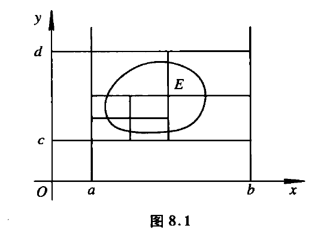

[toc]

［**$R^m$空间和ｍ元函数**］
依次排列这ｍ个实数$(x_1,x_2,...,x_m)$被称为一个ｍ元有序实数组．有一切可能的ｍ元实数组所组成的集合$R^{m}=\{(x_1,x_2,...,x_m) | x_1,x_2,...,x_m \in R\}$被称为ｍ维空间，每一个ｍ元有序实数组都被称为这个空间的点．
那么ｍ元函数，可以定义为从ｍ维空间的点集$D$到$R$的一个映射：$f:D \subset R^m \to R$.

## 多维空间的代数结构和距离结构
对于一般的ｍ维空间而言，将$(x_1,x_2,...,x_m)$表示这个空间中的点,并把$x_i$叫做这个点的第$i$个坐标.
$x=(x_1,x_2,...,x_m)$则表示$R^m$中的一个点．

常常还需要考察$R^m$ 中点的序列

$x_i=(x_1^{(i)},x_2^{(i)},...,x_m^{(i)})$则表示$R^m$中的一个序列的第i项.

### 代数结构
平面上的一个点$x=(x_1,x_2)$，又可以把它看成起始点在$(0,0)$终点在$(x_1,x_2)$的一个向量．对于高维空间，也采用类似的说法:把$x=(x_1,x_2,...,x_m)$表示这个空间中的点,同样可以把$(x_1,x_2,...,x_m)$称为起始点在$(0,0,...,0)$终点在$(x_1,x_2,...,x_m)$的一个向量．

仿照平面的上的向量，m维的向量，定义加法和数乘运算
$$
u=(u_1,u_2,...,u_m),v=(v_1,v_2,...,v_m) \\
u + v=(u_1 + v_1,u_2 + v_2,...,u_m + v_m)\\
\lambda u=(\lambda u_1 ,\lambda u_2 ,...,\lambda u_m )
$$
这样定义的加法和数乘，使得$R^m$成为了一个实数线性空间（实向量空间）．$R^m$具有实线性空间的代数结构．

### 距离结构
仿照平面上向量范数的定义，对于高维空间$R^m$，定义向量$u=(u_1,u_2,...,u_m)$的范数为
$||u|| =\sqrt{(u_1)^2 + (u_2)^2 + ...+ (u_m)^2}$
也满足三个性质

（１）$\lVert u \rVert \ge 0，\forall u \in R^m$并且$\lVert u \rVert =0 \Leftrightarrow u=0$
(2)$||\lambda u||=|\lambda| ||u||,\forall \lambda \in R,u \in R^m$
(3)$||u + v|| \le ||u|| + ||v||$(三角关系，两边长度之和大于第三边的长度)

[**引理-柯西不等式**]
实际上还要一个结论就是$\sum_{i=1}^{m} u_i v_i \le ||u||||v||$这个就是著名的柯西不等式,而三角关系实际上柯西不等式的推论．

如果空间的范数按照那个形式定义，就必然会有柯西不等式．

简单的描述一下就是$\forall u,v \in R^m ,\forall \lambda \in R ,||u -\lambda v|| \ge 0$要满足这个条件，就必须要有$l=u -\lambda v,\sum_{i=1}^{m} (l_i)^2 \ge 0$
那么就有
$$
S(\lambda)=\sum_{i=1}^{m}(u_i -\lambda v_i)^2=\sum_{i=1}^{m}((u_i)^2 - 2\lambda u_iv_i  + \lambda^2(v_i)^2)=\\
\lambda^2 ||v||^2 -2\lambda \sum_{i=1}^{m}u_iv_i + ||u||^2 \ge 0
$$
要对于一切的$\lambda \in R$要恒成立．
对于一个开口向上的二次函数$S(\lambda) \ge 0$.恒成立，必然有$\Delta =(2 \sum_{i=1}^{m}u_iv_i )^2 -4||v||^2||u||^2 \le 0$
整理即$\sum_{i=1}^{m}u_iv_i \le ||v||||u||$
$\blacksquare$

利用柯西不等式，很容易证明范数的三角不等式．
$||v +u||^2=\sum_{i=1}^{m}(v_i + u_i)^2=\sum_{i=1}^{m}[(v_i)^2 + 2v_iu_i + (u_i)^2] 
\le ||v||^2 + ||u||^2 + 2||u||*||v||=(||u|| + ||v||)^2 \Rightarrow ||u + v|| \le ||u|| + ||v||$

借助于范数，我们可以把任意两点$u,v \in R^m$之间的距离定义为$d(u,v)=||u-v||=\sqrt{\sum_{i=1}^{m}(u_i - v_i)^2}$

[**三角不等式推论**]
$\forall u,v \in R^m$，则有$|| u|| - ||v|| \le ||u -v||$.
proof:
欲证本结论，只需要证明$|| u|| \le ||u -v|| +   ||v||$
只需要证明$|| u - v + v || \le ||u -v|| +   ||v||$
而这个显然是成立的．
$\blacksquare$

## $R^m$中的点列
设$\{x_n\}$是$R^m$中的一个点列,这里$x_n=(x_1^{(n)},x_2^{(n)},...,x_m^{(n)}),n=1,2,...$
又设$a=(a_1,a_2,...,a_m)$为$R^m$中的一个点，我们来考察点列$\{x)n\}$中的各项到点$a$的距离$d(x_n,a)=||x_n-a||$
如果$\lim\limits_{n \to \infty}||x_n -a||=0$
就说点列$\{x_n\}$以点$a$为极限．
$\forall \varepsilon >0,\exists N,\forall n> N,||x_n -a|| < \varepsilon$

我们把$R^m$中的点集$U(a,\eta)=\{x \in R^m |||x-a|| < \eta\}$叫做点$a$的$\eta$邻域．
m=1,邻域是一个开区间
m=2,邻域是一个以ａ为中心的开圆
m=3,邻域是一个以ａ为中心的开球
对于更高维度，我们也把$U(a,\eta)$叫做以$a$为中心$\eta$为半径的开球．
用更具有几何色彩的语言描述高维空间点列的收敛：如果对于任意的$\varepsilon >0$，总是存在$N$，使得点列$\{x_n\}$从第Ｎ项以后的项，都进入点$a$的$\varepsilon$邻域之中，那我们说点列$\{x_n\}$收敛到点$a$.

##### 邻域
设 $P_0 \in R^m,\delta >0$ ,则称集合
$$
U(P_0,\delta )=\{ P | P \in R^m,d(P_0,P) < \delta \}
$$
为点 $P_0$ 的 $\delta$ 邻域；而称 
$$
\mathring{U}(P_0,\delta )=\{ P | P \in R^m,0 < d(P_0,P) < \delta \}
$$
为点 $P_0$ 的 $\delta$ 去心邻域

在 $R^2$ 中，点 $P_0(x_0,y_0)$ 的 $\delta$ 邻域为圆域 
$$
\{ (x,y) |  \sqrt{(x-x_0)^2 + (y-y_0)^2} < \delta \}
$$
在 $R^3$ 中，点 $P_0(x_0,y_0,z_0)$ 的 $\delta$ 邻域为球体域 
$$
\{ (x,y) |  \sqrt{(x-x_0)^2 + (y-y_0)^2 + (z-z_0)^2} < \delta \}
$$

利用范数的性质很容易把关于实数序列极限的许多结果，推广到$R^m$中点列的相应结果．

［**命题１**］如果$R^m$中的点列$\{x_n\}$有极限，那么极限是唯一的．
proof:
(1) 假设$\lim\limits_{n \to \infty}x_n = a_1,\lim\limits_{n \to \infty}x_n = a_2,a_1,a_2 \in R^m$.
如果$a_1 \ne a_2$,$\varepsilon=||a_1 - a_2||/2$，必然存在$N_1,n > N_1,||x_n -a_1|| < ||a_1 - a_2||/2$,也存在$N_2,n > N_2,||x_n -a_2|| < ||a_1 - a_2||/2$．那么$n > max\{N_1,N_2\}$时
$||a_1 - a_2|| \le ||a_1 -x_n || + ||x_n - a_2|| < ||a_1 - a_2||/2 + ||a_1 - a_2||/2 =  ||a_1 - a_2||$
矛盾，因为$||a_1 - a_2|| < ||a_1 - a_2||$.

(2)另证
$||a_1 -a_2|| \le  ||a_1-x_n || + ||x_n -a_2||$
那么$||a_1 -a_2|| \le  \lim\limits_{n \to \infty}(||a_1-x_n || + ||x_n -a_2||)=0$
那必然有$a_1 = a_2$.
$\blacksquare$

关于实数序列极限的加法定理和乘法定理，可以推广为:

［**命题２**］
设$\{x_n\}$和$\{y_n\}$是$R^m$中的点列，$a,b$是$R^m$中的点，$\{\lambda_n\}$是实数序列，$\lambda$是一个实数，如果$\lim x_n =a,\lim y_n=b,\lim \lambda_n =\lambda$
那么(1)$\lim\limits_{n \to \infty}(x_n + y_n) = a+b$
（２）$\lim\limits_{n \to \infty}\lambda_n x_n = \lambda a$

proof:
(1)
因为$\lim x_n =a \Rightarrow \forall \varepsilon >0,\exists N_1,n >N_1,||x_n -a || < \varepsilon/2$

因为$\lim y_n =a \Rightarrow \forall \varepsilon >0,\exists N_2,n >N_2,||y_n -a || < \varepsilon/2$

那么$N = \max\{N_1,N_2\}, n> N$
$||x_n + y_n - a -b|| \le ||x_n -a|| + ||y_n -b|| < \varepsilon/2 + \varepsilon/2 < \varepsilon$

(2)
因为$\lim\limits_{n \to \infty}\lambda_n = \lambda \Rightarrow \exists L >0,|\lambda_n| \le L$.

$||\lambda_n x_n -\lambda a|| = ||\lambda_n x_n - \lambda_n a   + \lambda_n a  -\lambda a|| = \\
||\lambda_n (x_n -a)  + (\lambda_n -\lambda)a|| \\
\le |\lambda_n|*|| x_n -  a || + |\lambda_n -\lambda|*||a||\\
\le L||\ x_n -  a || + |\lambda_n -\lambda|*||a|| $

因为$\lim\limits_{n \to \infty}\lambda_n = \lambda \Rightarrow \exists N_1,n >N_1,|\lambda_n -\lambda| <\frac{\varepsilon}{2||a||}$.

因为$\lim\limits_{n \to \infty} x_n = a \Rightarrow \exists N_2,n >N_2,||x_n - a|| <\frac{\varepsilon}{2|L|}$.

那么当$n  > max\{N_1,N_2\}$时
$||\lambda_n x_n -\lambda a||  \le L||\ x_n -  a || + |\lambda_n -\lambda|*||a|| <|L|\frac{\varepsilon}{2|L|} + ||a||\frac{\varepsilon}{2||a||} = \varepsilon$

可见有$\lim\limits_{n \to \infty}\lambda_n x_n =\lambda a$
$\blacksquare$

[**命题３**]收敛的点列是有界的．
proof:
不妨设$R^m$中的点列$\{x_n\}$收敛到$a$,意味着$\varepsilon >0,\exists N,n > N,||x_n - a|| < \varepsilon$
根据三角不等式的推论就有$||x_n|| - ||a|| \le ||x_n -a|| < \varepsilon$　
不妨取$\varepsilon = 1$则有$n > N,||x_n|| \le ||a|| +1$

如果取$M=\max\{||x_1||,||x_2||,...,||x_N||,||a||+1\}$
则有$\forall n \in N_+,||x_n|| \le M$

$\blacksquare$

[**引理**]
$x=(x_1,x_2,...,x_m) \in R^m$必然有
$$
\max\{|x_1-a_1|,|x_2-a_2|,...,|x_m-a_m|\} \le \\
\sqrt{\sum_{i=1}^{m}|x_i -a_i|^2} \le \\
|x_1-a_1| + |x_2-a_2| + ...+ |x_m -a_m|
$$
proof:

不等式的左边是显然的，右边简单证明一下.

$\sqrt{\sum_{i=1}^{m}|x_i -a_i|^2}=||x-a||$
而$x-a=(x_1-a_1,0,...,0) + (0,x_2-a_2,...,0) + ...+ (0,0,...x_{m-1}-a_{m-1},0) + (0,0,...,x_m-a_m)$
不妨记$l_i = (0,0,...,x_i-a_i,0,...,0)$从前面的分析可以知道$x-a = l_1 + l_2 + ...+l_m$
利用范数的三角不等式可以知道$||x-a|| \le ||l_1|| + ||l_2|| +...+||l_m|| = |x_1-a_1| + |x_2-a_2| + ...+|x_m-a_m|$
$\blacksquare$

[**定理－依坐标收敛定理**]对于$R^m$的点列$\{x_n\}$和点$a$,我们有$\lim\limits_{n \to \infty}x_n = a$的充分必要条件是$\lim\limits_{n \to \infty}x_i^{(n)}=a_i,i=1,2,...m$这里$x_i^{(n)}$表示$x_n$的第ｉ个坐标，$a_i$表示ａ的第i个坐标．

proof:

先证明必要性：$\forall \varepsilon >0,\exists N, n> N,||x_n -a|| < \varepsilon$

因为$\max\{|x_1^{(n)}-a_1|,|x_2^{(n)}-a_1|,...,|x_m^{(n)}-a_1|\} \le ||x_n-a||$
那么当$n > N$时,$i =1,2,...,m$都有$|x_i^{(n)} - a_i| \le ||x_n -a|| < \varepsilon$.因为$\varepsilon$的任意性，可知必然有$\lim\limits_{n \to \infty}x_i^{(n)} = a_i$.

充分性:
 因为$\lim\limits_{n \to \infty}x_i^{(n)}=a_i,i=1,2,...,m$那意味着$\forall \varepsilon/m,$对于每一个坐标i,分别$\exists N_i$使得$n > N_i,|x_i^{(n)} - a_i| < \varepsilon/m$
那当我们取$N=\max\{N_1,N_2,...,N_m\}$时$n > N$会有
$\sqrt{\sum_{i=1}^{m}|x_i^{(n)} -a_i|^2} \le 
|x_1^{(n)}-a_1| + |x_2^{(n)}-a_2| + ...+ |x_m^{(n)} -a_m| < m\frac{\varepsilon}{m}=\varepsilon$

因为$\varepsilon$的任意性，可知必然有$\lim\limits_{n \to \infty}x_n =(a_1,a_2,...,a_m)=a$

$\blacksquare$

依坐标收敛定理，十分重要，因为有了这个定理，很多涉及到$R^m$中点列极限的问题，可以转化为关于实数序列的相应问题．

[**柯西点列与空间的完备性**]

［**柯西点列定义**］
设$\{x_n\}$是$R^m$中的一个点列，如果对于任何$\varepsilon >0$,$\exists N$,使得只要$n > N,\forall p \in N_+$都有
$$
||x_{n+p}-x_n|| < \varepsilon
$$
那么我们就说$\{x_n\}$满足柯西条件，或者称$\{x_n\}$是一个柯西列（基本列）．

也可这样表示
设$\{x_n\}$是$R^m$中的一个点列，如果对于任何$\varepsilon >0$,$\exists N$,使得只要$m,n > N$都有
$$
||x_{m}-x_n|| < \varepsilon
$$
那么我们就说$\{x_n\}$满足柯西条件，或者称$\{x_n\}$是一个柯西列（基本列）．

［**引理**］所有收敛的点列都是柯西列．
proof:
不妨任意假设$R^m$中的收敛点列$\{x_n \} \to a$.依点列收敛的性质有$\varepsilon/2 > 0,\exists N,n > N$就有$||x_n -a|| < \varepsilon/2$

那么当$n > N$时$n + p > N,\forall  p \in N_+$那么必然有
$||x_{n +p} - a|| < \varepsilon/2$.

而$||x_{n +p}-x_{n}|| \le ||x_{n+p}-a|| + ||x_{n}-a|| < \varepsilon/2 + \varepsilon/2 =\varepsilon$

说明$\{x_n\}$确实柯西列．

$\blacksquare$

[**柯西收敛原理**]
设$\{x_n\}$是$R^m$中的点列，则$\{x_n\}$ 收敛的充分必要条件是它为柯西点列．

proof:
必要性引理已经给出．

充分性：
$\{x_n\}$是柯西列．那么意味着$\varepsilon >0, \exists N,n  N,\forall p \in N_+$都有$||x_{n+p}-x_{n} || < \varepsilon$

因为$|x_i^{(n+p)} - x_i^{(n)}| <||x_{n+p}-x_{n} || < \varepsilon$

说明对于任意的$\{x_i^{(n)}\},i=1,2,...,m$也都是柯西列，根据实数序列的收敛原理可知$\{x_i^{(n)}\}$是收敛点，不妨记$x_i^{(n)} \to a^i$那么必然有$\lim\limits_{n \to \infty}x_i^{(n)} =a_i$.根据点列按坐标收敛的原理有$\lim\limits_{n \to \infty}x_n = (a_1,a_2,...,a_m)$.

$\blacksquare$

[**有界点列必有收敛子列－布尔查诺定理**]
从任何一有界的点列中，可以选出收敛的子列．
proof:
考察点列$\{x_n\}$各项的坐标表示$x=(x_1^{(n)},x_2^{(n)},...,x_m^{(n)})$
因为$\{x_n\}$有界，意味着$\exists L >0,||x_n|| \le L,n=1,2,3...$
因为$|x_i^{(n)}| \le ||x_n|| \le L,n=1,2,...$
可见$\{x_i^{(n)}\},i=1,2,...,m$也是一列有界的列．

不妨从$\{x_1^{(n)}\}$选出一列收敛的子列$\{x_1^{n_{1,k}}\}$
基于同样的序号，我们考察$\{x_2^{n_{1,k}}\}$很显然它任然是实数的一个有界序列，断定，可以从里面挑选出收敛的子列$\{x_2^{n_{2,k}}\}$,以此类推，直到最后，可以从实数的有界序列$\{x_m^{n_{m-1,k}}\}$之中，挑选出收敛的子列$\{x_m^{n_{m,k}}\}$
我们记$n_k =n_{m,k}$
$x_{n_k}=(x_1^{n_k},x_2^{n_k},...,x_m^{n_k})$
那么子列$\{x_{n_k}\}$是收敛子列．

$\blacksquare$

并不是所有有关实数列收敛的定理都可以推广到点列上．例如：有界的单调数列必有极限,这是因为在点列的情形下，无法定义一种有用的序，从而也就不便用来定义点列的单调性．

#### 点集

##### 内点 外点 边界点

设集合 $E \subset R^n$ ,点 $x \in R^n$ ,若存在 $\delta >0 $ ，使得$U(x,\delta) \subset E$(开球$U(x,\delta)$里面的点都属于Ｅ),则称 $x$ 为 $E$ 的**内点**；

若存在 $\delta >0 $ ，使得$U(x,\delta) \cap E = \empty$则称 $x$ 为 $E$ 的**外点**；

若 $\forall \delta >0 $ ，在 $U(x,\delta)$ 内既有属于 $E$ 的点也有不属于 $E$ 的点，则称 $x$ 是 $E$ 的**边界点**.即$U(x,\delta) \cap E \ne \emptyset,U(x,\delta) \cap E^c \ne \emptyset$.

[**定义**]
a.由点集$E$的全体内点所构成的集合记作$E^\circ$或者$intE$，称为$E$的内部．
b.由点集$E$所有的外点组成的集合，称为$E$的外部，记为$extE$;
c.由点集$E$的所有的边界点组成的集合，称为$E$的边界，记为$\partial E$.

从定义可以知道$ext E = (E^c)^{\circ}$.

##### 开集 闭集  补集

集合$E$的**补集**$E^c=R^n\setminus E$．

[**定义**]设集合 $E \in R^n $ ,若 $E$ 中的点全是 $E$ 的内点，则称 $E$ 是 $R^n$ 中的**开集**；

[**定义**] 若集合$E$的补集$E^c(R^n\setminus E)$为开集，则称$E$为**闭集**。

比较特殊的是$\empty$和$R^n$都是开集．
有定义可知$E^{\circ} \subset E$.

总结:可见所谓的集合$E$是开集,就是集合中的点都是内点,所谓内点$x \in E $,就是存在开球$B_r(x) \subset E$.
而要确定集合$E$是闭集,需要判断其补集是否是开集.

实际，对于任何开集$E \subset R^n$而言，$F=E \cup \partial E$由闭集的定义，容易看出$F$为闭集．

[**定理**]$(E^c)^c = E$
proof:

任意给定$x \in (E^c)^c$,可以知道$x \in R^n \setminus E^c$,根据补集的定义可知$x \in E$.

反之：$\forall x \in E$则有$x \in R^n \setminus E^c$即$x \in (E^c)^c$.

$\blacksquare$

[**定理**]如果$E$是闭集，那么$E^c$是开集；如果Ｅ是开集，那么$E^c$是闭集，
proof:

（１）如果$E$是闭集，根据闭集的定义可知知道$E^c$是开集，得证．

(２)反证法：如果$E$是开集，而$E^c$是开集，那么根据闭集的定义可知，$E$是闭集与题设$E$是开集矛盾．可见$E^c$是闭集．

$\blacksquare$

不过特别需要注意的是，一个集合可以既不是开集，也不是闭集．例如$(a,b]$.

[**例题**]
（１）$R^2$中的上半平面$\{(x,y):y > 0\}$是$R^2$中的开集．

（２）将$R^n$挖去任一个点之后所成的集是$R^n$中的开集．

 (4)数轴上的任何开区间$(a,b),(a,\infty),(-\infty,b)$都是开集
而闭区间$[a,b]$以及$[a,\infty),(-\infty,b]$都是R中的闭集.

(5)闭的圆盘$x^2 + y^2 \le r^2$是$R^2$上的闭集.

（６）$R^n$中去除有限多个点所成的集合是开集，包括有限多个点所成的集合是闭集
（７)　在$R^n$中，开球的补集是闭集．

［**定理**］设$\forall x_0 \in R^n$,$\forall r >0$球$B_r(x_0)$是开集．
proof:

$\forall x \in B_r(x_0)$此时有$||x -x_0|| < r$.
因为$r-||x-x_0|| >0$利用实数的稠密性可以知道，存在$r'$满足
$0 <r' < r-||x-x_0||$.
不妨对ｘ构建开球$B_r'(x)$.如果能够证明$B_r'(x) \subset B_r(x_0)$则说明$x$是$B_r(x_0)$的内点，证明如下：
任意选定$x' \in B_r'(x)$
$||x'-x_0|| = ||x'-x + x- x_0|| \le ||x'-x|| + ||x-x_0||< r' + ||x-x_0|| < r-||x-x_0|| + ||x-x_0||=r$
从上面的证明可以知道$B_r'(x) \subset B_r(x_0)$从而可知$x$确实其内点，由于ｘ选取的任意性，可以知道$B_r(x_0)$ 是开集．

$\blacksquare$

[**定理**]
对任何集$E$,$E$的内部$E^{\circ}$是开集；Ｅ的外部即extE也是开集．
proof:

（１）
很显然$E=\empty$,那么命题必然成立.

设$E^{\circ} \ne \empty$,任取$c \in E^{\circ}$,可见$c$是$E$的一个内点,故存在$r > 0$,使得$B_r(c) \subset E$.

接下来，如果能够证得$\exists r'>0,B_{r'}(c) \subset E^{\circ} $.就能够说明ｃ确实是$E^{\circ}$的内点．

由于球$B_r(c)$是开集，那么其中的每一点$x'$都是$B_r(c)$的内点,因此存在开球$B_{r'}(x') \subset B_r(c) \subset E$.那么$x'$是$E$的内点．也就是说$x' \in E^{\circ}$,从$x'$ 的任意性可以知道$B_r(c) \subset E^{\circ}$

所以$c$是$E^{\circ}$的内点.由于$c$是$E^{\circ}$中的任一点,所以$E^{\circ}$全由内点组成,即$E^{\circ}$是开集.

（２）$x_0 \in ext E$,说明$x_0$是集合$E$的外点，也就说存在开球$B_r(x_0) \cap E = \emptyset$.

因为$B_r(x_0)是开集$，$\forall x \in B_r(x_0)$都是开球$B_r(x_0)$的内点，那么必然也就存在更小的球$B_r'(x) \subset B_r(x_0)$，可见这个时候必然有$B_r'(x) \cap E =\emptyset$.从而$x$也是Ｅ的外点，即$x \in extE$．从而有$B_r(x_0) \subset extE$.依照开集的定义，可知$extE$是开集．

$\blacksquare$

［**开集重要定理**］
（１）$R^n,\empty$是开集
（２）设指标集$I$，设$\{E_a\}$是$R^n$的一个开子集族，其中指标$a$来自于一个指标集$I$,那么并集$\cup_{a \in I}E_a$也是开集（任意多个开集的并是开集，可以是无限多个开集的并是开集）
(3)设$E_1,E_2,...,E_m$是有限个开集，那么交集$\cap_{i=1}^m E_i$也是开集（有限个开集之交是开集）

proof:

(2)
任意取定$\alpha \in \cup_{a \in I}E_a$,必然存在$\beta \in I$使得$\alpha \in E_\beta$.由于$E_\beta$是个开集,说明$\alpha$是集合$E_\beta$的内点,那么必然存在开球$B_r(\alpha) \subset E_\beta$.那当然也有$B_r(\alpha) \subset \cup_{a \in I}E_a$
这个表明,$\alpha$是$\cup_{a \in I}E_a$的内点,所以$\cup_{a \in I}E_a$是开集.
(3)
$\alpha \in \cap_{i=1}^{m}E_i$,即$\alpha \in E_i,i=1,2,...,m$则存在开球$B_{r_i}(\alpha) \subset E_i,i=1,2,...,m$

不妨取$r=\min\{r_1,r_2,...,r_m\}$则有$B_r(a) \subset B_{r_i}(\alpha) \subset E_i$
即$B_r(\alpha) \subset \cap_{i=1}^{m}E_i$
这个表明$\alpha$是$\cap_{i=1}^{m}E_i$的内点,根据$\alpha$的任意性,可知$\cap_{i=1}^{m}E_i$是开集.

值得注意的是,开集的个数是有限的,这个条件十分重要的,考察球$B_{1/i}(\alpha),i=1,2,...$,这里$\alpha \in R^n$,他们都是开集,但是
$\cap_{i=1}^{\infty}B_{1/i}(\alpha) = \{a\}$

很显然这个点集并不是开集.

$\blacksquare$

### De Morgan对偶原理
对于$R^n$中的任何一族集合$\{E_{\Lambda}\}_{\lambda \in \Lambda}$,其中$\Lambda$是一个指标集，有
(1)$(\cup_{\lambda \in \Lambda}E_\lambda)^c=\cap_{\lambda \in \Lambda}E_\lambda^{c}$

(2)$(\cap_{\lambda \in \Lambda}E_\lambda)^c=\cup_{\lambda \in \Lambda}E_\lambda^{c}$

proof:

$\blacksquare$

[**定理**]集合$A$为闭集,当且仅当任何$A$中收敛点列的极限仍在$A$中.
proof:
必要性:设A中的收敛点列$\{x_n\},x_n \in A,\forall n$,且有$x_n \to x_0$.需要证明的是$x_0 \in A$.不妨假设$x_0 \notin A$.那说明$x_0 \in A^c$,而因为$A$是闭集,从而有$A^c$是开集,从而存在$B_\varepsilon(x_0) \in A^c$.

因为$x_n \to x_0$,对于任意给定的$\varepsilon >0,\exists N, n> N,||x_n - x_0|| < \varepsilon \Rightarrow  n > N, x_n  \in B_\varepsilon(x_0) \subset A^c$这个矛盾,因为前面讲其所有的项都在$A$中.

充分性:
只需要证明A中所有的收敛点列$\{x_n\},x_n \in A,\forall n$,且$x_n \to x_0$,并且有$x_0 \in A$ $\Rightarrow$ $A$是闭集.

思路：
证明$A^c$是开集即可,如何证明呢?只需要任意选定一个点$x_0 \in A^c$,并且存在$B_r(x_0) \subset A^c$.如果找不到这样的开球，意味着，如果对于任意的$x_0 \in A^c$，不管半径如何小，总是会有$B_r(x_0)\cap A \ne \emptyset$,那不就是说明，可以找到一个点列，每项都在$A$中，但是其极限点确在$A$外吗?这个就与题设矛盾呢．实际上，给定一个Ａ的边界点，确实可以找到一个每项都在Ａ中，极限点却在边界上，如果Ａ包括其边界，就能满足假设所有的收敛点列其极限仍在Ａ中．

任意选定$x_0 \in A^c$,如果对于所有的$n \ge 1$,$B_{1/n}(x_0) \cap A \ne \emptyset$那么取$x_n \in B_{1/n}(x_0) \cap A$ 就可以得到一个$\lim\limits_{n \to \infty}x_n =x_0$.也就说存在一个数列的每项都在$A$中,但是其极限点确不在$A$中,这个就与题设矛盾.那说明,必然存在一个$n_0$使得$B_{1/n_0}(x_0) \cap A =\emptyset$那么此时有$B_{1/n_0}(x_0) \subset A^c$,前面讲过$x_0 \in A^c$,说明$x_0$是$A^c$的一个内点,可见$A^c$是一个开集.

$\blacksquare$

[**推论**]
如果集合 $A$不是闭集,那么必然在$A$内,存在收敛点列$\{x_n\} \subset A$,但是其极限点$x_0 \notin A$.

上面的定理的逆否命题就是这个推论的表述.

［**闭集重要定理**］
（１）$R^n,\empty$是闭集
（２）设指标集$I$，设$\{E_a\}$是$R^n$的一个闭子集族，其中指标$a$来自于一个指标集$I$,那么闭集$\cap_{a \in I}E_a$也是闭集（任意多个闭集的交是闭集）
(3)设$E_1,E_2,...,E_m$是有限个闭集，那么交集$\cup_{i=1}^m E_i$也是闭集（有限个闭集之并是闭集）
proof:

$\blacksquare$

［**凝聚点－定义**］
设$E \subset R^n$，若$x \in R^n$，对于任何$r >0$,在空心球$\hat{B}_r(x)$中总有$E$中的点，即$\hat{B}_r(x) \cap E \ne \emptyset$,那么称点$x$为Ｅ的**极限点和凝聚点**．

实际上Ｅ的极限点可以属于Ｅ，也可以不属于Ｅ．例如数轴上考虑开区间(0,1)这个时候[0,1]中的点，都可以是它凝聚点，但0,1却不在集合(0,1)之中．

按照聚点的定义，可以知道，如果ｘ不是集合Ｅ的聚点，则存在$\delta_0 >0$使得$\hat{B}_r(x)$中没有Ｅ中的点，如果$x \notin E$则有$B_r(a)\cap E = \emptyset$．特别的，如果$x \in E$,但是$x$确不是$E$的聚点时，一般来说称ｘ为Ｅ的孤立点．此时，必然存在$B_r(x) \cap E = {x}$.

[**定义**]点集$E \subset R^n$的凝聚点的全体称为$E$的导集，记作$E'$.

[**定理**]Ｅ是闭集的充分必要条件是$E' \subset E$.
proof:

必要性：如果$E$是闭集，证明$E' \subset E$.
任意选定$\alpha \in E'$，这个说明$\alpha$是Ｅ的凝聚点，不管$\delta$取多大，必然都有$B_\delta(\alpha) \cap E \ne \emptyset$.取$x_n =B_\frac{1}{n}(\alpha) \cap E$那么必然会存在一个收敛点列$x_n \to \alpha，x_n \in E$,依据闭集的性质可以知道$\alpha \in E$.从而就有$E' \subset E$.

充分性：$E' \subset E$, 则有$E$是闭集．

关键的证法还是证明$E^c$是开集．

$E' \subset E$,如果取$\alpha \in E^c$,必然有$\alpha$不是Ｅ的凝聚点，也就是存在开球$B_r(a)\cap E =\emptyset$.因为开球是一个开集，那么就有$B_r(a) \subset E^c$.这个表明$E^c$是一个开集，从而Ｅ是闭集．

$\blacksquare$

[**定理**]$E \subset R^n$,那么$\partial E$是闭集．
proof:

因为$R^n = A^{\circ} \cup ext A \cup \partial E$

那么$\partial E = R^n \setminus (A^{\circ} \cup ext A)=(A^{\circ} \cup ext A)^c=(A^{\circ})^c \cap (ext A)^c$

因为$A^{\circ},ext A$都是开集,那么当然有$\partial E$是闭集.

$\blacksquare$

[**定理**]
Ｅ是闭集充分必要条件是$\partial E \in E$ .

proof:

必要性:如果$E$是闭集,那么$\partial E \subset E$.

$\forall x \in \partial E$,$x$是E的边界点,根据边界点的定义,可以知道,必然存在一串邻域$B_\frac{1}{n}(x) \cap E \ne \emptyset $,所以存在一个一个点列$\{x_n\},x_n \in E$但是$x_n \to x$.因为$E$是闭集,我们知道闭集里面的收敛列,其极限点也在闭集里, 故有$x \in E$.根据$x$的任意性,可以知道$\partial E \subset E$.

充分性:如果$\partial E \subset E$,则$E$是闭集.

$\partial E \subset E$,假设E是开集.

$\forall x \in \partial E$也有$x \in E$.

因为$E$是开集,说明必然存在一个开球$B_r(x) \subset E$.
而因为$x \in \partial E$,讲的是不管半径$r$为多少,必然有$B_r(x) \cap E \ne \emptyset,B_r(x) \cap E^c \ne \emptyset$.这个就是矛盾.
可见$E$是闭集.

$\blacksquare$

[**定理**]如果$E \in R^n$的一个任意子集，记$\overline{E}=E \cup \partial E$
(1)$\overline{E}$是一个闭集
（２）$\overline{E}$中的任何一点$c$都是Ｅ中一个点列的极限
（３）$\overline{E}$是包含$E$的最小闭集．

proof:
（１）
$R^n=E \cup \partial E \cup ext E$
那么$\overline{E} = E \cup \partial E = R^n \setminus ext E$．当然也有$ext E = R^n \setminus \overline{E}$但是$ext E$是一个开集， 那么$\overline{E}$是一个闭集．　
（２）
因为$\overline{E}=E \cup \partial E$. 如果$c \in E$,那么构造一个常数列$x_n=c$，自然就完成了证明．
如果$x \in \partial E$,任意边界点的定义，可以知道，ｃ的任何邻域$U(c,\frac{1}{n}) \cap E \ne \emptyset$.
取$x_n = U(c,\frac{1}{n}) \cap E $
于是就有一个$E$中的点列$\{x_n\} \to c$.
(3)

$\blacksquare$

必须值得注意的是，开集和闭集并不是说互相对立的，存在即是开集又是闭集的集合，也存在既不是开集也不是闭集的集合．

[**闭包的定义**]　$\overline{E}=E' \cup E$

［**定理**］$E$的导集$E'$和闭包$\overline{E}$都是闭集．
proof:

$\blacksquare$

［**定理**］$E^{\circ}$是含于Ｅ内最大开集，闭包$\overline{E}$是包含E的最小闭集．

proof:

$\blacksquare$

##　欧式空间$R^n$的基本定理
实际这些性质都是实数系的基本定理的推广．

［**完备性**］
如果一个空间$E \subset E^n$中的任何柯西点列都是收敛的，并且其极限属于Ｅ，则我们称空间Ｅ是完备的．

［**定理**］欧式空间$R^n$是完备的
前面证明过任何欧式空间$R^n$中的柯西点列都是收敛的，并且收敛点也属于$R^n$．可见欧式空间是完备的．

［**定义**］ 有界集 无界集
设 $ E \in R^n $ , $O$ 是 $R^n$ 中的原点，若存在 $M >0$ ,使得 $E \subset U(O,M)$ ,称 $E$ 为 $R^m$ 中的有界集，否则称为 $E$ 为无界集。也可以说$\exists M >0,\forall  x \in E,||x|| \le M$.这可以说Ｅ是一个有界集.

［**集合直径的定义**］
利用$R^n$的完备性，可以推广$R$中的闭区间套定理，设$E \subset R^n$是一个非空集合，记$diam(E)$为Ｅ的直径，它的定义是$diam(E) =\sup_{x,y \in E}\{||x-y||\}$

［**定理**］如果$diam(E)$是有限数，当且仅当$E$是有界的．
proof:

必要性

$diam(E) =\sup_{x,y \in E}\{||x-y||\} < \infty$则有$E$是有界集.
不妨设$diam(E) =\sup_{x,y \in E}\{||x-y||\}=M < \infty$,那么会有$\forall x,y ||x-y|| \le M$.不妨取定一个点$\overline{x} \in E$.那么根据前面的定义可以知道$\forall x \in E$都有$||x -\overline{x}|| \le M \Rightarrow ||x|| \le ||\overline{x}|| + M$可见存在$M'=||\overline{x}|| + M$使得$||x|| \le M'$,所以集合E是有界的.

充分性:
如果$E$是有界的,$\forall x \in E,||x|| \le M$.
那么$||x - y|| \le ||x|| + ||y|| \le 2M$那么必然有$\sup_{x,y \in E}||x-y|| \le 2M$.所以直径$diam(E)$是一个有限数.

$\blacksquare$

[**闭集套定理**]设$\{F_i\}(F_i \ne \emptyset,i=1,2,3...,)$是一个闭集列.并且$F_1 \supset F_2 \supset F_2 \supset ...$若$\lim\limits_{i \to \infty}diam(F_i)=0$.
那么$\cap_{i=1}^{\infty}F_i$只还有唯一的一个点.

proof:

因为$F_i$不是空间,所以可以从每一个闭集$F_i$中选取一个点$x_i$,因为$\{F_i\}$本身形成一个套，并且$\lim\limits_{i \to \infty}diam(F_i) = 0$.
那么对于任意的$\varepsilon > 0,\exists N,i > N$时$\sup_{x,y \in F_i}\{||x-y||\} < \varepsilon$.

因为闭集之间的包含关系，可以知道的是$\{x_i,x_{i+i},...,\} \subset F_i$.

可见当$k,l > N$，记$l'=min\{k,l\}$必然有$x_k \in F_{l'},x_l \in F_{l'}$有因为$\sup_{x,y \in F_{l'}}\{||x-y||\} < \varepsilon$那么当然有$||x_k -x_l|| < \varepsilon$.
从而知道$\{x_n\}$是一个柯西列．不妨记$\lim\limits_{n \to \infty}x_n = x_0$.

任意给定一个$i$，因为$k \ge i$时有$x_k \in F_i$,值得注意的是，题设相当于构造了一列$\{x_k\}$收敛点列，其中每个元素都在闭集$F_i$之中，那必然有$x_0 \in F_i$.根据ｉ的任意性，可知$a \in \cap_{i=1}^{\infty}F_i$

如果又有$b \in \cap_{i=1}^{\infty}F_i$则显然有$a,b \in F_i(i=1,2,...)$,从而$||a-b|| \le diam(F_i)$.令$i \to \infty$,从而得知$||a-b||=0$.即$a=b$.

$\blacksquare$

[**布尔查诺-魏尔斯特拉斯定理**]
设$\{x_n\}$是$R^n$中的有界点列,则它必然存在收敛子列.

[**聚点理论**]
设E是$R^n$中任何有界无穷集合,则$E$至少有一个聚点.
proof:

$E$是无穷集合,任取一个点列$\{x_n\} \subset E$,由于$E$是有界集,可知$\{x_n\}$是一个有界点列,从而可以分出一列收敛点列$\{x_{n_k}\}$.设该子列的极限为$x_0$.根据点列极限的定义可知,不管$\varepsilon >0$取多少,必然存在$N ,k > N$有$||x_{n_k} - x_0|| < \varepsilon$.这个意味着$B_{\varepsilon}(x_0) \cap E \ne \emptyset$,这个是因为$x_{n_k} \in E$.可见$x_0$是E的聚点.

一定要注意的是,x是E的聚点,不一定要求x是属于E的.

$\blacksquare$

### 列紧集和紧致集
[**列紧集定义**]
设$E \subset R^n$,如果$E$中的任一点列都有一子列收敛于$E$中的一个点,则称$E$是$R^n$中的一个**列紧集**.

[**定理**]$R^n$中的集合E为列紧集的充分必要条件是$E$为有界闭集.
proof:

必要性:
如果$E$是一个列紧集，那么说明任意个一个属于Ｅ的点列，都存在收敛的子列，且其极限点仍然在Ｅ中．不妨假设Ｅ不是闭集，根据闭集的定义，可知必然存在一列收敛的点列$\{x_n \} \subset E$,但是其极限点$x_0 \notin E$,这个就与列紧集的定义矛盾．
如果$E$是一个无界集，那么意味着任意给定$M >0$,必然存在$x \in E$,满足$||x|| > M$,那不妨分别取$M =1,2,...,$那意味着可以构造一个点列$\{x_n\} \subset E$,但是其收敛点为$+\infty$.很显然其子列也是发散的．（这里收敛到无穷认为是发散的）

充分性：
如果集合$E$是有界的集合，那当然任意点列$\{x_n\} \subset E$都能分出收敛子列$\{x_{n_k}\} \subset E$．因为Ｅ是闭集，意味着，其中的任意收敛点列，其收敛点都属于集合Ｅ．从列紧集的定义，可知Ｅ是列紧集．

$\blacksquare$
我们知道，在Ｒ中有界闭区间上连续函数的许多局部性质可以称为该区间上的整体性质，这中从局部到整体的过程一般是通过有限覆盖定理来完成的．为了讨论更广泛的成立有限覆盖定理的一类集合，下面做讨论．

［**开覆盖**］
设$E\subset R^n$，而$\{o_\lambda\}_{\lambda \in \Lambda}$是$R^n$中的一个开集族．若$E \subset \cup_{\lambda \in \Lambda}O_\lambda$,则称$\{o_\lambda\}_{\lambda \in \Lambda}$为E的一个开覆盖．若此时指标集合$\Lambda$中只有有限个元素，则称$\{O_\lambda\}_{\lambda \in \Lambda}$是Ｅ的一个**有限开覆盖**．

［**紧致集**］设$E\in R^n$,若Ｅ的任何开覆盖$\{o_\lambda\}_{\lambda \in \Lambda}$都存在有限的子覆盖,即$\exists O_1,O_2,...,O_K \in \{o_\lambda\}_{\lambda \in \Lambda}$其中$K < \infty$,使得$E \subset \cup{k=1}^{K}O_k$,则称其为**紧致集**.

一个集合Ｅ是紧致集，指的是Ｅ的任何开覆盖都在存在有限子覆盖．
有些初学者总是取找Ｅ的一个固定的有限开覆盖来说明Ｅ是紧致集，实际上如果只是要找有限个开集来覆盖集合Ｅ，直接取$R^n$即可．

在$R$中，有限个有界闭区间的并构成的集合一定是紧致集．

对于$R^n$的任何一个集合Ｅ，如果Ｅ是无界集合时，则Ｅ不可能是紧致集．毫无疑问的是$\{U(0,k)\}_{k \in N}$是Ｅ的一个开覆盖，但由于无界，该开覆盖必然不存在有限个开覆盖，能够覆盖集合Ｅ．

再设$E=\{\frac{1}{k}: k \in N\}$,那么它也不是Ｒ中的紧致集．

不过$E \cup E'=\{\frac{1}{k}: k \in N\} \cup \{0\}$确是紧的．

［**引理**］
如果$E \in R^n$是非空集合，如果$x \notin E$,对每一个点$q \in E$，必定存在充分小的球，使得$B_r(p) \cap B_r(x) = \emptyset$.

proof:

取定一个点$x \in E^c$,而$p \in E$.即$d = ||x-p||/2$由于$x \ne p$，那么必然有$d >0$不妨取$r < d$.那么必然有$B_r(x) \cap B_r(p) = \emptyset$.

任意给定$x' \in B_r(x)$，去计算$x'$和$p$点之间的距离，$||x' - p|| = ||(x - p) -(x - x')|| \ge ||x-p|| - ||x-x'|| > ||x-p|| - ||x-p||/2 =||x - p ||/2 $.
那么$x' \notin B_r(p)$.

可见$B_r(x) \cap B_r(p) = \emptyset$.

$\blacksquare$

[**定义**]
设$E_1,E_2,...,E_m$是ｍ个集合，我们把集合$E=\{(x_1,x_2,...,x_m) | x_1 \in E_1,x_2 \in E_2,...,x_m \in E_m\}$称为集合$E_1,E_2,...,E_m$的直积．记为$E = E_1 \times E_2 \times E_3 \times ...\times E^m $.
$R^m$可以看出ｍ个Ｒ的直积．
$Ｒ^m = R \times R \times R \times ...\times R$.

[**定义**]
设$I_1=[a_1,b_1],I_2=[a_2,b_2],...,I_m=[a_m,b_m]$我们把集合$I = I_1 \times I_2 \times I_3 ...\times I_m$
叫做$R^m$的闭方块．
并且把$l(I) = max\{b_1-a_1,b_2-a_2,...,b_m-a_m\}$
叫做闭方块的线度．

[**有限开覆盖定理**]
设$E \subset R^n$ 则$E$为紧致集合的充分必要条件是$E$是$R^n$中的有界闭集．

proof:
必要性：对于$R^n$中的任意集合，$\{U(0,k)\}_{k \in N_+}$总是它的一个开覆盖．那它必然也是Ｅ的一个开覆盖．因为$E$是一个紧致集合，那么必然是存在一个有限的开覆盖$U(0,k_1),U(0,k_2),...,U(0,k_m),m < +\infty$,使得$E \subset \cup_{i=1}^{m}U(0,k_i)$,那只需要取$R=\max(k_1,k_2,...,k_m)$,必然有$E \subset \cup_{i=1}^{m} U(0,k_i) \subset U(0,R)$.可见$E$是一个有界的集合．

只需要证明$E^c$是开集．任意去定$p \in E^c$.很显然对于任意的点$q \in E$都存在充分小的球$B_r(q)$满足$B_r(q) \cap B_r(p)=\emptyset$,通过引理，可知只需要取$r < ||p-q||/2$即可．

很显然$B_r(q)$是集合Ｅ的一个无限开覆盖，有因为Ｅ是一个紧致集合，必然存在有限的开覆盖$B_{r_1}(q_1),B_{r_2}(q_2),B_{r_3}(q_3)...,B_{r_1=m}(q_m)$它依然是E的一个开覆盖．又因为$B_{r_i}(q_i) \cap B_{r_i}(p) = \emptyset$.
令$\cap_{i=1}^{m}B_{r_i}(p) = U $事实上，Ｕ是一点ｐ为球心的同心球中半径最小的那一个．那当然有$U \cap (\cup_{i=1}^{m}B_{r_i}(q_i)) \ne \emptyset$,由此可见必然有$U \cap E =\emptyset$.可见$U \subset E^c$,说明ｐ是$E^c$的内点，由于ｐ的任意性，可知Ｅ是一个闭集．

充分性：设$E$是有界闭集，倘若$E$不紧，则存在Ｅ的一个开覆盖$\{O_\lambda\}_{\lambda \in \Lambda}$,使得该开覆盖的任何有限个开集都不能覆盖Ｅ．我们下面为了叙述简便以$E \subset R^2$为例证明．对于$R^n$的情形，只是形式上比较复杂，但是证明思路是一致的．

因为Ｅ是一个有界闭集那么必然存在这样的ａ，使得$E \subset [-a,a] \times [-a,a]$．取$I_0$对边重点的连线，此时Ｉ_0可以被分成４个小闭正方形，则必然存在一个小正方形，使得Ｅ落在其中的部分不能被$\{O_\lambda\}_{\lambda \in \Lambda}$中有限个开集所覆盖．记该小闭正方形为$I_1$,对$I_1$重复对$I_0$ 的讨论，可得$I_2$,以此类推，我们可得到一列满足下面条件的闭正方形$\{I_k\}$
(1)$I_k \supset I_{k+1}$
(2)$diam(I_{k+1})=2*diam(I_{k+1})$
(3)对每个$k \in N_+$,$I_k \cap E$都不能被$\{O_\lambda\}_{\lambda \in \Lambda}$中有限个开集覆盖．

对$k=1,2,...$记$E_k=I_k \cap E$则$\{E_k\}$满足闭区间套的定理，从而存在一个唯一的$x_0$并且有$\{x_0\} = \cap_{k=1}^{\infty}E_k$.有$x_0 \in E$,因此$\{O_\lambda\}_{\lambda \in \Lambda}$中存在$O_{\lambda_0}$使得$x_0 \in O_{\lambda_0}$.由于$O_{\lambda_0}$为开集，因此，当ｋ充分大的时候,$E_k \subset O_{\lambda_0}$.
这个与$E_k$不能被$\{O_\lambda\}_{\lambda \in \Lambda}$中任意有限个开集所覆盖所矛盾．

$\blacksquare$

### 集合的连通性

##### 连通区域 闭区域
设 $D \in R^m$ 若 $D$ 中任意两点都能用完全属于 $D$ 的折线联结起来，则称 $D$ 是连通的。折线有有限直线段依次联结而成的，在 $R^n$ 中，有点 $P_1$ 到 $P_2$ 的直线段集合
$$
\overline {P_1P_2} = \{P | P=tP_1 + (1-t)P_2\}
$$
连通的开集称为开区域，简称区域；区域连通其边界称为闭区域。

