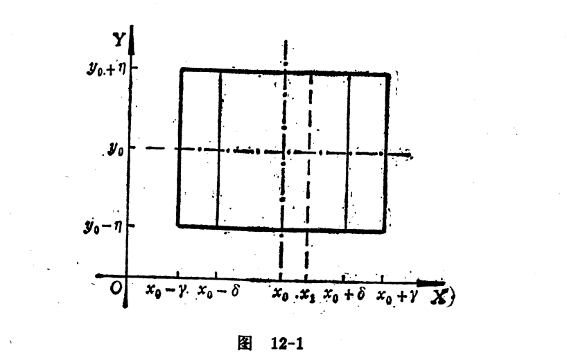

## 隐函数存在定理
所谓$f:D \to E$是一个函数,就是说$f$是这样一种法则:按照这种法则,对$D$中的每一个x,有E中唯一的y与之相对应.

我们约定:把与$x \in D$对应的唯一的$y \in E$记为$f(x)$.

但是要强调的是,函数关系式并不一定用明显(代数或分析)算式来表示.

在某些实际问题中,两个量之间的关系是通过一定的方程来表示.

[**定义**]
设$D \subset R,E \subset R$,并设二元函数$F(x,y)$定义域包含了$D \times E$.如果对每一个$x \in D$,恰好存在唯一的$y \in E$,使得$F(x,y)=0$.

由方程$F(x,y)=0$确定了一个D到E的隐函数.

或者说由条件$F(x,y)=0,x \in E,y \in E$确定了一个从D到E的的隐函数.

由条件$x \in D,y \in E,F(x,y)=0$所确定的从D到E的函数记为$f$,那么对任意的$x \in D$,我们有$f(x) \in E$且有$F(x,f(x)) \equiv 0$

函数f的对应法则就是:把每一个$ x \in D$对应于满足方程$F(x,y)=0$的唯一的$y \in E$.

实际上$F(x,y)=0$是一个方程,如果这个方程恒不成立,没有讨论的必要.

假设$F(x,y)=0$有解$(x_0,y_0)$,函数$F$在点$(x_0,y_0)$邻近是连续可微的.我们在点$(x_0,y_0)$邻近展开函数可以得到
$$F(x,y)=F(x_0,y_0)+\frac{\partial F}{\partial x}(x_0,y_0)(x-x_0) + \frac{\partial F}{\partial y}(x_0,y_0)(y-y_0) + o(\sqrt{(x-x_0)^2 + (y-y_0)^2})=\\
\frac{\partial F}{\partial x}(x_0,y_0)(x-x_0) + \frac{\partial F}{\partial y}(x_0,y_0)(y-y_0) + o(\sqrt{(x-x_0)^2 + (y-y_0)^2})$$
如果用线性主部代替原来的方程$F(x,y)=0$.
来考察近似方程
$\frac{\partial F}{\partial x}(x_0,y_0)(x-x_0) + \frac{\partial F}{\partial y}(x_0,y_0)(y-y_0)=0$
要使这个近似方程对每一个给定的$x$都能唯一确定$y$,必须而且只需要$\frac{\partial F}{\partial y}(x_0,y_0) \ne 0$
从观察近似方程得到了启发,探索能保证原来的方程$F(x,y)=0$在$(x_0,y_0)$邻近确定隐函数的条件.

[**定理1**]
设函数$F(x,y)$在包含$(x_0,y_0)$的一个开集$\Omega$上连续可微,并且满足$F(x_0,y_0)=0,\frac{\partial F}{\partial y}(x_0,y_0) \ne 0$,
则存在以$(x_0,y_0)$为中心的的开方块$D \times E \subset \Omega$
$(D=(x_0-\delta,x_0 + \delta),E=(y_0-\eta,y_0+\eta))$

## 逆映射定理