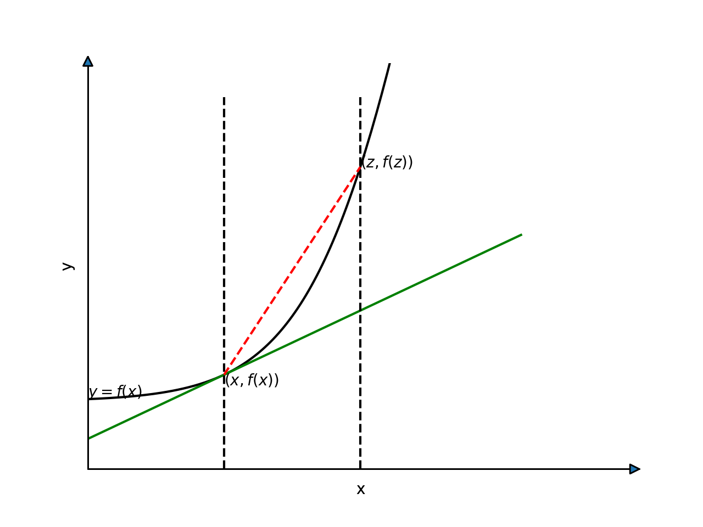
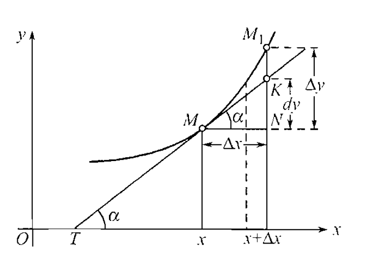
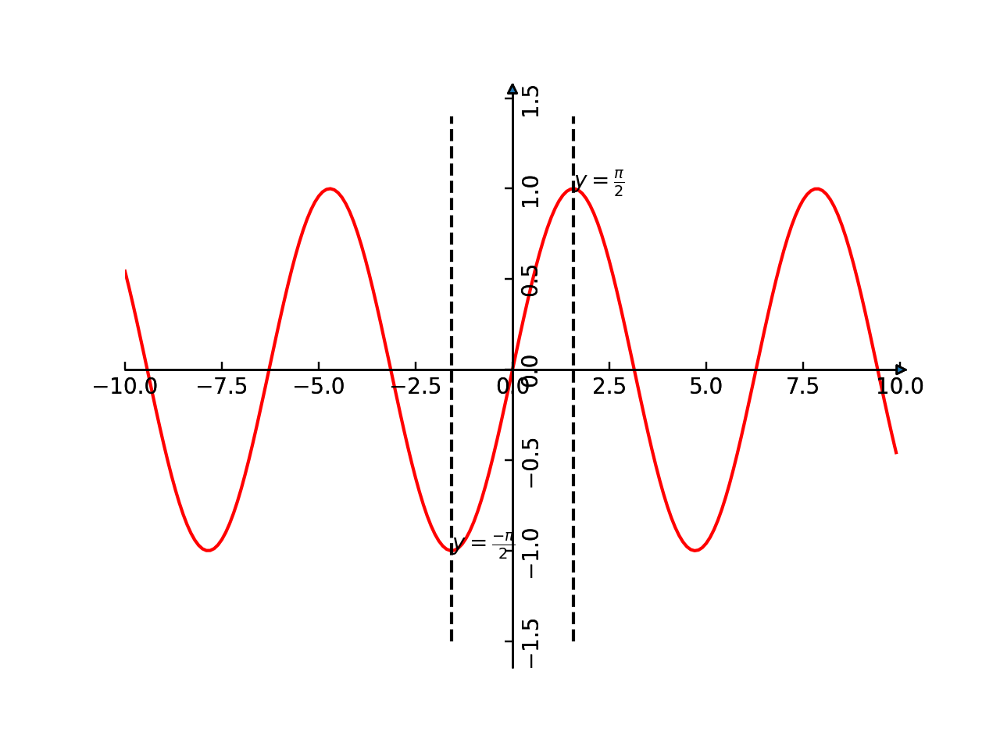

[toc]

## 导数

绿线表示 $y=f(x)$ 在 $x$ 处的切线  

红色虚线的斜率是
 $\frac{f(z)-f(x)}{z-x}$ 
现在，当点z越来越接近x，但没用真正到达x的情况下，以上直线的斜率应该变得越来越接近要找的切线斜率，  因此，显然有  

通过 $(x,f(x))$ 的切线斜率k $=\lim\limits_{z \to x}\frac{f(z)-f(x)}{z-x}$ .  

设 $h=z-x$ ，可以看到 $z \to x$ 时，有 $h \to 0$ 从而有通过 $(x,f(x))$ 的切线斜率k $=\lim\limits_{h \to 0}\frac{f(x+h)-f(x)}{h}$ .

通过 $(x,f(x))$ 的切线的斜率是关于 $x$ 的一个函数，这个函数被称为 $f$ 的导数，并写作 $f^{'}$ 。如果极限存在的话
$$
f^{'}(x)=\lim\limits_{h \to 0}\frac{f(x+h)-f(x)}{h}
$$

所以如果极限存在 $f(x)$ 在某点可到，否则不可导

##### 作为极限比的导数
 $\Delta y=f(x+\Delta x)-f(x)$   

 $f^{'}(x)=\lim\limits_{\Delta x \to 0}\frac{f(x+\Delta x)-f(x)}{\Delta x}=\lim\limits_{\Delta x \to 0}\frac{\Delta y}{\Delta x}$ 

##### 可导必连续
连续的定义
$$
\lim\limits_{x \to x_0}f(x)=f(x_0)
$$
也可以表示为
$$
\lim\limits_{\Delta x \to 0}f(x + \Delta x)=f(x)
$$
如果定义 $\Delta y =f(x + \Delta x) - f(x) $   
显然连续性的定义还可以表示为
$$
\lim\limits_{\Delta x \to 0}\Delta y=0
$$

可导意味着极限 $f^{'}(x)=\lim\limits_{h \to 0}\frac{f(x+h)-f(x)}{h}$ 存在，则
 $\lim\limits_{h \to 0} f(x+h)-f(x)=\lim\limits_{h \to 0}\frac{f(x+h)-f(x)}{h} * h=\lim\limits_{h \to 0}\frac{f(x+h)-f(x)}{h} * \lim\limits_{h \to 0} h=0$ ,所以 $\lim\limits_{h \to 0} f(x+h)=f(x)$ 故在 $x$ 处连续

#### 无穷小的定义
如果 $\Delta x$ 为无穷小量,则符号 $o(\Delta x)$ 表示比 $\Delta x$ 更加高阶的无穷小量,且有
$$
\lim\limits_{\Delta x \to 0}\frac{o(\Delta x)}{\Delta x} = 0
$$
#### 导数法则
1.
$$
\frac{d}{dx}(cy)=c \frac{dy}{dx}
$$
显然
$$
\frac{dy}{dx} = \lim\limits_{\Delta x \to 0}\frac{f(x + \Delta x) - f(x)}{\Delta x} \\
$$
或者
$$
\frac{dy}{dx} = \lim\limits_{\Delta x \to 0}\frac{ \Delta y}{\Delta x} \\
$$
 $y=f(x)$ 证明：
$$
\begin{aligned}
\frac{d}{dx}(cy)= & \lim\limits_{\Delta x \to 0}\frac{cf(x + \Delta x) - cf(x)}{\Delta x} \\
=& c \cdot \lim\limits_{\Delta x \to 0}\frac{f(x + \Delta x) - f(x)}{\Delta x} \\
=& c \frac{dy}{dx}
\end{aligned}
$$
2.  
$$
\frac{d}{dx}(u + v)=\frac{du}{dx} + \frac{dv}{dx}
$$
证明：
令 $u=f(x),v=g(x)$ ,那么
$$
\begin{aligned}
\frac{d}{dx}(u + v)= & \lim\limits_{\Delta x \to 0}\frac{(f(x + \Delta x) + g(x+ \Delta x)) - (f(x) + g(x))}{\Delta x} \\
=& \lim\limits_{\Delta x \to 0}\frac{f(x + \Delta x)   - f(x) }{\Delta x} + \lim\limits_{\Delta x \to 0}\frac{ g(x+ \Delta x) -  g(x)}{\Delta x} \\
=& \frac{du}{dx} + \frac{dv}{dx}
\end{aligned}
$$
3.
$$
\frac{d}{dx}(uv)=u\frac{dv}{dx} + v\frac{du}{dx}
$$
证明：
利用函数的增量比极限来定义导数有 $\frac{dy}{dx} = \lim\limits_{\Delta x \to 0}\frac{ \Delta y}{\Delta x} \\$ 
假设我们将 $x$ 变为 $x+\Delta x$ 时，变量u 变为了 $u + \Delta y$ ,而变量v 变为了 $v + \Delta v$ ,那么uv就变成了 $(u+\Delta u)(v + \Delta v)$ 
展开就有：
$$
(u+\Delta u)(v + \Delta v)=
uv + u \Delta v + v \Delta u + \Delta u \Delta v
$$
$$
\begin{aligned}
\frac{d}{dx}(uv)=& \lim\limits_{\Delta x \to 0}\frac{\Delta (uv)}{\Delta x} \\
=& \lim\limits_{\Delta x \to 0}\frac{(u+\Delta u)(v + \Delta v) -uv}{\Delta x} \\
=& \lim\limits_{\Delta x \to 0}\frac{u \Delta v + v \Delta u + \Delta u \Delta v}{\Delta x} \\
=& \lim\limits_{\Delta x \to 0}u \frac{ \Delta v }{\Delta x}  + \lim\limits_{\Delta x \to 0}v \frac{\Delta u }{\Delta x}  + \lim\limits_{\Delta x \to 0}\frac{\Delta u \Delta v}{\Delta x}  \\
=& \lim\limits_{\Delta x \to 0}u \frac{ \Delta v }{\Delta x}  + \lim\limits_{\Delta x \to 0}v \frac{\Delta u }{\Delta x}  + \lim\limits_{\Delta x \to 0}\frac{\Delta u }{\Delta x} \frac{\Delta v}{\Delta x} \Delta x \\
=& u\frac{dv}{dx} + v\frac{du}{dx} + 0 \\
=& u\frac{dv}{dx} + v\frac{du}{dx}
\end{aligned}
$$
4.
$$
\frac{d}{dx}(\frac{u}{v})=\frac{v\frac{du}{dx}-u\frac{dv}{dx}}{v^2}
$$
证明：
利用函数的增量比极限来定义导数有 $\frac{dy}{dx} = \lim\limits_{\Delta x \to 0}\frac{ \Delta y}{\Delta x} \\$ 
假设我们将 $x$ 变为 $x+\Delta x$ 时，变量u 变为了 $u + \Delta y$ ,而变量v 变为了 $v + \Delta v$ ,那么 $\frac{u}{v}$ 就变成了 $\frac{u+\Delta u}{v + \Delta v}$ 

$$
\Delta (\frac{u}{v})=\frac{u+\Delta u}{v + \Delta v} - \frac{u}{v}=
\frac{v\Delta u  -u \Delta v}{v^2+\Delta v}
$$

$$
\begin{aligned}
\frac{d}{dx}(\frac{u}{v})=& \lim\limits_{\Delta x \to 0}\frac{\Delta (\frac{u}{v})}{\Delta x} \\
=& \lim\limits_{\Delta x \to 0}\frac{\frac{u+\Delta u}{v + \Delta v} - \frac{u}{v}}{\Delta x} \\
=& \lim\limits_{\Delta x \to 0}\frac{\frac{v\Delta u  -u \Delta v}{v^2+\Delta v}}{\Delta x} \\
=& \lim\limits_{\Delta x \to 0}\frac{v \frac{\Delta u}{\Delta x}  -u \frac{\Delta v}{\Delta x}}{v^2+\Delta v} \\
=& \frac{v \frac{du}{dx}  -u \frac{dv}{dx}}{v^2} \\
\end{aligned} 
$$
这里利用了  $\lim\limits_{\Delta x \to 0}(v^2+\Delta v)=\lim\limits_{\Delta x \to 0}(v^2+\frac{\Delta v}{\Delta x}\Delta x)=v^2$ 
当然只要函数是可导的(甚至只要函数是连续的)，必然有
 $\lim\limits_{\Delta x \to 0} \Delta u=0,\lim\limits_{\Delta x \to 0} \Delta v=0$ 

#### 函数增量公式

对应于变元的增量 $\Delta x$ ，函数增量可以表示为
$$
    \Delta y=\Delta f(x_0)=f(x_0 + \Delta x)-f(x_0)
$$
1.若函数 $y=f(x)$ 在点 $x_0$ 处有（有限的）导数 $y_x^{'}=f^{'}(x_0)$ ，则函数的增量可以表示为如下的形式:
$$
\Delta f(x_0)=f^{'}(x_0)\Delta x + a \cdot \Delta x
$$
这里的 $\alpha$ 是依赖于 $\Delta x$ 的变量，且随着 $\Delta x$ 一同趋于零。

证明：
有导数的定义可知， $\Delta x \to 0$ 时
$$
\frac{\Delta y}{\Delta x} \to y^{'}_x
$$
令

$$
\alpha=\frac{\Delta y}{\Delta x} - y^{'}_x
$$
从而有:
$$
\Delta f(x_0)=y^{'}_x\Delta x + a \cdot \Delta x
=f^{'}(x_0)\Delta x + a \cdot \Delta x
$$
由导数的定义显然有
$$
\lim\limits_{\Delta x \to 0}\alpha=\lim\limits_{\Delta x \to 0}(\frac{\Delta y}{\Delta x} - y^{'}_x)=
\lim\limits_{\Delta x \to 0}\frac{\Delta y}{\Delta x} - y^{'}_x=0
$$

 $\alpha$ 随着 $\Delta x$ 一同趋于零，故 $\alpha \cdot \Delta x$ 是较 $\Delta x$ 更加高阶的无穷小，所以
$$
\Delta f(x_0)=y^{'}_x\Delta x + a \cdot \Delta x
=f^{'}(x_0)\Delta x + o(\Delta x) \\
$$
或者
$$
\Delta y=y^{'}_x\Delta x + a \cdot \Delta x
=y^{'}_x\Delta x + o(\Delta x)
$$

##### 复合函数求导法则----一元函数链式法则
对于 $g$ 在 $x$ 处可微，且 $f$ 在 $g(x)$ 处可微，这个时候复合函数 $f \circ g$ 定义了 $F(x)=f(g(x))$ 在x处可微，且 $F^{'}$ 可写成
$$
F(x）= f^{'}(g(x)) \cdot g^{'}(x) \tag{1.2}
$$
利用莱布尼茨记号 $y=f(u),u=g(x)$ ,则

$$
\frac{dy}{dx}=\frac{dy}{du} \cdot \frac{du}{dx} \tag{1.3}
$$

$$
\Delta u=g(x+\Delta x)-g(x) \\
\Delta y=f(u+\Delta u)-f(u) \\
$$
因为 g(x) 可微，所以 g(x) 必然连续，根据连续性定义有
$$
\lim\limits_{x \to a}g(x)=g(a) \\
\lim\limits_{\Delta x \to 0}g(x+\Delta x)=g(x) \\
$$
根据连续性定义可得 $\lim\limits_{\Delta x \to 0}\Delta u=0 $ ，证明如下：
$$
\begin{aligned}
\lim\limits_{\Delta x \to 0}\Delta u = & \lim\limits_{\Delta x \to 0}(g(x+\Delta x)-g(x)) \\
=& \lim\limits_{\Delta x \to 0}g(x+\Delta x)-\lim\limits_{\Delta x \to 0}g(x) \\
=& g(x)-g(x) \\
=& 0 \\
\end{aligned}
$$
利用上面准备好的结论，由导数定义 $\frac{dy}{dx}=\lim\limits_{\Delta x \to 0}\frac{\Delta y}{\Delta x}$ 有

$$
\begin{aligned}
\frac{dy}{dx}=&\lim\limits_{\Delta x \to 0}\frac{\Delta y}{\Delta x}\\
            =&\lim\limits_{\Delta x \to 0}\frac{\Delta y}{\Delta u} \cdot \frac{\Delta u}{\Delta x}\\
            =&\lim\limits_{\Delta x \to 0}\frac{\Delta y}{\Delta u} \cdot \lim\limits_{\Delta x \to 0}\frac{\Delta u}{\Delta x}\\
            =&\lim\limits_{\Delta u \to 0}\frac{\Delta y}{\Delta u} \cdot \lim\limits_{\Delta x \to 0}\frac{\Delta u}{\Delta x}\\
            =&\frac{dy}{du} \cdot \frac{du}{dx}
\end{aligned}
$$

上面的证明实际上有一些瑕疵，那就是如果 $\Delta u = 0$ 时，上面的推导是错误的。

[**引理-函数增量公式**]

利用有限导数可以将函数增量写成一下形式
$$\Delta y= f^{'}_u \Delta u + \alpha(\Delta  u) \Delta u,\tag{1}$$

其中 $\lim\limits_{\Delta u \to 0}\alpha(\Delta u)=0,\alpha(\Delta u)=0$ 
proof:
利用导数的定义可知$\lim\limits_{\Delta u \to 0}(\frac{\Delta y}{\Delta u} - f_u')=0$
这里需要注意的是$\Delta u \ne 0$,否则无定义.
记$\alpha(\Delta u) = \frac{\Delta y}{\Delta u} - f_u',\Delta u \ne 0$则有
$\Delta y =f_u'\Delta u + \alpha(\Delta u)\Delta u,\Delta u \ne 0$
这是因为$\alpha(\Delta u)$本身是在$\Delta u=0$处是没有定义的.
不妨补充定义$\alpha(0)=0$.补充定义不妨碍$\Delta u \to 0$时$\alpha(\Delta u)$的极限.

只要$\alpha(0)$有定义,很显然$\Delta u=0$,那么就有$\Delta y =f(u + \Delta u) - f(u)=0$而等式的右边也是0,从而等式1也是成立的.

实际上只需要补充$\alpha(\Delta u)$在$\Delta u=0$处的定义即可.至于是多少,实际上不影响等式1的成立与否.
但是如果补充$\alpha(0)=0$好处是,这样$\alpha(\Delta u)$在$\Delta u=0$处是连续的.

不见不管$\Delta u$是等于0还是不等于0,都有 $\Delta y= f^{'}_u \Delta u + \alpha(\Delta  u) \Delta u$成立.

$\blacksquare$

利用函数增量公式
$\Delta y= f^{'}_u \Delta u + \alpha \cdot \Delta u$
两边同时除以 $\Delta x$ ( 作为自变量的 $\Delta x$ 可以认为其不为0，而作为因变量的 $\Delta u$ 却不能作此假设)有
$$
 \frac{\Delta y}{\Delta x}= f^{'}_u \frac{\Delta u}{\Delta x} + \alpha \cdot \frac{\Delta u}{\Delta x}
$$
两边同时取极限 $\Delta x \to 0$ 
$$
\lim\limits_{\Delta x \to 0} \frac{\Delta y}{\Delta x}= \lim\limits_{\Delta x \to 0}f^{'}_u \frac{\Delta u}{\Delta x} + \lim\limits_{\Delta x \to 0}\alpha \cdot \frac{\Delta u}{\Delta x}
$$
因为 $\lim\limits_{\Delta x \to 0}\alpha =\lim\limits_{\Delta u \to 0}\alpha= 0$ 故有

$$
\frac{dy}{dx}=\lim\limits_{\Delta x \to 0} \frac{\Delta y}{\Delta x}= \lim\limits_{\Delta x \to 0}f^{'}_u \frac{\Delta u}{\Delta x}= f^{'}_u \cdot g^{'}_x
$$

[**例**]

 $F(x)=\sqrt{x^2+1}$ ,求解 $F(x)在x=1处的导数值\frac{dF(x)}{dx}|_{x=1}$   

链式表达  
$$
y=f(u)=\sqrt{u},u=g(x)=x^2+1 ,\\
\frac{du}{dx}=\frac{1}{2\sqrt{u}},\frac{du}{dx}=2x 
$$

前向计算  
$$
u(x=1)=2 \\ 
f(g(x))=f(u=2)=\sqrt{2} 
$$  

后向计算  
$$
\frac{du}{dx}|_{x=1} = 2 \\
\frac{dy}{du}|_{u=2} = \frac{1}{2*\sqrt{2}} 
$$

 $\text{利用链式法则可得}$ 
$$
\frac{dF(x)}{dx}=\frac{dy}{du} \frac{du}{dx} 
=\frac{1}{2\sqrt{u}} \cdot 2x 
=\frac{x}{\sqrt{x^2+1}} 
$$
两种计算方法  
M-1
$$
\frac{dF(x)}{dx}|_{x=1} = \frac{1}{\sqrt{1+1}}=\frac{1}{\sqrt{2}}
$$

M-2 
$$
\frac{dF(x)}{dx}|_{x=1} = \frac{dy}{du}|_{u=2} \cdot  \frac{du}{dx}|_{x=1}
=\frac{1}{2*\sqrt{2}} *2=\frac{1}{\sqrt{2}}
$$

#### 微分的定义
对应于变元的增量 $\Delta x$ ，函数增量可以表示为
$$
    \Delta y=\Delta f(x_0)=f(x_0 + \Delta x)-f(x_0)
$$
如果 $\Delta y$ 可以表示为
 $$
 \Delta y = A \cdot \Delta x  + o(\Delta x)
 $$
 则认为函数 $y=f(x)$ （在给定的x=x0处）是==可微==的，表达式中的 $A \cdot \Delta x$ 就称为函数的微分，用记号 $df$ 或者 $df(x_0)$ 表示。
 当 $\Delta x \to 0$ 时， $A \Delta x$ 就可当作 $\Delta y$ 的主部。
 
 函数的微分有两个特性：
 - 它是变元增量 $\Delta x$ 的线性函数
 - 它与函数的增量相差一个数量，且这个数量在 $\Delta x \to 0$ 时是较 $\Delta x$  更高阶的无穷小。
 
> 例子
- 圆的面积公式 $Q=\pi r^2$ ,半径 $r$ 增大 $\Delta r$ ,面积的增量
 $\Delta Q=\pi (r + \Delta r)^2 - \pi r^2=2 \pi r \Delta r + \pi (\Delta r)^2$ 
- 球体积公式 $V=\frac{4}{3}\pi r^3$ ,半径增大 $\Delta r$ ，体积的增量
 $\Delta V = \frac{4}{3} \pi ((r + \Delta r)^3 - r^3)=4 \pi r^2 \Delta r+ 4 \pi r (\Delta r)^2 + \frac{4}{3}\pi (\Delta r)^3 $ 

#### 函数增量的分析
对于函数 $y=f(x)$ ,对函数做增量分析:
$$
\Delta y = f(x + \Delta x) -f(x)
$$
如果函数在 $x$ 处可微，则表明:
$$
\Delta y = f(x + \Delta x) -f(x)=A \Delta x + r(\Delta x)
$$
其中 $A $ 与 $\Delta x$ 无关，但是函数增量与线性主部的差 $r(\Delta x)$ 一般来说都是 $\Delta x$ 的函数，但是可微要求
$$
\lim\limits_{\Delta x \to 0}\frac{r(\Delta x)}{\Delta x} = 0
$$
即 $r(\Delta x) = o(\Delta x)$ ,即残差是 $\Delta x$ 的高阶无穷小。

>例子

圆的面积公式 $Q=\pi r^2$ ,半径 $r$ 增大 $\Delta r$ ,面积的增量
 $\Delta Q=\pi (r + \Delta r)^2 - \pi r^2=2 \pi r \Delta r + \pi (\Delta r)^2$   
故有:
 $A = 2 \pi r  ,r(\Delta r)=\pi (\Delta r)^2$  
显然也有:
$$
\lim\limits_{\Delta r \to 0}\frac{r(\Delta r)}{\Delta r} = 0
$$

#### 可导和可微的关系  
由可导的结论可知,函数增量可以表示为
$$
\Delta y=y^{'}_x\Delta x + a \cdot \Delta x
=y^{'}_x\Delta x + o(\Delta x)
$$
由可微的定义可知，可导函数一定可微，这个时候 $A=y^{'}_x$ .

由可微的定义
 $$
 \Delta y = A \cdot \Delta x  + o(\Delta x)
 $$
 知
  $$
 \frac{\Delta y}{\Delta x} = A   +\frac{ o(\Delta x)}{\Delta x}
 $$
 显然有
   $$
 y^{'}_x=\lim\limits_{\Delta x \to 0}\frac{\Delta y}{\Delta x} = A   +\lim\limits_{\Delta x \to 0}\frac{ o(\Delta x)}{\Delta x}=A
 $$
 可知可微也可以推导出可导。
 
 显然可以得出微分和导数的关系
 $$
 dy=y^{'}_x \cdot dx
 $$
 也有
  $$
 y^{'}_x =\frac{dy}{dx}
 $$
函数的微分 $dy$ 和函数的导数 $y^{'}_x$ 只差一个因子 $dx$ 

#### 微分法则
$$
\begin{aligned}
d(cu)=& c \cdot du \\
d(u \pm v)=& du \pm dv \\
d(uv)=& udv + vdu \\
d(\frac{u}{v})=& \frac{v \cdot du-u \cdot dv}{v^2}
\end{aligned}
$$
利用导数和微分的关系简单证明如下:
$$
\begin{aligned}
d(uv)=& (uv)^{'}_x \cdot dx \\
=& (u^{'}_x \cdot v + v^{'}_x \cdot u) \cdot dx \\
=& (u^{'}_x dx \cdot v + v^{'}_x dx \cdot u)  \\
=& du \cdot v + dv \cdot u
\end{aligned}
$$

$$
\begin{aligned}
d(\frac{u}{v})=& (\frac{u}{v})^{'}_x \cdot dx \\
=& (\frac{u^{'}_x v - v^{'}_x u }{v^2}) \cdot dx \\
=& \frac{u^{'}_x dx v - v^{'}_x dx u }{v^2} \\
=& \frac{du \cdot  v - dv \cdot u }{v^2} \\
\end{aligned}
$$
#### 微分形式不变性
假设 $y=f(x),x=\varphi(t)$ ,由他们组成的复合函数: $y=f(\varphi(t))$ ,若导数 $y^{'}_x,x^{'}_t$ 都存在，则利用复合函数法则有:
$$
y^{'}_t = y^{'}_x \cdot x^{'}_t
$$
若以x为自变量自然有
 $dy=y^{'}_x dx$ 
若改用t作为自变量，
 $$
 dy=y^{'}_t dt=
 y^{'}_x x^{'}_t dt
 $$
  $x^{'}_t dt$ 是 $x$ 当做 $t$ 的函数时的微分,显然 $dx=x^{'}_t dt$ ,则有
  $$
 dy=y^{'}_t dt=
 y^{'}_x x^{'}_t dt = y^{'}_x dx
 $$
 所以微分的形式即使在原来的自变量替换成新的自变量以后任然可以保持着。
 在例子中，若选择t为自变量，则 $dx$ 并不是任意增量 $\Delta x$ , 而是表示 $x$ 作为 $t$ 的函数的微分。
 
 
 #### 参变量方程
 当 $y$ 和 $x$ 的关系并不直接给定，而是有第三辅助变量 $t$ 的关系所给定。若把 $x$ 和 $y$ 看做平面上点的直角坐标，则对参变量 $t$ 的每一个数值，都对应平面上一个具体的点，这点随着 $t$ 的变动在平面上画出一条曲线。
 $$
 x=\varphi(t),y=\psi(t)
 $$
 假设x和t之间可以确立反函数 $t=\theta(x)$ ,则
 $$
 y=\psi(\theta(x))=f(x)
 $$
我们并不需要真正的求出 $\theta$ , $f$ 函数，利用微分可确立导数
 $y^{'}_x$ 
 $$
 y^{'}_x = \frac{dy}{dx}=\frac{ y^{'}_t dt}{x^{'}_tdt}=\frac{y^{'}_t}{x^{'}_t}=\frac{\varphi^{'}(t)}{\psi^{'}(t)}
 $$
 
> 附注  
依任意变量而取的微分可以表示导数，利用这个可能性，可以非常简单的导出反函数的求导法则和符合函数的求导法则
$$
    \frac{dy}{dx}=\frac{1}{\frac{dx}{dy}} \\
    \frac{dy}{dx}=\frac{dy}{du} \cdot \frac{du}{dx}
$$
原来依次表示在莱布尼茨记法下的反函数及复合函数的微分法则，而现在却已成为了简单的代数恒等式（由于此处一切微分都可以依同一变量取之）

## 微分

#### 利用微分做近似计算
当 $\Delta x \to 0$ 时微分 $dy$ 是函数增量 $\Delta y$ 的主部，这样就有
$dy \sim \Delta y$ 于是
$$
dy \dot= \Delta y \\
\Delta f(x_0)=f(x_0 + \Delta x)-f(x_0) \dot= f^{'}(x_0)\Delta x
$$
只要 $\Delta x $ 够小，上面的等式的误差就小。

令 $\Delta x = x-x_0$ 则有  
$f(x)-f(x_0) = f^{'}(x_0)(x- x_0)$ 
$f(x) = f(x_0) + f^{'}(x_0)(x- x_0)$   

取 $x_0=0$ 则有 
$$
f(x) = f(0) + f^{'}(0)x
$$
> 例子
$$
(1+x)^\mu \dot= 1+\mu \cdot x,特别的有\sqrt{1+x} \dot= 1+ \frac{x}{2} \\
e^x \dot= 1+ x \\
\ln(1+x) \dot= 1+x \\
sin \dot= x \\
tgx \dot= x
$$

#### 应用微分来估计误差
设数量x可以直接地度量或计算，而依赖着它的数量y则依据公式 $y=f(x)$ 来决定。在度量时通常发生误差 $\Delta x$ ，它就引起数量y的误差  $\Delta y$ ，由于这些误差都是一些微小的数量，可假定
$$
\Delta y=y^{'}_x \cdot \Delta x
$$
++即用微分 $dy$ 来替代函数增量 $\Delta y$ ++

设 $\delta x$ 是x的最大误差，既有 $\left | \Delta x \right| \leq \delta x$ ,一般来说，此类度量时的误差限度是可以知道的，显然可以用
$$
\delta y = \left | y^{'}_x \right | \cdot \delta x
$$
来确定y的最大绝对误差(误差限度)
[**例**]

1.要确定球的体积，首先用一起来直接测量求的直径D,再用公式 $V=\frac{\pi D^3}{6}$ 计算体积。

$$
\delta V=\frac{ \pi D^2 }{2} \cdot \delta D
$$
化成相对误差有
$$
\frac{\delta V}{V}=\frac{ 3 }{D} \cdot \delta D=3\frac{\delta D}{D}
$$

#### 反函数存在定理
一个 $y$ 只与一个 $x$ 相对应的函数具有反函数。又称为水平线检验法，即任意一条水平线 $y=k$ ，只与函数 $y=f(x)$ 只有一个交点，则具有反函数。

定义映射
 $f:x \to y$ ,则逆映射 $ f^{-1}: y \to x$ ,如果一个 $y$ ，对应了多个 $x$ ，则逆映射 $f^{-1}$ 不符合定义。这样的函数显然是有问题的，不能一个自变量一会映射到 $A$ ，一会映射到 $B$ .

显然单调函数具有反函数。

对于有些函数其整个定义域区间可能不存在反函数，但是某些自变量 $x$ 的区间，是满足上面的单映射关系的。
 $y=sin(x)$ 在整个定义域区间，显然不满足，但是当 $x \in [\frac{-\pi}{2},\frac{\pi}{2}]$ 则有反函数。

#### 反函数求导的规则
给定$y=f(x)$,若假设反函数存在即 $x=f^{-1}(y)$ ,为了便于理解，可以令 $g=f^{-1} ,则 x=g(y)$ 

> 例  
这里一定要区分变量和表达式,其中  $ x ,y $ 是变量, $f(x),f^{-1}(y),g(y)$  都是表达式，表达式可以和不同的变量关联，举例来说
 $y=sin(x)$ ,表达式 $f(x)$ 给出了变量 $y$ 和 $x$ 之间的具体关系， $f(x)=sin(x),y=f(x)$ ,假设在 $x$ 的某个取值区间内反函数存在,即有 $x=arcsin(y)$ ,所以 $x=f^{-1}(y)=arcsin(y)$ 且 $x=g(y)=arcsin(y)$ ,表达式 $f^{-1}(y)$  和 $g(y)$ 给出了 $x$ 和 $y$ 之间的具体关系

> 有时候原函数直接求导可能比较困难，但是其反函数求导相对简单，则可以利用反函数和原函数的导数关系进行简化求解。

1.原始定义法---变量增量比极限法
$$ 
\frac{\Delta x}{\Delta y}=\frac{1}{\frac{\Delta y}{\Delta x}}
$$ 
显然 $\lim\limits_{\Delta x \to 0} \Delta y =0$ 故

$$ 
x^{'}_y=\frac{dx}{dy}=\lim\limits_{\Delta y \to 0}\frac{\Delta x}{\Delta y}=\lim\limits_{\Delta x \to 0}\frac{1}{\frac{\Delta y}{\Delta x}}
=\frac{1}{\frac{dy}{dx}}=\frac{1}{y^{'}_x}
$$ 

$$ 
y^{'}_x=\frac{dy}{dx}=\lim\limits_{\Delta x \to 0}\frac{\Delta y}{\Delta x}=\lim\limits_{\Delta y \to 0}\frac{1}{\frac{\Delta x}{\Delta y}}
=\frac{1}{\frac{dx}{dy}}=\frac{1}{x^{'}_y}
$$ 

2.利用微分法
$$ 
x^{'}_y =\frac{dx}{dy}=\frac{1}{\frac{dy}{dx}}=\frac{1}{y^{'}_x}
$$ 

3.隐函数法
$$ 
y=f(x),x=f^{-1}(y)=g(y)
$$ 
两边同时对x微分
$$ 
1=g^{'}(y) \frac{dy}{dx}
$$ 
显然 $x^{'}_y=g^{'}(y)$ 
故
 $\frac{dy}{dx}=\frac{1}{g^{'}(y)}=\frac{1}{x^{'}_y}$ 

> 应用

 $y=log_a(x)$ 不好直接求导，或者不记得导数的公式,但是知道这个是 $x=a^y$ 的反函数，且显然有 $x^{'}_y=a^y \ln a$ 
所以
$$ 
y^{'}_x=\frac{1}{x^{'}_y}=\frac{1}{a^ylna}=\frac{1}{a^{log_a(x)} lna}=\frac{1}{xlna}
$$ 

 $y=arcsin(x)$  不好直接求导,显然其反函数为 $x=sin(y)$ ，这个很好直接求导 $x^{'}_y=cos(y)$ ,所以
$$ 
y^{'}_x=\frac{1}{x^{'}_y}=\frac{1}{cos(y)}=\frac{1}{\sqrt{1-sin^2(y)}}=\frac{1}{\sqrt{1-x^2}}
$$ 

 $y=arccos(x)$  不好直接求导,显然其反函数为 $x=cos(y)$ ，这个很好直接求导 $x^{'}_y=-sin(y)$ ,所以
$$ 
y^{'}_x=\frac{1}{x^{'}_y}=\frac{1}{-sin(y)}=\frac{-1}{\sqrt{1-cos^2(y)}}=\frac{-1}{\sqrt{1-x^2}}
$$ 

 $y=arctg(x)$  不好直接求导,显然其反函数为 $x=tg(y)$ ，这个很好直接求导
 $x=\frac{sin(y)}{cos(y)} $ 

$$ 
x^{'}_y=\frac{cos(y)*cos(y)+sin(y)*sin(y)}{cos^2(y)}=\frac{1}{cos^2(y)}=1+tg^2(y)
$$ 

$$ 
y^{'}_x=\frac{1}{x^{'}_y}=\frac{1}{1+tg^2(y)}=\frac{1}{1+x^2}
$$ 

## 高阶导数