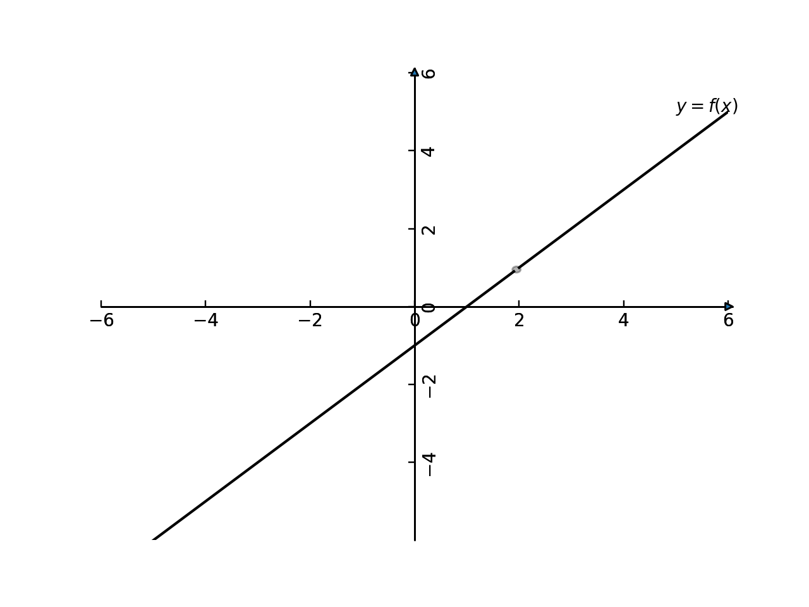
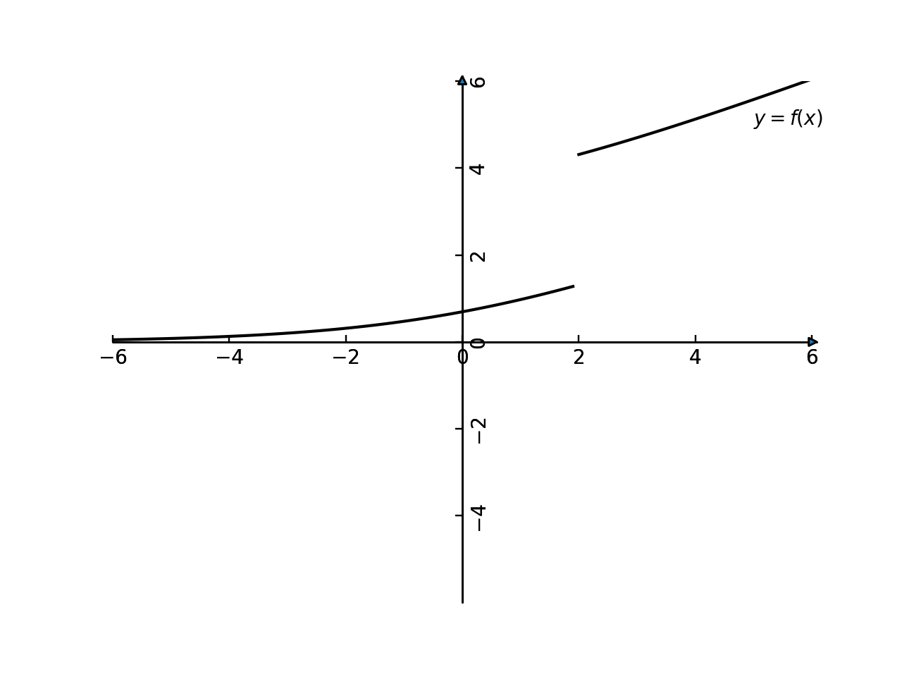

[toc]

# 函数极限

## 函数极限两种定义

###  $\epsilon - \delta $ 定义(柯西定义)

函数在去心邻域 $\hat{U}(a,\delta_0)$ 内有定义，
如果任给 $\epsilon  > 0$ ，总是存在 $\delta$ ,使得 $\forall x \in \hat{U}(a,\delta) = \{x| 0 <|x  - a| < \delta \}$ 满足 $|f(x) - A| < \epsilon $ ,则有
$$
\lim\limits_{x \to a}f(x) = A
$$

有时候函数 $x=a$ 是没有定义的，不要求函数在 $x=a$ 处有定义，,只要求函数在 $x=a$ 的一个去心邻域内 $\hat{U}(a,\delta)$ 有定义即可,函数在 $x=a$ 处的函数值也不影响函数的极限值。函数的极限可以不等于该处的极限值．

实际上当我们考察函数极限的时候，只需要考察 $a$ 附近一个充分小的邻域内的函数性态即可．

### 序列定义  

 $\lim\limits_{x \to a}f(x)=A$ 的充分必要条件为:  对任一满足 $\lim\limits_{n \to \infty}x_n = a$ 且 $x_n \ne a$ 的数列 $\{x_n\}$ 均有：
$$
\lim\limits_{n \to \infty}f(x_n)=A
$$
它反映了变量以连续形式变化时的趋势和以离散形式变化趋势之间的关系，前者是一般形式，后者是特殊形式。这个定理可以将数列极限和函数极限联系起来。

## 海涅定理

(海涅定理)设函数 $f(x)$ 在 $x_0$ 的某个去心领域内有定义，则 $f(x)$ 在 $x_0$ 处的极限为 $A$ 即， $\lim\limits_{x \to x_0} f(x) = A$ 的充分必要条件是对任何收敛点列 $x_n \to x_0$ 且 $x_n \ne x_0 (\exists N_0,\forall n > N_0)$ 均有
$$
\lim\limits_{n \to \infty}f(x_n) = A
$$
证明:  
必要性:
 $\lim\limits_{x \to x_0} f(x) = A$ 意味着 $\forall \epsilon >0 ,\exists \delta >0$ 满足 $0<|x -x_0|<\delta,|f(x) - A|< \epsilon $ .  
如果 $x_n \to x_0$ ,意味着 $\forall \epsilon_1>0,\exists N>0$ 满足 $n > N, |x_n -x_0| < \epsilon_1$ ,
将 $\epsilon_1 $ 取值为 $\delta$ 则有存在 $N > 0$ ,当 $n>N$ 的时候有 $|x_n -x_0| < \delta$ ，那么也就是说有 $|f(x_n) - A|< \epsilon$ .    
也就是说确实 $\forall \epsilon >0$ 确实存在 $\delta > 0, N>0$ 当 $n>N$ 的时候有 $|x_n - x_0| < \delta$ ,满足 $|f(x_n) - A| < \epsilon $ .  
这个也就证明了 $\lim\limits_{n \to \infty}f(x_n) = A$ .  

这个地方,如果 $\lim\limits_{x \to x_0}f(x) = A \ne f(x_0)$ ,则会出现对于某些 $\{x_n\}$ 来说,如果 $\{x_n\}$ 的每项都是 $x_0$ 的话,会出现 $f(x_n) \to f(x_0)$ .
而其他的如果 $x_n \to x_0$ 的数列而言,会有 $f(x_n) \to A$ .那么也就是 $\lim\limits_{n \to \infty}f(x_n)$ 不存在.这个就是为什么要定理里面规定 $x_n \to x_0$ 且 $x_n \ne x_0 (\forall n)$ .

充分性:  
反证法证明:任意 $x_n \to x_0$ 都有 $\lim\limits_{n \to \infty}f(x_n) = A$ ,但是 $\lim\limits_{x \to x_0} f(x) \ne A$ .  
如果 $\lim\limits_{x \to x_0} f(x) \ne A$ ,肯定 $\exists \epsilon_0 > 0,\forall \delta >0$ ,在去心邻域 $|x - x_0| < \delta$ 总是里存在 $x$ ,但是 $|f(x) - A | \ge \epsilon_0$ .  
从前面的分析里面取 $\delta =1,1/2,1/3,...,1/n,...$ ,我们可以获得一个数列 $\{x_n\}$ 满足 $x_n \to x_0$ ,但是都有 $|f(x_n) - A| \ge \epsilon_0$ .那当然会出现 $\lim\limits_{n \to \infty}f(x_n) \ne A$ .这个就和前提假设，已知条件矛盾.

 $\blacksquare$ 

证明步骤中出现了 $0<|x_n-x_0|<\delta$ ,所以 $x_n \ne x_0$ .
因为 $\{x_n\}$ 是任意的,所以假如我取了一个数列 $\{x_n\}$ ,使得从第 $N+1$ 项开始 $x_n=x_0$ ,这时候对于 $\delta>0$ ,总是存在 $N$ ,当 $n>N$ 时 $0<|x_n-x_0|<\delta$ 

但我从 $\lim\limits_{x \to x_0}f(x)=A$ ,仅仅得出对任意 $\epsilon >0$ ,存在 $\delta >0$ ,当 $0<|x_n-x_0|<\delta$ 时,有 $|f(x)-A|<\epsilon$ 
也就是说当 $|x-x_0|=0$ 时,不一定有 $|f(x)-A| < \epsilon $ ,于是你从 $|x_n-x_0|=0$ ,不能推出 $|f(x)-A|<\epsilon$ ,也就不能推出 $\lim\limits_{n \to +\infty}f(x_n)=A$ .

给一个反例.

取分段函数
$$
f(x) = x, x \ne 0  \\
f(x) = 1, x = 0
$$

令 $x_0=0$ ,显然 $\lim\limits_{x \to x_0} f(x)=\lim\limits_{x \to 0}f(x)=0$ 
取一个数列 ${x_n}=\{1,0,1/3,0,1/5,0,...\}$ ,奇数项是 $1/n$ ,偶数项是0.很显然也有 $\lim\limits_{n \to \infty} x_n = x_0 = 0$ .

但 $\{f(x_n)\}=\{f(1),f(0),f(1/3),f(0),...\}=\{1,1,1/3,1,1/5,1,...\}$ ,奇数项仍然是 $1/n$ ,但偶数项变成了 $1$ .显然 $\{f(x_n)\}$ 不再收敛.

(复合函数的极限)
设 $f(y)$ 在 $y_0$ 处的极限为 $A$ ,即 $\lim\limits_{y \to y_0}f(y) = A$ , $g(x)$ 在 $x_0$ 处的极限为 $y_0$ ,即 $\lim\limits_{x \to x_0}g(x) = y_0$ ,且存在 $x_0$ 的一个去心邻域，在此去心邻域内 $g(x) \ne y_0$ ,则复合函数 $f(g(x))$ 在 $x_0$ 处的极限为 $A$ ， $\lim\limits_{x \to x_0}f(g(x)) = A$ ．（实际上只要 $g(x)$ 趋向于 $y_0$ 的过程中没有无限个 $x$ 满足 $g(x)=y_0$ 那么必然就能找到一个 $x_0$ 的去心邻域满足 $g(x) \ne y_0$ ）  

证明:  
 $\lim\limits_{y \to y_0}f(y) = A$ 意味着， $\forall \epsilon >0,\exists \delta >0$ ,满足
 $0<|y - y_0| < \delta $ 都有 $|f(y) -  A| < \epsilon $ .  
 $\lim\limits_{x \to x_0}g(x) = y_0$ ,说明 $\forall \epsilon_1 > 0,\exists \delta_1 >0$ 
满足 $0<|x - x_0| < \delta_1 $ 都有 $|g(x) -  y_0| < \epsilon_1 $ .  

如果将 $\epsilon_1$ 取 $\delta$ ,也就是说 $\forall \delta > 0,\exists \delta_1 >0$ ,满足 $0<|x - x_0| < \delta_1 $ 都有 $|g(x) -  y_0| < \delta $ .  

总结起来就是 $\forall \epsilon > 0,\exists \delta  > 0,\exists \delta_1  >0$ ，满足
 $0<|y - y_0| < \delta $ 都有 $|f(y) -  A| < \epsilon $ . 又满足 $0<|x-x_0| < \delta_1$ ,
 $|g(x) - y_0| < \delta$ .  
总的来说，当然有 $0<|x - x_0| < \delta_1$ 时
$$
|f(g(x)) - A| < \epsilon
$$
要证明 $\lim\limits_{x \to x_0}f(g(x)) = A$ ,只需要证明 $\forall \epsilon >0,\exists \delta >0$ 满足
 $0<|x - x_0| < \delta ,|f(g(x)) -  A| < \epsilon$ .

结合起来说的，可知证明完毕．

为什么要强调 $\exists \delta >0$ ,满足 $\forall x \in \mathring{U}(x_0,\delta)$ 满足 $g(x) \ne y_0$ .
实际上是因为我们在说明 $f(y)$ 的极限的时候，并没有要求 $f(y)$ 是连续的，也就是我们没有要求 $\lim\limits_{y \to y_0}f(y)=A = f(y_0)$ .在学极限的时候，知道函数在某点的极限值完全可以不等于当地的函数值，称这样的点为间断点，甚至函数在某个点没有定义，也不影响它的极限值，所以在这里遇到这样的函数就会出现问题.

如果 $f$ 是一个分段函数　
$$
f(y) = A, y \ne y_0 ,f(y) = B, y = y_0,A \ne B
$$
假设 $\lim\limits_{x \to x_0}g(x) = y_0$ .
对于这个分段函数来说,可以构造两个 $\{x_n\}$ 的序列，一个 $x_n \to x_0,\forall n ,g(x_n) \ne y_0$ ,很显然 $f(g(x_n)) \to A$ .另外一个数列一个 $x_n \to x_0,\forall n ,g(x_n) = y_0$ ,这个时候 $f(g(x_n)) \to  B$ 而 $B \ne A$ 海涅定理告诉我们函数极限存在的函数，一定具有任意 $x_n \to x_0$ ，有 $\{f(g(x_n))\}$ 会具有相同的极限值，从前面的分析可知，我们可以得到不同的收敛值,可见 $\lim\limits_{x \to x_0}f(g(x))$ 不存在．

实际上从前面的分析也就知道，只要一个函数满足 $\lim\limits_{y \to y_0}f(y)=A = f(y_0)$ 也就是函数连续,这个时候实际上就等价于 $A=B$ ,所以也就不需要强调 $\exists \delta >0$ ,满足 $\forall x \in \mathring{U}(x_0,\delta)$ 满足 $g(x) \ne y_0$ 这个特性了．

 $\blacksquare$ 

1.
 $f(x)=sin(\frac{1}{x})$ 那么 $\lim\limits_{x \to 0}f(x)$ 是否存在？

2.
$$
D(x)=\begin{cases} 1,x是有理数 
\cr 0,x是无理数\end{cases}
$$
那么 $\lim\limits_{x \to 0}D(x)$ 是否存在？

[**海涅定理推论**]

## 如何利用定义计算函数极限

与序列极限的性质一样,由于函数的极限的存在与否只与 $x_0$ 附近的函数值有关,因此一些相应的结论也只能在 $x_0$ 的某个邻域内成立.

改变序列的有限多项不改变序列的敛散性,设 $f(x)$ 在 $x_0$ 的某个邻域 $\hat{U}(x_0,\delta_0)$ 有定义,则对任何 $\delta_0 > \delta_1 > 0$ 改变 $f(x)$ 在 $\hat{U}(x_0,\delta_1)$ 外面的函数值,不影响 $f(x)$ 在 $fx_0$ 处的敛散性.

要证明: $\lim\limits_{x \to x_0}f(x) = A$ ,我们应该先限定 $x$ 在 $x_0$ 的某个邻域内,这样容易从 $|f(x)-A|$ 中得到搜要的关于 $|x - x_0|$ 的不等式,而预先限定 $x$ 的变化范围,可以通过给定某个 $\delta_0$ 得到.

(1.)
 $\lim\limits_{x \to 1}\frac{x^2 - 1}{3(x-1)}=\frac{2}{3}$ 

(2.)
 $\lim\limits_{x \to 1}lnx = 0$ 

(3.) $\lim\limits_{x \to 2}\sqrt{x^3}=2\sqrt{2}$ 

(4.) $\lim\limits_{x \to 2}x^4=16$ 

(5.) $\lim\limits_{x \to 0}xsin(\frac{1}{x})=0$ 

(6.) $\lim\limits_{x \to 1}\frac{\sqrt{x}-1}{x-1}=\frac{1}{2}$ 

(7.)
$$
\lim\limits_{x \to 1 }\frac{x^2-1}{2x^2-3x+1} = 2
$$

## 函数极限基本性质

#### 函数极限的唯一性  
 $\lim\limits_{x \to a}f(x)=A$ 又 $\lim\limits_{x \to a}f(x)=B$ ，那么 $A=B$ .  
证明：
假设 $A \neq B,且 A > B $ ,取 $\varepsilon=
\frac{A-B}{2} > 0$ ,对于极限 $\lim\limits_{x \to a}f(x)=A$ 有，依极限定义有 $\exists \delta_1 > 0 $ 使得 $x \in \mathring{U}(a,\delta_1)$ 时有:
$$
\left |f(x) - A \right|< \varepsilon=\frac{A-B}{2}
$$
所以有
$$
A - \frac{A-B}{2}< f(x) < A + \frac{A-B}{2}
\Longrightarrow
\frac{A+B}{2}< f(x) < \frac{3A-B}{2}
$$

同理对于极限 $\lim\limits_{x \to a}f(x)=B$ 依极限定义有 $\exists \delta_2 > 0 $ 使得 $x \in \mathring{U}(a,\delta_2)$ 时有:
$$
\left |f(x) - B \right|< \varepsilon=\frac{A-B}{2}
$$
所以有
$
B - \frac{A-B}{2}< f(x) < B + \frac{A-B}{2}
\Longrightarrow
\frac{3B-A}{2}< f(x) < \frac{A+B}{2}
$
那如果取 $\delta = min\{ \delta_1,\delta_2\}$ ,则在去心邻域 $\mathring{U}(a,\delta)$ 内上面的两个不等式都会成立，就会出现
$$
\frac{A+B}{2}< f(x) ,\frac{A+B}{2} > f(x) 
$$
故矛盾，可知 $A = B$ .

#### 局部有界性 

若 $\lim\limits_{x \to a} f(x) =A$ ,则 $\exists \delta > 0$ 使得函数在去心领域 $\mathring{U}(a,\delta)$ 有界。  
证明： $\lim\limits_{x \to a} f(x) =A$ ,取 $\varepsilon = 1$ ， $\exists \delta > 0 $ 当 $0 < \left | x -a \right | < \delta $ 时有:
$$
\left |f(x) - A \right| < 1 \Longrightarrow
||f(x)| - |A || \le  |f(x) - A| <1
\Longrightarrow
|A| - 1  < |f(x)| < |A| + 1
$$
所以 $f(x) $ 在 $\hat{U}(a,\delta)$ 有界。

附注：

 $\lim\limits_{x \to a} f(x) = A,A \ne 0 $ ,取 $\varepsilon = |A|/2$ ， $\exists \delta > 0 $ 当 $0 < \left | x -a \right | < \delta $ 时有:
$$
|f(x) - A | < |A|/2 \Longrightarrow 
||A| - |f(x)|| \le  |f(x) - A| <|A|/2
$$

如果 $x \in \hat{U}(a,\delta), |f(x)| \ge A$ 则有
$$
||A | - |f(x)|| \le |f(x) - A| <|A|/2 \Longrightarrow  |f(x)| - |A| < |A|/2 \Leftrightarrow |A| \le |f(x)| < 3|A|/2
$$
如果 $x \in \hat{U}(a,\delta),|f(x)| \le A$ 则有
$$
||A | - |f(x)||\le  |f(x) - A| < |A|/2 \Longrightarrow 
|A| - |f(x)| < |A|/2 \Leftrightarrow |A|/2 < |f(x)| \le  |A| 
$$
可见必然有

$$
x \in\mathring{U}(a,\delta),|A|/2 < |f(x)| < 3|A|/2 
$$

这里就证明了其局部有界性.

#### 局部保序性
 $\lim\limits_{x \to a}f(x)=A$ 又 $\lim\limits_{x \to a}g(x)=B$ ，且 $A > B$ ,则 $\exists \delta >0$ ,当 $x \in \mathring{U}(a,\delta)$ 时有：
$$
f(x) > g(x)
$$
证明：
取 $\varepsilon=
\frac{A-B}{2} > 0$ ,对于极限 $\lim\limits_{x \to a}f(x)=A$ 有，依极限定义有 $\exists \delta_1 > 0 $ 使得 $x \in \mathring{U}(a,\delta_1)$ 时有:
$$
\left |f(x) - A \right|< \varepsilon=\frac{A-B}{2}
$$
所以有
$$
 A - \frac{A-B}{2}< f(x) < A + \frac{A-B}{2}

 \Longrightarrow
 
  \frac{A+B}{2}< f(x) < \frac{3A-B}{2}
$$
同理对于极限 $\lim\limits_{x \to a}g(x)=B$ 依极限定义有 $\exists \delta_2 > 0 $ 使得 $x \in \mathring{U}(a,\delta_2)$ 时有:
$$
\left |g(x) - B \right|< \varepsilon=\frac{A-B}{2}
$$
所以有
$$
B - \frac{A-B}{2}< g(x) < B + \frac{A-B}{2}
\Longrightarrow
\frac{3B-A}{2}< g(x) < \frac{A+B}{2}
$$
那如果取 $\delta = min\{ \delta_1,\delta_2\}$ ,则在去心邻域 $\mathring{U}(a,\delta)$ 内，上面的两个不等式都会成立，就会出现
$$
g(x) <\frac{A+B}{2}< f(x) 
$$
>推论
#### 局部保号性
推论1 .若 $\lim\limits_{x \to a }f(a)=A,A > 0(A <0)$ ,则存在 $\delta >0$ ,当 $x \in \mathring{U}(a,\delta)$ 时:
$$
f(a) > \frac{A}{2} >0  \quad (f(a)  < \frac{A}{2}  < 0)
$$
上述证明是显然的，当 $A > 0$ ,只要取 $\varepsilon = \frac{A}{2}$ ,既有
$$
\left |f(x ) - A \right | < \frac{A}{2}
$$
自然有:
$$
\frac{A}{2} < f(x)  < \frac{3A}{2}
$$

当 $A < 0$ ,只要取 $\varepsilon = \frac{\left |A \right|}{2}$ ,既有
$$
\left |f(x ) - A \right | < \frac{\left |A \right|}{2}
$$
自然有:
$$
A -\frac{\left |A \right|}{2} < f(x) < A + \frac{\left |A \right|}{2} =\frac{A}{2}  <0
$$
推论2.若存在 $\delta >0$ 使得 $x \in \mathring{U}(a,\delta)$ 时有  $f(x) \geq0 (f(x) \leq 0)$ ，且 $\lim\limits_{x \to a}f(x) = A $ (即极限存在)，则其极限值 $A \geq 0(A \leq 0)$ .  
证明：首先这个是推论1的逆否命题。  
首先不考虑 $A = 0$ 的情况，取 $\varepsilon = \frac{\left | A \right|}{2}$ ,则依据极限存在的定义，有 $\exists \delta_1 >0$ ,当 $x \in \mathring{U}(a,\delta_1)$ 时有：
$$
\left |f(x ) - A \right | < \frac{\left |A \right|}{2}
\Longrightarrow   \quad
A - \frac{\left |A \right|}{2}<f(x )  < A + \frac{\left |A \right|}{2}
$$

又因为 $x \in \mathring{U}(a,\delta)$ 时有  $f(x) \geq0 $ ,取
 $\delta_2 = min\{\delta,\delta_1 \}$ 时上面两个不等式都成立
$
A - \frac{\left |A \right|}{2}<f(x )  < A + \frac{\left |A \right|}{2} ,
f(x) \geq 0
$

如果有 $A <0$ 则会有：
$
A - \frac{\left |A \right|}{2}<f(x )  < A + \frac{\left |A \right|}{2} =  \frac{A}{2} < 0 \\
f(x) \geq0
$
会导出矛盾，所以必然有 $A \geq 0$ 

由于函数在一点极限刻画了函数在该点附近的变化情况，因此它的性质也必定是函数在该点附近的局部性质，所有有界性和保号性都是局部性质。

### 运算规则

#### 极限的四则混合运算及其证明

直接利用定义来证明极限存在是十分繁琐的，如果我们知道了一些极限，就可以将它们放在一起，就可以利用四则混合运算来产生一些新的极限，而不需要都直接从定义出发

（１）加法  
如果已知极限
$$
\lim\limits_{x \to a}f(x)=L,\lim\limits_{x \to a}g(x)=M \\
$$
则
$$
\lim\limits_{x \to a}(f(x) \pm g(x))=L \pm M \\
$$
证明：  

只证明加法的情，减法类似.

因为极限 $\lim\limits_{x \to a}f(x)=L,\lim\limits_{x \to a}g(x)=M $ 存在，依据极限存在的定义， $\forall \epsilon >0$ 

存在 $\delta_1 > 0$ ，使得 $\left |x-a \right| < \delta_1$ 时，有 $\left | f(x) - L \right| < \varepsilon/2$ .  

也存在正数 $\delta_2 >0 $ 使得 $\left |x-a \right| < \delta_2$ 时，有 $\left | g(x) - M \right| < \varepsilon/2$ .  

我们选取  $\delta =min\left\{\delta_1,\delta_2 \right\}$ , 那么 $0 < \left |x-a \right| < \delta$ 时， $\left | f(x) - L \right| < \varepsilon/2$ ， $\left | g(x) - M \right| < \varepsilon/2$ ,

显然根据上面的分析，可知,
$$
\begin{aligned}
\left | f(x) + g(x) -(L + M) \right| 
=& \left | (f(x)-L) + (g(x) - M) \right| \\
\leq & \left | (f(x)-L) \right| + \left |(g(x) - M) \right| \\
\leq & \varepsilon/2 + \varepsilon/2 \\
\leq & \varepsilon
\end{aligned}
$$

所以当 $\lim\limits_{x \to a}f(x)=L,\lim\limits_{x \to a}g(x)=M$ 时，对于任意的正数 $\varepsilon >0$ ，总是可以找到 $\delta >0 $ 使得
 $0 < \left |x-a \right| < \delta$ 时， $\left | f(x) + g(x) -(L + M) \right| < \varepsilon$ ，符合了极限的定义要求

（２）乘法
$$
\lim\limits_{x \to a}f(x)=L,\lim\limits_{x \to a}g(x)=M \\
$$
则
$$
\lim\limits_{x \to a}f(x) * g(x)=\lim\limits_{x \to a}f(x) * \lim\limits_{x \to a}g(x)=L  M \\
$$

证明：  

$$
\lim\limits_{x \to a}f(x)=L,\lim\limits_{x \to a}g(x)=M \\
$$
所以任意给定 $\epsilon >0$ 有 
$$
\exist \delta_f >0,\forall x \in \hat{U}(a,\delta_f),|f(x) - L|< \epsilon \\
\exist \delta_g >0,\forall x \in \hat{U}(a,\delta_g),|g(x) - M|< \epsilon

$$

利用极限的局部有界性，可知
$$
\exists \delta_0 >0,\exists Q >0,\forall  x \in \hat{U}(a,\delta_0),|g(x)| \le Q
$$
那么取 $\delta = min\{\delta_0,\delta_f,\delta_g\}$ ,当 $0 < |x - a| < \delta$ 有

$$
\begin{aligned}
\left | f(x)g(x) -LM \right| 
=& \left | f(x)g(x) - Lg(x) + Lg(x) - LM \right| \\
=& \left | (f(x)-L)g(x)  + L(g(x) - M )\right | \\
\leq & \left | (f(x)-L) \right| \left| g(x)\right|  + \left|L \right|\left|(g(x) - M )\right | \\
< & \epsilon |g(x| + | L|)  
< (|Q|+|L|)\epsilon \tag{1}
\end{aligned}
$$

所以我们重新选择 $f(x),g(x)$ 的函数区间半宽度值 $\varepsilon$ 为 $\frac{\varepsilon}{ |Q|+ |L|}$  
这个时候可以针对 $f(x),g(x)$ 找到相对应的自变量区间  $\left|x-a\right|<\delta_f',\left|x-a\right|<\delta_g'$ ,此时取 $\delta = min\{\delta_0,\delta_f',\delta_g'\}$ ,当 $0 <|x-a|< \delta$ 会有
， $\left | (f(x)-L) \right|<\frac{\varepsilon}{|Q|+|L|},\left | (g(x)-M) \right|<\frac{\varepsilon}{|Q|+|L|} $ 

$$
\left | f(x)g(x) -LM \right| < \frac{\varepsilon}{|Q| +  |L|} (|Q| + |L|) < \varepsilon  \tag{3}
$$

从上面的分析可知
$$
\lim\limits_{x \to a}f(x)g(x) = LM
$$

（３）
[**引理**]
如果 $\lim\limits_{x \to a}g(x) =M ,M \ne 0$ 则有
 $\lim\limits_{x \to a}\frac{1}{g(x)} = \frac{1}{M}$ .

证明：

$$
\lim\limits_{x \to a}g(x) = M,M \ne 0 \Rightarrow 
\exists \delta_0,\forall x \in \hat{U}(a,\delta_0),g(x) \ne 0
\exists \delta_1,\forall x \in \hat{U}(a,\delta_1),\frac{M}{2}<|g(x)| < \frac{3M}{2} \Rightarrow
\frac{1}{|g(x)|} < \frac{2}{M}
$$
可见在 $\delta_2 =\min\{\delta_0,\delta_1\}$ 有
$$
|\frac{1}{g(x)} - \frac{1}{M}|=\frac{|g(x)-M|}{|g(x)M|} < \frac{2}{M^2}|g(x)-M|
$$
可见只要取 $\epsilon_1=\epsilon M^2/2$ ,必然存在 
 $\delta_3,0<|x-a|< \delta_3$ 有 $|g(x) -M|< \epsilon M^2/2$  
那么取 $\delta=\min\{\delta_0,\delta_1,\delta_3\}$ 当 $0<|x-a|<\delta$ 时有
$$
|\frac{1}{g(x)} - \frac{1}{M}|=\frac{|g(x)-M|}{|g(x)M|} < \frac{2}{M^2}|g(x)-M|< \epsilon
$$

也就是说 $\lim\limits_{x \to a}\frac{1}{g(x)}=\frac{1}{M}$ .

 $\blacksquare$ 

（４）除法
$$
\lim\limits_{x \to a}f(x)=L,\lim\limits_{x \to a}g(x)=M,M \ne 0 \\
$$
则
$$
\lim\limits_{x \to a}\frac{f(x)}{g(x)}=\frac{\lim\limits_{x \to a}f(x) }{ \lim\limits_{x \to a}g(x)}=\frac{L} {M} \\
$$
证明：
$$
\lim\limits_{x \to a}\frac{f(x)}{g(x)}=\lim\limits_{x \to a}f(x)\frac{1}{g(x)}
$$
由于 $\lim\limits_{x \to a}f(x),\lim\limits_{x \to a}\frac{1}{g(x)}$ 都存在，利用极限的乘法规则有
$$
\lim\limits_{x \to a}\frac{f(x)}{g(x)}=\lim\limits_{x \to a}f(x)\frac{1}{g(x)} = \lim\limits_{x \to a} f(x) * \lim\limits_{x \to a}\frac{1}{g(x)}=\frac{L}{M}
$$

 $\blacksquare$ 
#### 夹逼定理
对于函数 $f(x),g(x)$ 有 $\lim\limits_{x \to a}f(x)=L,\lim\limits_{x \to a}h(x)=L$ 且存在 $\delta_0,\forall x \in \hat{U}(a,\delta_0)$ 都有
 $g(x) \leq f(x) \leq h(x)$ ,则有
 $\lim\limits_{x \to a}f(x)=L$ 

证明：
因为对于函数 $f(x),g(x)$ 有 $\lim\limits_{x \to a}f(x)=L,\lim\limits_{x \to a}h(x)=L$ ，则存在这样的取值区间使得

$$
 \exists \delta_1,| x-a  | < \delta_1,| h(x) - L  | < \varepsilon
 \exists \delta_2,| x-a  | < \delta_2,| g(x) - L  | < \varepsilon
$$
取 $\delta =min\{ \delta_0,\delta_1,\delta_2\}$ ，当 $0<|x-a|< \delta$ 
从而有：
$$
L - \varepsilon<g(x) \le f(x) \le h(x)  < L + \varepsilon \\
$$
即
$$
\left |f(x) -L \right |<  \varepsilon
$$
故有
 $\lim\limits_{x \to a}f(x)=L$ .

实际上要证明上述的定理，利用海涅定理和数列极限的四则混合运算也可以得出函数极限的四
则混合运算准则和夹逼准则．

### 复合函数极限

若函数 $f(u)$ 在 $\hat{U}(b,\delta_1)$ 上有定义，且$\lim\limits_{u \to b}f(u) = A$ ;而 $\varphi(x)$ 在 $\hat{U}(x_0,\delta_0)$ 上有定义，当 $x \in \hat{U}(x_0,\delta_0)$ 时有 $\varphi(x) \in \hat{U}(b,\delta_1)$ 且 $\lim\limits_{x \to a}\varphi(x)=b, \forall x \in \hat{U}(x_0,\delta_0) 时，\varphi(x) \ne b$ 则

$$
\lim\limits_{x \to a}f(\varphi(x))=A.
$$

证明:

由 $\lim\limits_{u \to b}f(u) = A$ 可知 $\forall \varepsilon  >0,\exists \sigma  >0 ,D_u=\{u | 0 <| u -b |< \sigma \}$ ,当 $ u \in D_u$ 时，
$$
 |f(u) - A | < \epsilon
$$
有因为 $\lim\limits_{x \to a}\varphi(x) = b$ 则取 $\varepsilon_1 = \sigma,\exists \delta >0$ ,当 $ |x -a  | < \delta$ 时 
$$
|\varphi(x) - b |< \sigma
$$
说明 $\varphi(x) \in D_u$ 所以, $\forall \epsilon >0,\exists \delta ,\forall x \in \hat{U}(a_,\delta)$ 有:
$$
 |f(\varphi(x)) - A | < \epsilon
$$
这就证明了：
$$
\lim\limits_{x \to a}f(\varphi(x)) = A
$$

复合函数的极限运算意味着在极限运算中可以进行变量代换，即在定理的条件下，若当 $x \to a , u \to b$ 那么
$$
\lim\limits_{x \to a}f(\varphi(x)) \xlongequal{u=\varphi(x)} \lim\limits_{u \to b}f(u)=A
$$
例子

1.
$$
\lim\limits_{x \to 0}\frac{sin(xsin(\frac{1}{x}))}{xsin(\frac{1}{x})}
$$

2.
$$
f(x)=\begin{cases}\frac{sinx}{x} ,x \ne 0
\cr 1,x=0 \end{cases} 
$$

那么
$$
\lim\limits_{x \to 0}f(xsin(\frac{1}{x}))
$$

3.

$$
\lim\limits_{x \to 0}\frac{sin(sinx)}{sinx}
$$
### 柯西收敛准则
函数在 $x=a$ 处的极限存在，即 $\lim\limits_{x \to a}f(x) $ 存在,当且仅当任意给定 $\epsilon $ ,存在 $\delta >0$ ，只要满足 $0< |x - a| < \delta,0<|x'-a| < \delta$ 即 $\forall x,x' \in \hat{U}(a,\delta)$ 就有 $|f(x) -f(x')| < \epsilon$ .

简洁表达
$$
\lim\limits_{x \to a}f(x)=A \Leftrightarrow \forall \epsilon >0,\exists \delta >0,\forall x,x' \in \hat{U}(a,\delta),|f(x) -f(x')| < \epsilon.
$$

证明：

必要性
$$
\lim\limits_{x \to a} f(x) = A \Leftrightarrow \forall \epsilon/2 > 0,\exists \delta  >0 ,\forall x \in \hat{U}(a,\delta),|f(x) - A| < \epsilon/2 
$$
任意给定 $\epsilon >0$ ,那么取 $x ,x' \in \hat{U}(a,\delta )$ 则有
$$
|f(x) - f(x')| = |f(x) -A + A - f(x')| \le |f(x) -A | + |A - f(x')| < \epsilon/2  + \epsilon/2 =\epsilon
$$
可见确实 $\forall \epsilon $ 都存在这样的 $\delta >0$ ,使得满足题设的条件.

充分性
$$
\forall \epsilon >0,\exists \delta >0,\forall x,x' \in \hat{U}(a,\delta),|f(x) -f(x')| < \epsilon \Rightarrow \lim\limits_{x \to a}f(x)=A 
$$
是否可以通过海涅定理，即证明任意 $\{x_n\} \to a$ 都有 $f(x_n) \to A$ .

假设存在某数列 $\{x_n\} \to a$ ,那么必然存在这样的 $N$ 使得 $n > N$ 是满足 $|x_n - a| < \delta $ .

如果 $m,n > N$ 即有 $|x_n - a| < \delta , |x_m - a| < \delta$ 那么此时根据题设必然有
$$
 |f(x_m) - f(x_n)| <  \epsilon 
$$
由于 $\epsilon$ 的任意性可知 $\{f(x_n)\}$ 是一个基本列,也就是说 $\{f(x_n)\}$ 是一个收敛的数列.但是证明到这里还是不够的，还没有证明他们的收敛值都相同。

现在只需要证明任意收敛到 a 的数列 $\{x_n\}$ 其函数列到相同的值。

假设存在两列数列 $\{x_n\} \to a,\{f(x_n)\} \to A$ 而 $\{y_n\} \to a,\{f(y_n)\} \to B$ 假设
 $A \ne B$ .

那么我们可以构建一个新的数列 $\{z_n\} \to a$ 其中 $z_{2k} = x_k,x_{2k+1}=y_k$ 很显然 $z_n \to a$ 是成立的，但是此时 $\{f(z_n)\}$ 显然是不收敛的，因为其子列收敛到不同的值，故跟前面证明的，任意 $\{x_n\} \to a$ 都有 $\{f(x_n)\}$ 必然收敛矛盾。

另证：

假设 $\lim\limits_{n \to \infty}f(x_n) = A$ .
说明 $\forall \epsilon > 0$ 存在 $N_1,n>N_1$ 有
$$
|f(x_n) - A| < \epsilon 
$$
又因为

$$
\forall \epsilon >0,\exists \delta >0,\forall x,x' \in \hat{U}(a,\delta),|f(x) -f(x')| < \epsilon
$$

对于 $\{x_n\}$ 存在 $N_2$ 满足 $n > N_2,|x_n - a| < \delta$ ；
对于 $\{y_n\}$ 存在 $N_3$ 满足 $n > N_3,|y_n - a| < \delta$ 可见只要
 $n > max\{N_2,N_3\}$ 就有 $|x_n - a| < \delta,|y_n - a| < \delta$ 此时就有
$$
|f(x_n) - f(y_n)| < \epsilon 
$$

而此时那么显然 $n > max\{N_1,N_2,N_3\}$ 的时候有
$$
|f(y_n) -A | = |f(y_n) -f(x_n) + f(x_n) -A| \\
\le |f(y_n) -f(x_n) |+ |f(x_n) -A| \\
< \epsilon  + \epsilon = 2\epsilon
$$

因为 $\epsilon$ 的任取性可知必然有
$$
\lim\limits_{n \to \infty}f(y_n) = A
$$

## 单侧函数极限

#### 单侧极限定义
定义:
设函数 $f(x)$ 在点 $a$ 的一个右邻域 $(a,a + \delta_0)$ 内有定义，若存在实数 $A, \forall \varepsilon >0,\exists \delta >0(\delta < \delta_0)$ ,使得 $a < x < a + \delta $ 有:
$$
\left | f(x) -A \right |< \varepsilon
$$
则称函数 $f(x)$ 在 $a$ 处的右极限为 $A$ ，记为:
$$
 \lim\limits_{x \to a^+}=A 或 f(a + 0)= A
$$
类似的可以各处左极限的定义

$$
 \lim\limits_{x \to a^-}=A 或 f(a - 0)= A
$$
定理：
 $\lim\limits_{x \to a}f(x)=A$ 的充分必要条件为
$$
f(a -0) =A 且 f(a + 0) =A 
$$
这个表明，即使函数在这一点的左、右极限存均存在，只要他们不相等，则函数在该点的极限仍然不存在
$$
f(x)=\begin{cases} 1 , & x > 0  \cr 0, &x=0 \cr -1,& x<0 \end{cases}
$$

#### 单调有界函数单侧极限存在定理

结论1 证明单调函数极限的单调定理

(1) 若 $f(x)$ 在点 $a$ 的某个右邻域 $(a,a+\eta)$ 单调，则其有极限 $\lim\limits_{x \to a^+}f(x)$ 存在;

证明：

实际上并不要求函数在 $x=a$ 上有定义。

如果 $f(x)$ 单调递增，下确界为 $\inf_{x \in (a,a + \eta)}f(x) = m $ 那么必然有 $\lim\limits_{x \to a^+}f(x)=m$ .

先证明下确界为有限值的情况。即 $\inf_{x \in (a,a+\eta)}f(x) > -\infty $ 。
由于 $m$ 是邻域内的下确界，利用下确界的定义有 $\forall \epsilon > 0$ 在 $(a,a+ \eta)$ 里必然有 $x_1$ 满足
$$
m \le f(x_1) < m + \epsilon 
$$
又因为 $f(x)$ 在这个区间里面单调递增，那么必然有 $x \in (a ,x_1)$ 有
$$
m \le f(x) \le f(x_1) < m+\epsilon 
$$
可见任意给定 $\epsilon  >0$ 只需要取定 $\delta = x_1 - a$ 则如果 $ 0< x-a< \delta $ 里满足
$$
m \le f(x) \le f(x_1) < m+\epsilon  \Leftrightarrow  
|f(x) - m | < \epsilon 
$$
由于 $\epsilon$ 的任意取性,可知有 $\lim\limits_{x \to a^+}f(x)=m$ 

如果 $\inf_{x \in (a,a+\eta)}f(x) =  -\infty $ 
意味着，任意给定 $M > 0,\exists x_E \in (a,a+\eta),f(x_E) < -M$ 
利用函数的单调性可知 $a < x < x_E$ 有 $f(x) \le f(x_E)$ 那么
$$
 f(x) \le f(x_E ) < -M
$$
可见只要取 $\delta = x_E-a,0<|x-a|< \delta$ 就有
 $f(x) < - M$ ,根据M的任意性以及极限的定义，可知
$$
\lim\limits_{x \to a}f(x) = -\infty
$$

同理可证明，如果 $f(x)$ 单调递减，上确界为 $\sup_{x \in (a,a+\eta)}f(x) = M$ ,那么必然有 $\lim\limits_{x \to a^+}f(x) = M$ .

可见结论是成立的。

[**推论**]
若 $f(x)$ 在点 $a$ 的某个左邻域 $(a-\eta,a)$ 单调，则其左极限 $\lim\limits_{x \to a^-}f(x)$ 存在。

[**定理**]
若函数 $f(x)$ 在开区间 $(a,b)$ 内单调增加，则 $\forall x_0 \in (a,b)$ ，则有
$$
\lim\limits_{x \to x_0^-}f(x) \le f(x_0) \le \lim\limits_{x \to x_0^+}f(x)
$$
同样的，如果 $f(x)$ 在开区间 $(a,b)$ 里面有内单调减少，则 $\forall x_0 \in (a,b)$ ，则有
$$
\lim\limits_{x \to x_0^+}f(x) \le f(x_0) \le \lim\limits_{x \to x_0^-}f(x)
$$

证明:

对于某个 $\eta > 0$ ,利用函数的单调递增性质，可知 $\forall x \in (x_0 -\eta,x_0)$ 必然有
$$
f(x) \le f(x_0) \Rightarrow \sup_{x \in (x_0-\eta,x_0)} f(x) \le f(x_0)
$$
很显然 $f(x)$ 在邻域 $(x_0-\eta,x_0)$ 单调递增，有上界 $f(x_0)$ ,根据单调函数单侧极限存在定理可知
$$
\lim\limits_{x \to x_0^-}f(x) = \sup_{x \in (x_0-\eta,x_0)}f(x) \le f(x_0)
$$

同理

对于某个 $\sigma > 0$ ,利用函数的单调递增性质，可知 $\forall x \in (x_0 ,x_0 + \sigma)$ 必然有
$$
f(x) \ge f(x_0) \Rightarrow \inf_{x \in (x_0,x_0 + \sigma)} f(x) \ge f(x_0)
$$
很显然 $f(x)$ 在邻域 $(x_0,x_0+ \sigma)$ 单调递增，有下界 $f(x_0)$ ,根据单调函数单侧极限存在定理可知
$$
\lim\limits_{x \to x_0^+}f(x) = \inf_{x \in (x_0,x_0+ \sigma)}f(x) \ge f(x_0)
$$
故有
$$
\lim\limits_{x \to x_0^-}f(x) \le f(x_0) \le \lim\limits_{x \to x_0^+}f(x)
$$

 $\blacksquare$ 

> 这里比较有意思是，单调性保证了局部的有界性

推论1.
如果 $f(x)$ 是区间 $(a,b)$ 里面的单调函数，则 $f(x)$ 的间断点一定是跳跃间断点，而且跳跃点集是可数的。

证明 :

从上面的结论可知 $\forall x_0 \in (a,b)$ ,必然有 $\lim\limits_{x \to x_0^-}f(x)$ 和 $\lim\limits_{x \to x_0^+}f(x)$ 存在，故不可能是第二类间断点

如果满足
$$
\lim\limits_{x \to x_0^-}f(x) = \lim\limits_{x \to x_0^+}f(x)
$$
则函数在有

$$
\lim\limits_{x \to x_0^-}f(x) = \lim\limits_{x \to x_0^+}f(x)=f(x_0)
$$
此时函数连续。

如果
$$
\lim\limits_{x \to x_0^-}f(x) < \lim\limits_{x \to x_0^+}f(x)
$$
此时函数的间断点为跳跃间断点。

设 $E$ 表示函数 f 在区间 $(a,b)$ 的间断点集合。任意取定一个间断点 $x \in E$ 由于必然有
 $f(x^-) < f(x^+)$ 。那么此时在开区间 $(f(x^-),f(x^+))$ 取定一个有理数,记作 $r(x)$ 。因为当
 $x_1 < x_2$ 必然有 $f(x_1^+) \le f(x_2^-)$ 故一定有 $r(x_1) < r(x_2)$ .
从而可以构建一个 $x \to r(x)$ 的映射关系，将集合 $E$ 与有理数的一个子集建立一个一一对应关系，可见 $E$ 必然是可数的。

[**推论**]

如果函数 $f(x)$ 在 $[a,+\infty)$ 上单调有界，则 $\lim\limits_{x \to +\infty}f(x)$ 存在。

证明：
 
（1）假设 $f(x)$ 单调递增，且有界，既有 $\exists M>0,|f(x)| \le M$ 利用确界存在定理，知道，必然存在上确界 $S=\sup_{x \ge a}f(x)$ .
利用上确界的性质，可知 $\forall \epsilon >0$ 必然存在 $x_0$ 满足 
$$
S - \epsilon < f(x_0) \le  S
$$
那么当 $x \ge x_0$ ,根据单调性可知
$$
S - \epsilon < f(x_0) \le f(x)\le  S \Rightarrow
|f(x) - S| < \epsilon
$$
也就是，任意给定 $\epsilon,\exists x_0,x>x_0$ 有 $|f(x)-S|< \epsilon$ 
可知必然有 $\lim\limits_{x \to +\infty}f(x)=S$ 

（2）假设 $f(x)$ 单调递减，且有界，既有 $\exists m,f(x) \ge m $ 利用确界存在定理，知道，必然存在下确界 $s =\inf_{x \ge a}f(x)$ .
利用上确界的性质，可知 $\forall \epsilon >0$ 必然存在 $x_0$ 满足 
$$
s \le  f(x_0) <  s + \epsilon
$$
那么当 $x \ge x_0$ ,根据单调性可知
$$
s \le  f(x) \le f(x_0) <  s + \epsilon \Rightarrow
|f(x) - S| < \epsilon
$$ 
也就是，任意给定 $\epsilon,\exists x_0,x>x_0$ 有 $|f(x)-s|< \epsilon$ 
可知必然有 $\lim\limits_{x \to +\infty}f(x)=s$ 

 $\blacksquare$ 

#### 函数在无穷远处的极限定义
定义：
设 $f(x)$ 在 $(-\infty,-a) \cup (a ,+\infty)(a >0)$ 内有定义，若存在实数 $A,\forall \varepsilon >0,\exists X >0(X >a )$ ，使得 $\left | x \right| > X$ 时
 $$
 \left |f(x) -  A \right| < \varepsilon 
$$
 则称当 $x$ 趋向于无穷时，函数 $f(x)$ 的极限为 $A$ 或者收敛于 $A$ ,记为
$$
 \lim\limits_{x \to \infty}f(x)=A 或 f(x) \to A
$$

若只讨论单侧极限的情况，可以将定义下成下面的形式   

设 $f(x)$ 在 $(a ,+\infty)(a >0)$ 内有定义，若存在实数 $A,\forall \varepsilon >0,\exists X >0(X >a )$ ，使得 $ x > X$ 时
 $$
 \left |f(x) -  A \right| < \varepsilon 
$$
 则称当 $x$ 趋向于正无穷时，函数 $f(x)$ 的极限为 $A$ 或者收敛于 $A$ ,记为
$$
 \lim\limits_{x \to +\infty}f(x)=A 或 f(x) \to A
$$
Tips :不难看出 $x \to +\infty$ 时，函数 $f(x)$ 的极限定义和数列极限定义几乎相同，差别在于自变量取值的不同，数列 $x_n$ 的自变量 $n$ 只能取正整数 $(\exists N \in N_+,n>N)$ ，函数 $f(x)$ 的自变量可以去充分大的一切实数。

定理：  

 $\lim\limits_{x \to \infty}f(x)= A$ 的充分必要条件是
$$
\lim\limits_{x \to —\infty}f(x)= A 且 \lim\limits_{x \to +\infty}f(x)= A
$$

## 极限几何解释

$$
\lim\limits_{x \to a} f(x)=L  \tag{1.1}
$$
对于任意大的正数  $\varepsilon > 0$  不管其多小,也不管其多大，只要大于0，总是存在这样的正数 $\delta_\varepsilon>0$ ，使得  $0<\left| x-a \right|<\delta_\varepsilon$ ，不要求x在a处有定义，但是 $x=a$ 的去心邻域 $\mathring{U}(a)$ 内的所有 $x$ 的函数值都满足 $\left|f(x)-L\right|<\varepsilon $ 。

极限的定义引申一些小的tips:
- 实际上 $\delta$ 的选取是依赖于 $\varepsilon$ 的，甚至是依赖于 $a$ 所在的位置的。  
- 已知极限存在，能得到什么结论？

如果极限 $\lim\limits_{x \to a} f(x)=L$ 存在，则对于任意的正数 $\varepsilon >0 $ ，一定存在这样的正数 $\delta_\varepsilon >0$ ，对于所有在去心领域  $0 < \left| x- a \right| <\delta_\varepsilon $ 内的x, 其函数值 $f(x)$ 有 $\left | f(x)-L \right|< \varepsilon$ 

- 如何证明极限存在？  
任取一个正数 $\varepsilon >0$ ,如果总是存在这样的正数 $\delta_\varepsilon >0$ ,且对于所有在去心领域  $0 < \left| x- a \right| <\delta_\varepsilon $ 内的x, 其函数值 $f(x)$ 都满足 $\left | f(x)-L \right|< \varepsilon$ 条件，则函数极限存在，且极限为 $\lim\limits_{x \to a} f(x)=L$ .

> 例子  

证明
$$
    \lim\limits_{x \to 3}x^2=9
$$
证明：
任取正数 $\varepsilon >0 $ ,如果需要  $| x^2 -9 |<\varepsilon$ ，通过求解可以得出两个区间
 $[-\sqrt{9 + \varepsilon},-\sqrt{9 - \varepsilon}]$ ，
 $[\sqrt{9 -\varepsilon},\sqrt{9 + \varepsilon}]$ 
我们只考虑 $x=3$ 的去心领域，故我们只需要考虑后面的区间。
取 $\delta_\varepsilon=min \left\{ 3-\sqrt{9 -\varepsilon},\sqrt{9 +\varepsilon}-3 \right\}$ ,则显然 $0 < \left| x- 3 \right| <\delta_\varepsilon $ 区间里面的任意的x,其值总有
 $\left | f(x) -9 \right | <\varepsilon$ .

极限不总是存在的，通常的双侧极限在 $x=a$ 处存在，仅当左极限和右极限在 $x=a$ 处都存在且相等。

> 只要令 $x$ 充分地接近于2，那么你想多接近于1就能多接近于1，却又不是真正得到1，例如，如果你想要 $f(x)$ 在 $1\pm0.0001$ 内，可以取在1.9999和2.0001之间任意的 $x$ 值，如果你想要 $f(x)$ 在 $1\pm 0.000 007$ 内，那么你选取 $x$ 的时候，你就要更小心一些，实际上这个时候，你可以取1.999 993和2.000 007之间的任意值。

分段函数
 $f(x)=\begin{cases}log(1+exp(x/2)) , &x<2  \cr 3+log(1+exp(x/2), &x>2 \end{cases}$ 

> 对于函数 $f(x)=log(1+exp(x/2))$ 从左边看，在 $x=2$ 处的值为 $log(1+e)$ ，随意取 $\varepsilon=0.05$ ,定义函数值集合 $A = \left \{ f(x) \in R | \quad \left|f(x) - log(1+e) \right|  < \varepsilon \right\}$ 在 $x=2$ 的左边，能找到这样的 $x$ 的使得 $f(x)\in A $ ，但是在 $x=2$ 的右边，是找不到这样的 $x$ 使得 $f(x)\in A$ ,显示这个是违背极限的定义的，即找不到这样的 $\delta_\varepsilon$ ，使得所有 $x\in \left\{ x \in R| \left| x-2\right|<\delta_\varepsilon \right\}$ 其函数值都在集合 $A$ 中。

## 两个重要极限
[**引理1**]
 $x \in R,|sin(x)| \le |x| $ .

证明:  
 $g(x) = sinx-x,g'(x)=cosx -1 \le 0,g(0) = 0$ 可见 
$$
x \ge 0,g(x) \le g(0)=0,sinx \le x
$$

$$
x <0,g(x) \ge g(0)=0,sinx \ge x
$$

 $g(x) = sinx+x,g'(x)=cosx + 1 \ge 0,g(0) = 0 $ 

可见 

$$
x \ge 0,g(x) \ge g(0)=0,sinx \ge -x
$$

$$
x <0,g(x) \le g(0)=0,sinx \le -x
$$

综合有
$$
x \in R,|sinx| \le |x|
$$

 $\blacksquare$ 

[**引理2**]  $x \ge 0,tanx \ge x;x \le 0,tanx \le x $ .

$$
g(x) = tanx -x,g(0)=0,g'(x) = \frac{1}{cos^2(x)}-1
\ge 0
$$
可见 $x \ge 0,tan(x) \ge x$ ;

 $x \le 0,tanx \le x$ 

(1)
$$
\lim\limits_{x \to 0}\frac{sinx}{x}=1
$$

证明：

从引理可知

 $x \in (0,\pi/2)$ 有
$$
sin(x) \le x \le tan(x) \Rightarrow \\ 
cos(x) \le \frac{sinx}{x} \le 1
$$
那么自然有 $\lim\limits_{x \to 0^+}\frac{sin(x)}{x}=1$ 

那么在 $(-\pi/2,0)$ 

$$
tan(x) \le x \le sin(x)  \Rightarrow \\ 
cos(x) \le \frac{sinx}{x} \le 1
$$
那么自然有 $\lim\limits_{x \to 0^-}\frac{sin(x)}{x}=1$ 

从而有
$$
\lim\limits_{x \to 0}\frac{sin(x)}{x}=1
$$
 $\blacksquare$ 

$$
|\frac{sin(x)}{x}-1| =|1-cosx| = 2sin^2{\frac{x}{2}} \le  \frac{x^2}{2}
$$
可见对于任意的 $\epsilon > 0$ ，有 $|\frac{sin(x)}{x}-1| < \epsilon $ ,只需要 $\frac{x^2}{2} < \epsilon $ ,只需要 $|x| < \sqrt{2\epsilon}$ 
那么当 $\delta = \sqrt{2\epsilon}$ 时满足 $|x| < \delta$ ,必然有
$$
|\frac{sin(x)}{x}-1| < \epsilon 
$$
这些证明，很像不等式证明里面的分析法加放缩综合起来的做法。

在恒等变形下的使用分析法实际上对应着硬解，可是有些表达式硬解十分困难，将其适当放大，结合分析法进行证明会变得简单的多。

(2)
$$
\lim\limits_{x \to 0}(1+x)^\frac{1}{x}=1
$$

$$
\lim\limits_{x \to \infty}(1+\frac{1}{x})^x=1
$$

