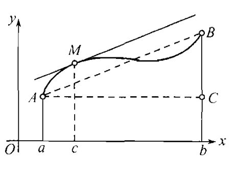

[toc]
# 微分学的基本定理
[**定义**]
设函数$f(x):(a,b) \to R$如果对点$x_0 \in (a,b)$存在一个$\delta >0$使得开区间$\Delta =(x_0,\delta,x_0+\delta) \subset (a,b)$并且$\forall x \in \Delta$都有$f(x_0) \ge f(x)$那么$f(x_0)$就是这个开区间$\Delta$上的最大值，那么称$f(x_0)$是函数$f$在$(a,b)$上的一个极大值，而称$x_0$称为f的一个极大值点。

很显然，我们同理给出极小值和极小值点的定义。

**而特别需要强调的，极值点只能在区间$[a,b]$的内点上才有定义，极值是一个局部的概念，它只在极值点的一个充分小的近旁才有最大值或者最小值的特征。所以，当我们讲极值点的时候，讨论的一定是定义域的内点，而不包括区间的边界点。**

> 当然我们知道连续函数$f(x)$在闭区间$[a,b]$是有最大值和最小值的，最大值和最小值是同极值不同的概念，当然如果函数$f(x)$在闭区间的内点$x_0$上取到了函数的最大值或者最小值，那么$x_0$自然是函数的一个极值点，而$f(x_0)$也相应的是函数的一个极值。

### 费马定理
[**引理1**]
如果函数$f(x)$在点$x_0$处有有限导数，若$f'(x_0) >0$则必然在$x_0$的右侧存在一个邻域$(x_0,x_0+\delta)$,函数在该邻域上满足$f(x) \gt f(x_0)$，在$x_0$的左侧，必然存在一个邻域$(x_0-\delta,x_0)$有$f(x) < f(x_0)$.

proof:
利用极限的保号性，这个引理是必然的。
$f'(x_0)=\lim\limits_{x \to x_0}\frac{f(x)-f(x_0)}{x-x_0} >0$
必然存在一个去心邻域$(x_0,\delta ,x_0+\delta) \setminus x_0$，在该去心邻域里有
$$\frac{f(x)-f(x_0)}{x-x_0} >0$$

分左右两侧分析，并可得到引理的结论。
$\blacksquare$

> 注:若命题的条件改为只存在单侧导数，或者$x_0$是一个闭区间的端点，那么就只有一边的结论成立。

[**定理**]
设函数$f(x)$在区间$I$上定义，并且在区间$I$的内部$I^{\circ}$的某点$x_0 \in I^{\circ}$取得极值，若函数$f(x)$在$x_0$处存在有限的导数，则必然有$f'(x_0)=0$.
proof:
设$x_0$为极大值点，那么存在一个邻域$(x_0-\delta,x_0 + \delta)$时有$f(x) \le f(x_0)$,那么当$x \in (x_0-\delta,x_0)$时有
$$\frac{f(x)-f(x_0)}{x-x_0} \ge 0$$
当$x \in (x_0,x_0+\delta)$时有
$$\frac{f(x)-f(x_0)}{x-x_0} \le 0$$
命题告诉我们函数$f(x)$在$x_0$处可导，那意味着$f_-'(x_0),f_+'(x_0)$都是存在的并且相等。
根据题设条件有$f_-'(x_0)=\lim\limits_{x \to x_0^-}\frac{f(x)-f(x_0)}{x-x_0} \ge 0$
$f_+'(x_0)=\lim\limits_{x \to x_0^+}\frac{f(x)-f(x_0)}{x-x_0} \le 0$

由于它们相等，那么必然有$f_-'(x_0)=f_+'(x_0)=f'(x_0)=0$

故命题的证。
$\blacksquare$

[**推论**]
设函数$f(x)$在区间$I$上定义，并且在区间$I$的内部$I^{\circ}$的某点$x_0 \in I^{\circ}$取得最大值（最小值),若函数$f(x)$在$x_0$处存在有限的导数，则必然有$f'(x_0)=0$.

很显然，处于区间$I$内部$I^{\circ}$的最值点也是极值点。利用费马定理，马上就有推论的结论。

> 这里特别需要注意的是$x_0$必须是区间的内点才能得出费马定理的结论，然后在$x_0$处函数必须是可导的。
> 在$x_0$点导数的存在，实际上也告诉了，函数必然在$x_0$的一个邻域内有定义，否则无法求导数。

总所周知的是，若函数$f(x)$是闭区间上定义的函数，并且在闭区间的某一段上取得最值，若此处还是可导的，那么$f'(x)$也可以不是0.所以内点的条件是不能去掉的。

[**定义**]满足$x_0 \in (a,b)$且有$f'(x_0)=0$的点，称为函数f的一个驻点或者静止点。

实际上费马定理告诉我们的是，函数在其上可导的极值点$x_0$必然是驻点，即$f'(x_0)=0$.
但是需要注意的是，该命题的逆命题并不成立，比如$f(x)=x^3,x=0$是它的驻点，但是它不是极值点。

当面费马定理的几何意义是:
如果$x_0$是函数$f(x)$的极值点且在$(x_0,f(x_0))$处曲线$y=f(x)$的切线存在，那么这条切线必然与横轴平行。

### 罗尔定理
[**定理**]
设函数$f(x)$在$[a,b]$上连续，并且在开区间$(a,b)$上可导且存在有限导数$f'(x)$,如果$f(a)=f(b)$,那么必然存在$\xi \in (a,b)$使得$f'(\xi)=0$.

proof:
因为闭区间$[a,b]$上的连续函数，一定存在最小值和最大值$m,M$.  
如果$M=m$那么意味$f$是$[a,b]$上的常数函数，当然$f'(x)=0,\forall x \in (a,b)$.

如果$M \gt m$,由于$f(a)=f(b)$,那说明最大值或者最小值不可能分别在$a,b$两点同时取到。也就是说最大值或者最小值中至少有一个在内点$\xi \in (a,b)$上取到。我们知道处于区间内点处的最值点也是极值点，并且命题还告诉我们在区间内部都是可导的，那么根据费马定理，我们知道必然有$f'(\xi)=0$.

$\blacksquare$

罗尔定理规定的条件都是十分必要的，他们一环套一环。

根据每个条件都可以举出相应的反例
$f(x)=x-E(x)$

$f(x)=\begin{cases}
x ,0  \le x \le \frac{1}{2}\\
1-x,\frac{1}{2} < x \le 1
\end{cases}$

$f(x)=x ,x\in [0,1]$

### 拉格朗日中值定理
设$f(x)$在闭区间$[a,b]$内有定义，并且是连续的，在开区间$(a,b)$是可导的，并且有有限导数$f'(x)$,那么必然存在$\xi \in (a,b)$使得
$$\frac{f(b)-f(a)}{b-a}=f'(\xi)$$
proof:
引入辅助函数,它在闭区间$[a,b]$上定义为
$F(x)=f(x)-[f(a)+\frac{f(b)-f(a)}{b-a}(x-a)]$
很显然$F(b)=F(a)=0$且函数$F(x)$在闭区间$[a,b]$上是连续的，在开区间$(a,b)$上也是可导的，根据罗尔定义有存在$\xi \in (a,b)$满足
$F'(\xi)=0$即
$$f'(\xi)=\frac{f(b)-f(a)}{b-a}$$
这个就得证。
$\blacksquare$

拉格朗日中值定理是罗尔定理的应用。

实际上$\frac{f(b)-f(a)}{b-a}$正是割线$AB$的斜率，而$f'(\xi)$是函数$y=f(x)$在点$\xi$处的切线斜率，拉格朗日中值定理，告诉我们在弧$AB$上一定能找到一个$M$，这点处切线是平行于$AB$的。

一般来说将拉格朗日中值定理改写为
$$f(b)-f(a)=f'(\xi)(b-a)$$
称之为**有限增量公式**,很显然不管$a>b,a< b,a=b$都是成立的，只要函数$f(x)$满足拉格朗日中值定理的有关条件。

取区间$[a,b]$上任意的数$x_0$,并且约定增量$\Delta x \ne 0$使得$x +\Delta x \in [a,b]$,为了明确起见$\Delta x >0$,那么在区间$[x_0,x_0 +\Delta x]$上利用拉格朗日中值定理，则必然存在$\xi \in (x_0,x_0 \Delta x)$使得
$$f(x_0+\Delta x)-f(x_0)=f'(\xi)\Delta x,\xi \in (x_0,x_0+\Delta x)$$

而介于$x_0$和$x_0 + \Delta x$之间的数$\xi$也可以表示为
$$\xi =x_0 + \theta \Delta x,\theta \in (0,1)$$

那么拉更朗日中值定理就可以表示为
$$\frac{f(x_0+\Delta x)-f(x_0)}{\Delta x}=f'(x_0+\theta \Delta x)$$
或者
$$f(x_0+\Delta x)-f(x_0)=f'(x_0+\theta \Delta x)\Delta x,\theta \in (0,1)$$

拉格朗日中值定理的缺点就是存在$\xi,\theta$是未知的。
### 达布定理
若函数$f(x)$在闭区间$[a,b]$上可导，并且有有限的导数，则导函数$f'(x)$可以取到$f'(a),f'(b)$之间的一切值，换句话说，如果$C \in (\min\{f'(a),f'(b)\},\max\{f'(a),f'(b)\})$,必然存在$\xi \in (a,b)$使得$f'(\xi)=C$.

proof:
首先证明$f'(a)f'(b) <0$那么必然存在$\xi \in (a,b)$使得$f'(\xi)=0$.
为了明确起见不妨设$f'(a)>0,f'(b) <0$
那么$f'(a)=\lim\limits_{x \to a^+}\frac{f(x)-f(a)}{x-a} >0$那意味着存在右邻域$(a,a+\delta)$，在这个邻域里$f(x) \gt f(a)$

$f'(b)=\lim\limits_{x \to b^-}\frac{f(x)-f(b)}{x-b} < 0$那意味着存在左邻域$(b-\delta_1,b)$，在这个邻域里$f(x) \gt f(b)$
这个就说明$x=a,x=b$点都不可能是函数在区间$[a,b]$上的最大值点，而连续函数$f(x)$在闭区间$[a,b]$上必然是可以取到最大值点的，那么这个分析意味着最大值点只能在内点处取到，不妨设这个点为$\xi$,根据费马定理，很显然有$f'(\xi)=0,\xi \in (a,b)$。
同理$f'(a)<0,f'(b) >0$也能得到类似的结论。

不妨设$f'(a) > f'(b)$考察位于$f'(a),f'(b)$之间的任意数C，为了确定起见，不妨设$f'(b) < C < f'(a)$.  
那么考察函数$F(x)=f(x)-Cx$很显然$F(x)$在闭区间$[a,b]$上可导，并且$F'(a)=f'(a)-C > 0 ,F'(b)=f'(b)-C < 0$,根据前面的证明我们知道存在$\xi \in (a,b)$满足$F'(\xi)=0$即
$$f'(\xi)=C$$

$\blacksquare$

> 这里需要注意的，必须要求函数在闭区间可导，并且这里处于闭区间端点处的$a,b$可导，指的就是单侧导出存在，即左导数或者右导数存在。

达布定理十分有意思，说明只要函数在闭区间可导，即使导函数不是连续函数，也满足介质性。能够取到两个端点导数之间的任何值。

### 导数的极限
[**定理**]假定函数$f(x)$在区间$[x_0,x_0+H](H >0)$内是连续的，并且$x>x_0$时有有限导数$f'(x)$，如果导函数$f'(x)$存在（有限或者无限)极限$\lim\limits_{x \to x_0^+}f'(x)=k$那么在点$x_0$处$f(x)$的右导数也为$k$,即
$$f_+'(x_0)=\lim\limits_{x \to x_0^+}f'(x)$$
proof:
取$x \in [x_0,x_0 + H],x > x_0$那么在区间$[x_0,x]$上利用拉格朗日中值定理有$\frac{f(x)-f(x_0)}{x-x_0}=f'(\xi ),\xi \in (x_0,x)$
$f_+'(x_0)=\lim\limits_{x \to x_0^+}\frac{f(x)-f(x_0)}{x-x_0}=\lim\limits_{x \to x_0^+}f'(\xi)=\lim\limits_{ x \to x_0^+}f'(x)=k$
这个就得证了。
$\blacksquare$

这个说明如果导函数$f'(x)$的$x \to x_0^+$右极限存在，那么$f(x)$在点$x_0$处的右导数$f_+'(x_0)$也存在,并且与之相等。

[**例子**]
1.给定闭区间$[-1,1]$的函数$f(x)=x \arcsin x+\sqrt{1-x^2}$
如果$-1<x<1$那么根据微分学的普通法则容易求出
$$f'(x)=arcsinx$$
很显然$\lim\limits_{x \to -1^+}f'(x)=-\frac{\pi}{2}$,$\lim\limits_{x \to 1^-}f'(x)=\frac{\pi}{2}$
根据前面的定理，我们立马知道
$f'_-(1)=\lim\limits_{x \to 1^-}f'(x)=\frac{\pi}{2},f'_+(-1)=\lim\limits_{x \to -1^+}f'(x)=-\frac{\pi}{2}$

2.如果$\lim\limits_{x \to x_0^+}f'(x)=\infty$或者$\lim\limits_{x \to x_0^-}f'(x)=\infty$此时则有函数$f(x)$在$x_0$对应侧的导数等于$\infty$.

3.$f_1(x)=x^{\frac{1}{3}},f_2(x)=x^{\frac{2}{3}}$与之相对应的导数为
$x \ne 0,f_1'(x)=\frac{1}{3x^{2/3}},f_2'(x)=\frac{2}{3x^{1/3}}$
因为第一式子在$x \to 0^+,x \to 0^-$时都有$\lim\limits_{x \to 0}f_1'(x)=+\infty$，这个说明$f_1(x)$在点$x=0$处有双侧的导数。

而第二个式子有
$\lim\limits_{x \to 0^-}f_2'(x)=-\infty$,$\lim\limits_{x \to 0^+}f_2'(x)=+\infty$
这个说明$f_2(x)$在此处只有单侧的导数。

[**推论**]
若函数$f(x)$在$[a,b]$上可导，则$f'(x)$在区间$[a,b]$无第一类间断点。
proof:
这里讨论的是有限导数$f'(x)$的问题，实际上如果$f'(x)$在某点取$\infty$那本身也就说明了$x_0$是第二类间断点，没有讨论的必要。
基于此，我们不妨假设$x_0 \in [a,b]$是到函数$f'(x)$的第一类间断点，那说明$\lim\limits_{x \to x_0^-}f'(x),\lim\limits_{x \to x_0^+}f'(x)$都是存在的，并且是有限数。

因为函数$f(x)$在$x_0$处可导，那意味着$f'(x_0)=f_-'(x_0)=f_+'(x_0)$
我们知道
$$f_+'(x_0)=\lim\limits_{x \to x_0^+}\frac{f(x)-f(x_0)}{x-x_0}=\lim\limits_{x \to x_0^+}f'(\xi)$$
这里$x_0 < \xi <x$那么$x \to x_0^+$时必然有$\xi \to x_0^+$，因为已知$\lim\limits_{x \to x_0^+}f'(x)$是存在的，那么必然有
$f_+'(x_0)=\lim\limits_{x \to x_0^+}f'(x)$
同理可以证得
$f_-'(x_0)=\lim\limits_{x \to x_0^-}f'(x)$
这个就会有$\lim\limits_{x \to x_0^-}f'(x)=\lim\limits_{x \to x_0^+}f'(x)=f'(x_0)$说明$f'(x)$在$x_0$处连续，与$x_0$是第一类间断点时矛盾的。
$\blacksquare$

如果$f'(x)$是$[a,b]$的连续函数，当然有介质性，可是达布定理告诉我们$f'(x)$在$[a,b]$上不连续，也有介质性，这个特点是导函数所特有的性质。从这个性质出发，我们立马知道，不可能存在可导函数$f(x)$使得$f'(x)=D(x)$或者$f'(x)=R(x)$.

不过一定要注意此定理的前提条件。
1.例如函数$f(x)=|x|,x \in [-1,1]$其导函数为$f'(x)=\begin{cases}
-1,x < 0\\
1,x>0  
\end{cases}$
在$x=0$处是第一类间断点，这个主要是因为$f(x)$在$x=0$处并不可导。
2.$f(x)=\begin{cases}
xsin\frac{1}{x},x \ne 0\\
0,x=0
\end{cases}$

这个函数在$x=0$处是连续的，但是它在$x=0$处是不导的，单侧导数都不存在。
$$f'(0)=\lim\limits_{x \to 0}\frac{\Delta x sin(1/\Delta x)-0}{\Delta x}=\lim\limits_{x \to 0}sin\frac{1}{\Delta x}$$
很显然极限都不存在。
3.对于函数$f(x)=\begin{cases}
x^2sin\frac{1}{x},x \ne 0\\
0,x=0    
\end{cases}$
如果$x \ne 0,f'(x)=2xsin\frac{1}{x}-cos\frac{1}{x}$
$x=0$处的导数，只能用定理来进行计算
那么$f'(0)=\lim\limits_{\Delta x \to 0}\frac{(\Delta x)^2sin\frac{1}{\Delta x}}{\Delta x}=\lim\limits_{\Delta x \to 0}(\Delta x)sin\frac{1}{\Delta x}=0$
但是$\lim\limits_{x \to 0}f'(x)$确实不存在的，因此$f'(x)$在$x=0$处是有间断的。

### 柯西公式中值定理
设函数$f(x),g(x)$在闭区间$[a,b]$上连续，并且在开区间$(a,b)$内可导且有有限导数$f'(x)$及$g'(x)$,且$\forall x \in (a,b),g'(x) \ne 0$那么在$a,b$之间必然存在$\xi$使得:
$$\frac{f(b)-f(a)}{g(b)-g(a)}=\frac{f'(\xi)}{g'(\xi)}$$
proof:
根据题设，我们知道$g(b) \ne g(a)$
构造辅助函数
$F(x)=f(x)-[f(a)+\frac{f(b)-f(a)}{g(b)-g(a)}(g(x)-g(a)]$
那么$F(x)$在$[a,b]$上是连续的，在开区间$(a,b)$上是可导的，并且$F(a)=F(b)=0$
$F'(x)=f'(x)-\frac{f(b)-f(a)}{g(b)-g(a)}g'(x)$
那么根据罗尔定理，我们知道存在$\xi \in (a,b)$使得$F'(\xi)=0$
那意味着
$$\frac{f(b)-f(a)}{g(b)-g(a)}=\frac{f'(\xi)}{g'(\xi)},\xi \in (a,b)$$
这里有用到$\forall x \in (a,b),g'(x) \ne 0$这个条件。

$\blacksquare$
取$g(x)=x$就可以用柯西中值定理导出拉格朗日中值定理。

如果把变量换成$t$,分别取函数$\varphi(t),\psi(t)$，若t在$[\alpha,\beta]$内变动,利用柯西公式就有
$$\frac{\psi(\alpha)-\psi(\beta)}{\varphi(\alpha)-\varphi(\beta)}=\frac{\psi'(\gamma)}{\varphi'(\gamma)},\gamma \in (\alpha,\beta)$$

如果用参变量方程来描述就有
$x=\varphi(t),y=\psi(t),t \in [\alpha,\beta]$
所给定的曲线，那么上面的公式表示，在弧上某个时刻$t=\gamma$处的切斜的斜率是等于连接曲线两端的弦的斜率的。

### 微分学基本定理的应用

# 有限差分

# 插值多项式

