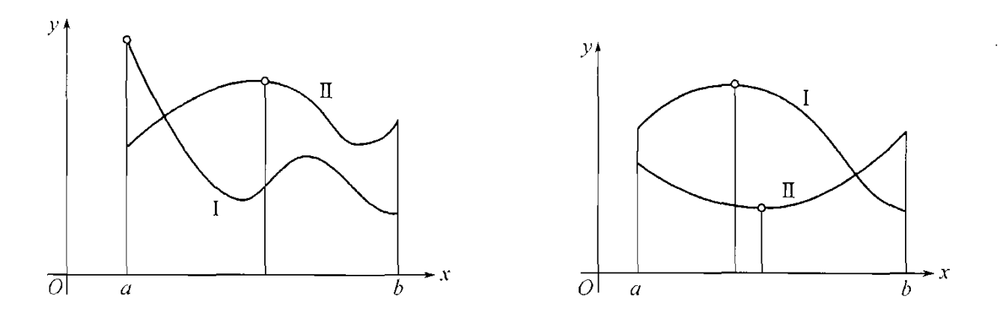

[toc]
所谓研究函数是指研究函数在指定区间上的单调性，凸性以及确定函数在这个区间上的最小值和最大值。

# 函数为常数的条件
在研究函数的动态的时候，首先出现的问题就是，在那些条件下函数在所给的区间内保持为常数。

[**定理**]
设函数$f(x)$在区间$I$内有定义而且连续，并且在区间$I$的内部$I^{\circ}$有有限导数$f'(x)$,要使得$f(x)$在$I$内是常数的，充分必要条件是$\forall x \in I^{\circ},f'(x) \equiv 0$.
proof:
必要性，十分明显，如果$f(x)=Const$,其导数当然为0.
充分性：
在区间上I上任意选定$x_1,x_2 \in I$为了明确起见不妨假设$x_1,x_2$那么很显然$f(x)$在闭区间$[x_1,x_2] \subset I$上是连续的，在开区间$(x_1,x_2) \subset I^{\circ}$是可导的，利用lagrange定理有
$$f(x_2)-f(x_1)=f'(\xi)(x_2-x_1),\xi \in (x_1,x_2) \subset I^{\circ}$$
从而有$f(x_2)=f(x_1)$由于$x_2,x_1$的选取的任意性，我们知道，必然有$\forall x \in I,f(x)=const$.
$\blacksquare$

[**推论**]
若两个函数$f(x),g(x)$在区间$I$上有定义，并且连续，对于区间I的内部$I^{\circ}$两个函数均有有限的导数$f'(x),g'(x)$，如果有$f'(x)=g'(x),\forall x \in I^{\circ}$那么在整个区间$I$上，这个两个函数相差一个常数C即
$$f(x)=g(x)+C$$
proof:
$F(x)=f(x)-g(x),\forall x \in I$
那么必然有$F'(x)=f'(x)-g'(x),\forall x \in I^{\circ}$
利用前面的定理，知道$F(x)=C$，故推论的证。
$\blacksquare$

这里需要注意的是，$I$可以是闭区间，开区间，有限的区间，或者无限的区间都是可以的。

# 函数单调性问题
[**定理1**]
设函数f在区间$[a,b]$上连续，在$(a,b)$上可导，那么f在$[a,b]$上递增的充分必要条件是$f'(x) \ge 0,\forall x \in (a,b)$,同时f在$[a,b]$上递减的充分必要条件是$f'(x) \le 0 ,\forall x \in (a,b)$.  
proof：
必要性，不妨设$f(x)$在$[a,b]$上递增，任取一点$x \in (a,b)$,对于一切能使得$x + h \in (a,b)$的h，h不能取正值或者取负值，总是有
$\frac{f(x+h)-f(x)}{h} \ge 0$
由于函数在$x$处可导，那么$h \to 0$利用极限的保号性，必然有$f'(x) \ge 0,\forall x \in (a,b)$  
充分性：
设在$(a,b)$上$f'(x) \ge 0$,那么对于任何$x_1,x_2 \in [a,b]$不妨$x_1 < x_2$，依据lagrange中值定理有
$$f(x_2)-f(x_1)=f'(\xi)(x_2-x_1), \xi \in (x_1,x_2) \subset (a,b)$$
根据命题有$f'(\xi) \ge 0$那么就有$f(x_2) \ge f(x_1)$.

这里注意使用lagrange中值定理的条件
$\blacksquare$

下面关于严格单调函数给出一个充分条件。

[**定理2**]
设函数$f(x)$在$[a,b]$上连续，在$(a,b)$上可导，如果$\forall x \in (a,b),f'(x) \gt 0$那么函数严格递增，如果$\forall x \in (a,b),f'(x) <0$,此时函数严格单调递减。

proof:
只证明$f'(x) \gt 0,\forall x \in (a,b)$函数严格递增的情况，严格递减的证明于此类似。
任意选定$x_1 ,x_2 \in [a,b],x_1 < x_2$，很显然函数$f(x)$在区间$[x_1,x_2]$上连续，在$(x_1,x_2)$上可导，那么利用lagrange中值定理就有
$$f(x_2)-f(x_1)=f'(\xi)(x_2-x_1) \gt 0$$
故有$f(x_2) \gt  f(x_1)$成立。得证。
$\blacksquare$

不过这里需要特别指出的是，定理2的逆定理并不成立，即严格递增（严格递减)函数并不必须有严格的正(严格负)导函数。

例如$f(x)=x^3$虽然在$(-\infty,+\infty)$上是严格递增的，但是$f'(0)=0$.
不过函数在$[a,b]$上严格单调的充分条件还可以减弱.

[**定理3**]
设函数$f(x)$在$[a,b]$上连续，
a.在开区间$(a,b)$上除了有限个点以外，都有正导数，那么函数$f(x)$在$[a,b]$上严格递增。
b.在开区间$(a,b)$上除了有限个点以外，都有负导数，那么函数$f(x)$在$[a,b]$上严格递减。

proof:
设函数$f(x)$在除了有限个点$x_1,....,x_n \in (a,b)$,都有$f'(x) \gt 0$,这里$a< x_1 <x_2<...<x_n < b$,那么在区间$[a,x_1],[x_1,x_2],...,[x_n,b]$上都是连续的，且在$(a,x_1),(x_1,x_2),...,(x_n,b)$都有$f'(x) \gt 0$,因此函数$f(x)$在$[a,x_1],[x_1,x_2],...,[x_n,b]$上都是严格递增的，那么在区间$[a,b]$上也是严格递增的。
$\blacksquare$

[**定理4**]
设函数$f(x)$在区间$[a,b]$上连续，在开区间$(a,b)$上可导，那么在$[a,b]$上严格递增（严格递减）的充分必要条件是:在$x \in (a,b)$时$f'(x) \ge 0(f'(x) \le 0)$且在$(a,b)$的任何开子区间上，$f'(x)$不恒等于0.  
proof:
只证明严格递增的情况。  
必要性:$\forall x \in (a,b),f'(x) \ge 0$这个已经证明过了。
假设存在一个一个开区间$(c,d) \subset (a,b),f'(x) \equiv 0$,那么在这个开区间上$f(x)$是一个常数，这个就违反了$f(x)$是严格单调函数的的题设，故矛盾，可见此时$(a,b)$的任何开子区间上，$f'(x)$不恒等于0.

充分性：
基于$\forall x \in (a,b),f'(x) \ge 0$我们可以得出函数$f(x)$在$[a,b]$是单调递增的。

假设存在$x_1< x_2 ,x_1,x_2 \in [a,b]$有$f(x_1) =f(x_2)$那么对于$x \in [x_1,x_2]$必然有$f(x_1)=f(x)=f(x_2)$,这个表明在$(x_1,x_2)$上函数$f(x)$为常数，从而在$(x_1,x_2)$上有$f'(x) \equiv 0$这个就违背了题设的条件，故矛盾。

可见$x_1,x_2 \in [a,b]$且满足$x_1 < x_2$时必然有$f(x_1) < f(x_2)$.

$\blacksquare$

# 函数极值问题

若函数$f(x)$在区间$[a,b]$是有定义，并且是连续的．

并且如果函数在这个区间只要不是单调函数，则必能在$[a,b]$内求出部分区间$[\alpha,\beta]$，在它的内点处，即在$\alpha,\beta$之间，函数达到最大值或者最小值．
### 极值点的定义
我们将函数$f(x)$在点$x_0$处极大值，指的是存在一个邻域$(x_0-\delta,x_0+\delta)$完全包含于函数$f(x)$的定义域之内，并且对这个邻域内的一切ｘ都满足$f(x) \le f(x_0)$

同理可以定义极小值和极小值点的定义．

不过特别需要注意的是$x_0$要求是内点．即在$x_0$的两侧函数都是有定义的，可见闭区间的端点并不在讨论的范围内．

若函数在点$x_0,x_1$处都是极大值，则把连续函数魏尔斯特拉斯定理于闭区间
$[x_0,x_1]$,就可以看出，函数$x_0,x_1$之间一定存在一点$x_2$达到在这个区间内的最小值，而在那一点出很显然也是有极小值的．类似地，在二极小值之间一定能求出极大值，这个发现意味着，在那种最简单的情形下，当函数总共只有有限个极大值及极小值时，他们总是交迭出现的．值得注意的是，这个结论是实际上是依靠函数的连续性的．

如果函数在区间$(a,b)$内有有限导数，若在点$x_0$处函数有极值，利用费马定理与区间$(x_0-\delta,x_0-\delta)$,自然就有$f'(x_0)=0$,这个是极值的必要条件，极值只能在使导数等于零的点中取找，一般称这样的点为静止点或者为驻点．

不过值得注意的是，这个只是一个必要条件，并不是充分条件，著名的例子就是
１．$f(x)=x^3,f'(x)=3x^2$很显然函数$f'(0)=0$,但是在这点处函数并无极值．
若扩大所考察的函数$f(x)$的范围，并假设在个别的点处导数可以等于无穷或者不存在，$f(x)$并非就不可能在这种点处取得极值，这个也是符合费马定理的前提，费马定理需满足有限导数存在的假定．

２．$f(x)=\sqrt[3]{x^2}$在$x=0$处显然有极小值，可是它在这个点的左导数为$-\infty$,右导数为$+\infty$.实际上函数在$x=0$处也是不可导的．

3. $f(x)=|x|$很显然在$x=0$函数有极小值，但是在$x=0$处函数不可导．

因此，即使在有限的双侧导数不存在点处函数亦同样能够获得极值．

但在这种情形下，自然亦同样不能保证在这种点处就有极值存在．$y=x^{1/3},y=\begin{cases}
xsin\frac{1}{x} ,x \ne 0 \\
0,x=0    
\end{cases}$
对于这两个函数而言，第一函数在点$x=0$处有无穷导数，第二个$x=0$处根本没有导数，但是在点$x=0$处两个函数并没有获得极值，因为在这点的任意邻域内，两个函数既有正值又有负值．

### 极值点判断的充分性定理
因此，若点$x_0$是函数$f(x)$是驻点或假如在这个点处$f(x)$没有有限导数，则点$x_0$仅是所谓的“有极值嫌疑的”点，那还应该对它再作进一步的考察。

[**第一充分性定理**]
假定在点$x_0$的某一个去心邻域$\hat{U}(x_0,\delta)$存在有限导数$f'(x)$,**而且它在点$x_0$的左边或者右边保持着确定的符号**，那么就有下面三种可能性：
a.在$x<x_0,f'(x) \gt 0$,而在$x \gt x_0$时，$f'(x) \lt 0$,即导数$f'(x)$在经过点$x_0$时由正变负的。在这种情形下，函数$f(x)$在区间$[x_0-\delta,x_0]$内递增，而在区间$[x_0,x_0 +\delta]$内递减，于是$f(x_0)$就是区间$[x_0-\delta,x_0+\delta]$内的极大值，$x_0$就是极大值点。

b.在$x < x_0,f'(x) \lt 0$,而在$x \gt x_0$时，$f'(x) \gt 0$,即导数$f'(x)$在经过点$x_0$时由负的变成正的，类似地可以证明，在点$x_0$处函数有极小值。

c.在$x < x_0,x \gt x_0$时都有$f'(x) \gt 0$或者$x <x_0,x \gt x_0$时都有$f'(x) \lt 0$,即$f'(x)$在经过$x_0$时并不变换符号。那时函数要么是递增，要么是递减，那么$x_0$不可能是极值点。

总的来说，考验“有嫌疑"的数值$x_0$的第一法则是：先用$x <x_0$后用$x \gt x_0$代入导数$f'(x)$，以确定导数在点$x_0$的左方及右方近处的符号；若这时导数$f'(x)$的符号由正变负，则有极大值，若由负变正，则有极小值；又若符号不变，则无极值。

当在区间$(a,b)$内像通常那样只有有限个驻点或有限个导数不存在的点列:
$$a<x_1 < x_2 <...<x_n < b$$
首先在任一区间
$$(a,x_1),(x_1,x_2),...,(x_n,b)$$
内存在有限导数$f'(x)$,此外，在每一个这种的区间内$f'(x)$都保持不变号。

事实如果$f'(x)$在区间$(x_k,x_{k+1})$内变号，则根据达布定理，它就要在$(x_k,x_{k+1})$之间某一点处等于零，但是这是不可能的，因为导数一切的零点都已经包括在我们列的点列内了。

> 第一充分性定理的条件一定要明确，它要求导函数$f'(x)$在$x_0$的左方邻域和右方邻域里保持着确定的符号，否则无法判断。
当被考查的点的任意近处包含着无穷个类似的点时，于是在这点的一方或者另外一方，导数就不能保持确定的符号了。

1.考查函数$f(x)=\begin{cases}
x^2sin\frac{1}{x},x \ne 0\\
0,x=0
\end{cases}$
这个函数在0处的导数为$0$,而$f'(x)=2xsin\frac{1}{x}-cos\frac{1}{x}$
在靠近驻点$x=0$的左方以及右方的任意近处，导数无穷多次的变号，这个函数在$x=0$处无极值。
2.$f(x)=\begin{cases}
x^2(1 +sin\frac{1}{x}),x \ne 0 \\
0,x=0
\end{cases}$
这个函数$x=0$处能够取到极值，但是它导函数在$x=0$的左右两侧也是任意次变动符号。

[**第二充分性定理**]
在探究函数的的极值时，研究驻点附近的的导数符号，可以换成研究在这点的二阶导数的符号。

设函数$f(x)$不仅在点$x_0$的邻域内有导数$f'(x)$,并且在点$x_0$处有二阶导数$f''(x_0)$
点$x_0$是驻点，那么$f'(x_0)=0$.
因为
$$f''(x_0)=\lim\limits_{x \to x_0}\frac{f'(x)-f'(x_0)}{x-x_0}$$
若$f''(x_0) >0$,利用极限的保号性，那意味着函数$f'(x)$在点$x_0$的左方近处有$f'(x) < f'(x_0)=0$,而在$x_0$的右方近处有$f'(x)> f'(x_0)=0$,这个就意味着，导数$f'(x)$在经过$x_0$时符号由负转正，因此$f(x)$在此点处有极小值.

若$f''(x_0) <0$，可以类似的证明，导数$f'(x)$的符号由正变负，函数$f(x)$在$x_0$点有极大值。

那么第二法则，实际上就是告诉我们:把$x_0$代入二阶导数$f''(x)$，若$f''(x_0) > 0$函数有极小值，若$f''(x_0) <0$，则函数有极大值。

一般来说，这个法则的应用范围应用范围较为狭窄；例如，它显然不能应用于不存在有限一阶导数的点，因为这样的点处不可能有二阶导数，当二阶导数等于零的那些情形，这个法则也无法给出结果，而此时需要依赖更加高阶的导数的性态。

[**第三充分性定理**]
根据极值判断的第二充分性定理，我们知道$f'(x_0)=0$且$f''(x_0) > 0$，则函数$f(x)$在点$x=0$处达到极小值，若$f(x_0)=0$,且$f''(x_0)<0$则函数在这个点处有极大值。

但是遇到类似$f'(x_0),f''(x_0)$的情形，如何研究呢?

今假定函数$f(x)$在点$x=x_0$处有顺次至n阶的导数，而且直至$n-1$阶导数为止全都在这点处等于零:
$$f'(x_0)=f''(x_0)=...=f^{(n-1)}(x_0)=0$$
但是却同时有$f^{(n)}(x_0) \ne 0$.把函数$f(x)$的增量$f(x)-f(x_0)$依$x-x_0$的幂用余项为佩亚诺余项的泰勒公式展开，因为所有低于n阶的一切导数在点$x_0$处都等于零，故
$$f(x)-f(x_0)=\frac{f^{(n)}(x_0)}{n!}(x-x_0)^n +o((x-x_0)^n)\\
=[\frac{f^{(n)}(x_0)}{n!} + \alpha(x)](x-x_0)^n$$
这里有$x \to x_0,\alpha(x) \to 0$
那也意味
$$\lim\limits_{x \to x_0}[\frac{f^{(n)}(x_0)}{n!} + \alpha(x)]=\frac{f^{(n)}(x_0)}{n!}$$
所以当$x$十分接近$x_0$时$[\frac{f^{(n)}(x_0)}{n!} + \alpha(x)]$的符号就与$\frac{f^{(n)}(x_0)}{n!}$的符号相同，当$x <x_0$的小邻域，和$x>x_0$的小邻域里亦是如此。

$1^{\circ}$
n是奇数，$n=2k+1$,当$x<x_0,(x-x_0)^n <0;x > x_0,(x-x_0)^n > 0$,但是因为$[\frac{f^{(n)}(x_0)}{n!} + \alpha(x)]$不变符号，那意味着$f(x)-f(x_0)$在左右两侧是变号的，这样，在$x=x_0$处，函数$f(x)$不可能极值，在含有点$x_0$的邻域，总是能找到大于$f(x_0)$和小于$f(x_0)$的函数值。

$2^{\circ}$
n是偶数是,$n=2k$在这种情形下，$x>x_0,x< x_0$都有$(x-x_0)^n >0$因为$[\frac{f^{(n)}(x_0)}{n!} + \alpha(x)]$在邻域里不变号，那也就意味着$f(x)-f(x_0)$在左右十分接近$x_0$的邻域里不变号。并且符号与$[\frac{f^{(n)}(x_0)}{n!} + \alpha(x)]$在邻域里的符号相同。

那意味着$f^{(n)}(x_0) >0$,在这个邻域里有$f(x)-f(x_0) >0$,此时$x_0$是极小值点。
$f^{(n)}(x_0) < 0$,在这个邻域里有$f(x)-f(x_0) <0$，此时$x=x_0$是极大值点。

总结来说，在各阶导数，第一个在点$x_0$处不等于零的导数是奇数阶，则函数在$x_0$处无极值，$x_0$不是极值点；若第一个在点$x_0$处不等于零的导数是偶数阶，则函数在点$x_0$处有极大值或者极小值，就看这导数是负或者是正的。

很显然第二充分定理，只是第三充分定理的特殊情况。

虽然这个检定方法，解决了许多情形下的极值问题，但在理论上来说，它总还不是万能，一个并不恒等于常数的函数，可以在所考查的邻域内具有一切阶导数，然而在这点处，各阶导数都等于零。

$f(x)=\begin{cases}
e^{-\frac{1}{x^2}},x \ne 0\\
0,x=0   
\end{cases}$

在$x=0$处，各阶导数都为0,但是$x=0$处却是一个极小值点。

### 闭区间最值
设函数$f(x)$在有限闭区间$[a,b]$内有定义，并且是连续的，我们前面主要是针对$(a,b)$内的极值点做了讨论。
现在再提出关于它在整个闭区间的一切数值中如何求最大值和最小的问题，根据魏尔斯特里斯定理，我们知道最大值和最小值一定是存在的。

为了明确起见，我们就讨论最大值的问题，最小值的问题是类似的。

若函数在a与b之间(开区间$(a,b)$里)的某一点处达到最大值，它同时将是极大值之一;但是最大值，亦可以在区间的端点$a$或者$b$处达到。这样就需要把函数的一切极大值互相比较，在于边界$f(a),f(b)$相比较；这些数中的最大值就是$f(x)$在$[a,b]$内的一切函数值中的最大值。类似可以求出函数的最小值。

若在$[a,b]$区间内只有一个"有嫌疑的"的点，那么若在这个点处函数有极大值，则不用与边界值相比较，就能明白这就是函数在所给区间的最大值；若在这个点处是极小值点，则不用与边界值相比较，就能明白这个就是函数在所给区间的最小值，一定要注意，在区间内只能有一个”有嫌疑的"点，并不是说分别有一个极小值点和极大值点也能满足上面的推论，这种情况是不满足的，是总共只能有一个嫌疑点才能符合。

