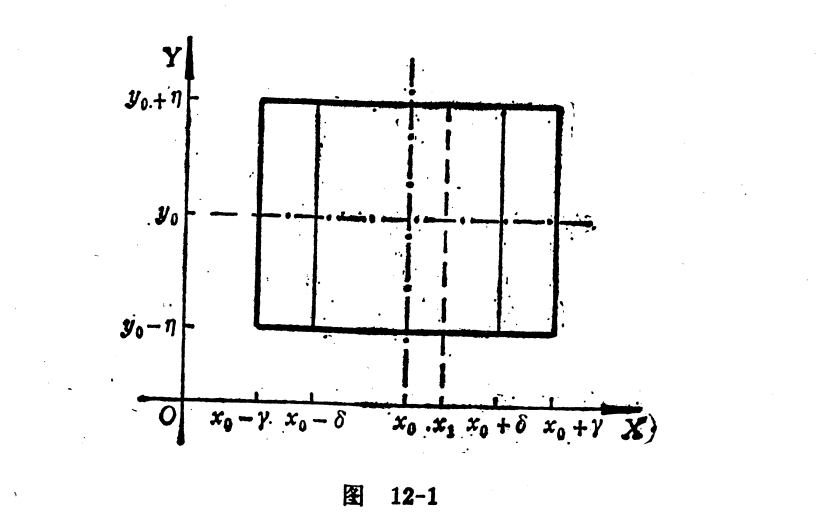
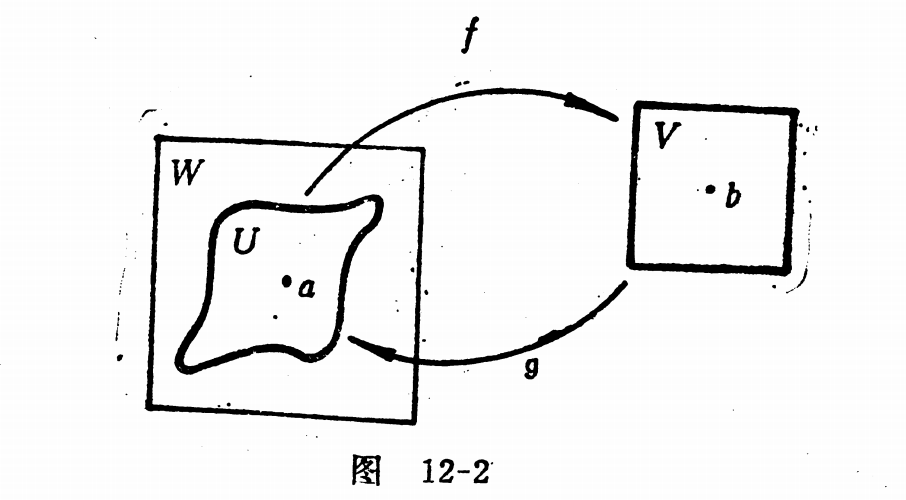

[toc]

### 隐函数存在定理
所谓$f:D \to E$是一个函数,就是说$f$是这样一种法则:按照这种法则,对$D$中的每一个x,有E中唯一的y与之相对应.

我们约定:把与$x \in D$对应的唯一的$y \in E$记为$f(x)$.

但是要强调的是,函数关系式并不一定用明显(代数或分析)算式来表示.

在某些实际问题中,两个量之间的关系是通过一定的方程来表示.

[**定义**]
设$D \subset R,E \subset R$,并设二元函数$F(x,y)$定义域包含了$D \times E$.如果对每一个$x \in D$,恰好存在唯一的$y \in E$,使得$F(x,y)=0$.

由方程$F(x,y)=0$确定了一个D到E的隐函数.

或者说由条件$F(x,y)=0,x \in E,y \in E$确定了一个从D到E的的隐函数.

由条件$x \in D,y \in E,F(x,y)=0$所确定的从D到E的函数记为$f$,那么对任意的$x \in D$,我们有$f(x) \in E$且有$F(x,f(x)) \equiv 0$

函数f的对应法则就是:把每一个$ x \in D$对应于满足方程$F(x,y)=0$的唯一的$y \in E$.

实际上$F(x,y)=0$是一个方程,如果这个方程恒不成立,没有讨论的必要.

假设$F(x,y)=0$有解$(x_0,y_0)$,函数$F$在点$(x_0,y_0)$邻近是连续可微的.我们在点$(x_0,y_0)$邻近展开函数可以得到
$$F(x,y)=F(x_0,y_0)+\frac{\partial F}{\partial x}(x_0,y_0)(x-x_0) + \frac{\partial F}{\partial y}(x_0,y_0)(y-y_0) + o(\sqrt{(x-x_0)^2 + (y-y_0)^2})=\\
\frac{\partial F}{\partial x}(x_0,y_0)(x-x_0) + \frac{\partial F}{\partial y}(x_0,y_0)(y-y_0) + o(\sqrt{(x-x_0)^2 + (y-y_0)^2})$$
如果用线性主部代替原来的方程$F(x,y)=0$.
来考察近似方程
$\frac{\partial F}{\partial x}(x_0,y_0)(x-x_0) + \frac{\partial F}{\partial y}(x_0,y_0)(y-y_0)=0$
要使这个近似方程对每一个给定的$x$都能唯一确定$y$,必须而且只需要$\frac{\partial F}{\partial y}(x_0,y_0) \ne 0$
从观察近似方程得到了启发,探索能保证原来的方程$F(x,y)=0$在$(x_0,y_0)$邻近确定隐函数的条件.

[**定理1**]
设函数$F(x,y)$在包含$(x_0,y_0)$的一个开集$\Omega$上连续可微,$F \in C^1(\Omega)$,并且满足$F(x_0,y_0)=0,\frac{\partial F}{\partial y}(x_0,y_0) \ne 0$,
则存在以$(x_0,y_0)$为中心的的开方块$D \times E \subset \Omega$
$(D=(x_0-\delta,x_0 + \delta),E=(y_0-\eta,y_0+\eta))$
使得:
(1)对任何一个$x \in D$,恰好存在唯一的$y \in E$,满足方程$F(x,y)=0$这就是说,方程确定了一个从D到E的函数$y=f(x)$, 且有$y_0=f(x_0)$,当然也就确定了一个映射$f:D \to E$.(这里一定要注意的是证明无法给出$f$是满射的结论,也就是不确定是否有$f(D)=E$,实际上一般情况都是没有的,一般都是$f(D) \subset E$)

(2)这个函数$y=f(x)$在D上连续可微,$\forall x \in D$它的导数如下面进行计算:
$f'(x)=\frac{dy}{dx}=-\frac{\frac{\partial F}{\partial x}(x,y)}{\frac{\partial F}{\partial y}(x,y)}$

proof:

不妨设$\frac{\partial F}{\partial y}(x_0,y_0) >0$,$F \in C^1(\Omega)$根据其连续性,必然会存在一个开区域$\Omega_1 :(x_0-\gamma',x_0 +\gamma') \times (y_0-\eta',y_0 + \eta') \in \Omega$
在这个开区域里$\frac{\partial F}{\partial y}(x_0,y_0) >0$.

取充分小的$0<\gamma<\gamma',0<\eta <\eta'$使得包含$(x_0,y_0)$的小矩形$\Omega':[x_0-\gamma,x_0 +\gamma] \times [y_0-\eta,y_0 + \eta] \subset \Omega_1$这个是完全做得到的.
并且$\frac{\partial F}{\partial y}(x,y) >0,\forall (x,y) \in \Omega'$

对于$\forall (x,y)\in \Omega'$,考察$y$的函数$\psi(y)=F(x_0,y)$因为$\psi'(y)=\frac{\partial F}{\partial y}(x_0,y) >0,\forall y \in [y_0-\eta,y_0 +\eta]$

所以在闭区间$[y_0-\eta,y_0 + \eta]$上面有$\forall x' \in (x_0-\gamma,x_0 + \gamma)$,$F(x',y)$关于y严格单调递增.

所以有$\psi(y_0-\eta) < \psi(y_0) < \psi(y_0 + \eta)$即
$F(x_0,y_0-\eta) < F(x_0,y_0) < F(x_0,y_0+\eta) \Rightarrow \\
F(x_0,y_0-\eta) < 0 < F(x_0,y_0+\eta) $

因为$F(x,y)$的连续性,我们知道$F(x,y_0-\eta),F(x,y_0+\eta)$也是关于$x$的连续函数.

$F(x_0,y_0-\eta) <0$根据连续性,知道必然存在$\delta_1$,当$|x-x_0|< \delta_1$时,$F(x,y_0-\eta) <0$

$F(x_0,y_0+\eta) >0$根据连续性,知道必然存在$\delta_2$,当$|x-x_0|< \delta_2$时,$F(x,y_0+\eta) <0$
那么只要取$\delta =\min\{\delta_1,\delta_2,\gamma\}$必然有.

根据连续性,我们知道必然会存在$0<\delta < \gamma$使得$$F(x,y_0-\eta) <0,\forall x \in (x_0 -\delta,x_0+\delta) \\
F(x,y_0 + \eta) > 0,\forall x \in (x_0 -\delta,x_0+\delta)
$$

取定$D=(x_0-\delta,x_0 + \delta),E=(y_0-\eta,y_0 + \eta)$

(1)对任意一个$x_1 \in D$,考察$y$ 的函数$F(x_1,y)$,因为这个函数是连续的,并且$F(x_1,y_0-\eta) < 0< F(x_1,y_0 + \eta)$根据连续函数的介质定理,我们知道必然存在$y_1 \in (y_0-\eta,y_0 + \eta) =E$使得$F(x_1,y_1)=0$.
又是因为$\frac{\partial F}{\partial y}(x_1,y) >0,\forall y \in (y_0-\eta,y_0 + \eta)$
因为函数$F(x_1,y)$是严格单调上升的,所以仅有唯一的$y_1 \in E$能使$F(x_1,y_1)=0$成立的.

根据前面的分析,方程$F(x,y)=0$确定了一个从D到E的函数$y=f(x)$.
a.考察函数$y=f(x)$在任意一点$x_1 \in D$的连续性.
记$y_1=f(x_1)$,因为$y_1 \in (y_0-\eta,y_0 + \eta) =E$并且有$F(x_1,y_1)=0$.
只要$\varepsilon >0$够小,必然就有$(y_1-\varepsilon,y_1+\varepsilon) \subset (y_0 -\eta,y_0 +\eta)$
实际上只要$\varepsilon < \min\{y_1-y_0+\eta,y_1+\eta-y_0\}$就
就必然有$(y_1-\varepsilon,y_1+\varepsilon) \subset (y_0 -\eta,y_0 +\eta)$.
根据$\frac{\partial F}{\partial y}(x_1,y_1) >0$,那必然有
$F(x_1,y_1-\varepsilon) <0 <F(x_1,y_1+\varepsilon)$
当然必然存在$\sigma > 0$使得$\forall x \in (x_1-\sigma,x_1 + \sigma)$有
$$F(x,y_1-\varepsilon) < 0 <F(x,y_1 + \varepsilon)$$
很显然$\forall x \in (x_1-\sigma,x_1 + \sigma)$,根据连续函数的介质性,必然存在$y \in (y_1-\varepsilon,y_1 + \varepsilon)$使得$F(x,y)=0$.这个意味着
$\forall x \in (x_1-\sigma,x_1+\sigma),f(x) \in (y_1-\varepsilon,y_1 +\varepsilon)$.

我们就证明了函数f的任意点$x_1 \in D$的连续性.
(2)我们求函数$f(x)$的导数.本质上是求$\frac{f(x+h)-f(x)}{h}$
记$\forall x \in D,y=f(x)$如果$x+h \in D,y_1=f(x+h)$
不妨记$k=f(x+h)-f(x)$
因为$F(x+h,f(x+h))=0,F(x,f(x))=0$
那么利用二元函数的有限增量公式可得.
$$0=F(x+h,y+k)-F(x,y)\\
=F(x+h,y+k)-F(x,y)\\
=F_x'(x+\theta h,y+\theta k)h + F_y'(x+\theta h,y+\theta k)k$$
那么$\lim\limits_{h \to 0}\frac{f(x+h)-f(x)}{h}=\lim\limits_{h \to 0}\frac{h}{k}=\lim\limits_{h \to 0}-\frac{F_x'(x+\theta h,y+\theta k)}{F_y'(x+\theta h,y+\theta k)}$
因为$f(x)$的连续性知道$\lim\limits_{h \to 0}(f(x+h)-f(x))=\lim\limits_{h \to 0}k=0$.

根据偏导数的连续性,我们知道
$\lim\limits_{h \to 0}-\frac{F_x'(x+\theta h,y+\theta k)}{F_y'(x+\theta h,y+\theta k)}=-\frac{F_x'(x,y)}{F_y'(x,y)}$

这个就整理额隐函数$y=f(x)$的可微性.

因为$\frac{\partial F}{\partial x}(x,y),\frac{\partial F}{\partial y}(x,y)$的连续性,并且有$f'(x)=-\frac{F_x'(x,y)}{F_y'(x,y)}$就可以看出$f'(x)$的连续性.

$\blacksquare$

另:利用可微性,我们知道
$$0=F(x+h,y+k)-F(x,y)=\\
\frac{\partial F}{\partial x}(x,y)h+\frac{\partial F}{\partial y}(x,y)k + \alpha(h,k)h + \beta(h,k)k$$
那么可以得到$\lim\limits_{h \to 0}\frac{k}{h}=\lim\limits_{h \to 0}\frac{-\frac{\partial F}{\partial x} - \alpha}{\frac{\partial F}{\partial y} + \beta}=\frac{-\frac{\partial F}{\partial x}}{\frac{\partial F}{\partial y}}$

$\blacksquare$

[**推论**]在定理1中,如果函数$F(x,y)$在开集$\Omega$上是r阶连续可微的,那么有$F(x,y)=0,x \in D,y \in E$所确定的函数$y=f(x)$在开区间D上也是r阶连续可微的.
proof:
r=1的情况,定理1已经进行了证明,不妨假设$r=s$的情形推论是成立的,那么$r=s+1$时,复合函数$\frac{\partial F}{\partial x}(x,f(x)),\frac{\partial F}{\partial y}(x,f(x))$显然他们都是$s$阶连续可微的,所以
$$
f'(x)=-\frac{\frac{\partial F}{\partial x}(x,f(x))}{\frac{\partial F}{\partial y}(x,f(x))}
$$
也是s阶连续可微的,这个就证明了函数$f(x)$在开区间D上是$s+1$阶连续可微的.

[**定理2**]
设$m+1$元函数$F(x_1,x_2,...,x_m,y)$在包含$(x_1^{0},x_2^{0},...,x_m^{0},y_0)$的一个开集$\Omega$上连续可微,并且满足$F(x_1^{0},x_2^{0},...,x_m^{0},y_0)=0,\frac{\partial F(x_1^{0},x_2^{0},...,x_m^{0},y_0)}{\partial y} \ne 0$则存在以$(x_1^{0},x_2^{0},...,x_m^{0},y_0)$为中心的一个开方块$D \times E \subset \Omega$其中$D=(x_1^{0}-\delta,x_1^{0}+\delta) \times ... \times (x_m^{0}-\delta,x_m^{0}+\delta),E=(y_0-\eta,y_0 +\eta)$
使得(1)对任何一点$(x_1,x_2,...,x_m) \in D$恰好存在唯一的一个$y \in $满足方程$F(x_1,...,x_m,y)=0$,也就是说,方程$F(x_1,x_2,..,x_m,y)=0$确定了一个从D到E的函数$y=f(x_1,x_2,...,x_m)$.
(2)这个函数$y=f(x_1,...,x_m)$在D上连续可微,它的各偏导数计算公式如下.$\frac{\partial y}{\partial x_i}=-\frac{\frac{\partial F}{x_i}(x_1,...,x_m,y)}{\frac{\partial F}{\partial y}(x_1,...,x_m,y)}$

[**推论**]
在定理2中,如果函数F在开集$\Omega$上r阶连续可微,那么由$F(x_1,...,x_m,y)=0,(x_1,...,x_m) \in D,y \in E$所确定的函数$y=f(x_1,..,x_m)$在开方块D上也是r阶连续可微的.

> 注记
1.
所以在定理1的条件下,为了求隐函数$y=f(x)$的导数,我们可以记为恒等式$F(x,f(x)) \equiv 0,x \in D,f(x) \in E$.

将这个式子两边同时对x求导,就可以得到
$$F_x'(x,f(x)) + F_y'(x,f(x))f'(x) \equiv 0$$
因为定理1的条件保证了$(x_0,y_0)$附近有$F_y'(x,y) \ne 0$.
因而可以唯一地解出
$f'(x)=-\frac{F_x'(x,f(x))}{F_y'(x,f(x))}$

这个就得出了隐函数求导数的实际做法.

所以定理1为隐函数的微分法提供了理论依据,如果F在$\Omega$上是r阶可微,我们f也是r阶连续可微的,为了求的f的k阶导数$1 \le k \le r$,对两边对x求导1,2,...,r次,从所得的各式子中就可以以此解出$f'(x),f''(x),...,f^{(r)}(x)$.

实际上对偏导也有类似的性质.

1. 在求$y=f(x)$的过程中,实际是可以通过分区间套的方法,把$f(x)$计算到任意精度.

[1]
$(p+\frac{a}{V^2})(V-b)=RT$这里$a,b,R$都是常数.
解:不妨认为上面的方程确定了隐函数$V=f(p,T)$那么可以得到恒等式
$$(p+\frac{a}{f(p,T)^2})(f(p,T)-b) \equiv RT$$

从而有$\frac{\partial V}{\partial p}=\frac{V-b}{\frac{2a}{V^2}(V-b)-(p+\frac{a}{V^2})}$

## 隐映射存在定理

### 两个方程的形式
不妨记函数$F(x_1,x_2,y_1,y_2),G(x_1,x_2,y_1,y_2)$在包含$x_0=(x_1^{0},x_2^{0},y_1^{0},y_2^{0})$开集$\Omega \subset R^4$内连续可微,即$F ,G\in C^1(\Omega)$,并且满足
(1)$F(x_1^{0},x_2^{0},y_1^{0},y_2^{0})=0,G(x_1^{0},x_2^{0},y_1^{0},y_2^{0})=0 $

(2)$\frac{\partial(F,G)}{\partial(y_1,y_2)}(x_1^{0},x_2^{0},y_1^{0},y_2^{0}) =\det \left[\begin{matrix}
\frac{\partial F}{\partial y_1},\frac{\partial F}{\partial y_2} \\
\frac{\partial G}{\partial y_1},\frac{\partial G}{\partial y_2}
\end{matrix}\right]_{(x_1^{0},x_2^{0},y_1^{0},y_2^{0})} \ne 0$
那么在包含$(x_1^{0},x_2^{0},y_1^{0},y_2^{0})$的开邻域内$D \times E$有$y_1=\phi(x_1,x_2),y_2=\psi(x_1,x_2)$,并且$\phi \in C^{1}(D),\psi \in C^{1}(D)$,并且$\forall (x_1,x_2,y_1,y_2) \in D \times E$有
$\left[\begin{matrix}
\frac{\partial y_1}{\partial x_1},\frac{\partial y_1}{\partial x_2}  \\
\frac{\partial y_2}{\partial x_1},\frac{\partial y_2}{\partial x_2}      
\end{matrix}\right]=\left[\begin{matrix}
\frac{\partial F}{\partial y_1},\frac{\partial F}{\partial y_2}  \\
\frac{\partial G}{\partial y_1},\frac{\partial G}{\partial y_2}      
\end{matrix}\right]^{-1} *\left[\begin{matrix}
\frac{\partial F}{\partial x_1},\frac{\partial F}{\partial x_2}  \\
\frac{\partial G}{\partial x_1},\frac{\partial G}{\partial x_2}      
\end{matrix}\right]$

proof:

$\blacksquare$

将$f=(F,G)^T,x=(x_1,x_2)^T,y=(y_1,y_2)^T$

## 逆映射定理
[**引理**]
设$D \subset R^n$的一个开集，$f:D \to R^m$,$f$是一个连续映射，那么对于$R^m$的任意开集$G$，$f^{-1}(G)=\{x \in D:f(x) \in G\}$，则$f^{-1}(G)$是$R^n$中的开集。

proof:
设$f$在D上连续，G是$R^m$中的任意开集，要证$f^{-1}(G)$是$R^n$中的开集。
如果$f^{-1}(G)$是空集，那么它当然是开集。

取$x_0 \in f^{-1}(G)$,那么$f(x_0) \in G$,因为$G$是$R^m$中的开集，故存在$\varepsilon >0$,使得$B(f(x_0),\varepsilon) \subset G$,又因为函数在$x_0$处连续，故对于刚才的$\varepsilon >0$,存在$\delta$,只要$B(x_0,\delta) \cap D$便有$f(x) \in B(f(x_0),\varepsilon)$,那么既有$f(B(x_0,\delta)) \subset G$,因而

$B(x_0,\delta) \subset f^{-1}(G)$
这个说明$f^{-1}(G)$是一个开集.

$\blacksquare$

### 单变量的反函数存在问题
[1]设(a,b)是一个开区间,一元函数$f:(a,b) \to R$,并且$f \in C^1(a,b)$,又设$x_0 \in (a,b),f'(x_0) \ne 0$,那么存在包含$f(x_0)$的邻域$V$和包含$x_0$的邻域$U$使得(1)$f:U \to V$是一个一一对应.(2)在$U$上$f$存在逆映射$g.$(3)当$y \in V$那么$g'(y)=\frac{1}{f'(x)}$.

proof:
不妨设$f'(x_0) >0$根据 $f'$的连续性,可知必然存在包含$x_0$的邻域$(\alpha,\beta) \subset (a,b)$上有$f'(x) > 0 ,\forall x\in (\alpha,\beta)$.
这说明函数$f(x)$在$(\alpha,\beta)$是严格单调递增函数.
记$y_0=f(x_0),A=f(\alpha),B=f(\beta)$,那么$\forall y_1 \in (A,B)$根据$f(x)$的连续性,知道必然存在$x_1 \in (\alpha,\beta)$使得$f(x_1)=y_1$;
因为$f(x)$在$(\alpha,\beta)$的严格单调递增性质,知道$x_1$是唯一存在的.不妨记$x_1=g(y_1)$.通过分析可以知道,函数$f(x)$在$(A,B)$上是存在反函数$g$的.

记$V=(A,B)$,记$U=g(V)$

$\blacksquare$

### 隐函数处理反函数存在问题
给定$x \in (a,b)$,假设有$y=f(x)$,如果存在$x_0 \in (a,b),f'(x_0) \ne 0$那么在局部是不是存在反函数？

考察二元函数$F(x,y)=f(x)-y$它的定义域是$R^2$中的开集$D=(a,b) \times R$.
这里需要注意是，如果$E=(a,b)$为什么不把$F(x,y)$定义在$D=E \times f(E)$上，实际无法确定$f(E)$的拓扑性质，无法知道其开闭，这样也无法确定D的开闭。

点$(x_0,y_0) \in D,y_0=f(x_0)$很显然也满足$F(x_0,y_0)=f(x_0)-y_0=0$

并且$\frac{\partial F}{\partial x}(x_0,y_0)=f'(x_0) \ne 0$,并且有$F \in C^1(D)$,根据隐函数存在定理知道，存在开区间$(\alpha,\beta) \subset (a,b)$和$(A,B)$，使得对于每一个$y \in (A,B)$，方程$F(x,y)=0$,即方程$f(x)=y$在$(\alpha,\beta)$内有唯一的解$f^{-1}(y)$,并且函数$f^{-1}(y)$在$(A,B)$内是连续可微的。
$$
(f^{-1})'(y)=-\frac{\frac{\partial F(x,y)}{\partial y}}{\frac{\partial F(x,y)}{\partial x}}=\frac{1}{f'(x)}
$$

记$F(x,y)=f(x)-y$,$F(x_0,y_0)=0,\Omega=(a,b) \times R$
$x_0$是开集$(a,b)$的内点,意味着存在$\delta_1$使得$(x_0-\delta_1,x_0 + \delta_1) \subset (a,b)$
因为$\frac{\partial F(x_0,y_0)}{\partial x} >0$,根据偏导数的连续性,知道存在一个开区域$\Omega_1:(x_0-\delta_2,x_0+\delta_2) \times (y_0 -\eta,y_0 + \eta)$使得在区域内$\frac{\partial F(x,y)}{\partial x} >0$

取$\delta'=\min\{\delta_1,\delta_2\}$得到
开区域$\Omega_2:(x_0-\delta',x_0+\delta') \times (y_0 -\eta,y_0 + \eta)$
在这个开区域$\Omega_2$里,既能保证$x$是在考察的定义域$(a,b)$范围的,又能保证偏导数大于0.

因为$\forall (x,y) \in \Omega_2,\frac{\partial F(x,y)}{\partial x} >0$那么必然有$F(x_0-\delta',y_0)<F(x_0,y_0) < F(x_0+\delta',y_0)$
即
$F(x_0-\delta',y_0)<0 < F(x_0+\delta',y_0)$
根据保号性,我们知道,必定存在$0<\eta_1<\eta$
使得$\forall y \in (y_0-\eta_1,y_0 + \eta_1),F(x_0-\delta',y_0) <0$

$\forall y \in (y_0-\eta_1,y_0 + \eta_1),F(x_0+\delta',y_0) > 0$

那么此时$(x_0-\delta',x_0 + \delta') \times (y_0-\eta_1,y_0+ \eta_1) \subset \Omega_2$.

那么对任意给定的$y' \in (y_0-\eta_1,y_0 + \eta_1)$,因为$F(x_0+\delta',y') >0,F(x_0-\delta',y') <0$
那么必然存在$x' \in (x_0 -\delta',x_0 + \delta')$使得$F(x',y')=0$,不妨记$x'=g(y')$
因为$\forall (x,y) \in \Omega_2,\frac{\partial F(x,y)}{\partial x} >0$必然有这样的$x'$是唯一的.

实际上$V=(y_0-\eta_1,y_0 + \eta_1),W=(x_0 -\delta',x_0 + \delta'),g;V \to W$.

此时当然有$W \subset (a,b)$.

[**微分同胚**]
设U和V是$R^m$中开集,如果满足
(1)$f \in C^{p}(U;V)$
(2)$f$是双射
(3)$f^{-1} \in C^{p}(V;U)$
则称映射$f:U \to V$称为$C^{p}$类微分同胚,$p=0$就称为同胚.

[**定理**]
设$\Omega$是$R^m$中的一个开集，$f: \Omega \to R^m$是一个连续可微映射，$a \in \Omega$,如果$\det Df(a) \ne 0$
那么f在d点时局部微分同胚。
换句话说，在所给的条件下，存在包含$a$的开集$U$和包含$b=f(a)$的开集$V$,使得$f(U) = V,f:U \to V$是一一对应，并在$f$在$U$上存在逆映射$$g:V \to U \subset R^m$$也是连续可微映射。
proof:
考察这样一个向量值函数$F:\Omega \times R^m \to R^m$
$F(x,y)=f(x) - y,\forall (x,y) \in \Omega \times R^m$

注意并不是定义在$\Omega \times f(\Omega)$
映射显然是连续可微的，并且还满足$F(a,b)=f(a)-b=0$
$$\det D_xF(a,b)=\det Df(a) \ne 0$$
对于对$F(x,y)$应用一般映函数存在定理（x和y的角色互换),我们可以断定:存在已$a$为中心的开方块$W \subset \Omega$和以点$b=f(a)$为中心的开方块$V \subset R^m$使得

> 疑惑点
0.为什么这样的V一定是存在的?隐函数存在定理给出的结论,通过2元函数的分析会发现这个是做得到的.
1.$V \subset f(W)?$
2.如果$\Omega$是开集，作为$\Omega$的内点，意味着存在一个开区域$B(a,\delta) \subset \Omega$,那么毫无疑问的是，$f(B(a,\delta)) \subset f(\Omega)$.
举例来说明一下，1应该来说是不一定成立的。
3.$f:g(V) \to V$是满射吗？存在映射$g:V \to W$，所有满足$g(y)=x$点$(x,y)$都是从$f(x)=y$里面解出来的，那意味着$\forall y \in V$,必然存在$x \in g(V)$使得$f(x)=y$所以$f$肯定是满射。但是$g:V \to W$不一定是满射。而$f:W \to V$都有可能不是映射，可能存在$x' \in W$但是$f(x') \notin V$
4.$g:V \to W$是满射吗?

(1)对于任何$y \in V$恰好唯一存在一个$x \in W$使得$F(x,y)=f(x)-y=0$因为方程$f(x)-y=0$定义了一个从$V$到$W$的映射$x=g(y)$（这里只是说可以确定一个映射g，实际上此时还不能断言$f，g$是互逆映射，要确定映射互逆还需要确定取值集合。）

(2)映射$g:V \to W \subset R^m$是连续可微的映射，并且对于$y \in V$，$x=g(y)$,应该有
$Dg(y)=-(D_xF(x,y))^{-1}D_yF(x,y)=(Df(x))^{-1}$

因为$g:V \to W$,毫无疑问的是$g(V) \subset W$.这个是映射的基本性质,这个要把握好.

我们考察集合$U=\{x \in W |f(x) \in V\}$(即$U=\{x|x=g(y)且x \in W ,\forall y \in V\}$) 因为$W,V$都是开集，$f$是连续映射，所以$f^{-1}(V)$也是开集。实际上$U=f^{-1}(V) \cap W$当然是开集。

映射$g:V \to W$并不一定是满射,去掉$W$中不是映射$g:V \to W$的像的元素作为新的集合$U$,这样就能确保$f$在U上的单射.

另证:
$W,V$都是开集.

任意给定$x_0 \in U \subset W$必然存在$\delta >0$使得$U(x_0,\delta) \subset W$

存在充分小的$\varepsilon >0$,使得$U(f(x_0),\varepsilon) \subset V$,因为是连续函数，意味着对于$\varepsilon >0$,存在$\delta_1 >0$,使得$f(U(x_0,\delta_1)) \subset U(f(x_0),\varepsilon) \subset V$.

所以只需要取$\delta'=\min\{\delta,\delta_1\}$,就有$U(x_,\delta') \subset U$.因为$f(U(x_0,\delta')) \subset U(f(x_0),\varepsilon) \subset V$.

说明$x_0$是U的一个内点，根据$x_0$的随意性，知道$U$是$R^m$的一个开集。

显然$f$限制在$U$上是$U$到$V$的一一对应，而逆映射$g:V \to U$就是连续可微映射。

$\blacksquare$

[**推论**]
如果$f$是$r$阶连续可微的$r \ge 1$,那么局部逆映射$g$也是$r$阶连续可微的,换句话说,在这个条件下$f$在$a$点是一个局部$C^{r}$同胚.

[**定理2**]
设$\Omega$是$R^m$中的开集,$f:\Omega \to R^m$是一个连续可微映射,如果$\forall x \in \Omega ,\det Df(x) \ne 0$,那么$f$把$\Omega$中的任何开集$G$让映射成$R^m$中的开集.
proof:

设$G$是$R^m$中的一个开集,$G \subset \Omega$.我们来证明$H=f(G)$仍然是一个开集.
任意取$f(G)$的一个点$b \in f(G)$,当然存在$a \in G,f(a)=b$,因为$\det Df(a) \ne 0$,根据逆映射定理,可以判断存在一个含有$a$的开集$U \subset G$和一个含有$b$的开集$V$满足条件$f(U)=V$.

因为$a \in U ,b \in V ,U \subset G \Rightarrow f(U) \subset f(G)$.
于是$b \in V=f(U) \subset f(G)$
于是b存在一个开集$V$,满足$V \subset f(G)$.

可见$b$是一个$f(G)$的内点,根据$b$的任意性,我们知道$f(G)$是一个开集

$\blacksquare$

如果一个映射f把开集仍然映射为开集,那么我们就是$f$是一个开映射,定理2给出了保证f是一个开映射的充分条件.

[**定理3**]
设$G$是$R^m$的开集,而$f:G \to R^m$是一个r阶连续可微的映射$r \ge 1$.如果
(1)$f$是一个G上的单射($\forall x_1,x_2 \in G,f(x_1) \ne f(x_2)$)
(2)$\forall x \in G,\det Df(x) \ne 0$,那么$f$是一个从开集$G$到开集$H=f(G)$的$C^{r}$微分同胚.
proof:
如果$f$是一个单射在$G$上,那么映射$f:G \to f(G)=H$是一个一一对应,存在逆映射$f^{-1}:H \to G$.

根据定理2,我们知道$H=f(G)$是一个开集,根据逆映射定理及其推论,知道在每一个点$b \in H=f(G)$的邻近,逆映射$f^{-1}=g$都是$r$阶连续可微的,这个说明$f^{-1}$在$H$上也是$C^{r}$的.

$\blacksquare$