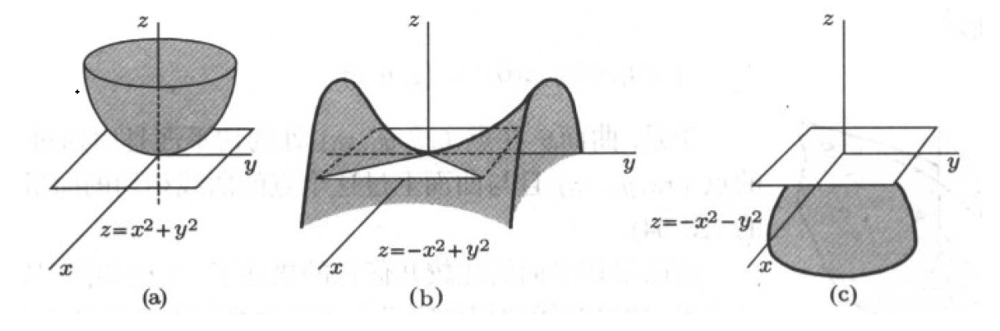
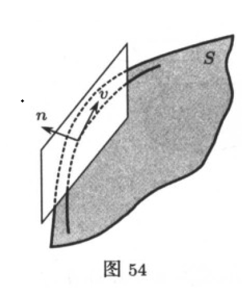
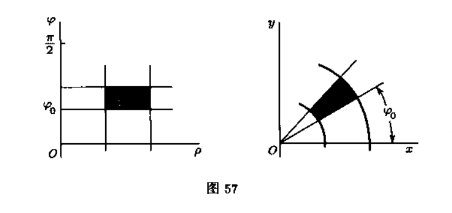
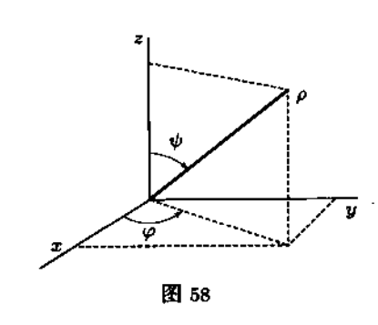
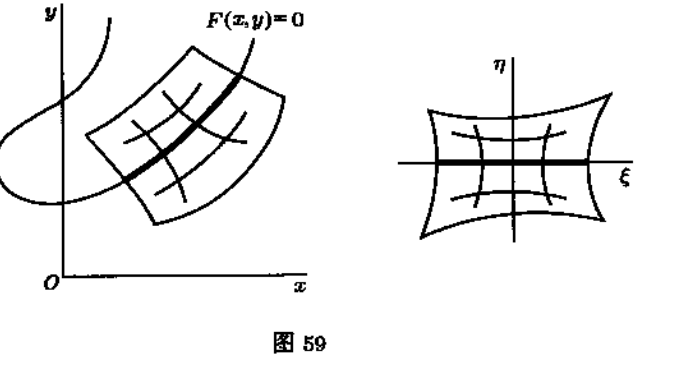
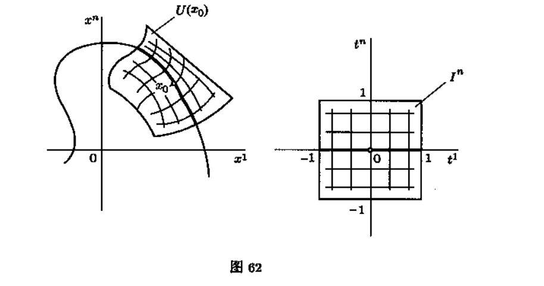

[toc]
# 多元函数微分学的几何应用

### 基础集合概念

#### 函数图像的切平面和法向量
在某个区域$G \subset R^2$上给定一个函数定义$z=f(x,y),f \in C^{0}(G)$,那么显然$f:G \to R$.
那么根据函数图像的一般定义，函数$f:G \to R$的图像是空间$R^3$中的集合
$$S=\{(x,y,z) \in R^3 | (x,y) \in G,z=f(x,y) \in R\} $$
显然用关系式$(x,y) \to (x,y,f(x,y))$定义的映射$G \stackrel{F}{\to} S$是一个从$G$到$S$的连续一一映射。

[**引理**]$F:G \to S$是一一映射.
proof:
证明F是单射,任意取定$(x_1,y_1) , (x_2,y_2) \in G,(x_1,y_1) \ne (x_2,y_2)$
那么通过映射F上述点在S里的像为$(x_1,y_1,f(x_1,y_1)) \ne (x_2,y_2,f(x_2,y_2))$
可见F是一个单射。

根据S集合定义，我们知道任意取定一个元素$s \in S$,意味着必然存在$(x,y) \in G$使得
s元素的三个坐标为$(x,y,f(x,y))$这个就证明了$F$的满射性质。

从而F是一个一一映射。

$\blacksquare$

根据这个映射，要想给出集合$S$中任何一个点$(x,y,f(x,y))$，只要给出区域$G$中相应的点解，而这个又等价于给出$G$中这个点的坐标$(x,y)$.

因此序偶$(x,y) \in G$可以看做集合$S$即函数$z=f(x,y)$的图像上的点的某种坐标。因此S的点有两个数给出，所以称S为$R^3$中的二维曲面。

如果给定$G$的道路$\Gamma:I \to G$,自然就可以得到曲面S上的道路$F \circ \Gamma :I \to S$.

如果$x=x(t),y=y(t)$是道路$\Gamma$的参数方程，那么与之对应的S上的道路$F \circ \Gamma$就可以用三个函数来表示
$$x=x(t),y=y(t),z=f(x(t),y(t))$$

特别的如果设$x=x_0+ t,y=y_0$,这个是$G$内平行于$x$轴的直线，那么与之对应的曲面$S$上的曲线为
$$x=x_0 + t,y=y_0,z=f(x_0+t,y_0)$$
那么沿着这条曲线全面上S上点的坐标$y=y_0$保持不变，类似的，可以得到曲面S上的另一条曲线
$$x=x_0,y=y_0+t,z=f(x_0,y_0+t)$$
沿着它，曲面S上的点第一个坐标$x=x_0$也是保持不变的。曲面S上的这些线，类似于平面的情况，自然成为曲面S上的坐标线。$G \subset R^2$上的坐标线是直线，而曲面S上的坐标线不同，一遍是$R^3$中的空间曲线，由于这个原因，曲面S上点的坐标$(x,y)$常常成为S上的曲线坐标。

因此定义在区域$G \subset R^2$上的连续函数$z=f(x,y)$的图像是$R^3$中的二维曲面，它的点可以用曲线坐标$(x,y) \in G$来表示。

如果函数$z=f(x,y)$在点$(x_0,y_0) \in G$可微，那么
$$f(x,y)=f(x_0,y_0)+A(x-x_0)+B(y-y_0)+o(\sqrt{(x-x_0)^2+(y-y_0)^2})$$
其中$A=f_x'(x_0,y_0),B=f_y'(x_0,y_0)$,那么考察$R^3$上的平面方程：
$$z=z_0+A(x-x_0)+B(y-y_0),z_0=f(x_0,y_0)$$

我们的曲面S上的点在$(x_0,y_0,z_0)$内非常接近上面定义的平面。
确切的说，函数图像上的点$(x,y,f(x,y))$有平面上的点$(z,y,z(x,y))$的偏差与量$\sqrt{(x-x_0)^2+(y-y_0)^2}$比较是一个无穷小量。实际上$\sqrt{(x-x_0)^2+(y-y_0)^2}$是从点$(x_0,y_0,z_0)$的坐标到图像上点$(x,y,f(x,y))$的曲线坐标$(x,y)$的位移。
即
$$\lim\limits_{(x,y) \to (x_0,y_0)}\frac{f(x,y)-z(x,y)}{\sqrt{(x-x_0)^2 + (y-y_0)^2}}=0$$

由于函数微分的唯一性知道，具有上述性质的平面是唯一的，并有如下形式:
$$z=f(x_0,y_0)+f_x'(x_0,y_0)(x-x_0)+f_y'(x_0,y_0)(y-y_0) \tag{1}$$
我们一般把它称为函数$z=f(x,y)$图像在点$(x_0,y_0,f(x_0,y_0))$的切平面。
于是，通过分析，我们函数$z=f(x,y)$在点$(x_0,y_0)$的可微性与这个函数的图像在点$(x_0,y_0,f(x_0,y_0))$存在切平面是等价的。

将切平面方程$(1)$改写为
$$f_x'(x_0,y_0)(x-x_0)+f_y'(x_0,y_0)(y-y_0)-(z-f(x_0,y_0))=0 \tag{2}$$

那么毫无疑问$(f_x'(x_0,y_0),f_y'(x_0,y_0),-1)$是切平面的法向量。它的方向看书曲面S在点$(x_0,y_0,f(x_0,y_0))$的法像或正交于S的方向。

特别的是，如果点$(x_0,y_0)$是函数$f(x,y)$的临界点，那么图像在点$(x_0,y_0,f(x_0,y_0))$处的法向量为$(0,0,-1)$,那么函数图像在这个点的切平面是水平的。临界点指的是$f_x(x_0,y_0)=f_y(x_0,y_0)=0$的点。

#### 切平面和切向量
我们知道，在$R^3$中的道路$\Gamma:I \to R^3$可以表示为
$$x=x(t),y=y(t),z=z(t) \tag{2}$$
且$x(t),y(t),z(t)$都是可微函数，那么向量$(\dot{x}(0),\dot{y}(0),\dot{z}(0))$是时刻$t=0$的速度向量。很显然道路上通过点$x_0=x(0),y_0=y(0),z_0=z(0)$且在这个点处与向量$(\dot{x}(0),\dot{y}(0),\dot{z}(0))$相切。

现在考察函数$z=f(x,y)$图像上的道路$\Gamma:I \to S$,它的表示为
$$x=x(t),y=y(t),z=f(x(t),y(t)) \tag{3}$$
此时切向量为
$$(\dot{x}(0),\dot{y}(0),\dot{z}(0))=(\dot{x}(0),\dot{y}(0),f_x'(x_0,y_0)\dot{x}(0)+f_y'(x_0,y_0)\dot{y}(0)) \\
\tag{4}$$

向量$(\dot{x}(0),\dot{y}(0),f_x'(x_0,y_0)\dot{x}(0)+f_y'(x_0,y_0)\dot{y}(0))$和向量$(f_x'(x_0,y_0),f_y'(x_0,y_0),-1)$是垂直的，所以说且向量垂直于函数图像在点$(x_0,y_0,f(x_0,y_0))$的法向量。

当然利用$(3)$表达的曲线必然在曲面$S$上，所以
$$f(x(t),y(t))-z(t) \equiv 0 \tag{5}$$
两边同时对$t$求导,并且取$t=0$则有
$$f_x'(x_0,y_0)\dot{x}(0)+f_y'(x_0,y_0)\dot{y}(0)-\dot{z}(0)=0 \tag{6}$$
也能得到相同的结论.

通过这个分析，我们知道，如果向量$(\xi,\eta,\zeta)$在点$(x_0,y_0,f(x_0,y_0))$与曲面S上过此点的某曲线相切，那么它垂直于点$(x_0,y_0,f(x_0,y_0))$处的法向量$(f_x'(x_0,y_0),f_y'(x_0,y_0),-1)$，并且可以认为这个向量在切平面(2)上，这个平面在所指出的点与曲面S相切。
更确切地说所有直线
$$x=x_0+\xi t,y=y_0+\eta t,z=f(x_0,y_0)+\zeta t \tag{7}$$
都在切平面上。

如果向量$(\xi ,\eta,\zeta)$垂直于点$(x_0,y_0,f(x_0,y_0))$处的法向量$(f_x'(x_0,y_0),f_y'(x_0,y_0),-1)$那么向量$(\xi,\eta,\zeta)$所确定的直线(7)必然在点$(x_0,y_0,f(x_0,y_0))$的切平面上。

通俗地说，函数$z=f(x,y)$的图像曲面上任意一条通过点$(x_0,y_0,f(x_0,y_0))$的曲线$\Gamma$,那么曲线$\Gamma$在点$(x_0,y_0,f(x_0,y_0))$处的切向量，必然在曲面$S在此点的切平面上。

那么逆命题是否成立呢？

即如果直线$x=x_0+\xi t,y=y_0+\eta t,z=f(x_0,y_0)+\zeta t$或者向量$(\xi,\eta,\zeta)$位于函数$z=f(x,y)$图像$S$在点$(x_0,y_0,f(x_0,y_0))$的切平面上，那么在S上实际上是存在一条曲线$\Gamma$，通过点$(x_0,y_0,f(x_0,y_0))$,并且向量$(\xi ,\eta,\zeta)$就是道路$\Gamma$在点$(x_0,y_0,f(x_0,y_0))$处的切向量。

我们构建这样位于曲面S上的曲线$\Gamma$方程为:
$$x=x_0+\xi t,y=y_0+\eta t,z=f(x_0+\xi t,y_0+\eta t) \tag{8}$$

那么不妨认为$t=0$是通过点$(x_0,y_0,f(x_0,y_0))$,那么曲线在t=0时的切向量为
$$\dot{x}(0)=\xi,\dot{y}(0)=\eta,\dot{z}(0)=f_x'(x_0,y_0)\dot{x}(0)+f_y'(x_0,y_0)\dot{y}(0)=f_x'(x_0,y_0) \xi + f_y'(x_0,y_0)\eta$$

因为直线$x=x_0+\xi t,y=y_0+\eta t,z=f(x_0,y_0)+\zeta t$或者向量$(\xi,\eta,\zeta)$位于函数$z=f(x,y)$图像$S$在点$(x_0,y_0,f(x_0,y_0))$的切平面上，那意味着
$$f_x'(x_0,y_0)\xi +f_y'(x_0,y_0)\eta -\zeta =0$$

所以必然有$\dot{z}(0)=f_x'(x_0,y_0) \xi + f_y'(x_0,y_0)\eta=\zeta$
所以对于曲线$\Gamma$,我们断定$(\dot{x}(0),\dot{y}(0),\dot{z}(0))=(\xi,\eta,\zeta)$

这个就意味着曲面S在点$(x_0,y_0,z_0)$处的切平面是有通过S上点$(x_0,y_0,z_0)$且与过这个点的曲线相切的向量组成的。

在某种程度上说，如果点$(x_0,y_0)$不是函数$z=f(x,y)$的临界点，那么有方程$f_x'(x_0,y_0)d_1+f_y'(x_0,y_0)d_2-d_3=0$确定的解集$E=\{(d_1,d_2,d_3) \in R^3|f_x'(x_0,y_0)d_1+f_y'(x_0,y_0)d_2-d_3=0\}$
与函数$z=f(x,y)$的图像在点$(x_0,y_0,f(x_0,y_0))$的切空间$T_s$是等价的。

将切空间$T_s$定义为图像S上所有过点$(x_0,y_0,f(x_0,y_0))$的曲线在此点处的切向量所组成的空间。

当然上面关于二元函数$z=f(x,y)$的结论，都可以平行地推广到$y=f(x_1,...,x_n)$的函数上去。

### 隐函数存在定理的几何应用
[例２]假定函数$F:G \to R$定义在区域$G \subset R^m$上并且有$f \in C^{1}(G)$.设$x_0=(x_1^{0},...,x_m^{0}) \in G,F(x_0)=F(x_1^{0},...,x_m^{0})=0$,如果$x_0$不是函数Ｆ的临界点，那么函数Ｆ在点$x_0$的偏导数至少一个不为零，不妨假设$\frac{\partial F}{\partial x_m}(x_0) \ne 0$
这个时候通过隐函数存在定理，在点$x_0$的某个邻域中，满足方程$F(x_1,...,x_m)=0$的$R^m$中的点集可以表示成点$(x_1^{0},...,x_{m-1}^{0}) \in R^{m-1}$的一个邻域中定义的某个函数$x_m=f(x_1,...,x_{m-1})$的图像，这个函数在这个邻域是可微的且有$f(x_1^{0},...,x_{m-1}^{0})=x_m^{0}$.

这样，在函数Ｆ的非临界点$x_0$的邻域中，方程$F(x_1,...,x_m)=0$给出了一个(m-1)维的曲面．

特别地，在$R^3$的情况下，方程$F(x,y,z)=0$在非临界点$(x_0,y_0,z_0)$的邻域内给出一个二维曲面，这个曲面在条件$F_z'(x_0,y_0,z_0) \ne 0$之下可以局部地表示为$z=f(x,y)$
我们知道，这个函数的图像在点$(x_0,y_0,z_0)$的切平面方程为
$z-z_0=f_x'(x_0,y_0)(x-x_0) + f_y'(x_0,y_0)(y-y_0)$
通过隐函数存在定理，我们知道$f_x'(x_0,y_0)=-\frac{F_x'(x_0,y_0,z_0)}{F_z'(x_0,y_0,z_0)},f_y'(x_0,y_0)=-\frac{F_y'(x_0,y_0,z_0)}{F_z'(x_0,y_0,z_0)}$
将其代入切平面方程则会有
$$F_x'(x_0,y_0,z_0)(x-x_0)+F_y'(x_0,y_0,z_0)(y-y_0)+ F_z'(x_0,y_0,z_0)(z-z_0) =0 \\
\tag{9}$$
$x,y,z$是切平面上的流动坐标，它关于变量$x,y,z$是对称的．

类似的，对于一般情况下$R^m$中的超平面
$$\sum_{i=1}^{m}F_{x_i}'(x-x_i^{0})=0　\tag{10}$$
它在点$x_0=(x_1^{0},...,x_m^{0})$与由方程$F(x_1,...,x_m)=0$所表示的曲面相切．
所以(10)是通过隐函数$F(x,y,z)=0,F(x_0) =0$在$x_0$的邻域内所确定的曲面的切平面．

很显然对于等高线$F(x,y,z)=r$，取等高线上的一点$(x_0,y_0,z_0)$，即$F(x_0,y_0,z_0)=r$那么毫无疑问在$(x_0,y_0,z_0)$的邻域内满足$F(x,y,z)=r$所确定的曲面$S$在点$(x_0,y_0,z_0)$的切平面还是（９）式，这个也就说明了$gradF(x_0,y_0,z_0)=(F_x'(x_0,y_0,z_0),F_y'(x_0,y_0,z_0),F_z'(x_0,y_0,z_0))$是垂直于曲面Ｓ的，实际上也是说$gradF(x_0,y_0,z_0)$是切平面的法向量．

### 反函数存在定理的几何应用
反函数定理常常应用于从一个坐标系到另一个坐标系的坐标变换，当然最简单的就是线性的坐标变换．即
$$\left[\begin{matrix}
y_1\\
...\\
y_m
\end{matrix}\right]=\left[\begin{matrix}
A_{11},...,A_{1m}\\
...\\
A_{m1},...,A_{mm}
\end{matrix}\right]\left[\begin{matrix}
x_1\\
...\\
x_m
\end{matrix}\right]　\tag{11}$$
可以写成线性变换$A:R_x^{m} \to R_y^{m}$有定义在整个$R_y^{m}$上的逆变换$A^{-1}:R_y^{m} \to R_x^{m}$当且仅当$\det A \ne 0$.
反函数定理是这个断言的局部变化形式，它基于这样一个事实，光滑映射在一点的小邻域内的性质就像它在这一点的微分那样好．

[1]极坐标，从上半平面$R_+^{2}=\{(\rho,\varphi) \in R^2|\rho \ge 0\}$到平面$R^2$的映射$f:R_+^{2} \to R^2$由公式
$$\begin{cases}
x=\rho cos\varphi\\
y=\rho sin\varphi 
\end{cases}
\tag{12}$$
$\frac{\partial(x,y)}{\partial(\rho,\varphi)}=\rho >0$,可见只要$\rho >0$的任何点$(\rho,\varphi)$的任何邻域内也不为０，所以利用反函数存在定理，我们知道(12)是局部可逆的，也就是说，在局部范围内，数$\rho,\varphi$可以作为直角坐标系点$(x,y)$的新坐标．

从图上可以观察到，平面$(x,y)$上的圆弧对应着平面$(\rho,\varphi)$上的直线段，这意味着曲线被局部的展平了．

坐标$(\rho,\varphi)$是众所周知的片面上的曲线坐标－－极坐标．
由于所涉及的三角函数的周期性，映射仅仅在$\rho >0$的地方是局部微分同胚的，并不能在整个区域上都是双方单值的，所以从笛卡尔坐标转到极坐标时常常需要选取角度$\varphi$的范围．

在三维空间$R^3$中的极坐标$(\rho,\psi,\varphi)$称为球坐标，他们和笛卡尔坐标之间的关系
$$
\begin{cases}
 x=\rho \sin\psi \cos\varphi   \\ 
 y=\rho \sin\psi \sin\varphi   \\
 z=\rho \cos\psi   
\end{cases}　\tag{12}
$$

参数$\rho,\psi,\varphi$的几何意义如图．

$\frac{\partial(x,y,z)}{\partial(\rho,\psi,\varphi)} =\rho^2\sin\psi$可见，对于球坐标的变换而言在任意一个点$(\rho,\psi,\varphi)(\rho >0,\sin\psi \ne 0)$的邻域内有逆变换．

在空间$(x,y,z)$中满足$\rho=const$的是半径为$\rho$的球面
$\varphi=const$是一个通过ｚ轴的半平面．
$\psi=const$是以ｚ轴为对称轴的圆锥面．

这样，由坐标系$(x,y,z)$转到$(\rho,\psi,\varphi)$ 时，例如球面和锥面可以局部抻平，即他们分配对应小块平面$\rho=const$与$\psi=const$．

[2]
曲线局部抻直的一般想法
新坐标的引入通常是为了简化问题所涉及的对象的解析表达式，使他们在新坐标中更加易于观察．
设$R^2$上用方程$F(x,y)=0$给出的一条曲线，Ｆ是光滑函数，点$(x_0,y_0)$ 在曲线上，即$F(x_0,y_0)=0$,设它不是函数Ｆ的临界点，不妨设$F_y'(x_0,y_0) \ne 0$

我试图选取新的坐标$\xi,\eta$,使得在这个坐标系下，曲线含有点$(x_0,y_0)$的一段弧变成坐标直线，例如$\eta =0$上的一个线段．令
$$\begin{cases}
\xi =x -x_0\\
\eta =F(x,y)    
\end{cases} \tag{13}
$$
当然也可以变为
$$\begin{cases}
\xi =x\\
\eta =F(x,y)    
\end{cases} \tag{14}
$$
前后两个映射没有什么什么本质的区别，只是$(x_0,y_0)$在不同的映射下的坐标不同．
那么(13)所定义的Jacobi矩阵为
$$J_{(x,y)}(\xi,\eta)=\left(\begin{matrix}
1 ,0 \\
F_x',F_y'    
\end{matrix}\right)$$
那么$\frac{\partial(\xi,\eta)}{\partial(x,y)}＝\det J_{(x,y)}(\xi,\eta)=F_y'$那么$\frac{\partial(\xi,\eta)}{\partial(x,y)}(x_0,y_0)=F_y'(x_0,y_0) \ne 0$
那么根据反函数存在定理，我们知道(13)所定义的映射是可逆的，那意味着这个映射是从点$(x_0,y_0)$的邻域到点$(0,0)$的邻域的微分同胚．

那意味着，在所处的邻域范围内，数$(\xi,\eta)$可以作为点$(x_0,y_0)$邻域内的点的新坐标．

而在新的坐标系下，我们的曲线方程就变成了$\eta =0$,在这个意义上，我们的变换相当于把曲线局部抻直了．

## $R^n$中的曲面
### $R^n$中的k维曲面
推广质点运动规律$x=x(t)$的概念,得到$R^n$中的道路的概念,集定义在区间$I \subset R$上的连续映射$\Gamma:I \to R^n$.用这个映射的光滑成都来定义道路的光滑程度.

道路的承载子$\Gamma(I) \subset R^n$可能是$R^n$中非常复杂的点集,仅仅有时候可以很勉强地称为曲线而已,道路的的承载子可以是单独的一个点.

类似地,定义在k维区间$I^k \subset R^k$上的连续或光滑映射$f:I^k \to R^n$称为$R^n$中的$k$道路,它的像$f(I^k)$可能不是我们想象的$R^n$中的k维曲面,例如它可能仅仅是一个点.

设$f:G \to R^n$是定义在区域$G \subset R^k$上的光滑映射,为了使f所确定的$R^n$中的集合图形是k个独立参数$(t_1,...,t_k) \in G$描述的k维图像.只要$f:G \to R^n$在每一点$t \in G$的秩等于$k(k \le n)$.
这时,映射$f:G \to f(G)$在局部范围内(即在任一点$t \in G$的邻域内)是一一映射的.
事实上,设$rank f(t_0)=k$,如果映射$f:G \to R^n$的坐标形式如下:
$$x_1=f_1(t_1,...,t_k)\\
...\\
x_k=f_k(t_1,...,t_k)\\
...\\
x_n=f_n(t_1,...,t_k) \tag{15}$$
为了方便讨论起见,不妨设前k个函数的秩为$k$.

那么根据反函数存在定理知道,变量$t_1,...,t_k$在点$t_0$的某个邻域$U(t_0)$内可以用变量$x_1,...,x_k$来表示,为了简明起见不妨$$t_i=\varphi_i(x_1,...,x_k),i=1,2,...,k \tag{16}$$
这个就是说集合$f(U(t_0))$可以写成
$$x_{k+1}=\varphi(x_1,...,x_k),...,x_n=\varphi_n(x_1,...,x_k) \tag{17}$$
只需要将$(16)$式的结果代入(15)式,便可以得到(17)式的结果.
很显然集合$f(U(t_0))$可相互单值地投影到坐标平面$x_1,...,x_k$上.
因此,映射$f:U(t_0) \to f(U(t_0))$是一个一一映射.

实际上单独证明也是好证明的.
映射是满的无须证明,关键是证明映射是单设.
不妨在$U(t_0)$的邻域内取点$t_1,t_2,t_1 \ne t_2$不妨设其在$f(U(t_0))$中的像为$x^{1},x^{2}$,很显然$(x_1^{1},...,x_k^{1}) \ne ((x_1^{2},...,x_k^{2}))$ 这是因为$f=\varphi^{-1}$在邻域里微分同胚.那么当然有$x^{1} \ne x^{2}$,从而可知知道映射是一一映射的.

当然局部的是一一映射,不能确定整体也是一一映射.
如果我们需要定义$R^n$中的k维光滑曲面是这样一个集合,它在自己的每一点附近都可以用某个k维($R^n$中的k维子空间)平面块变形而成,那么只把k维曲面的典则块$G \subset R^k$正规地映入$R^n$中是不够的,还必须同时注意使它从整体上呈现处是嵌入到这个空间上的.

[**曲面定义1**]
集合$S \subset R^n$称为空间$R^n$中的$k$维光滑曲面(R^n中的k维子流形).如果对于每一点$x_0 \in S$,存在$R^n$中的邻域$U(x_0)$和从这个邻域到$R^n$中的单位区间$I^n=\{t \in R^n| \quad |t_i| \le 1,i=1,...,n\}$的微分同胚$\varphi:U(x_0) \to I^n$使得集合$S \cap U(x_0)$在这个微分同胚下的像在$I^n$中的部分是有关系式$t_{k+1}=...=t_{n}=0$确定的$R^n$中的k维平面.

如果把$t_1,...,t_n$看成邻域$U(x_0)$中点的新坐标,那么定义可以重新简化如下:集合$S \subset R^n$称为$R^n$中的k维曲面(k维子流形),如果对于每一个点$x_0 \in S$,都可以指出一个邻域$U(x_0)$和该邻域中的坐标$t_1,...,t_n$使得集合$S \cap U(x_0)$在这些坐标下可以用关系式$t_{k+1}=...=t_n=0$给出.

定义中的单位立方体的角色纯粹是约定的,它大致上起着标准尺寸或者页面形式大致具有类似之处.

一个区间在坐标系$t_1,...,t_n$中的正则位置也和标准化问题有关,并且除此之外并没有更多的意义,因为$R^n$中的任何一个区间通过线性微分同胚总是可以变换成n维单位区间.

[**例题**]
3.给定方程组
$$\begin{cases}
a_{1,1}x_1 + a_{1,k}x_k +...+a_{1,n}x_n=0 \\
...\\
a_{n-k,1}x_1 + a_{n-k,k}x_k +...+a_{n-k,n}x_n=0 \\
\end{cases} \tag{18}$$
设它的秩为$n-k$,则由它确定的点集是$R^n$中的k维子流形.
这个说明方程都是不相关的.
可以将方程写成$Ax=0$,说明系数矩阵有(n-k)的非零子式,为了方便起见,不妨设
$$\left|\begin{matrix}
a_{1,k+1},...,a_{1,n}\\
a_{2,k+1},...,a_{2,n}\\
...\\
a_{n-k,k+1},...,a_{n-k,n}\\
\end{matrix}\right| \ne 0$$

这个时候考虑变换
$$\begin{cases}
t_1=x_1\\
...\\
t_k=x_k\\
t_{k+1}=a_{1,1}x_1 + a_{1,k}x_k +...+a_{1,n}x_n\\
...\\
t_n=a_{n-k,1}x_1 + a_{n-k,k}x_k +...+a_{n-k,n}x_n   
\end{cases}
$$
可以考虑变换的行列式
$$
\left|\begin{matrix}
1,0,...0,...,0\\
0,1,...0,...,0\\
...\\
0,...,1,...,0\\
a_{1,1},...,a_{1,k},...,a_{1,n}\\
a_{2,1},...,a_{2,k},...,a_{2,n}\\
a_{n-k,1},...,a_{n-k,k},...,a_{n-k,n}
\end{matrix}\right|=\left|\begin{matrix}
a_{1,k+1},...,a_{1,n}\\
a_{2,k+1},...,a_{2,n}\\
...\\
a_{n-k,k+1},...,a_{n-k,n}\\
\end{matrix}\right| \ne 0$$
可见$t=\varphi(x)$是一个局部微分同胚的变换.也就是说是非退化的变换.
在新的坐标系下,(18)式定义的集合用条件$t_{k+1}=...=t_n=0$给出.

4.定义在某个区域$G \subset R^{n-1}$的光滑函数$x_n=f(x_1,...,x_{n-1})$的图像是$R^{n}$中的$n-1$维光滑曲面.
考虑映射
$$\begin{cases}
t_1=x_1\\
...\\
t_{n-1}=x_{n-1}\\
t_{n}=x_n-f(x_1,...,x_{n-1})    
\end{cases}$$
$t=\varphi(x)$那么变换的行列是为$|J_x\varphi(x)|=1$这是因为
$\left|\begin{matrix}
1,...,0\\
0,1,...,0\\
...\\
0,....,1,0\\
f_{x_1}',...,f_{x_{n-1}}',1    
\end{matrix}\right|=1 \ne 0$
说明变换是微分同胚的,在新的坐标系$t_1,...,t_n$坐标下,函数的图像可以用$t_n=0$来描绘.

5.在圆周$x^2+y^2=1$是$R^2$中的一维子流形,可以通过极坐标的形式来刻画,即$x=\rho cos\varphi,y=\rho \sin \varphi$,并且这个变换是局部可逆的,而在极坐标系中,上述圆周方程可以表示为$\rho=1$描绘.

实际上也可以定义映射$t_1=x,t_2=x^2+y^2-1$但是这个映射在$y=0$处并不是微分同胚的.

6.研究由一组光滑函数组确定的集合S:
$$\begin{cases}
F_1(x_1,...,x_k,x_{k+1},...,x_n)=0\\
F_2(x_1,...,x_k,x_{k+1},...,x_n)=0\\
...\\
F_{n-k}(x_1,...,x_k,x_{k+1},...,x_n)=0\\
\end{cases} \tag{19}$$
如果上面的光滑函数组它的秩$n-k$,那么$(19)$确定的集合S是$R^n$中的k维子流形.

设$x_0 \in S$处有
$$\left|\begin{matrix}
\partial_{x_{k+1}}F_1,...,\partial_{x_{n}}F_1\\
...\\
\partial_{x_{k+1}}F_{n-k},...,\partial_{x_{n}}F_{n-k}\\
\end{matrix}\right|(x_0) \ne 0$$
那么根据反函数定理,我们知道变换
$$\begin{cases}
t_1=x_1\\
...\\
t_{k}=x_{k}\\
t_{k+1}=F_1(x_1,...,x_n)\\
...\\
t_{n}=F_{n-k}(x_1,...,x_n)\\
\end{cases}$$
像以往考虑变换$t=\varphi(x)$的雅克比行列式,并且有$|J_x\varphi(x_0)| =\left|\begin{matrix}
\partial_{x_{k+1}}F_1,...,\partial_{x_{n}}F_1\\
...\\
\partial_{x_{k+1}}F_{n-k},...,\partial_{x_{n}}F_{n-k}\\
\end{matrix}\right|(x_0) \ne 0$

那么映射,在这个点的某个邻域是微分同胚的.
在新坐标系$(t_1,...,t_n)$下,原来的关系式具有$t_{k+1}=...=t_n=0$的形式,所以S是$R^n$中的k维光滑曲面.

7.平面$R^2$上满足方程$x^2-y^2=0$的点的集合$E$由相交于坐标于坐标原点的两条直线组成,这个集合不是$R^2$的一维子流形.因为它自身有相交的点.

当然如果从E中去除坐标原点$0 \in R^2$那么集合$E\setminus 0$是满足一维子流形的定义的.但是集合$E \setminus 0$不是连通的,因为它是有四条没有公共点的射线组成的.

这就是说,满足定义1的$R^n$中的k维曲面可以是非连通的子集,它们有一些连通分支组成(这些分支是连通的k维曲面).$R^n$中的曲面常常理解为连通的k维曲面.
我们现在关心的问题是寻找曲面上的函数的极值,这是局部的问题,所以不必提出曲面连通的条件.

8.如果区域$G \subset R^k$的光滑映射$f:G \to R^n$在坐标形式(15)给出,它在点$t_0 \in G$的秩为k,则该店某个邻域$U(t_0) \subset G$的像$f(U(t_0)) \subset R^n$是$R^n$中的光滑曲面.

如前面所描述的那样,此时可以把点$t_0 \in G$的某个邻域$U(t_0)$内把关系式(15)替换为它的等价关系式
$$x_{k+1}=\varphi_{k+1}(x_1,...,x_k),...,x_n=\varphi_n(x_1,...,x_k)$$
为了简明起见,认为函数组$f_1,...,f_k$的秩为k.正如例6讨论的那样,可以取
$F_i(x_1,...,x_n)=x_{k+i}-\varphi_{k+i}(x_1,...,x_k),i=1,2...,n-k$
从例6的讨论,我们知道集合$f(U(t_0))$确实是$R^n$中的k维曲面.
那么$rank J_x(F_1,...,F_{n-k})(x_0)=n-k$

$$J_x(F_1,...,F_{n-k})=\left[\begin{matrix}
\partial_{x_1}\varphi_{k+1},\partial_{x_2}\varphi_{k+1},...,\partial_{x_k}\varphi_{k+1},1,...,0 \\  
\partial_{x_1}\varphi_{k+2},\partial_{x_2}\varphi_{k+2},...,\partial_{x_k}\varphi_{k+2},0,1,...,0 \\
...\\
\partial_{x_1}\varphi_{n},\partial_{x_2}\varphi_{n},...,\partial_{x_k}\varphi_{n},0,...,1 \\
\end{matrix}\right]
$$
可以简要的重新写$J_x(F_1,...,F_{n-k})=(J_{(x_1,..,x_k)}(\varphi_{k+1},...,\varphi_{n})|I_{n-k})$
很显然有一个n-k阶子式的行列式是不为0的.就是后半段的$I_{n-k}$

## 切空间

当研究质点运动在$R^3$中的运动规律$x=x(t)$时,从关系式
$$x(t)=x(0)+x'(0)t+o(t),t \to 0 \tag{20}$$
出发,并且假定$t=0$不是映射$t \to x(t)$的临界点,即$x'(0) \ne 0$,我们定义了运动轨迹在点$x(0)$的切线,它是$R^3$中由参数方程
$$x-x_0=x'(0)t \tag{21}$$
或者
$$x-x_0=\xi t$$
确定的$R^3$的线性子集,其中$x_0=x(0)$而$\xi =x'(0)$是切线的方向向量.显然切线也是通过点$x_0$点.

我们在$R^3$中定义函数$z=f(x,y)$的图像的切平面时已经做过类似的事情.除了$z=f(x,y)$再补充两个显然的等式$x=x,y=y$,从而可以得到映射$(x,y) \to (x,y,f(x,y))$,这个映射在点$(x_0,y_0)$的切映射是线性映射.
$$\left(\begin{matrix}
x-x_0\\
y-y_0\\
z-z_0    
\end{matrix}\right)=\left(\begin{matrix}
1,0\\
0,1\\
f_x'(x_0,y_0),f_y'(x_0,y_0)    
\end{matrix}\right)\left(\begin{matrix}
x-x_0\\
y-y_0    
\end{matrix}\right)\tag{22}$$
其中$z_0=f(x_0,y_0)$

如果在这里取$t=\left(\begin{matrix}
x-x_0\\
y-y_0    
\end{matrix}\right),x-x_0=\left(\begin{matrix}
x-x_0\\
y-y_0\\
z-z_0    
\end{matrix}\right)$
并用$x'(0)$表示(22)的上述映射的雅可比矩阵$\left(\begin{matrix}
1,0\\
0,1\\
f_x'(x_0,y_0),f_y'(x_0,y_0)    
\end{matrix}\right)$,则它的秩为2,而关系式(21)就可以表示成$x-x_0=x'(0)t$

实际上关系式$(22)$中的三个等式,只有最有一个等式是非平凡的.因此我们认为它才是给出函数$z=f(x,y)$的图像在点$(x_0,y_0,z_0)$的切平面的方程.

现在可以用上述的观察来定义k维光滑曲面$S \subset R^n$的k维切平面.

我们从曲面的定义1我们知道,在k维曲面$S$上的任何点$x_0\in S$的邻域内,可以用参数形式给出曲面,即利用映射$(t_1,...,t_k) \to (x_1,...,x_n) \in S,(t_1,...,t_k) \in I^k$给出这个曲面,例如可以取映射$\varphi^{-1}:I^n \to U(x_0)$在$k$维平面$t_{k+1}=t_{k+2}=...=t_n=0$上的限制.
因为$\varphi^{-1}$是微分同胚,所以映射$\varphi^{-1}:I^n \to U(x_0)$在立方体中任何点的雅可比行列式不为0,于是$\varphi^{-1}$在上述平面上的限制映射
$$(t_1,...,t_k) \to (x_1,...,x_n) \in S$$
在立方体$I^{k}$中的任何点秩应当是$k$.

> 注:
$\varphi^{-1}:I^n \to U(x_0)$是一个微分同胚的映射.
不妨取
$$x_1=\varphi_1^{-1}(t_1,...,t_n) \\
x_2=\varphi_2^{-1}(t_1,...,t_n)\\
...\\
x_n=\varphi_n^{-1}(t_1,...,t_n)$$
如果不限制,映射的像在$x_0$的邻域内,如果限制$t$的取值,我们将其限制在k维平面$t_{k+1}=t_{k+2}=...=t_n=0$上,那么映射的像就在$U(x_0)\cap S$上,即曲面$S$上.

此时相当于可以得到新的映射
$$x_1=\phi_1(t_1,...,t_k)=\varphi_1^{-1}(t_1,...,t_k,0,...,0) \\
x_2=\phi_2(t_1,...,t_k)=\varphi_2^{-1}(t_1,...,t_k,0,...,0)\\
...\\
x_n=\phi_n(t_1,...,t_k)=\varphi_n^{-1}(t_1,...,t_k,0,...,0)$$
那很显然$rank J_{t_1,...,t_k}(x_1,...,x_n)=k$

所以,现在取$t=(t_1,...,t_k)\in I^{k}$,并且用$x=x(t)$来表示$t \to x \in S,t \in I^k$,实际上就是前面讲的$\phi:t \to x \in S,t \in I^k$那我们就可以得到曲面S的局部参数表达式,它具有$(20)$表示的性质.
我们可以认为(21)就是曲面$S \subset R^n$在点$x_0 \in S$的切空间或切平面的方程.

[**定义2**]
如果k维曲面$S \subset R^n(1 \le k \le n)$在点$x_0 \in S$的邻域内由参数形式的光滑映射$t=(t_1,...,t_k) \to (x_1,...,x_n) \in S$给出,并且$x_0=x(0)$,矩阵$x'(0)$的秩为k,则在$R^n$中由参数形式的的矩阵等式(21)给出的k维平面称为曲面S在点$x_0 \in S$的切平面或切平面.

$$\begin{cases}
x_1-x_1^{0}=\partial_{t_1}x_1(0)t_1 +...+ \partial_{t_k}x_1(0)t_k   \\
...\\
x_n-x_n^{0}=\partial_{t_1}x_n(0)t_1 +...+ \partial_{t_k}x_n(0)t_k   \\
\end{cases} \tag{23}
$$
其中因为$x_1=x_1(t_1,...,t_k),...,x_1=x_n(t_1,...,t_k)$
$\partial_{t_k}x_n(0)=\frac{\partial x_n(0)}{\partial t_k}$

我们仍然项一样用记号$TS_x$表示曲面S在点$x \in S$的切空间.

线性映射$t \to x'(0)t$它是局部给出曲面S的映射$t \to x(t) \in S$的切映射,而这个线性映射把空间$R^k=TR_0^{k}$映射为平面$TS_{x(0)}$.

### 隐函数确定的曲面的切空间
$$\begin{cases}
F_1(x_1,...,x_k,x_{k+1},...,x_n)=0\\
F_2(x_1,...,x_k,x_{k+1},...,x_n)=0\\
...\\
F_{n-k}(x_1,...,x_k,x_{k+1},...,x_n)=0\\
\end{cases}$$
如果函数组的秩为$n-k$我们知道这个方程组给出了$R^n$中的k为曲面S.

给出$x_0 \in S$,并且假设$\left|\begin{matrix}
\partial_{x_{k+1}}F_1,...,\partial_{x_{n}}F_1\\
...\\
\partial_{x_{k+1}}F_{n-k},...,\partial_{x_{n}}F_{n-k}\\
\end{matrix}\right|(x_0) \ne 0$在$x_0$的邻域里都成立.根据偏导数的连续性知道这个是成立的.

为了方便起见,设$(x_1,...,x_k)=u,(x_{k+1},...,x_{n})=v,(F_1,...,F_{n-k})=F$,那么方程组和行列式条件可以改写成
$F(u,v)=0,\det F_v'(u,v) \ne 0$
利用隐函数存在定理,且$F(u_0,v_0)=0,\det F_v'(u_0,v_0) \ne 0$那么在点$(u_0,v_0)$的邻域内从$F(u,v)=0$可以确定一个函数$v=f(u)$
然后再补充恒等式$u=u$,我们就可以得到曲面S在点$x_0 \in S$的邻域内的参数表达式
$$\begin{cases}
 u=u\\
 v=f(u)   
\end{cases}
$$
换个坐标形式就有
$$\begin{cases}
 u=u_0+t\\
 v=f(u_0+t)   
\end{cases} \tag{24}$$
(24)式就是曲面S的参数形式.

那么就可以得到$x_0$处的切平面方程的参数方程
$$\begin{cases}
 u-u_0=Et\\
 v-v_0=f'(u_0)t   
\end{cases}\tag{25}$$

实际上(25)的切平面参数方程,只有最后一个是非平凡的,由于$t=u-u_0$,那么只留下切平面参数方程的非平凡形式
$$v-v_0=f'(u_0)t \tag{26}$$
它给出了切平面上变量$x_1,...,x_k$与变量$x_{k+1},...,x_{n}$之间的关系,而切空间正是由这样的关系给出的.

根据隐函数存在定义,我们知道
$f'(u_0)=-[F_v'(u_0,v_0)]^{-1}F_u'(u_0,v_0)$
把这个结果代入(26)式就有
$$F_u'(u_0,v_0)(u-u_0) + F_v'(u_0,v_0)(v-v_0)=0 \tag{27}$$
我们回到变量$x_1,...,x_n$的形式就有,就可以得到切空间$TS_{x_0} \subset R^n$的方程
$$F_x'(x_0)(x-x_0)=0 \tag{28}$$
将其写成坐标形式下的等价方程组为
$$
\begin{cases}
\partial_{x_1}F_1(x_0)(x_1-x_1^{0})  +...+ \partial_{x_n}F_1(x_0)(x_n-x_n^{0})=0\\
...\\
\partial_{x_1}F_{n-k}(x_0)(x_1-x_1^{0})  +...+ \partial_{x_n}F_{n-k}(x_0)(x_n-x_n^{0})=0\\    
\end{cases} \tag{29}
$$
根据条件,这个方程组的秩等于$n-k$,所以它给出了$R^n$中的k维平面.

这个意味着,如果曲面$S \subset R^n$由方程$F(x)=0$给出,(28)式给出了曲面S的切平面方程.

对于切平面上的点$x,x_0$,那么向量$\xi=x-x_0 \in TS_{x_0}$,并且有
$$F_x'(x_0) \xi =0 \tag{30}$$

这个意味着,如果曲面$S \subset R^n$由方程$F(x)=0$给出,则向量$\xi$位于曲面S在点$x_0 \in S$的切平面$TS_{x_0}$的充分必要条件是它满足$F_x'(x_0)\xi = 0$.因此,可以把$TS_{x_0}$看做满足(30)的向量$\xi$构成的向量空间.

根据分析,给出了两种不同形式的切平面方程,一种是由参数形式给出,一种是由(28)式给出,这个主要的差异是由于曲面S的形式差异造成的,本质并没有什么不同.

下面给出曲面切空间的另外一种等价描述

[**命题**]
光滑曲面$S \subset R^n$在点$x_0 \in S$的切空间是有由曲面S上过点$x_0$的光滑曲线在点$x_0$的切向量组成的.

$$\begin{cases}
F_1(x_1,...,x_k,x_{k+1},...,x_n)=0\\
F_2(x_1,...,x_k,x_{k+1},...,x_n)=0\\
...\\
F_{n-k}(x_1,...,x_k,x_{k+1},...,x_n)=0\\
\end{cases}$$
设曲面S在点$x_0$的邻域内有上面的方程给出.
为了简明起见,我们将其写为$F(x)=0,F=(F_1,...,F_{n-k}),x=(x_1,...,x_n)$.

设$\Gamma:I \to S$是任意的一条光滑道路,并且承载子位于S上,取$I=\{t \in R| \quad |t| <1\}$,认为$x(0)=x_0$.

因为当$t \in I$时有$x(t) \in S$,那么$\forall t \in I,F(x(t))\equiv 0$
对这个恒等式的两边求导,得到
$F_x'(x(t))x'(t) \equiv 0$
特别的当$t=0$取$\xi =x'(0)$就可以得到$F_x'(x_0)\xi=0$
实际上这里的$\xi$就是曲线$x(t)$在点$x_0$的切向量.
由此可知在$x_0$的切向量$\xi$是满足切空间$TS_{x_0}$的方程(30)的.

所以这个也就证明了,曲面S的任意曲线$x(t)$在$x_0$处的切向量都属于$x_0$的切空间$TS_{x_0}$.

那么是不是意味着满足(30)的任何向量$\xi$,都存在一条道路$\Gamma:I \to S$,它给出了曲面S上的一条曲线,这条曲线在时刻$t=0$通过点$x_0$,而且在时刻$t=0$就有速度向量$\xi$.

实际上答案是肯定的.

当然要回答这个问题,依然要强调的是在$x_0$处满足
$$\left|\begin{matrix}
\partial_{x_{k+1}}F_1,...,\partial_{x_{n}}F_1\\
...\\
\partial_{x_{k+1}}F_{n-k},...,\partial_{x_{n}}F_{n-k}\\
\end{matrix}\right|(x_0) \ne 0$$

我们不妨设$\xi=(\xi_1,...,\xi_k,\xi_{k+1},...,\xi_{n})$满足$F_x'(x_0)\xi=0$.

为了方便起见,设$(x_1,...,x_k)=u,(x_{k+1},...,x_{n})=v,(F_1,...,F_{n-k})=F$,那么方程组和行列式条件可以改写成
$F(u,v)=0,\det F_v'(u,v) \ne 0$
利用隐函数存在定理,且$F(u_0,v_0)=0,\det F_v'(u_0,v_0) \ne 0$那么在点$(u_0,v_0)$的邻域内从$F(u,v)=0$可以确定一个函数$v=f(u)$
然后再补充恒等式$u=u$,我们就可以得到曲面S在点$x_0 \in S$的邻域内的参数表达式
$$\begin{cases}
 u=u\\
 v=f(u)   
\end{cases}
$$

那么在变量$x_1,...x_k$的子空间$R^k \subset R^n$中取参数方程
$$
\begin{cases}
x_1 -x_1^{0}=\xi_1 t  \\
x_2 -x_2^{0}=\xi_2 t   \\
...\\
x_k -x_k^{0}=\xi_k t    
\end{cases} \tag{31}$$
很显然$(31)$给出了$R^{k}$中的一条直线.
其方向向量为$\xi_u=(\xi_1,...,\xi_k)$
也可用更加简洁的方程表示为$u=u_0+\xi_u t$

可以利用隐函数定理,从曲面的隐式表达里接触曲面S的参数表达式
$$\begin{cases}
 u=u\\
 v=f(u)   
\end{cases}
$$
那意味着,根据此,我们可以得到$R^n$中的一条曲线
$$\begin{cases}
u=u_0+\xi_u t \\
v=f(u_0+\xi_u t),t \in U(0) \in R     
\end{cases} \tag{32}
$$
因为在这个邻域里有$F(u,f(u)) \equiv 0$,所以(32)式定义的曲线必然在曲面S上.
且该曲线在$t=0$时,通过点$(u_0,v_0)=(x_1^{0},...,x_k^{0},x_{k+1}^{0},...,x_n^{0}) \in S$

曲线$(32)$式在$t=0$时的切向量为$\overline{\xi}=(\overline{\xi}_u,\overline{\xi}_v)=(\xi_u,f'(u_0)\xi_u)$
又因为$f'(u_0)=-[F_v'(u_0,v_0)]^{-1}F_u'(u_0,v_0)$那么我们知道
$\overline{\xi}=(\xi_u,-[F_v'(u_0,v_0)]^{-1}F_u'(u_0,v_0)\xi_u)$.

前面约定的向量$\xi=(\xi_u,\xi_v)$满足$F_x'(x_0)\xi=0$即有
$F_u'(u_0,v_0)\xi_u + F_v'(u_0,v_0)\xi_v=0$
所以有$\xi_v=-F_v'(u_0,v_0)^{-1}F_u'(u_0,v_0)\xi_u$
由此可见$\overline{\xi_v}=\xi_v$而$\overline{\xi_u}=\xi_u$
所以曲线(32)在$t=0$处的切向量$\overline{\xi}$等于$\xi$.

>注
还有一种办法就是设曲线$(32)$在$t=0$处的切向量为$\overline{\xi}=(\overline{\xi}_u,\overline{\xi}_u)$,根据曲线在曲面上,那么必然有
$F(u_0+\xi_u t,f(u_0+\xi_u t)) \equiv 0$
所以有
$F_u'(u_0,v_0)\overline{\xi}_u +F_v'(u_0,v_0)\overline{\xi}_v \equiv 0$
很显然这里$\overline{\xi}_u=\xi_u$.由因为$\xi=(\xi_u,\xi_v)$满足
$F_u'(u_0,v_0)\xi_u + F_v'(u_0,v_0)\xi_v=0$
那么必然有必然有$\xi_v =\overline{\xi}_v$
只需要用  
$F_u'(u_0,v_0)\xi_u + F_v'(u_0,v_0)\xi_v -F_u'(u_0,v_0)\overline{\xi}_u +F_v'(u_0,v_0)\overline{\xi}_v=0$
即$F_v'(u_0,v_0)(\xi_v-\overline{\xi}_v)=0$根据线性代数的知识,我们知道必然有$\xi_v=\overline{\xi}_v$

那说明趣满S是确实存在满足条件的曲线.

这个也就证明了$x_0$切空间$TS_{x_0}$的另外一种等价描述,它可以记为曲面S上所有过$x_0$的曲线,在$x_0$处的切向量构成的空间.

由此切空间的几何意义就明确了.

不过一定要注意的是,这些讨论都是基于点的函数方程组的秩假设的.

