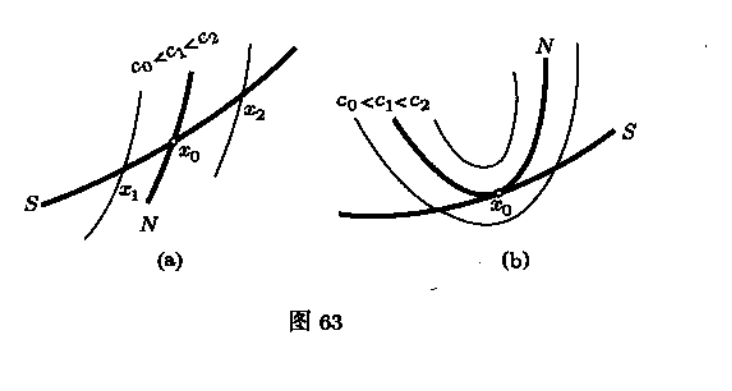
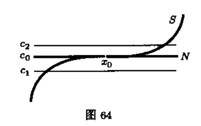

# 从几何的角度考察条件极值

对于一般情形而言,条件极值的问题都可以表示:求n个变量的实值函数
$$y=f(x_1,x_2,...,x_n) \tag{1}$$
在这些变量满足方程
$$
\begin{cases}
F_1(x_1,...,x_n)=0\\
....\\
F_m(x_1,...,x_n)=0
\end{cases}
\tag{2}$$

无约束极值问题,研究的是$x \to f(x),x \in R^n$在点$x_0 \in R^n$的邻域内的性质,这时自变量$x$可以取点$x_0$在$R^n$中的邻域内的任何值.

常常会出现更加复杂一点的问题,需要寻找一个函数在自变量的变化范围受到某些条件限值时的极值.

我们研究希望获得微分形式的极值条件.所以假设(1)(2)所涉及到的函数是可微的,甚至是连续可微的.

如果函数$F_1,...,F_m$的秩为$k$,那么条件(2)给出$R^n$中的某个k维光滑曲面S???暂且认为对,后续再确认.

那么从几何的观点来看,寻找函数f在条件(2)下的极值,就是寻找函数f在曲面S上的极值,更准确些说,就是考察函数f在曲面S上的限制$f_{|S}$并且寻找函数$f_{|S}$上的极值.

当然局部极值点的定义还是一致的,即点$x_0 \in S$是函数f在曲面S上的局部极值点,或简短地说,$x_0 \in S$是函数$f_{|S}$的局部极值点,如果点$x_0$在集合$S \in R^n$中具有邻域$U_S(x_0)=S\cap U(x_0)$,那么对于$\forall x \in U_S(x_0)$都有$f(x) \ge f(x_0)$则称$x_0$是局部极小值点,那么对于$\forall x \in U_S(x_0)$都有$f(x) \le f(x_0)$则称$x_0$是局部极大值点.

当然如果取值$x \in U_S(x_0) \setminus x_0$不等式严格成立,则称$x_0$是严格局部极值点.

[**定理1**]
设$f:D \to R$是定义在开集$D \subset R^n$上且属于$C^{1}(D)$类的函数,S是$D$中的光滑曲面且$x_0 \in S$是f的非临界点,如果$x_0$是函数$f_{|S}$的局部极值点则有
$$TS_{x_0} \subset TN_{x_0} \tag{3}$$
其中$TS_{x_0}$是曲面S在$x_0$的切空间,而$TN_{x_0}$是曲面$N=\{x \in D|f(x)=f(x_0)\}$(实际上函数$f(x)$一个等值面)在$x_0$的切空间.

proof:

任意取定$\xi \in TS_{x_0}$那么必然在曲面S上存在一条光滑的曲线$x=x(t)$它满足$x(0)=x_0,x'(0)=\xi$

因为$x_0$是曲面邻域$U_S(x_0)$邻域的极值点,那么必然存在充分小的$\delta$,当$-\delta <t < \delta$,使得$x(t) \in U_S(x_0)$,那么考虑函数$f(x(t))$必然在$t=0$处取得相应的极值,由一元函数极值的必要条件可以知道
$$f'(x_0)\xi =0$$
其中$f'(x_0)=(\partial_{x_1}f(x_0),...,\partial_{x_n}f(x_0)),\xi=(\xi_1,...,\xi_n)$

我们考察曲面$N$:$f(x)=f(x_0)$,根据隐曲面的切空间方程,我们知道曲面$N$在点$x_0$
$$f'(x_0) \xi'=0$$
其中向量$\xi' \in TN_{x_0}$.

可见$\xi \in TN_{x_0}$.

因为$\xi$的任意性,我们知道$TS_{x_0} \subset TN_{x_0}$.

$\blacksquare$

> 注
所讨论的求条件极值问题的上下文来看,条件$x_0$是函数f的非临界点,不是本质的限制,事实上,如果$x_0 \in S$已经是函数$f:D \to R$的临界点或极值点,那么显然它也是函数$f_{|S}$的可疑点或者是极值点,这样一来,在所考察的问题中,真正需要研究的新问题是,函数$f_{|S}$的临界点和极值点可能不同于函数f的临界点和极值点.

如果曲面S在点$x_0$邻域用方程组(2)来表示,那么曲面S在点$x_0$的切空间$TS_{x_0}$可以用线性方程组
$$
\begin{cases}
\partial_{x_1}F_1(x_0)\xi_1 +...+\partial_{x_n}F_1(x_0)\xi_n=0\\
...\\
\partial_{x_1}F_m(x_0)\xi_1 +...+\partial_{x_n}F_m(x_0)\xi_n=0    
\end{cases} \tag{4}$$
其中$\xi \in TS_{x_0}$

当然曲面$N:f(x)=f(x_0)$在$x_0$处的切空间方程$TN_{x_0}$可以写成
$$\partial_{x_1}f(x_0)\xi_1 + ...+ \partial_{x_n}f(x_0)\xi_n=0 \tag{5}$$
其中$\xi \in TN_{x_0}$

那么根据定理1,我们知道,如果$x_0$是曲面S上的局部极值点,必有方程组$(4)$的解都是方程组$(30)$的解,可见方程(5)可以有方程组(4)线性表出.

那意味着存在$\lambda_1,...,\lambda_m$使得
$$grad f(x_0)=\sum_{i=1}^{m}\lambda_i grad F_i(x_0) \tag{6}$$
那么方程组(6)结合方组组$(2)$即$F(x_0)=0$就是$x_0$是局部极值点的必要性条件.
$$
grad f(x_0)=\sum_{i=1}^{m}\lambda_i grad F_i(x_0) \\
F(x_0)=0\tag{7}
$$

拉格朗日建议在寻找条件极值时时利用下面的$n+m$个变量$(x,\lambda)=(x_1,...,x_n,\lambda_1,...,\lambda_m)$的辅助函数
$$L(x,\lambda)=f(x)-\sum_{i=1}^{m}\lambda_i F_(x) \tag{8}$$
这个函数称为拉格朗日函数,所用的方法称为拉格朗日乘子法.

函数$(8)$的方便之处在于,它作为n+m个变量$x_1,...,x_n,\lambda_1,..,\lambda_m$的函数的无条件极值的必要性条件完全和条件(7)完全一致.
事实上
$$
\partial_{x_j}L(x,\lambda)=\partial_{x_j}f(x)-\sum_{i=1}^{m}\lambda_i \partial_{x_j}F_i(x)=0,i=1,2,...,n \\
\partial_{\lambda_i}L(x,\lambda)=F_i(x)=0,i=1,2,...,m
\tag{9}$$

这样,当需求函数(1)在条件(2)下的极值时,可以写出含待定因子的拉格朗日函数(8),而要求的就是它的临界点,如果能从方组组(9)求出临界点$x_0=(x_1^{0},...,x_n^{0})$而不求$\lambda=(\lambda_1,...,\lambda_m)$那么从求解原来问题的观点看,这个正是应当做的.

从关系式(6)可以看出,只要向量$grad F_i(x_0),i=1,...,m$是线性无关的,那么因子$\lambda_i(i=1,...,m)$是唯一确定的.这些向量的无关等价与方程组(2)的秩为m,也就是说,这个方程组的所有方程是独立,它们的任何一个都不能有其他方程推出.

这个要求通常是能够满足的,因为可以认为$(2)$式所有关系是无关的,且函数组$F_1,...,F_m$在任一点$x \in S$的秩都是m.

常用的拉格朗日函数常常写成
$$L(x,\lambda)=f(x)+\sum_{i=1}^{m}\lambda_iF_i(x) \tag{10}$$
这个形式不同于以前的形式,仅仅是做了一个非本质的替换,即用$\lambda_i$替换$-\lambda_i$.所以用(10)和(8)都是可以的.

[**引理**]
对于条件极值问题
$$y=f(x_1,x_2,...,x_n),f \in C^{1}(D)$$
这些变量满足方程
$$
\begin{cases}
F_1(x_1,...,x_n)=0\\
....\\
F_m(x_1,...,x_n)=0
\end{cases}$$
为了明确起见,不妨设可行域为集合$E=\{x \in R^n |F_i(x) = 0,i=1,2,...,n\}$那么  
a.如果$x_0$是问题的最值点,那么其也是极值点,这个说明了极值点包含了最值点.    
b.如果$E$是紧致集合,那么问题必然有最大值点和最小值点,并且最大值点和最小值点分别是极值点中函数值$f(x)$最大的点和极值点中函数值$f(x)$最小的点.  

proof:  

a.我们只证最小值的情况,不妨设$x_0$是最小值点,那意味着$\forall x \in E$都有$f(x) \ge f(x_0)$.  
$F(x_0)=0$,根据函数组,不妨设$F_1,...,F_m$在$x_0$处的秩的情况,可以在$x_0$附近确定一个曲面S,当然点$x_0$在曲面$S$上.那么便可以确定一个邻域$U_S(x_0)=U(x_0) \cap S$.很显然$S \subset E,U_S(x_0) \subset E$.  
可见有$\forall x \in U_S(x_0),f(x) \ge f(x_0)$,所以$x_0$也是一个局部极小值点.

同理可以证明最大值的情况.  

b.因为E是一个紧致集合,例如$\{(x,y) \in R^2 | x^2+y^2=1\}$就是一个紧致集合.

而函数$f$是紧致集合上E的一个连续函数,根据Weierstrass定理我们知道函数必然能够在集合E上取到最大值和最小值,即$\exists x_1,x_2 \in E,f(x_1)=\sup_{x \in E}f(x),f(x_2) =\inf_{x \in E}f(x)$.

因为最值点必然包含在临界点集合$D=\{x \in R^n|J_xL(x,\lambda)=0,J_\lambda L(x,\lambda)=0 \}$里.

那么必然只能取最大值点为集合D中函数值$f(x)$最大值的点,最小值点为集合D中函数值$f(x)$最小值的点.

$\blacksquare$

这个引理很重要,特别是对于很多实际问题,我们通过分析可行域是可以分析出最值是不是存在的,基于对最值存在的把握,再对极值点做分析,就不需要用到二阶的充分条件.

图a中曲面S与曲面$N=\{x \in R^n|f(x)=f(x_0)=c_0\}$在点$x_0$不相切,
这里假设$grad f(x_0) \ne 0$ 这个条件保证了,在$x_0$的任意邻域内既有函数值大于$f(x_0)$ 的点,也有函数值小于$f(x_0)$的点.

图a中曲面S和曲面N是相交的,从图中我们分析$U_S(x_0)=U(x_0)\cap S$,会发现不管邻域取得如何小,总是存在函数值大于$f(x_0)$的点,也存在函数值小于$f(x_0)$的点.

而图b中,曲面S和曲面N是相切的,只要我们选择恰当的邻域$U_S(x_0)=U(x_0)\cap S$,会发现$x_0$是一个局部极大值点.

这个函数图像是   
$f(x,y)=y ,F(x,y)=y-x^3=0$
实际上本质是一个无约束的极值问题,即$f(x)=x^3$
那么有方程$y=x^3$给出的曲线$S \subset R^2$上,$y$在$(0,0)$处没有极值,
虽然这条曲线与函数f的等值线$f(x,y)=0$在该点相切,注意$grad f(0,0)=(0,1) \ne 0$.

