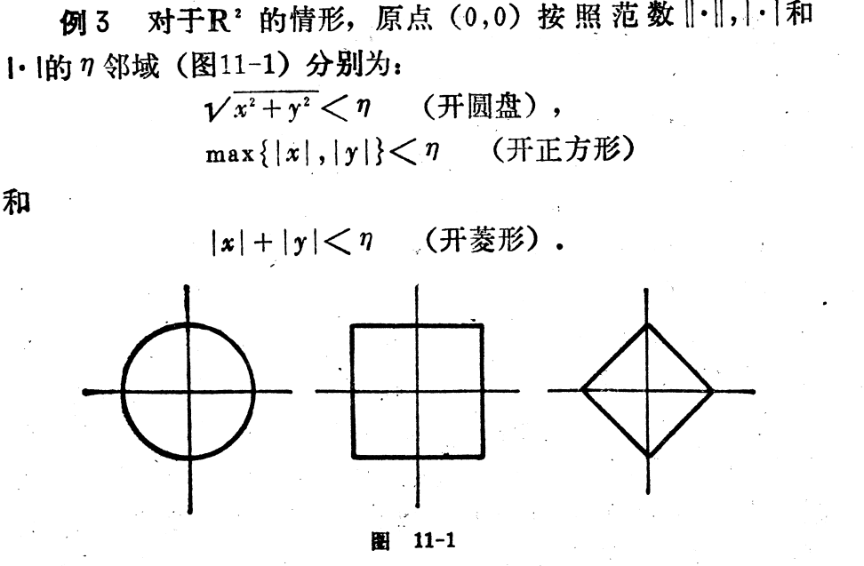

[toc]

## 多元函数的极限

对于$a \in R^m$和$\eta \in R$,把集合$\hat{U}(a,\eta)=\{x \in R^m |0 , ||x-a|| ＜\eta\}$叫做a点的去心邻域．

$D \subset R^m$,不管$\eta$取多大，$\hat{U}(a,\eta)$中都含有$D$中的点，即取多少，ａ的去心邻域
$$
\hat{U}(a,\eta) \cap D \ne \emptyset ,\forall \eta >0
$$
那么我们就说ａ是集合Ｄ的一个聚点，需要特别注意的是，聚点ａ本身可以属于Ｄ，也可以不属于Ｄ．

###　函数极限的序列上定义
$D \in R^m$,$a$是集合Ｄ的一个聚点，ｍ原函数$f(x_1,...,x_m)$在$\hat{U}(a,\eta) \cap D$上有定义，如果对于$\hat{U}(a,\eta) \cap D$中收敛于ａ的任何点列$\{x_n\}$,相应的函数值序列$\{f(x_n)\}$都收敛于同一个实数Ａ，那么就说$x$沿着集合Ｄ趋于ａ时，函数$f(x)$以Ａ为极限．记为$\lim\limits_{x\to a}f(x)=A$.

###　柯西定义
设$D \in R^m$,ａ是集合Ｄ的聚点，ｍ原函数在$\hat{U}(a,\eta) \cap D$上有定义，$A \in R$.如果对任何$\varepsilon >0,\exist \delta >0$,使得只要$x \in D ,0 < ||x-a|| < \delta$,就有$|f(x)-A| < \varepsilon$.那么就是ｘ沿着集合Ｄ趋向于ａ时，函数ｆ(x）以Ａ为极限．

仿照一元的情况，可以知道，上面两个定义是等价的．　

[**例题**]
（１）常数函数，极限等于常数本身
（２）$f(x)=f(x_1,x_2,...,x_m)=x_i$,对于$a=(a_1,a_2,...,a_m) \in R^m$, 因为$|f(x)-a_i| =|x_i -a_i| \le ||x-a||$，那么就有$\lim\limits_{x \to a}f(x) = a_i$.

［**定理－多元函数极限运算公式**］
设$D \subset R^m$,$a$是Ｄ的一个聚点，ｍ元函数ｆ和ｇ在$\hat{U}(a,\eta) \cap D$有定义，$A,B \in R$.如果$\lim\limits_{x \to a}f(x)=A,\lim\limits_{x \to a}g(x)=B$.那么就有
(1)$\lim\limits_{x \to a}[f(x) + g(x)]=A+B$
(2)$\lim\limits_{x \to a}f(x)g(x)=AB$
(3)$\lim\limits_{x \to a}\frac{f(x)}{g(x)}=\frac{A}{B}(B \ne 0)$
根据实数序列的四则混合运算规律可以很方便得到．

例３．由变元$x_1,x_2,...,x_m$与实数通过有限次加法和乘法运算得到的代数式称为ｍ元多项式，设$P(x)=P(x_1,x_2,...,x_m)，Q(x)=Q(x_1,x_2,...,x_m)$是ｍ元多项式．可以知道$\lim\limits_{x \to a}P(x)=P(a)$
$\lim\limits_{x \to a}\frac{P(x)}{Q(x)}=\frac{P(a)}{Q(a)}$(设$Q(a) \ne 0$)

#### 二元函数极限
设二元函数 $f:\mathring{U}(P_0) \to R$ ,若存在数A，对于任意 $\varepsilon >0$ ,存在 $\delta  >0 $ ,使得当 $0<d(P,P_0)<\delta$ 时
$$
\left |f(P) - A \right | =\left |f(x,y) - A \right| < \varepsilon 
$$
则称当 $P(x,y) \to P(x_0,y_0)$ 或者 $ x \to x_0,y \to y_0$ 时， $f(x,y)$ 的极限为A。或  $f(x,y)$ 收敛于A。
$$
\lim\limits_{P \to P_0}f(P)=A
\lim\limits_{x \to x_0 ,y \to y_0}f(x,y) = A
$$
二元函数 $f(x,y)$ 的极限为 $A$ 意味着: $f(x,y)$ 与 $A$ 的距离  $\| f(x,y) - A \|$ 可以达到任意小的程度，前提是点 $P(x,y)$ 与点 $P_0(x_0,y_0)$ 的距离充分小。 

二元变量趋于一个点的情况相对来说比一元函数的情况复杂很多：在直线上的 $x \to x_0$ 仅有 $x_0$ 的左侧和右侧两个方向，但是在平面上点 $P(x,y) \to P_0(x_0,y_0)$ 则有无穷多个方向，而且采取的路径也是任意的，即可以是直线，也可以是曲线。 $f(P)$ 的极限为 $A$ 说明无论从那种方向，沿那种路径，只要点 $P$ 和 $P_0$ 之间的距离充分小， $\left | f(P) - A \right |$ 都必须充分小。

[**例题**]
(0)$\lim\limits_{(x,y) \to (0,0)}f(x,y)=\lim\limits_{(x,y) \to (0,0)}\frac{x^2y^2}{x^2 + y^2}$  

极限不存在的例子:
(1)$\lim\limits_{(x,y) \to (0,0)}f(x,y)=\lim\limits_{(x,y) \to (0,0)}\frac{xy}{x^2 + y^2}$ 
解:选择点列$\{(x_n,y_n)\}$,使它沿着$y=ax$趋于(0,0),$(x_n,y_n)=(\frac{1}{n},\frac{a}{n})$
对这样选取的点列$\{(x_n,y_n)\}$而言，函数列$f(x_n,y_n)=\frac{a}{1+a^2}$.
从这个表达式可知，ａ为不同的值，函数列会收敛到不同的值，这个与函数极限的序列定义是矛盾的．故极限不存在

(2)$\lim\limits_{(x,y) \to (0,0)}f(x,y)=\lim\limits_{(x,y) \to (0,0)}\frac{x^2y}{x^4 + y^2}$

解:选择点列$\{(x_n,y_n)\}$,使它沿着$y=ax^2$趋于(0,0),$(x_n,y_n)=(\frac{1}{n},\frac{a}{n^2})$
对这样选取的点列$\{(x_n,y_n)\}$而言，函数列$f(x_n,y_n)=\frac{a}{1+a^2}$.
从这个表达式可知,ａ不同的值，函数列会收敛到不同的值，这个与函数极限的序列定义是矛盾的．故极限不存在

（３）二重极限 $\lim\limits_{x \to x_0, y \to y_0}f(x,y)$ 表达式中 $x \to x_0,y \to y_0$ 是指点 $P(x,y) \to P(x_0,y_0)$ 而不是先 $x \to x_0$ 而后 $y \to y_0$ 一般地
$$
\lim\limits_{x \to x_0,y \to y_0}f(x,y) \ne \lim\limits_{y \to y_0}(\lim\limits_{x \to x_0}f(x,y)) \ne \lim\limits_{x \to x_0}(\lim\limits_{y \to y_0}f(x,y))
$$

#### 累次极限

[**多元复合函数极限**]
设一元函数$g(u)$在实数ｂ的去心邻域$\hat{U}(b)$上有定义，并且$\lim\limits_{u \to b}g(u)=c$.又设ｍ元函数$ｆ(x)$在点ａ的某个去心邻域$\hat{U}(a)$上有定义，并且$f(\hat{U}(a) \subset \hat{u}(b))$,并且有$\lim\limits_{x \to a}g(x)=b$,那么则有$\lim\limits_{x \to a}g(f(x))=c$.
proof:
对于$\hat{U}(a)$中收敛于ａ的任意点列$\{x_n\}$,相应的函数序列$\{f(x_n)\}$满足$\{f(x_n)\} \subset \hat{U}(b),\lim\limits_{n \to \infty}f(x_n)=b$

因而有$\lim\limits_{n \to \infty}g(f(x_n))=c$

$\blacksquare$

[**函数收敛的柯西原则**]
设$D \subset R^m$,$a$是Ｄ的聚点，ｍ元函数ｆ在$\hat{U}(a,\eta) \cap D$有定义，则使得有穷极限$\lim\limits_{x \to a}f(x)$存在的充分必要条件是：$\forall \varepsilon >0,\exist \delta >0$,使得只要$x,x' \in D$满足$0<||x-a|| < \delta,0<||x'-a|| < \delta$就一定有$|f(x)-f(x')| < \varepsilon$.

前面讲过的Ｄ可以视为定义域．

## 多元函数的连续性
（１）设$D \subset R^m,a \in D$,m元函数ｆ在$U(a,\eta) \cap D$有定义，如果对于$U(a,\eta)\cap D$中收敛于ａ的任意点列$\{x_n\}$,相应的函数值序列$\{f(x_n)\}$都以$f(a)$为极限，那么我们就说$f(x)$沿集合Ｄ在点ａ处连续．

（２）设$D \subset R^m,a \in D$,m元函数f在$U(a,\eta)\cap D$有定义，如果对与任何$\varepsilon >0,\exist \delta >0$使得只要$x \in D,||x-a|| < \delta$就有$|f(x)-f(a)|< \varepsilon$

换句话说$\lim\limits_{x \to a}f(x)=f(a)$就称其为在点ａ处连续．

**值得注意的是**
上面给出的定义，并没有要求ａ是Ｄ的聚点．如果ａ属于Ｄ，但不是Ｄ的聚点，说明其是集合Ｄ的孤立点，即存在点ａ的邻域$U(a,\eta)\cap D=\{a\}$.
如果ａ是集合Ｄ的孤立点，$U(a,\eta)\cap D$中趋于ａ的点列，只可能恒等于ａ的点列$x_n=a,n=1,2,...$
对于这样的定义函数点列$\{f(x_n)\}$肯定是收敛于$f(a)$.可见在集合D的孤立点处,函数f必然是连续性的．

如果ａ属于Ｄ而又不是Ｄ的孤立点，那么它是Ｄ的聚点，对这中情形，函数ｆ沿着集合Ｄ在点ａ处的连续的定义，等价与$\lim\limits_{x \to a}f(x)=f(a)$

[**集合连续（区间连续）**]设$D \subset R^m$，ｍ元函数ｆ在集合Ｄ中有定义，如果对于任何一点$a \in D$,函数ｆ沿着集合Ｄ在ａ点处连续，那么我们就说函数ｆ在集合Ｄ处连续．

［**例题**］m元多项式函数P(x)在任意点$a \in R^m$连续，ｍ元有理分式函数$\frac{P(x)}{Q(x)}$也在任何使得$Q(a) \ne 0$的点ａ处连续．

１．考察二元函数
　$f(x,y)=\begin{cases}\frac{x^2y^2}{x^2 + y^2} ,(x,y) \ne (0,0)
\cr 0,(x,y) =(0,0)
\end{cases}$
函数在$R^2$上都是连续的

2．考察二元函数
　$f(x,y)=\begin{cases}\frac{xy}{x^2 + y^2} ,(x,y) \ne (0,0)
\cr 0,(x,y) =(0,0)
\end{cases}$
这个函数在点(0,0)点不连续

［**连续性四则混合运算定理**］设$D \subset R^m,a \in D$,m元函数f(x)和g(x)在$U(a,\eta) \cap D$上有定义，$\lambda \in R$.如果函数$f(x)$和$g(x)$沿集合Ｄ在点ａ处是连序的，那么函数$f(x)+ g(x)$,$\lambda f(x)$和$f(x)g(x)$都沿着集合Ｄ在点ａ处连续．并且当$g(a) \ne 0$时，函数$\frac{f(x)}{g(x)}$也沿集合Ｄ在点ａ处连续．

［**复合函数的连续性**］
设$D \subset R^m,a \in D$，ｍ元函数ｆ在$U(a,\eta)\cap D$有定义，一元函数$g$在$b=f(a)$邻近有定义，如果函数ｆ沿集合Ｄ在点ａ处连续，函数ｇ在ｂ处连续，那么符合函数$g(f(x))$也沿集合在点ａ处连续．
proof:

$\blacksquare$

［**例题**］１．二元函数$f(x,y)=sinxy$在$R^2$的每一点都连续．
２．二元函数$f(x,y)=\frac{e^{xy}}{x^2 + y^2}$在$R^2 \setminus \{(0,0)\}$的每一点连续．

##　有界闭集上连续函数的性质

在$R$中的闭区间$[a,b]$即是$R$的有界集，又是R中的闭集．我们知道，在闭区间$[a,b]$上连续的函数ｆ具有很好的性质，它在这个区间上是有界的，并且可以取得到最大值和最小值，它是一致连续的等等．

对于多元函数$f(x)$在$R^m$的有界闭集$E$上也有类似的性质．

［**连续性函数有界闭集有界定理**］设$E \subset R^m$是$R^m$中的有界闭集，函数ｆ在$E$上连续，则f(x)在Ｅ上是有界的．
proof:
假设函数f(x)在Ｅ上是无界的，那么对于任意的$n \in N_+$都存在$x_n \in Ｅ$使得$|f(x_n)| > n$.
因为Ｅ是有界集，那么点列$\{x_n\} \subset E$也是有界列，有布尔查诺定理可以知道，存在$\{x_n\}$的收敛点列$\{x_{n_k}\}$.设$x_{n_k} \to x_0$.因为Ｅ是闭集，那么必然有$x_0 \in E$.又因为函数ｆ在点$x_0 \in E$处是连续的，那意味着$\lim\limits_{k \to \infty}f(x_{n_k})=f(x_0)$

前面的分析告诉我们$|f(x_{n_k})| > n_k,\lim\limits_{n \to \infty}|f(x_{n_k})| = +\infty$　这便是矛盾的．可见$f(x)$在Ｅ上肯定是有界的．

$\blacksquare$

［**连续性函数在有界闭集上可达到上下确界定理**］
设$E \subset R^m$，Ｅ是$R^m$中的有界闭集，函数ｆ在Ｅ上是连续的，则ｆ在E中的某点取得它在Ｅ上的最大值，并且在Ｅ中的某点取得它的最小值，即$M=\sup_{x \in E}f(x),m=\inf_{x \in E}f(x),\exists x_1,f(x_1)=M,\exists x_2,f(x_2)=m$.

proof:
根据上确界的定义，可以知道$\forall n \in N_+$,必然存在$x \in E$使得$M-\frac{1}{n} < f(x) \le M$.
那么便可以构建一个点列$\{x_n\}$满足$M-\frac{1}{n} < f(x_n) \le M$.
因为$\{x_n\} \subset E$是有界的，它当然存在收敛的子列$\{x_{n_k}\}$设$x_{n_k} \to x_1$,则$x_1 \in E$因为Ｅ是一个闭集．
有因为函数是连续的，必然有$\lim\limits_{k \to \infty}f(x_{n_k}) = f(x_1)$
前前面的点列的构建可以知道必然有$M-\frac{1}{n_k} < f(x_{n_k} \le M$
很显然有$\lim\limits_{k \to \infty}f(x_{n_k})=M$即$f(x_1)=M$.
同理可以证明存在$x_2 \in E,f(x_2)=\inf_{x \in E}f(x)$.

$\blacksquare$

[**值域的紧致性和列紧性**]
设$E \subset R^m,f:E \to R$,且ｆ在E上连续，如果Ｅ是紧致集，那么其值域f(E)也是紧致集．
proof:

不妨记值域$f(E)$集合$D=\{f(x) | x \in E\}$.

E是紧致，当然其也是列紧的．在$f(E)$中任取一点列$\{y_n\}$,则必然存在一个点列$\{x_n\} \subset E$并且有$f(x_n) =y_n$.由于E是列紧的，那么点列$\{x_{n}\}$有收敛的子列$\{x_{n_k}\}$,不妨设$x_{n_k} \to x_0 \in E$.

因为$f(x)$在$x_0$处是连续的，那么$\lim\limits_{k \to \infty}f(x_{n_k})=f(x_0) $那么对于$\{y_n\}$的子列$\{y_{n_k}\}$子列便是收敛的,其中$y_{n_k}=f(x_{n_k})$．从而有$\lim\limits_{k \to \infty}y_{n_k}=\lim\limits_{k \to \infty}f(x_{n_k})=f(x_0) \in D$

可见集合Ｄ是列紧，因而也是紧致的．

$\blacksquare$

［**推论**］连续函数将有界闭集映射称有界闭集．
因为紧致集就是有界闭集，因此上面的定理可以断言连续函数一定把有界闭集映射称有界闭集

几个问题？
１．连续函数是否将有界集映射称有界集？把闭集映射称闭集？
有界集$(0,1)$对于连续函数$f(x)=1/x$此时其值域为$(1,\infty)$缺是一个无界集．可见连续函数无法保证将有界集映成有界集．

对于闭集$[1,\infty)$，函数$f(x)=1/x$在上面是连续的，但是其值域是(0,1],而(0,1]既不是开集，也不是闭集．

２．连续函数也未必将开集映称开集？
答案也是否定的，函数$f(x)=x^2$在开集$(-1,1)$上函数显然是连续的，但是其值域为$[0,1)$却不是开集，也不是闭集．

［**一致连续定义**］
设$E \subset R^m$，函数ｆ在Ｅ上有定义，如果对任何$\varepsilon >0$存在$\delta >0$,使得只要$x,x' \in E,||x-x'||< \delta$就有$|f(x)-f(x')| < \varepsilon$那么我们就是函数ｆ在集合Ｅ上一致连续．

[**有界闭区间上连续函数的一致连续性定理**]
设$E \subset R^m$中的有界闭集，函数ｆ在Ｅ上连续，那么ｆ在Ｅ上一致连续．
proof:
用反证法，不妨假设ｆ在Ｅ上不是一致连续的．那么意味着,存在某个$\varepsilon_0 > 0$,不论$\delta$取多少，必然存在$x,x' \in E,||x-x''||< \delta$都有$|f(x)-f(x')| \ge \varepsilon_0$.
如果取$\delta_n =\frac{1}{n}$不论$\delta_n$多小，依然存在$x_n,x_n' \in E,||x_n -x_n'|| < \delta_n,||f(x')-f(x)|| \ge \varepsilon_0$.

因为$\{x_n \} \subset E$是有界序列，它具有收敛的子列$\{x_{n_k}\}$,不妨设$x_{n_k} \to x_0$.很显然因为Ｅ是闭集，那么$x_0 \in E$.
又因为$||x_{n_k}'-x_0|| \le |x_{n_k}'-x_{n_k}|| + ||x_{n_k}-x_0|| \le \frac{1}{n_k} + |x_{n_k}-x_0||$
可见当$k \to \infty \Rightarrow x_{n_k}' \to x_0$.
又因为函数在$x_0$处是连续的，所以$\lim\limits_{k \to \infty}f(x_{n_k})=\lim\limits_{k \to \infty}f(x_{n_k}')=f(x_0)$.
这一意味着，当$k$充分大的时候会有$|f(x_{n_k})-f(x_0)| < \varepsilon_0/2,|f(x_{n_k}')-f(x_0)| < \varepsilon_0/2$那么此时$|f(x_{n_k})-f(x_{n_k}')| < \varepsilon_0$

这个很显然与$\forall k \in N_+$都有$|f(x_{n_k}) - f(x_{n_k}')| \ge \varepsilon_0 >0$矛盾，因为这个要导出$\lim\limits_{k \to \infty}|f(x_{n_k}) - f(x_{n_k}')| \ge \varepsilon_0$.

这个矛盾说明ｆ在Ｅ上必须是一致连续的．

$\blacksquare$

[**定理**]
设函数ｆ在$R^n$上连续，并且极限$\lim\limits_{x \to \infty}f(x)$存在且有限，那么ｆ在$R^n$上一致连续．

proof:
$\lim\limits_{x \to \infty}f(x)=A ,|A| < +\infty$,考察某一个特定的$\varepsilon >0$,利用函数柯西收敛原理有$\exists r >0 ,||x_1|| > r,||x_2|| > r,|f(x_1) - f(x_2)| < \varepsilon$

构建一个闭球$\overline{B}_{r+1}(0)$有前面的定理，它是一个有界闭集，也是列紧集，由此可知$\overline{B}_{r+1}(0)$上是一致连续的．从而对于$\varepsilon >0,\exists \delta >0 ,x_1,x_2 \in \overline{B}_{r+1}(0),||x_1-x_2|| < \delta$,可以有$|f(x_1) -f(x_2)| < \varepsilon$.

那么很显然，如果$||x_1|| > r,||x_2||>r,||x_1-x_2||< \delta $也会有$|f(x_1)-f(x_2)| < \varepsilon$.

不妨取$\delta'=\min\{\delta,1\}$,那么
$x_1,x_2 \in \overline{B}_{r+1}(0),||x_1-x_2|| < \delta' < \delta$必然有$|f(x_1) -f(x_2)| < \varepsilon$.

如果$||x_1|| > r,||x_2||>r,||x_1-x_2||< \delta' $也会有$|f(x_1)-f(x_2)| < \varepsilon$.

当$x_1 \in \overline{B}_{r}(0)时$，如果$||x_1 -x_2|| < \delta'$那么必然有$||x_2|| \le ||x_1 || +\delta' < r+ 1$可见$x_2 \in \overline{B}_{r+1}(0),x_1 \in \overline{B}_{r+1}(0)$.从前面的证明已经知道此时必然有$|f(x_1) -f(x_2)| < \varepsilon$.
 
如果$r < ||x_1 || \le r+1$,有$||x_1||> r$,如果满足$||x_1 -x_2 || < \delta'$.那么此时就有两种可能，一种是$x_2 \in \overline{B}_{r}(0)$那么此时就有$x_2 \in \overline{B}_{r+1}(0),x_1 \in \overline{B}_{r+1}(0)$.这个时候如果满足$||x_1-x_2|| < \delta'$也有$|f(x_1) -f(x_2)| < \varepsilon$.

另一种情况是$||x_2|| > r$,此时就有$||x_1|| > r,||x_2||> r$.从前面的证明可知，这个时候如果满足$||x_1-x_2|| < \delta'$也有$|f(x_1) -f(x_2)| < \varepsilon$.

如果$|x_1| \ge r+1 $，如果满足$||x_2 -x_1 ||< \delta'$,必然有$||x_2|| > r$同理也有上面的结论．

对于这个特定的$\varepsilon >0$，存在$\delta'=\min\{\delta,1\}$必然有$x_1,x_2 \in R^n,||x_1 - x_2 ||< \delta',|f(x_1) -f(x_2)|< \varepsilon$.

由$\varepsilon >0$ 的任意性，可知这是符合一致连续的定义的．

$\blacksquare$

#### 代数基本定理

## 连通性
介值性质-取得介于它的任意两个值中间的一切值.
实际上函数f在D上连续,能保证f具有介值性质的,并不是D的紧致性,而是D的另外一种性质-联通性,必须要求D是 连成一片 ,才能保证介值定理.

例
(1)开区间$J=(a,b)$是 连成一片 的,对于J上的连续函数,介质定理也成立.

(2)考察R中的有界闭集$E = [-2,-1]\cup[1,2]$和定义在上的函数
$f(x)=\begin{cases}-1,x \in [-2,-1]
\cr 1 ,x \in [1,2]
\end{cases}$
容易看出:f在E上是连续的,但是确不具有介值性质.

要说明一个集合是否连成一片,这里主要说最简单的一种$路径联通$.

[**引理**]
设$T \subset R,E \subset R^m$则T和E都可以看成距离空间,因而可以讨论映射$\varphi:T \to E$的连续性.
因为$\max_{1 \le i \le m}|\varphi_i(t) - \varphi_i(t_0)|| \le ||\varphi(t) - \varphi(t_0)|| \le \sum_{i=1}^{m}|\varphi_i(t)-\varphi_i(t_0)|$
所以映射$\varphi(t)=(\varphi_1(t),\varphi_2(t),...,\varphi_m(t))$在$t_0$处连续的充分必要条件是:它的各分量$\varphi_i(t)$都在$t_0$处连续.

[定义]
设$E \subset R^m,x_0,x_1 \in E$,并设$$\varphi:[0,1] \to E$$是一个连续映射,满足条件$$\varphi(0)=x_0,\varphi(1)=x_1$$,则称$\varphi$为E中联结$x_0,x_1$的一条路径.($\varphi(t) \in E,\forall t \in [0,1]$)

$路径$的直观几何形象就是联结给定两点的一条连续曲线.

[**路径连通**]
设$E \subset R^m$.如果对于任意的$x_0,x_1 \in E$,都至少存在$E$中联结这个两点的一条路径,那么我们就说E是路径联通的.

空间$\emptyset$也是被认为是路径联通的.

[**定理**]
设$E \subset R^m$中的路径连通子集,函数f在E上连续,则f具有介值性质.
proof:
设$A_0,A_1$是$f(E)$中的任意两点,不妨设
$$x_0 \in E,f(x_0)=A_0,x_1 \in E,f(x_1) = A_1$$.
由于集合E的路径联通性,存在一条连续曲线,存在连续映射$\varphi:[0,1] \to E$并且$$\varphi(0)=x_0,\varphi(1)=x_1$$
考察复合映射$\psi=f(\varphi(t)) ,t \in [0,1]$那么这是一个在$[0,1]$上连续的函数,并且$$\psi(0)=A_0,\psi(1)=A_1$$.

于是$\psi$取得介于$A_0$和$A_1$之间的任何值,因此,函数f在点集$$\varphi([0,1]) = \{\varphi(t) | t \in [0,1]\}$$
之上可以取得介于$A_0$和$A_1$上的任何值.
$\blacksquare$

[**定义**]
我们把$R^m$中的**连通**开集D称为开区域,并把**连通**开集D的闭包$\overline{D}$称为闭区域.(这里的连通指的是路径连通)

[**定理**]
在开区域或闭区域上连续的函数具有介值性质.
proof:
从前面的定理已经知道,在开区域上连续的函数具有介值性质.

下面来考察闭区域上连续函数的介值性质.

设$D \subset R^m$是一个开区域,函数f在闭区域$\overline{D}$上连续.$A_0,A_1$是f在$\overline{D}$上的两个值.不妨记
$$x_0 \in \overline{D},f(x_0)=A_0,x_1 \in \overline{D},f(x_1) = A_1$$.
假设$\forall C \in (A_0,A_1)$,如果$x_0,x_1 \in D$那么显然f在D中某点取得值C.

我们来考虑$x_0$和$x_1$之一不在D中的情形,例如$x_0 \in \partial E,x_1 \in D$.
因为f在闭区域$\overline{D}$上的连续性.因为$\lim\limits_{x \to x_0}f(x)=f(x_0)=A_0$.

不妨取$\varepsilon = C-A_0 >0$,必然存在$\delta$,对于所有满足$x \in D,||x-x_0|| < \delta$,都有$|f(x) - f(x_0)| < \varepsilon \Rightarrow f(x) < \varepsilon + f(x_0) = C$这里需要注意的是,这样的点是存在的,因为$x_0 \in \partial E$.从而必然有$x_0' \in D,f(x_0') = A_0' < C$.
那我们就能看到$x_0' \in D,x_1 \in D$使得
$f(x_0')=A_0' < C < A_1 =f(x_1)$.
有此可知函数f在D中某点必能取到值C.

对于$x_0$和 $x_1$两点都在边界上的情形也是一样的.
$\blacksquare$

## 等价范数
前面讨论的范数的定义,实际上是有欧式空空间的内积定义的长度而来的.
所以一般又叫欧几里得范数.

在本节中,我们来推广范数的概念.

[**定义**]设N是定以于$R^m$上的一个函数,它满足一下条件
(1) $N(x) \ge 0 ,\forall x \in R^m$并且$N(x)=0 \Leftrightarrow x=0$.
(2) $N(\lambda x) = |\lambda|  N(x),\forall x \in R^m ,\lambda \in R$.
(3)$N(x + y) \le N(x) +N(y)$
则我们把这这样的N叫做$R^m$上的一个范数.

容易验证的是
$$N_0(x)=\max\{|x_1|,|x_2|,...,|x_m|\} \\
N_1(x)=|x_1| + |x_2| + ...|x_m| \\
N_2(x)=\sqrt{x_1^2 + x_2^2 + ...+ x_m^2}$$

都是符合范数的定义的.
有些文献里面分表叫
$$||x||_{\infty}=\max\{|x_1|,|x_2|,...,|x_m|\} \\
||x||_1=|x_1| + |x_2| + ...|x_m| \\
||x||_2=\sqrt{x_1^2 + x_2^2 + ...+ x_m^2}$$

设N是$R^m$上的一个范数,则N在$R^m$决定了一个距离$d_N(x,y)=N(x-y),\forall x,y \in R^m$.

显然按照这个距离又可以定义$R^m$点列的收敛性和m元函数的连续性.
这样定义的收敛性和连续性称为按照范数N(或者说按照距离$d_N$)收敛性和连续性
值得庆幸的是,对于$R^m$来说,用任何一种范数决定的收敛以及函数的连续性,都是完全一样的,为了说明这一个点,先要介绍等价范数的概念.

[**范数等价**]设$M,N$都是$R^m$上的范数,如果存在正实数$a,A \in R$使得
$$a*M(x) \le N(x) \le A*M(x),\forall x \in R^m$$
那么我们就是范数$N$和$M$是等价的.

等价在数学里面是有具体定义的,即要满足自身性,对称性和传递性的关系.

下面说明一下,范数的等价是一种具备反身性,对称性,传递性的关系:
(1)显然有$M(x) \le M(x) \le M(x)$,因而范数$M$与$M$是等价的(反身性).
(2)如果范数$N$和$M$是等价范数,既有
$a*M(x) \le N(x) \le A*M(x),\forall x \in R^m$
那么显然是有$\frac{1}{A}*N(x)\le M(x) \le \frac{1}{a}*N(x)$
即范数M与范数N也是等价的.这个说明范数的等价关系具有对称性.
(3)如果范数$N$和$M$等价,范数$P$和范数$N$等价,即
$$a*M(x) \le N(x) \le A*M(x),\forall x\in R^m \\
b*N(x) \le P(x) \le B*N(x),\forall x \in R^m$$
那么必然有$ba*M(x)\le P(x) \le BA*M(x),\forall x \in R^m$.这个说明范数的等价具有传递性.

[**例题**]对于欧式空间的常见三种范数
$$||x||_{\infty}=\max\{|x_1|,|x_2|,...,|x_m|\} \\
||x||_1=|x_1| + |x_2| + ...|x_m| \\
||x||_2=\sqrt{x_1^2 + x_2^2 + ...+ x_m^2}$$
给出其相应的等价性.则有
$$ \frac{||x||_1}{m}\le ||x||_{\infty} \le ||x||_2 \le ||x||_1 \le m * ||x||_{\infty} $$
proof:
(0)
$
||x||_2 =\sqrt{x_1^2 + x_2^2 + ...+ x_m^2} \ge \max\{|x_1|,|x_2|,...,|x_m|\}
$
从而有$||x||_2 \ge ||x||_{\infty}$
(1)
$||x||_2 =||x_1*e_1 + x_2*e_2 + ...x_m*e_m||_2 \le \sum_{i=1}^{m}|x_i|*||e_i||=\sum_{i=1}^{m}|x_i|$从而有$||x||_2 \le ||x||_1$.

(2)
$$|x_1| \le \max\{|x_1|,|x_2|,...,|x_m|\} \\
|x_2| \le \max\{|x_1|,|x_2|,...,|x_m|\} \\
... \\
|x_m| \le \max\{|x_1|,|x_2|,...,|x_m|\}
$$
相加并有$||x||_1 \le m||x||_\infty,\frac{||x||_1}{m} \le ||x||_\infty$

总结,以$||x||_2$作为基础,可知有
$||x||_{\infty} \le ||x||_2 \le m*||x||_{\infty}$

$\frac{1}{m}*||x||_1 \le ||x||_2 \le ||x||_1$

$\blacksquare$

设N是$R^m$上的范数,$a \in R^m$,我们把集合
$U_{N}(a,\eta)=\{x \in R^m |N(x-a) < \eta\}$叫做点$a$的$N-\eta$的邻域.

设N是$R^m$上的范数,$a \in R^m$,我们把集合
$\hat{U}_{N}(a,\eta)=\{x \in R^m |0< N(x-a) < \eta\}$叫做点$a$的$N-\eta$的去心邻域.

[**定理1**]
按照等价范数N和M决定的收敛性(连续性)完全一样的.
proof:
假如$a*M(x) \le N(x) \le A*M(x),\forall x \in R^m$
如果$\{x_n\}$是$R^m$中的点列,它按照范数M收敛与$x_0$.即$\lim\limits_{n \to \infty}M(x_n-x_0)=0$.

因为$N(x-x_0) \le A*M(x-x_0)$

根据$\lim\limits_{n \to \infty}M(x_n-x_0) =0 $.说明$\forall \varepsilon >0 ,\exists N_1,n> n_1,M(x_n -x_0) < \frac{\varepsilon}{A}$.
那么此时$n >N_1$有$N(x_n-x_0) \le A*M(x_n -x_0) < \varepsilon$.
根据$\varepsilon$ 的任意性,可以知道$\lim\limits_{n \to \infty}N(x_n-x_0) = 0$
可见点列$\{x_n\}$按照范数$N$也收敛于$x_0$.

根据范数等价关系的对称性可以知道,N和M的地位可以互相交换.因此这两种范数定义的收敛性是一样的.

函数在一点的连续性,可以通过序列方式来定义,既然按照两种范数定义的点列的收敛性是一致的,那么按两种范数定义的函数的连续性也必定是完全一样的.

$\blacksquare$

[**引理1**]欧式空间上的任意范数$N(x)$都必然存在正实数$C$满足
$$N(x-y) \le C||x-y||_2,\forall x,y \in R^m$$
proof:
很显然$x=(x_1,x_2,...,x_m)=\sum_{i=1}^{m}x_ie_i$
$y=(y_1,y_2,...,y_m)=\sum_{i=1}^{m}y_ie_i$

$$
N(x-y)=N[\sum_{i=1}^{m}(x_i -y_i)*e_i] \le \\
\sum_{i=1}^{m}N((x_i - y_i)*e_i) = \\
\sum_{i=1}^{m}(|x_i - y_i|*N(e_i))
$$
因为柯西不等式是欧式空间的产物,根据柯西不等式有
$$N(x-y) \le \sum_{i=1}^{m}(|x_i - y_i|*N(e_i)) \le \\
\sqrt{(x_1 -y_1)^2 +(x_2 -y_2)^2  + ...+ (x_m -y_m)^2 } * \sqrt{\sum_{i=1}^{m}N(e_i)^2} = \\
||x-y||_2 * \sqrt{\sum_{i=1}^{m}N(e_i)^2}$$

只需要取$C = \sqrt{\sum_{i=1}^{m}N(e_i)^2}$便有$N(x-y) \le C||x-y||_2$.

$\blacksquare$

[**引理2**]考察集合$E \subset R^m$,定义函数$f(x),\forall x \in E$,如果函数满足$|f(x) - f(y)| \le C ||x-y||_2,\forall x,y \in E$.那么函数$f(x)$在集合E上按照范数$||.||_2$定义的距离下是连续的.

proof:
如果$x_0$是孤立点，根据连续性的定义，可知函数在点上是连续的．

如果$x_0 \in E$而$x_0$是凝聚点．

只需要证明$\forall x_0 \in E,\lim\limits_{x \to x_0}f(x)=f(x_0)$那么$f(x)$在点$x_0$上是连续的.
只需要证明$\varepsilon >0,\exists \delta >0,x \in E,||x-x_0|| < \delta$时有$|f(x) -f(x_0)| < \varepsilon$.

因为$x_0$是凝聚点，可以知道$U(x_0,\delta) \cap E \ne \emptyset,\forall \delta  >0$

考察$\forall \varepsilon >0$

$$
|f(x) -f(x_0) | \le C||x-x_0||_2
$$

需要$|f(x)-f(x_0)| < \varepsilon$只需要$||x-x_0||_2 < \frac{\varepsilon}{C}$.
因为必要函数在$x_0$的邻域处是有定义的,那么只需要取$\delta=\frac{\varepsilon}{C}$

那么当$||x-x_0||_2 < \delta$时,必有$|f(x)-f(x_0)| \le C||x-x_0||_2 < C*\delta < \varepsilon$.

可见函数在$f(x)$在$x_0$处是连续的.

实际上凝聚点就更加广泛，它可以是内点，也可以是边界点．

$\blacksquare$

[**定理2**]欧式空间$R^m$中任意两个范数都互相等价.

proof:
只需要证明$R^m$的任何范数N都和欧式范数$||.||_2$是等价的.
通过引理1我们知道范数$N(x)$满足$\forall x,x_0 \in R^m$有
$N(x-x_0) \le C||x-x_0||_2$
根据范数的三角不等式,很显然有$|N(x) -N(x_0)| \le N(x-x_0) \le C||x-x_0||_2,\forall x,x_0 \in R^m$.
由引理2,可知范数$N(x)$在 $||.||_2$定义距离下是连续的.

实际上我们以前做的讨论都是在欧式空间里用$||.||_2$定义距离下讨论的.

给定集合$K=\{y \in R^m | \quad ||y||_2=1\}$它显然是$R^m$中的有界闭集.

根据连续函数在有界闭集上的性质,可以知道$0 <b \le N(y) \le B,\forall y \in K$.这里$b >0$是根据范数的恒大于等于o的性质获得的,因为$y \ne 0$,故在K集上其值恒大于0.

$\forall x \in R^m, x \ne 0$,必然有$\frac{x}{||x||_2} \in K$.因为
$$
b \le N(\frac{x}{||x||_2}) \le B
$$
从而有
$$
b*||x||_2 \le N(x) \le B*||x||_2
$$
上面的不等式,关于$x=0$显然也是成立的.也就是说对于任何$x \in R^m$都有$b||x||_2 \le N(x) \le B*||x||_2$
这个就证明了范数N与欧式范数的等价性.

$\blacksquare$

由于范数的等价性,无论用那一种形状的邻域来描述收敛性与连续性,效果都是一样的.
当我们研究$R^m$或者$R^m$上的集合的时候,实际上都是在欧式空间范畴进行研究.也就是说必然是向量空间,也定义了内积运算,而距离一般来说都用内积导出,前面也证实了其他范数与欧式范数的等价性.

##　距离空间上的一般概念

根据前面的很多讨论,我们知道,极限和连续性这些概念,实际上只和空间的距离结构有关.

[**直积**]
设$E,F$是两个非空集合,我们把有序对$(x,y),x\in E,y \in F$组成的集合
$$
\{(x,y) | x\in E,y\in F\}
$$
称为集合E,集合F的直积(笛卡尔积),记作$E \times F$.
$$
E\times F=\{(x,y) | x\in E,y\in F\}
$$
.特别的是$E\times E$是由E的元素对组成的集合
$E\times E=\{(x,y),x\in E,y\in E\}$

[**距离空间定义**]
设$X$是一个非空的集合$d:X \times X \to R$是一个映射,它满足以下条件
(1)$d(x,y) \ge 0,\forall x,y \in X$;并且$d(x,y)=0 \Leftrightarrow x=y$
(2)$d(x,y)=d(y,x),\forall x,y \in X$.
(3)$d(x,z) \le d(x,y) + d(y,z),\forall x,y,z \in X$
则称d为X上的一个距离,称$(X,d)$为距离空间,一般也可以说了定义了这样距离的集合X是一个距离空间.
有了距离定义,就可以对集合X中任意两个元素x和y定义一个确定的距离d(x,y).

［**利用距离定义邻域**]
在距离空间$(X,d)$中,我们把点集$U_d(a,\eta)=\{x \in X | d(x,a) < \eta\}$称为点a的$\eta$邻域.并且把点集$\hat{U}_d(a,\eta)=\{x \in X | 0 < d(x,a) < \eta\}$称为a的去心$\eta$邻域.为简单起见,可以去掉下标d.

[**利用距离定义收敛**]
设$(X,d)$是一个距离空间,$\{x_n\}$是X中的一个点列,$a \in X$.如果对任何$\varepsilon >0$,$\exists N$,使得只要$n>Ｎ$就有$d(x_n ,a) < \varepsilon$那么此时我们就说点列$\{x_n\}$收敛于ａ，或者说$\{x_n\}$以ａ为极限．

同理利用距离空间的性质，可以证明任何点列的收敛极限是唯一的．

［**利用距离定义聚点**］
设$(X,d)$是距离空间，$\Omega \subset X,a \in X$.如果
$$\hat{U}(a,\eta) \cap \Omega \ne \emptyset,\forall \eta >0$$
那我们就说ａ是集合$\Omega$的一个聚点．

同样的，我们可以得到ａ是集合$\Omega$的聚点的充分必要条件是存在点列$\{x_n\} \subset \Omega\setminus\{a\}$,使得$\lim\limits_{n \to \infty}x_n=a$.

[**利用距离空间定义函数极限**]
设$(X,d)$和$(X',d')$都是距离空间，$\Omega \subset X$,
$$f:\Omega \to X'$$
是一个映射，$a \in X,A \in X'$．如果对于任何$\Omega \setminus \{a\}$中收敛于ａ的任何点列$\{x_n\}$，相应的函数列$\{f(x_n)\}$都是以Ａ为极限，那么我们就说当ｘ沿集合$\Omega$趋于ａ时，映射$f(x)$以Ａ为极限，记为$\lim\limits_{x \to a}f(x)=A$.

同样有定义:设$(X,d)$和$(X',d')$都是距离空间,$\Omega \subset X$,$f:\Omega \to X'$是一个映射,$a \in \Omega$,如果$\forall \varepsilon >0,\exists \delta >0$,使得只要$x \in \Omega,0< d(x,a) < \delta$就有$d'(f(x),A) < \varepsilon$,那么我们就说：当ｘ沿集合$\Omega$趋于ａ时，映射$f(x)$以Ａ为极限．

实际上讲极限的时候都要满足一个条件，必然存在一个邻域$\hat{U}(a,\eta)$,满足$\hat{U}(a,\eta) \cap \Omega $上是有定义的．

[**利用距离空间定义连续映射**]
设$(X,d)$和$(X',d')$都是距离空间,$\Omega \subset X$,$f:\Omega \to X'$是一个映射,$a \in \Omega$.如果对于$\Omega$中收敛于$a$任何点列$\{x_n\}$,那么相应的点列$\{f(x_n)\}$都是以$f(x)$为极限,那么我们就说映射f在点a处连续,如果映射f在$\Omega$的每一个点都连续,那么就说映射f在$\Omega$上连续.

同理还有一种表述:
设$(X,d)$和$(X',d')$都是距离空间,$\Omega \subset X$,$f:\Omega \to X'$是一个映射,$a \in \Omega$,如果对任何$\varepsilon >0$,存在$\delta >0$,使得只要$x \in \Omega,d(x,a) <\delta$就有$d'(f(x),f(a)) <\varepsilon$,那么我们就说映射f在点a处是连续的.

[**利用距离空间定义复合映射的连续性**]
设$(X_1,d_1),(X_2,d_2),(X_3,d_3)$都是距离空间,$G \subset X_1,H \subset X_2$.如果定义映射$f:G \to X_2,g:H \to X_3$都是连续映射,并且$f(G) \subset H$,那么复合映射$g \circ f:G \to X_3$
也是连续映射.
proof:
设$a$是G中的任意一点,$\{x_n\}$是G中收敛于a的任意点列,根据f的连续性,可以知道$\{f(x_n)\}$是H中收敛于点$f(a)$的点列,于是点列$\{g(f(x_n))\}$应收敛于$g(f(a))$,这个证明了复合映射$g\circ f$在点a处的连续性.

$\blacksquare$

[**距离的等价性**]设$X$是一个非空集合,$d_1,d_2$都是$X$ 上的距离,如果存在正实数,使得$a*d_1(x,y) \le d_2(x,y)\le A*d_1(x,y),\forall x,y \in X$
那么我们就说距离$d_2$与距离$d_1$是等价的.

[**例题**]
1.设$X$是$R^m$的一个子集,$N_1,N_2$是$R^m$的范数,则$N_1,N_2$在$X$上诱导的距离$d_1,d_2$,这里$d_1(x,y) =N_1(x,y),d_2=N_2(x,y)$.

2.设$X=\{(x_1,x_2) \in R^2 | x_1^2 + x_2^2=1\}$我们用$u,v \in X$,并且用记号$d_1(u,v)$表示两点之间的直线距离即$d_1(u,v)=\sqrt{(u_1-v_1)^2 + (u_2-v_2)^2}$有用记号$d_2(x,y)$表示这两点间较短的一段圆狐的长度.证明这两种距离在集合X是等价的.

实际上可以将欧式空间定义为具备内积的向量空间,它上面的距离可以有内积诱导,也可以用其他方式进行定义.

距离空间不一样非要是向量空间,如同欧式空间一样,距离空间,利用距离的定义依然是可以导出一些拓扑的概念的.

[**在距离空间定义基本列**]
设$(X,d)$是距离空间,$\{x_n\}$上X上的一个点列,如果对任何$\varepsilon >0$,存在$N \in N_+$,使得只要$n > N,\forall p \in N_+$就有$d(x_{n+p},x_n) < \varepsilon$
那么我们就说$\{x_n\}$是$(X,d)$中的一个基本序列.

[**定理**]$(X,d)$中的收敛序列都是柯西序列.

[**距离空间的完备性**]
设$(x,d)$是距离空间,如果$(X,d)$中的任何基本序列(柯西列)都是收敛序列,并且其收敛点属于$X$,那么我们就是距离空间$(X,d)$是完备的距离空间.

例3.在$R^m$中用任何一种范数$N$来定义距离$d(x,y)=N(x-y)$这样得到的距离空间$(R^m,d)$都是完备的.

例4.设$X$是$R^m$的**非空闭子集**,用$R^m$的任何一种范数N在$X$上定义距离$d(x,y)=N(x-y),\forall x,y \in X$.
这样得到的距离空间$(X,d)$也是完备的.

[**压缩映射**]  
设$(X,d)$是距离空间,$\varphi:X \to X$是一个映射,如果存在$\alpha \in [0,1)$使得$d(\varphi(x),\varphi(y)) \le \alpha d(x,y),\forall x,y \in X$.那我们就说$\varphi$是
一个压缩映射.

显然压缩映射肯定是一个连续映射.

[**映射的不动点**]
设$X$是一个集合,$\varphi:X \to X$是一个映射,如果$\xi \in X$使得$\varphi(\xi)=\xi$,那么我们就说$\xi$是映射$\varphi$的一个不动点.

[**不动点原理/Banach不动点原理**]
完备距离空间$(X,d)$的压缩映射$\varphi:X \to X$,必定有唯一的不动点.
proof:
先证明不动点的存在性.任取$x_0 \in X$,给定一个压缩映射
$\varphi:X \to X$,存在$\alpha \in [0,1)$使得$d(\varphi(x),\varphi(y)) \le \alpha d(x,y),\forall x,y \in X$.
用映射构造一个迭代序列$x_{n+1}=\varphi(x_n),n=0,1,...$

以为是压缩映射,那么必然有$d(x_{n+1},x_{n})=d(\varphi(x_n),\varphi(x_{n-1})) \le \alpha d(x_{n},x_{n-1})$

依次类推有
$d(x_{n+1},x_{n}) \le \alpha d(x_{n},x_{n-1}) \le \\
\alpha^2d(x_{n-1},x_{n-2}) \\
.... \\
\le \alpha^{n}d(x_1,x_0)
$
利用三角不等式,可以知道
那么$d(x_{n+p},x_{n}) \le d(x_{n+p},x_{n+p-1}) + d(x_{n+p-1},x_{n+p-2}) + ...+ d(x_{n+1},x_{n})\le (\alpha^{n+p-1} + \alpha^{n+p-2}+ ...+ \alpha^n)d(x_1,x_0)
\le \frac{a^n(1-\alpha^p)}{1-\alpha}d(x_1,x_0) \le \frac{a^n}{1-\alpha}d(x_1,x_0)$

毫无疑问的是$\alpha \in [0,1),\lim\limits_{n \to \infty}\frac{a^n}{1-\alpha}d(x_1,x_0)=0$,那对任何$\varepsilon >0,$必然存在$N$,只要$n > N$就有$\frac{a^n}{1-\alpha}d(x_1,x_0) < \varepsilon$.
那当然有$n < N,\forall p \in N_+$有$d(x_{n+p},x_n) <\varepsilon$存在.从而可知$\{x_n\}$是一个基本列.
题设告诉我们距离空间是完备空间,那么也就是说点列$\{x_n\}$是收敛的.不妨设$\lim\limits_{n \to \infty}x_n =\xi$.
那么$x_{n+1} = \varphi(x_n)$

两边同时取极限有$\lim\limits_{n \to \infty}x_{n+1} = \lim\limits_{n \to \infty}\varphi(x_n)$.

因为$\varphi$是压缩映射,实际上也是连续性映射,那么必然有
$\lim\limits_{n \to \infty}\varphi(x_n) = \varphi(\xi)$.从而有$\xi = \varphi(\xi)$.这里的$\xi =\lim\limits_{n \to \infty}x_n$.

不妨假设存在两个这样的点$\xi' =\varphi(\xi'),\xi =\varphi(\xi)$
从而有$d(\xi,\xi')=d(\varphi(\xi),\varphi(\xi')) \le \alpha d(\xi ,\xi')$
也即是说$(1-\alpha)d(\xi,\xi') \le 0$.
所以$\alpha \in[0,1),d(\xi,\xi')=0 \Rightarrow \xi = \xi'$.

这个就证明了不动点的唯一性.

$\blacksquare$

压缩映射的定义即保证它的不动点不能多于一个.上面的唯一性证明的过程,并没有用到空间的完备性,但是空间的完备性至关重要,它保证了不动点的存在性.

[**例题**]
$X=(0,1]$上定义距离$d(x,y)=|x-y|,\forall x,y \in (0,1]$
考察$\varphi(x)=\frac{1}{2}x$是一个压缩映射,但是$\varphi$在X中没有不动点.
解:
首先$\forall x \in X,\varphi(x) \in X$

$$
d(\varphi(x),\varphi(y))=d(\frac{x}{2},\frac{y}{2})=\frac{|x-y|}{2}=\frac{d(x,y)}{2}
$$
可见$\alpha = \frac{1}{2} <1$是一个压缩映射．
但是实际上$X$并不是一个完备的距离空间，因为在上面构造柯西列$x_n=\frac{1}{n}$但是它在Ｘ上吧收敛，因为$0 \notin X$.
可见一个点列是否收敛，不但与其自身结构有关，也与其所在的空间结有关．