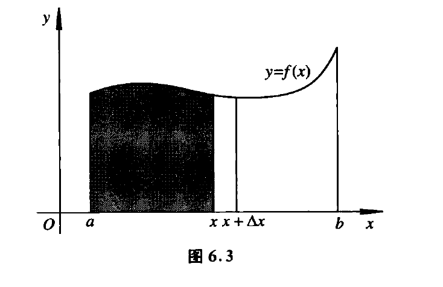

[toc]

## 微积分基本定理

### 变上限积分
如果f(x)在$[a,b]$上是可积的,那么对任意$x \in [a,b]$，函数$f(x)$在$[a,x]$上也是可积的。那应以函数$F(a) = \int_{a}^{x}f(t)dt$
其中$x$在$[a,b]$上变化。
很显然有$F(a)=0,F(b)=\int_{a}^{b}f(x)dx$.

［**引理**］
设函数$f$在$[a,b]$上可积，并设$|f(x)| \le K,\forall x \in [a,b]$
则$|\int_{a}^{b}f(x)dx| \le K(b-a)$
proof:
不妨先考察$a <b$.
那么$|\int_{a}^{b}f(x)dx| \le \int_{a}^{b}|f(x)|dx \le \int_{a}^{b}Kdx=K(b-a)=K|b-a|$

当$a >b$时
$|\int_{a}^{b}f(x)dx|=|\int_{b}^{a}f(x)dx| \le K|a-b|=K|b-a|$
故引理得证
$\blacksquare$

[**连续性**]设$f$在$[a,b]$上可积，那么上限变动的积分$F(x)=\int_{a}^{x}f(t)dt$在$[a,b]$上连续。
proof:
由于f在[a,b]上可积，那么必然有$|f(x)| \le M,\forall x \in [a,b]$
任取取定$x_0 \in [a,b]$

$$F(x_0 + h)-F(x_0)=\int_{a}^{x_0 + h}f(t)dt - \int_{a}^{x_0}f(t)dt\\
=\int_{x_0}^{x_0+h}f(t)dt $$
那么$|F(x_0 + h) -F(x_0)| =|\int_{x_0}^{x_0 + h}f(t)dt|\le M|h|$ 

分别$h> 0,h <0$讨论
如果$h >0$时$|F(x_0 + h) -F(x_0)| =|\int_{x_0}^{x_0 + h}f(t)dt|\le \int_{x_0}^{x_0+h}|f(t)|dt \le Mh=M|h|$ 
如果$h <0$，那么$|F(x_0 + h) -F(x_0)| =|\int_{x_0 +h}^{x_0}f(t)dt|\le \int_{x_0+h}^{x_0}|f(t)|dt \le -Mh=M|h|$ 

那么当然有$\lim\limits_{h \to 0}|F(x_0 +h) -F(x_0)| =0$
即$\lim\limits_{h \to 0}F(x_0 + h)=F(x_0)$
表明了$x_0$出$F(x)$的连续性，由于$x_0$出的任意性，可知函数$F(x)$在整个区间都是连续的。

$\blacksquare$

[**定理**]
设函数$f$在$[a,b]$上可积，在一点$x_0 \in [a,b]$处连续，那么$F(x)=\int_{a}^{x}f(t)dt$在$x_0$处可导，并且有$F'(x_0)=f(x_0)$.
proof:

题设本质是要证明$\lim\limits_{h \to 0}\frac{F(x_0 + h)-F(x_0)}{h}$存在，并且有$\lim\limits_{h \to 0}\frac{F(x_0 + h)-F(x_0)}{h} =f(x_0)$
不妨证明$\frac{F(x_0 + h)-F(x_0)}{h} -f(x_0)$是一个无穷小量
$$
\frac{F(x_0 + h)-F(x_0)}{h} -f(x_0)=\frac{\int_{x_0}^{x_0 + h}f(t)dt}{h}-f(x_0)\\
=\frac{\int_{x_0}^{x_0 + h}(f(t)-f(x_0))dt}{h}
$$
由于函数$f(x)$在$x_0$处是连续的，那么必然$\varepsilon >0$,$\exists \delta >0$,使得只要$|x -x_0| < \delta$,就有$|f(x) -f(x_0)|<\varepsilon$.

那么只要$0< |h| < \delta$,那么$t \in (x_0,x_0 + h)$必然有$|f(t)-f(x_0)| < \varepsilon$.

从而有
$$|\frac{F(x_0 + h)-F(x_0)}{h} -f(x_0)|=|\frac{\int_{x_0}^{x_0 + h}f(t)dt}{h}-f(x_0)|\\
=|\frac{\int_{x_0}^{x_0 + h}(f(t)-f(x_0))dt}{h}| \le \\
\frac{|\int_{x_0}^{x_0 + h}(f(t)-f(x_0))dt|}{|h|} \le 
\frac{\varepsilon |h|}{|h|}=\varepsilon
$$

这个说明$\lim\limits_{h \to 0}\frac{F(x_0 + h)-F(x_0)}{h}=f(x_0)$即$F'(x_0)=f(x_0)$

$\blacksquare$

[**微积分基本定理**]如果函数$f(x)$在$[a,b]$上连续，那么$\frac{d\int_{a}^{x}f(t)dt}{dx}=f(x),(a \le x \le b)$

这个说明了如果函数$f(x)$在区间是连续的，那么$\int_{a}^{x}f(t)dt$是f的一个原函数。

[**推论**]
$[a,b]$上的连续函数$f(x)$一定有原函数。

proof:

前面的引理证明了$\int_{a}^{x}f(t)dt$就是$f(x)$在区间上的原函数。

$\blacksquare$

### Newton-Leibniz公式
[**形式1**]
函数$f$在$[a,b]$上是可积的，且在$(a,b)$上有原函数$F(x)$,即$F'(x)=f(x),\forall x \in [a,b]$,如果$F$在[a,b]上连续，那么必有
$$\int_{a}^{b}f(x)dx=F(b) -F(a)$$
proof:
首先需要注意的是如果函数F(x)在$(a,b)$上是可导的，必然在$(a,b)$是连续的，那么强调函数$F(x)$在闭区间连续的含义是为了保证函数在$x=a,x=b$处连续。

确定一个分割，不妨将[a,b]区间n等分。$P:a=x_0 < x_1 < ...< x_n=b$,即$\Delta x_i = x_i - x_{i-1}=\frac{b-a}{n}$.

于是$F(b)-F(a) = \sum_{i=1}^{n}F(x_i)-F(x_{i-1})$
对于F应用微分中值定理，a，b点的连续，正好可以确保第一个和最后一个区间也是可以使用微分中值定理的。
那么
$F(b)-F(a) = \sum_{i=1}^{n}F(x_i)-F(x_{i-1})=\sum_{i=1}^{n}F'(\xi_i)(x_i -x_{i-1})=\sum_{i=1}^{n}f(\xi_i)\Delta x_i$

这里$\xi \in (x_{i-1},x_i)$.由于$f(x)$是可积的，那么必然有$\lim\limits_{n \to \infty}\sum_{i=1}^{n}f(\xi)\Delta x_i=\lim\limits_{|P|\to 0}\sum_{i=1}^{n}f(\xi)\Delta x_i$是存在，并且等于$\int_{a}^{b}f(x)dx$.

从而有$\int_{a}^{b}f(x)dx=F(b)-F(a)$

$\blacksquare$
将求可积函数的积分的问题，转化为求f的原函数的问题。

[**形式2**]

[**形式3**]
设$f(x)$在[a,b]上连续，$G$是$f$的任意一个原函数，那么
$$\int_{a}^{b}f(x)dx=G(b)-G(a)$$

proof:

根据微积分基本定理知道$\int_{a}^{x}f(t)dt$是$f(x)$一个原函数.
又因为$G(x)$也是其一个原函数，那么必然有$\int_{a}^{x}f(t)dt=G(x)+c,\forall x \in [a,b]$
那么$\int_{a}^{a}f(t)dt = G(a) +c =0$所以$c=-G(a)$
所以$\int_{a}^{x}f(t)dt=G(x)-G(a)$

不妨取$x=b$则有$\int_{a}^{b}f(t)dt =G(b)-G(a)$
有因为$\int_{a}^{b}f(x)dx =\int_{a}^{b}f(t)dt = G(b)-G(a)$
得证。

$\blacksquare$

[**推论**]

如果函数$G(x)$在$[a,b]$上有连续的导函数，那么
$\int_{a}^{x}G'(t)dt = G(x)-G(a)(a \le x \le b)$
proof:
这里$G'(x)$是连续的是必要的，因为这个连续性才能确定$\int_{a}^{x}G'(t)dt$是$G'(x)$的一个原函数。

毫无疑问的是$G(x)$当然也是$G'(x)$的原函数，那么利用微积分基本定理，自然就有$\int_{a}^{x}G'(t)dt =G(x)-G(a)$

$\blacksquare$

１．需要注意的是，可微函数的导函数不一定是可积的，如函数
$f(x)=\begin{cases} x^2sin(\frac{1}{x^2}) ,x \ne 0
\cr 0,x=0
\end{cases}$

实际上函数在$[0,1]$上是可微，０处的导数可以用定义进行求解，其到函数为
$f'(x)=\begin{cases} 2xsin(\frac{1}{x^2})-\frac{2}{x}cos(\frac{1}{x^2}) ,x \ne 0
\cr 0,x=0
\end{cases}$
实际上这是一个无界的函数，主要是靠近０点的附近是无界的，因此并不是黎曼可积的．

２．微积分基本定理和其推论，包含了两个方面的内容，第一是说一个连续函数的原函数可以通过变上线积分来确定，第二就是一个函数的导数积分可以还原到这个函数的本身。

定理的重要性在于它沟通了导数和积分之间的关系，以及求导和求积分之间的关系。

[**例题**]
(1)$\lim\limits_{n \to \infty}((1 + \frac{1}{n})(1 + \frac{2}{n})...(1 + \frac{n}{n}))^{\frac{1}{n}}$

解：
将求极限的表达式取对数，记$a_n = \frac{1}{n}\sum_{k=1}^{n}ln(1+\frac{k}{n})$
这个表达式，可以看做$f(x)=ln(1+x)$在$[0,1]$上的一个特殊的Reimann和，这时$[0,1]$被等分成n个区间，每一个子区间的宽度为$\frac{1}{n}$,取$\xi_i = \frac{i}{n}$是第i个区间的右端点。由于知道$ln(1+x)$在$[0,1]$上可积的，那么取均匀的分割，并且选取对我们有利的，特殊的点值点$\xi_i$做黎曼和后再取极限，一定会收敛到积分值。

$\lim\limits_{n \to \infty}a_n =\int_{0}^{1}ln(1+x)dx =2ln2-1$

［**定理**］
考察$F(x)=\int_{u(x)}^{v(x)}f(t)dt$,设函数$u(x),v(x)$在闭区间$[a,b]$上可微，并且满足$u(x) \in [A,B],v(x)\in [A,B]$,如果函数$f(t)$在闭区间$[A,B]$连续，那么函数$F(x)=\int_{u(x)}^{v(x)}f(t)dt$也在闭区间$[a,b]$上可微．并且有
$$\frac{d}{dx}\int_{u(x)}^{v(x)}f(t)dt=f(v(x))v'(x) - f(u(x))u'(x)$$

proof:

不妨取$c \in [A,B]$

$F(x)=\int_{u(x)}^{v(x)}f(t)dt= \int_{u(x)}^{c}f(t)dt + \int_{c}^{v(x)}f(t)dt =\int_{c}^{v(x)}f(t)dt - \int_{c}^{u(x)}f(t)dt$

$\int_{c}^{v(x)}f(t)dt$可以看做$\int_{a}^{s}f(t)dt,s=v(x)$的复合函数．那么$(\int_{c}^{v(x)}f(t)dt)'=f(s)v'(x)=f(v(x))v'(x)$
$\blacksquare$

［**定理**］
设函数ｆ在闭区间$[a,b]$上连续，则$\varPhi(x)=\int_{a}^{x}f(t)dt$就是ｆ在$[a,b]$上的一个原函数，由此可知，函数ｆ在闭区间$[a,b]$上的任何一个原函数$\varPsi$都可以表示称如下的形式：
$$\varPsi(x)=\int_{a}^{x}f(t)dt + C$$
这里Ｃ是常数．

有不少初等函数，他们的原函数不能表示为初等函数，例如，$\int e^{-x^2}dx,\int sin(x^2)dx,\int cos(x^2)dx,\int \frac{sin(x)}{x}dx,\int \frac{cos(x)}{x}dx,\int \frac{x}{lnx}dx$
但是一个不定积分不能用初等函数来表示，绝不意味着不定积分不存在．根据本节的讨论，知道任何连续函数都具有原函数，这个原函数可以用变动上限的定积分来表示．

## 定积分的计算方法

### 定积分换元法

$$\int_{g(a)}^{g(b)}f(u)du=\int_{a}^{b}f(g(x))g'(x)dx$$

proof:

不妨假设$f(u)$的原函数为$F(u)$,即$F'(u)=f(u)$利用$Newton-Leibniz$公式有
$\int_{g(a)}^{g(b)}f(u)du = F(u)|_{g(a)}^{g(b)}=F(g(b))-F(g(a))$

很显然的是$F(g(x))$是$f(g(x))g'(x)$的原函数.
因为$dF(g(x))/dx=F'(g(x))g'(x)=f(g(x))g'(x)$
那么可以知道$\int_{a}^{b}f(g(x))g'(x)dx=F(g(x))|_{a}^{b}=F(g(b))-F(g(a))$
由此可见是成立的.
$\blacksquare$

### 分部积分法

## 定积分计算中的疑问

### 定积分凑微分中的疑问

一般来说求解类似$\int_{a}^{b}f(g(x))g'(x)dx$的定积分采用凑微分的方法,但是用凑微分的时候,让人疑惑的是到底要不要改变积分上下限.

根据定积分的换元法我们知道,$u=g(x),x \in [a,b]$那么必然有
$\int_{g(a)}^{g(b)}f(u)du=\int_{a}^{b}f(g(x))g'(x)dx$

疑惑点在于要证明$\int_{a}^{b}f(g(x))g'(x)dx = \int_{a}^{b}f(g(x))dg(x)$

$\int_{a}^{b}f(g(x))dg(x)$这个里面的a,b是x的范围,利用换元令$u=g(x)$,那么$\int_{a}^{b}f(g(x))dg(x)$可以变成$\int_{g(a)}^{g(b)}f(u)du$.

根据前面的证明,我们是知道$\int_{g(a)}^{g(b)}f(u)du=\int_{a}^{b}f(g(x))g'(x)dx$

那么就有$\int_{a}^{b}f(g(x))dg(x)=\int_{a}^{b}f(g(x))g'(x)dx$

试想一个问题,如果$\int_{a}^{b}f(g(x))dg(x)$这个里面的a,b是g(x)的范围,进行换元后,那么$\int_{a}^{b}f(g(x))dg(x)$可以变成$\int_{a}^{b}f(u)du$.很显然$\int_{a}^{b}f(u)du \ne \int_{a}^{b}f(g(x))g'(x)dx$

### 分部积分里面的一个疑问
$\int_{a}^{b}f(x)d\varphi(x) = \sum_{i=1}^{n}f(x)(\varphi(x_i) - \varphi(x_{i-1}))=\sum_{i=1}^{n}f(x)\varphi'(\xi)(x_i - x_{i-1})$
1.这里需要强调的是,这样类似的积分形式,称为$Stieltjes$积分.
2.这里的积分范围依然是x的范围,$x \in [a,b]$.而不是$\varphi(x) \in [a,b]$.
3.不加证明的可以认为$\int_{a}^{b}f(x)d\varphi(x)=\int_{a}^{b}f(x)\varphi'(x)dx$

一般来说,会这样做的时候一般都是使用分部积分的时候,这样确实给学习者带了了很多困扰,其实是有办法取消除这样的歧义的.

$f(x)=f(x_0) + \int_{x_0}^{x}f'(t)dt$

一种形式是,这个也是很多教科书上的写法$f(x)=f(x_0) + \int_{x_0}^{x}f'(t)dt=f(x_0) + \int_{x_0}^{x}f'(t)d(t-x)=f(x_0) + (t-x)f'(t)|_{x_0}^{x} -\int_{x_0}^{x}f''(t)(t-x)dt$
然后使用分部积分进行展开.

如果换种更加贴近分部积分原始形式的写法,是不会带来这样的歧义的
$f(x)=f(x_0) + \int_{x_0}^{x}f'(t)dt=f(x_0) + \int_{x_0}^{x}(t-x)'f'(t)dt=f(x_0) + (t-x)f'(t)|_{x_0}^{x} -\int_{x_0}^{x}f''(t)(t-x)dt$
这里将$(t-x)'=v'(t),f'(t) = u(t)$自然有
$\int_{x_0}^{x}v'(t)u(t)dt=v(t)u(t)-\int_{x_0}^{x}u'(t)v(t)dt$与之对应的就是
$\int_{x_0}^{x}(t-x)'f'(t)dt=(t-x)f'(t)|_{x_0}^{x} -\int_{x_0}^{x}f''(t)(t-x)dt$
这样便不会出现有歧义的地方,但是达到的效果确实一样的.

1.
所以通过分析,最好是直接记$\int_{a}^{b}f(x)g'(x)dx =\int_{a}^{b}f(x)dg(x)$

通过分析,我们已经证明了如果积分形式$\int_{a}^{b}f(g(x))g'(x)dx$的形式,把积分的形式写成$\int_{a}^{b}f(g(x))dg(x)$是等价的

2.对于$\int_{a}^{b}f(x)g'(x)dx$这种形式的积分,如果是要采用分部积分来进行计算,写成$\int_{a}^{b}f(g(x))dg(x)$是没有必要的,可以直接利用$\int_{a}^{b}f(x)g'(x)dx=f(x)g(x)|_{a}^{b} -\int_{a}^{b}g(x)f'(x)dx$即可. 

所以总的来说,可以直接记$\int_{a}^{b}f(x)g'(x)dx = \int_{a}^{b}f(x)dg(x)$也就说说不从证明的角度去思考,直接记,也就是定义.

### 　Ｔaylor积分公式

因为$\int_{a}^{b}(u(x)v(x))'dx=\int_{a}^{b}u'(x)v(x)dx + \int_{a}^{b}u(x)v'(x)dx$而$\int_{a}^{b}(u(x)v(x))'dx=u(x)v(x)|_{a}^{b}$

那么就有
$$\int_{a}^{b}u'(x)v(x)dx = u(x)v(x)|_{a}^{b}-\int_{a}^{b}u(x)v'(x)dx$$
这是分部积分公式，十分重要．

一般教科书会记
$$\int_{a}^{b}u'(x)v(x)dx=\int_{a}^{b}v(x)du(x)\\
\int_{a}^{b}u(x)v'(x)dx = \int_{a}^{b}u(x)dv(x)$$
这个是需要注意的，仅仅只是方便记忆罢了．

记$\phi(t)=f(a+th)$，如果ｆ是n阶连续可微$f \in C^{n}$.
$$\phi(1)-\phi(0)=\int_{0}^{1}\phi'(t)dt$$
那么设$\tau \in [0,1]$,如果$\phi'(t)$是连续的，则有
$$\phi(\tau)-\phi(0)=\int_{0}^{\tau}\phi'(t)dt=-\int_{0}^{\tau}\phi'(t)(\tau -t)'dt\\
=\phi'(0)\tau+\int_{0}^{\tau}\phi''(t)(\tau -t)\\
=\phi'(0)\tau-\frac{1}{2}\int_{0}^{\tau}\phi''(t)[(\tau -t)^2]'dt\\
=\phi'(0)\tau + \frac{1}{2}\phi''(0)\tau^2 +\frac{1}{2}\int_{0}^{\tau}\phi'''(t)(\tau -t)^2dt\\
=...\\
=\phi'(0)\tau + \frac{1}{2}\phi''(0)\tau^2 +..+\frac{1}{(n-1)!}\phi^{(n-1)}(0)\tau^{n-1} + \\
\frac{1}{(n-1)!}\int_{0}^{\tau}\phi^{(n)}(t)(\tau -t)^{n-1}dt
$$
不妨记$t=\tau u,dt=\tau du$
那么
$\frac{1}{(n-1)!}\int_{0}^{\tau}\phi^{(n)}(t)(\tau -t)^{n-1}dt=\frac{1}{(n-1)!}\int_{0}^{1}\phi^{(n)}(\tau u)(\tau -\tau u)^{n-1}\tau du=\frac{1}{(n-1)!}\int_{0}^{1}\phi^{(n)}(\tau u)(1-u)^{n-1}\tau^{n} du$
