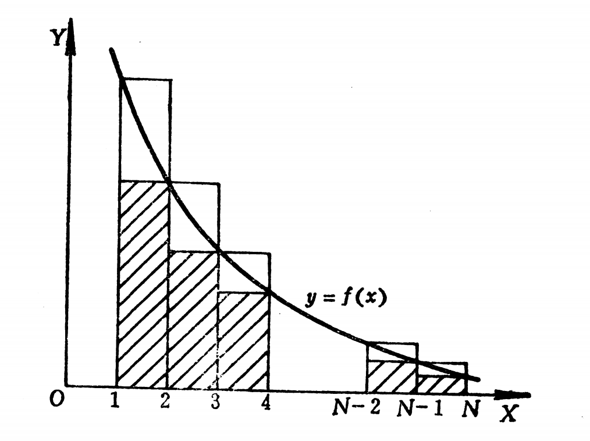

[toc]

[**引理**]
任意给定序列$\{a_n\}$,任意改变其有限项，构建新的序列$\{b_n\}$,那么如果$\{a_n\}$收敛则$\{b_n\}$收敛 ,反之，如果$\{b_n\}$收敛，则$\{a_n\}$也收敛。

proof:

任意给定序列$\{a_n\}$,任意改变其有限项，构建新的序列$\{b_n\}$,不妨设最后一项的下标是$N_0$，那么$n > N_0,a_n = b_n$.

如果$\lim\limits_{n \to \infty}a_n = A$,意味着$\forall \epsilon >0,\exist N,n>N,|a_n - A| < \epsilon$.又因为$n > N_0$有$a_n =b_n$那么不妨取$N_1 = max\{N,N_0\}$，如果$n >N_1$必然也有$|b_n -A| < \epsilon$.
可见有$\lim\limits_{n \to \infty}b_n = A$.

同理，如果$\lim\limits_{n \to \infty}b_n = B$,那么$\forall \epsilon >0,\exist N,n>N,|b_n - B| < \epsilon$.不妨取$N_1 = \max\{N,N_0\}$此时必然有$n > N_1$时，$|a_n - B | < \epsilon$,故有$\lim\limits_{n \to \infty}a_n= B$.

$\blacksquare$

## 级数

记$a_n \in R,n=1,2,...$
$$
\sum_{n=1}^{\infty} a_n = a_1 + a_2 + ...+ a_n +... \tag{1}
$$
叫做以$a_1,a_2,...,a_n$为项的级数。

可以将级数看做序列$\{S_n\}$，那么必然有
$$
S_1 = a_1,\\
S_2 =a_1 + a_2,\\
S_3 = a_1 + a_2 + a_3,\\
....\\
S_n =a_1 + a_2 + ...+ a_n
$$

只用记$S_n$为级数的前$n$项和。如果序列$\{S_n\}$ 收敛，那么就说级数(1)收敛。如果序列$\{S_n\}$发散，就说级数(1)发散。

如果$\lim\limits_{n \to \infty}S_n=S$,就说$S$是级数(1)的和，并且约定$\sum_{n =1}^{\infty}a_n = S$.

也就是说通过部分和的序列定义级数的敛散性与级数的和。

实际上，涉及序列极限的任何问题，也都可以化成级数的相应问题来讨论。序列$\{b_n\}$的敛散性，等价于级数
$$b_1 + \sum_{n=1}^{\infty}(b_{n+1} - b_{n})$$
的敛散性，并且很显然$\lim\limits_{n \to \infty}b_n = b$等价于$b_1 + \sum_{n=1}^{\infty}(b_{n+1}-b_{n})=b$.

## 数项级数性质
[**收敛级数的必要性定理**]  
如果级数$\sum a_n$收敛，那么必然有$\lim\limits_{n \to \infty}a_n = 0$  
proof:

如果级数$\sum a_n$收敛 $\Rightarrow$ $\lim S_n=S$存在.  
而$a_n = S_{n} - S_{n-1}$

必然有$\lim a_n = \lim S_{n} - \lim S_{n-1}=0$

$\blacksquare$

[**例题**]
可求和级数的的敛散性

(1)几何级数的收敛性,$\sum_{n = 1}^{\infty}r^{n-1}$的敛散性
解:
$S_n =\sum_{k =1}^n r^{k-1}=\frac{1-r^n}{1-r}$
那么
$\lim\limits_{n \to \infty}S_n = \lim\limits_{n \to \infty}\frac{1-r^n}{1-r}$

当$r \ge 1$时$S_n$是发散的。

当$r < 1$的时候$S_n$是收敛的，并且$\lim\limits_{n \to \infty}S_n  = \frac{1}{1-r}$.

2.
考察级数$\sum_{n=1}^{\infty}\frac{1}{n(n+1)}$那么$S_n=\sum_{k=1}^{n}(\frac{1}{k} -\frac{1}{k+1})=\lim\limits_{n \to \infty}(1-\frac{1}{n+1})=1$可见其也是收敛的。

## 正项级数

[定义] $a_n \ge 0$则称$\sum_{n =1}^{\infty}a_n$ 则称其为正项级数。

毫无疑问的是

$S_n=\sum_{k=1}^{n} a_k \le\sum_{k=1}^{n+1} a_k=S_{n+1}$

也就是正项级数的部分和序列是单调上升的。

如果一个级数的部分和序列是单调上升的，那么这个级数也就一定是正项级数。因此，正项级数的理论是单调数列极限理论的另一种陈述方式。

### 正项级数的收敛原理 

【**单调数列收敛原理**】单调上升数列收敛的充分必要条件是这个数列是上有界的。

【**正项级数收敛原理**】换句话说，正项级数的充分必要条件的他的部分和序列有上界。

[**例题**]

（1）$\sum_{n=1}^{\infty}\frac{1}{n^2}$

$S_n =\sum_{k =1}^{n}\frac{1}{k^2} < 1+ \sum_{k = 2}^{n}(\frac{1}{k-1}-\frac{1}{k})=2-\frac{1}{n} < 2$
可见其前n项和是上有界的。故$\{S_n\}$收敛。

（2）$\sum_{n=1}^{\infty}\frac{1}{\sqrt{n}}$
$$S_n = \sum_{k=1}^{n}\frac{1}{\sqrt{k}} = 1 + \frac{1}{\sqrt{2}} + \frac{1}{\sqrt{3}} + \frac{1}{\sqrt{4}} + ...+ \frac{1}{\sqrt{n}} \ge n\frac{1}{\sqrt{n}}=\sqrt{n}$$
$\forall M > 0,S_n \ge \sqrt{n} > M$只需要$n > M^2$,取$N=M^2, n > N$必然有
$S_n > M$ 从而有$\lim\limits_{n \to \infty}S_n = +\infty$.
可见$\{S_n\}$是无界的。

### **比较判别法**

为了考察一个正项级数是否收敛，常用另一个已知是收敛的或已知是发散的正项级数来与它作比较。

【**比较判别法定理**】 

设$\sum a_n ,\sum b_n$是正项级数，则  
(1)如果级数$\sum b_n$收敛，并且存在$c \ge 0,\exists N \in N_+$有
$$a_n \le cb_n,\forall n \ge N $$
那么级数$\sum a_n$也收敛。

proof:  
因为$\sum b_n$是收敛的,那么$B_{n}=\sum_{k=1}^n b_k$,有$\lim\limits_{n \to \infty} B_n$极限存在，利用极限存在的有界性质，$\exist M \ge 0,|B_n | \le M,n=1,2,...$

$$n > N,\sum_{k =1}^n a_n  = \sum_{k = 1}^{N-1} a_n + \sum_{k = N}^n a_n \le \sum_{k = 1}^{N-1}a_n + c\sum_{k = N}^n b_n  = \\
\sum_{k = 1}^{N-1}a_n + c\sum_{k = 1}^{N-1}b_n+ c\sum_{k = N}^n b_n -c\sum_{k = 1}^{N-1}b_n =\\
B_n + \sum_{k = 1}^{N-1}a_n - c\sum_{k = 1}^{N-1}b_n \le M + \sum_{k = 1}^{N-1}a_n $$

也就是说$\sum_{k =1}^{n}a_n$也是有界的。

那么利用正项级数的收敛原理，可知$\sum_{n =1}^{\infty} a_n$是收敛的。
$\blacksquare$

（2）如果级数$\sum b_n$发散，并且存在$c >0,N \in N_+$使得
$$a_n \ge c b_n ,\forall n \ge N$$
则$\sum a_n$发散.

proof:  

如果$\sum a_n$收敛，根据$\exists N ,c ,\forall n \ge N,b_n \le \frac{1}{c} a_n$
必然有$\sum b_n$收敛，这个就与条件矛盾。

　**利用定义证明**

记$B_n =\sum_{k=1}^{n}b_k$,由$\sum b_n$发散可知，
$\lim\limits_{n \to \infty} B_n=+\infty$ $\Rightarrow$ $\forall M >0,\exists N_1,n> N_1,B_n > M$

$$A_n=\sum_{k=1}^{n}a_k = \sum_{k=1}^{N-1}a_k + \sum_{k=N}^{n}a_n \ge \\ 
\sum_{k=1}^{N-1}a_k + c\sum_{k=N}^{n}b_n = \sum_{k=1}^{N-1}a_k - c\sum_{k=1}^{N-1}b_k + c\sum_{k=1}^{n}b_n > \\
\sum_{k=1}^{N-1}a_k - c\sum_{k=1}^{N-1}b_k + c M $$

可见对于任意的$E > 0$,只需要

$\sum_{k=1}^{N-1}a_k - c\sum_{k=1}^{N-1}b_k + c M > E \Leftrightarrow M > (E-\sum_{k=1}^{N-1}a_k + c\sum_{k=1}^{N-1}b_k)/c$

取$M'= \max\{(E-\sum_{k=1}^{N-1}a_k + c\sum_{k=1}^{N-1}b_k)/c,0\}$对于$B_n$来说，必然存在$N', n > N'$使得$B_n > M'$,只要
$n > max\{N',N\}$则必然有$A_n > E$.有定义可知，$\{A_n\}$发散.

$\blacksquare$

[例题]
1.$x \in (0,\pi),\sum sin(\frac{x}{n^2})$是否收敛。
解：
$sin(\frac{x}{n^2}) \ge 0,sin(\frac{x}{n^2}) \le \frac{x}{n^2}$
因为$\sum\frac{1}{n^2}$收敛，故$\sum\frac{x}{n^2}$必然是收敛的。

2.$\sum \frac{1}{\sqrt{4n-3}}$
解：
$\frac{1}{\sqrt{4n-3}} \ge 0$,$\frac{1}{\sqrt{4n-3}} > \frac{1}{\sqrt{4n}}=\frac{1}{2\sqrt{n}}$
而$\frac{1}{\sqrt{n}}$发散，故$\sum \frac{1}{\sqrt{4n-3}}$也发散。

【**定理**】  
设$\sum a_n,\sum b_n$是正项级数，并设一下极限存在
$$\lim\limits_{n \to \infty}\frac{a_n}{b_n} = \gamma (0 \le \gamma \le +\infty)$$
(1)如果$\sum b_n$收敛，且$\gamma < \infty$,那么级数$\sum a_n$也收敛  
(2)如果$\sum b_n$发散，且$\gamma  > 0$,那么级数$\sum a_n$也发散

proof:  
（1）
$\lim\limits_{n \to \infty}\frac{a_n}{b_n} = \gamma \Leftrightarrow \forall \varepsilon >0,\exists N ,n >N,|\frac{a_n}{b_n} - \gamma| < \varepsilon$ $\Rightarrow$ $0 \le \frac{a_n}{b_n} < \gamma + \varepsilon$

不妨取$\varepsilon =1$那么$\exists N,n > N,0 \le \frac{a_n}{b_n} < \gamma + 1$故有$a_n \le (\gamma +1)b_n, n > N$而$\sum b_n$是收敛的，故$\sum a_n$也收敛。

（2）

如果$\gamma > 0$
取$\varepsilon =\frac{\gamma}{2} ,\exists N,n > N, \frac{\gamma}{2}<\frac{a_n}{b_n} < \frac{3\gamma}{2}$也就是$a_n > \frac{\gamma}{2}b_n ,n > N$
而$\sum b_n$发散，必然有$\sum a_n$ 发散。

当$\gamma =\infty \Leftrightarrow \forall M>0,\exists N,\frac{a_n}{b_n} > M \Rightarrow a_n > Mb_n ,n > N$也能推出$\sum a_n$ 发散。

$\blacksquare$

[例题]  
（1）设 $x \in (0,\pi)$,判断下列级数的敛散性
(a)$\sum(1-cos\frac{x}{n})$
(b)$\sum2^nsin\frac{x}{3^n}$
解:
(a)
$1-cos(\frac{x}{n}) \ge 0$
$\lim\limits_{n \to \infty}\frac{1-cos\frac{x}{n}}{\frac{1}{n^2}} = \\
\lim\limits_{n \to \infty}\frac{2sin^2\frac{x}{2n}}{\frac{1}{n^2}} = \\
\lim\limits_{n \to \infty}\frac{2(\frac{x}{2n})^2}{\frac{1}{n^2}}=\frac{x^2}{2}$

因为级数$\sum \frac{1}{n^2}$收敛,那么$\sum(1-cos\frac{x}{n})$也收敛.

(b)
$2^nsin\frac{x}{3^n} \ge 0$
$$\lim\limits_{n \to \infty}\frac{2^nsin\frac{x}{3^n}}{(\frac{2}{3})^n}=\lim\limits_{n \to \infty}\frac{2^n\frac{x}{3^n}}{(\frac{2}{3})^n} = x$$
因为级数$\sum(\frac{2}{3})^n$收敛，那么必然$\sum2^nsin\frac{x}{3^n}$收敛。

[**比较判别法引理**]　　
设$\{a_n\},\{b_n\}$是两个正数列，如果当$n \ge n_0$时，有不等式
$\frac{a_{n+1}}{a_n} \le \frac{b_{n+1}}{b_n}$,那么
(1)当$\sum b_n$收敛时,$\sum a_n$也收敛．
(2)当$\sum a_n$发散时，$\sum b_n$也发散．

proof:

$n \ge n_0$时，$\frac{a_{n+1}}{a_n} \le \frac{b_{n+1}}{b_n}$那么
$$
\frac{a_{n_0+1}}{a_{n_0}} \le \frac{b_{n_0+1}}{b_{n_0}} \\
\frac{a_{n_0+1}}{a_{n_0}} \le \frac{b_{n_0+1}}{b_{n_0}}\\
\frac{a_{n_0+1}}{a_{n_0}} \le \frac{b_{n_0+1}}{b_{n_0}} \\
...\\
\frac{a_{n}}{a_{n-1}} \le \frac{b_{n}}{b_{n-1}}
$$

这些式子相乘便有$a_n/a_{n_0} \le b_n/b_{n_0} \Leftrightarrow a_n \le \frac{a_{n_0}}{b_{n_0}}b_n$

（１）利用比较判别法可知当$\sum b_n$收敛时,$\sum a_n$也收敛．
（２）利用比较判别法当$\sum a_n$发散时，$\sum b_n$也发散．

$\blacksquare$

从直觉的角度似乎是说两个增长速度有差异的级数比较其收敛情况．

### p-判别法
[**引理　p-级数的收敛性**]
1.$\sum \frac{1}{n^p}$的敛散性

$p \le 1$发散,$p >1$收敛，利用广义积分$\int_{1}^{\infty}\frac{1}{x^p}dx$的收敛性来进行判断。

### 达朗贝尔,柯西，$Rabee$判别法

用比较判别法来判别正项级数的敛散性，依赖于另一个已知敛散性的适当正项级数，但有时候，要选择一个这样的级数并不容易，而比值判别法和根值判别法，包括$Rabee$判别法只依赖级数本身的结构。
一般来说，比值判别法叫做达朗贝尔判别法，根值判别法称为柯西判别法。

［**达朗贝尔判别法**］

设$a_n >0$(1)如果存在正数$q <1$,满足$n \ge n_0$有
$\frac{a_{n+1}}{a_n} \le q <1$那么级数$\sum a_n$收敛．（２）如果当$n \ge n_0$时有$\frac{a_{n+1}}{a_{n}} \ge 1$那么级数$\sum a_n$发散．

proof:

(1)$\exists n_0 ,n \ge n_0,\frac{a_{n+1}}{a_{n}} \le q \Rightarrow a_n \le q^{n-n_0}a_{n_0}=q^n a_{n_0} q^{n_0}$
由比较判别法知道$\sum a_n$是收敛的．

（２）$\exists n_0 ,n \ge n_0,\frac{a_{n+1}}{a_{n}} \ge 1 \Rightarrow a_{n+1} \ge a_{n} \ge ...\ge a_{n_0} > 0$可知必然不可能有$a_n \to 0$从而有$\sum a_n$是发散的．

如果$\{a_n\}$收敛，那么必然有$\lim\limits_{n \to \infty}a_n =\sup_{n \ge n_0}\{a_n\} \ge a_{n_0} >0$

$\blacksquare$

### **达朗贝尔极限判别法**
设$\sum a_n$为正项级数，且$\lim\limits_{n \to \infty}\frac{a_{n+1}}{a_n}=l$

(a)当$0 \le l <1$，级数$\sum a_n$是收敛的。
（b)当$1 < l \le \infty$,级数$\sum a_n$是发散的。  

proof ：  

（a)
$\lim\limits_{n \to \infty}\frac{a_{n+1}}{a_n}=l$
如果$l <1$，那么取$\varepsilon=\frac{1-l}{2}>0,\exists N,n>N$有,
$0 \le \frac{a_{n+1}}{a_n} < l + \varepsilon =\frac{l+1}{2} <1$
为了简便起见，记$q=\frac{l+1}{2} < 1$那么有
$n>N,a_{n+1} < q a_n$.

取$N_1 =N+1$，那么$n > N_1$有
$a_{N_1 +1} < q a_{N_1},a_{N_1 +2} < q a_{N_1 +1},a_{N_1 +3} < q a_{N_1+2}...$
那么必然有$n > N_1,a_n < q^{n-N_1}a_{N_1}$.

因为等比级数$\sum_{n=N_1}^{\infty}q^{n-N_1}a_{N_1}$是收敛的，

根据比较判别法可知$\sum a_n$收敛。

(b)
当$\lim\limits_{n \to \infty}\frac{a_{n}}{a_n} =l > 1$,利用极限的保序性可知，$\exists N,n>N,\frac{a_{n+1}}{a_n} > 1$
取$N_1 = N +1$从而有

$a_{n+1} > a_n > ...> a_{N_1}$,只需要在$n >N_1$有一项$a_k \ne 0$,那么必然有
$\lim\limits_{n \to \infty}a_n \ne 0$那么此时级数$\sum a_n$是发散的。

$\blacksquare$

缺陷就是$l=1$会失效。

【**例题**】

（1）$\sum \frac{a^n}{n!},a >0$ 

(2)$\sum \frac{2^n+3}{3^n-2}$ 

(2)设$a >0$,讨论$\sum \frac{a^n n!}{n^n}$的敛散性.

### **根值判别法**
设$\sum a_n$为正项级数，且$\lim\limits_{n \to \infty}\sqrt[n]{a_n}=l$那么
(a)当$0 \le l <1$，级数$\sum a_n$是收敛的。
(b)当$1 < l \le \infty$,级数$\sum a_n$是发散的。  

proof:  
（a)
$\lim\limits_{n \to \infty}\sqrt[n]{a_n}=l<1$，$\varepsilon =\frac{1-l}{2},\exist N ,n > N,\sqrt[n]{a_n}< \frac{l+1}{2}<1$，记$q=\frac{l+1}{2}<1$那么也就是说
$n >N,a_n < q^n$,而级数$\sum q^n$是收敛的，由比较判别法可知$\sum a_n$也是收敛的
。

(b)
$\lim\limits_{n \to \infty}\sqrt[n]{a_n}=l>1,\varepsilon = \frac{l-1}{2},\exist N,n>N ,\sqrt[n]{a_n} >1 \Rightarrow a_n > 1$必然会有$\lim\limits_{n \to \infty}a_n \ne 0$,故级数$\sum a_n$必然是发散的。

$\blacksquare$

[**例题**]
（1）设常数$a>0$,试讨论级数$\sum_{n=1}^{\infty}\frac{n}{(a+\frac{1}{n})^n}$的敛散性。

【**引理**】
对于非负序列$\{a_n\}$满足$\lim\limits_{n \to \infty}\frac{a_{n+1}}{a_n}=l$,则有$\lim\limits_{n \to \infty}\sqrt[n]{a_n}=l$.

proof:

1.$l \ne 0$  

只需要证明$\varepsilon <l$的情况

$\lim\limits_{n \to \infty}\frac{a_{n+1}}{a_n}=l$ $\Leftrightarrow$ $\forall \varepsilon > 0,\exist N_1,n > N,l-\varepsilon<\frac{a_{n+1}}{a_{n}} < l+\varepsilon$

那么$a_n = \frac{a_n}{a_{n-1}}\frac{a_{n-1}}{a_{n-2}}...\frac{a_{N+2}}{a_{N+1}}a_{N+1}$

必然有

$a_{N+1}(l-\varepsilon)^{n-N-1} <a_n < a_{N+1}(l+\varepsilon)^{n-N-1}$

$\sqrt[n]{a_{N+1}}(l-\varepsilon)^{\frac{n-N-1}{n}} <\sqrt[n]{a_n} <\sqrt[n]{a_{N+1}}(l+\varepsilon)^{\frac{n-N-1}{n}}$

$$l-\varepsilon \le \liminf\limits_{n \to \infty}\sqrt[n]{a_n} \le \limsup\limits_{n \to \infty}\sqrt[n]{a_n} \le l+\varepsilon$$

取$\varepsilon_1 \ge  l$,那么必然也有
$$l-\varepsilon_1<l-\varepsilon \le \liminf\limits_{n \to \infty}\sqrt[n]{a_n} \le \limsup\limits_{n \to \infty}\sqrt[n]{a_n} \le l+\varepsilon < l+\varepsilon_1$$

由于$\epsilon$的任意性可知，$\lim\limits_{n \to \infty}\sqrt[n]{a_n} = l$

2.$l =+\infty$，这个证明是平凡的，略去不证.

$\blacksquare$

从这个引理可知，任意的比值判别法都可以推断出根值判别法。

同样的问题就是$l=1$会失效.

### **积分判别法**
设函数$f(x)$在$[1,\infty)$单调下降并且非负，为了考察级数
$$\sum_{n=1}^{\infty}f(n)$$
是否收敛，我们将这个级数于广义积分
$$\int_{1}^{\infty}f(x)dx$$
做比较。

不妨记$F(x)=\int_{1}^{x}f(x)dx$
显然$F(n+1)-F(n)=\int_{n}^{n+1}f(x)dx$

此时级数$\sum_{n=1}^{\infty}(F(n+1)-F(n))$与广义积分$\int_{1}^{\infty}f(x)dx$同为收敛或同为发散。
如果广义积分收敛那么
$$\lim\limits_{N \to \infty}\sum_{n=1}^{N}(F(n+1)-F(n))=\lim\limits_{N \to \infty}F(N+1)\\
=\lim\limits_{N \to \infty}\int_{1}^{N+1}f(x)dx=\int_{1}^{\infty}f(x)dx$$
另一方面，对任何$H >0$,设$N=[H]$(H的整数部分)，则有
$\int_{1}^{H}f(x)dx \le \int_{1}^{N+1}f(x)dx=\sum_{n=1}^{N}(F(n+1)-F(n))$
由此看出，如果级数$\sum_{n=1}^{N}(F(n+1)-F(n))$是收敛的，那么广义积分$\int_{1}^{H}f(x)dx$也是收敛的。

[**柯西积分判别法**]
设函数$f(x)$在$[1,\infty)$上单调下降并且非负，则级数
$\sum_{n=1}^{\infty}f(n)$与广义积分$\int_{1}^{\infty}f(x)dx$同为收敛或者同为收敛。
proof:
(1)
因为
$f(n) \le \int_{n-1}^{n}f(x)dx=F(n)-F(n-1)$
那么
$\sum_{n=1}^{N}f(n) \le \sum_{n=2}^{N}(F(n)-F(n-1))=F(N)=\int_{1}^{N}f(x)dx，n=2,3,...$
如果广义积分$\int_{1}^{\infty}f(x)dx$收敛，那么级数$\sum_{n=2}^{N}(F(n)-F(n-1))$是收敛的.
那么通过正项级数的比较判别法，可以知道$\sum_{n=1}^{\infty}$也是收敛的。
(2)
如果广义积分$\int_{1}^{\infty}f(x)dx$发散，那么级数$\sum_{n=1}^{\infty}(F(n+1)-F(n))$也是发散的。
又因为
$f(n) \ge \int_{n}^{n+1}f(x)dx =F(n+1)-F(n)$

通过正项级数的发散判别法，知道级数$\sum_{n=1}^{\infty}$也是发散的。

$\blacksquare$

借助面积大小的比较，可以做出柯西积分判别法的要给明晰的几何解释。
上图中画阴影的那些矩形条的面积之和为$\sum_{n=2}^{N}f(n)$
而较大的那些矩形条的面积之和等于$\sum_{n=1}^{N-1}f(n)$
将上述两个和数所表示的面积与积分$\int_{1}^{N}f(x)dx$所表的面积做比较就有
$$\sum_{n=2}^{N}f(n) \le \int_{1}^{N}f(x)dx \le \sum_{n=1}^{N-1}f(n)$$
由此可知，级数$\sum_{n=1}^{\infty}f(n)$与积分$\int_{1}^{\infty}f(x)dx$有相同的敛散性质。

[**例题**]
(1)$\sum_{n=1}^{\infty}\frac{1}{n^p}$

(2)$\sum_{n=2}^{\infty}\frac{1}{n(lnn)^p}$

(3)$\sum_{n=3}^{\infty}\frac{1}{nlnn(lnlnn)^p}$

## **利用上下极限判断正项级数的收敛性**

［**柯西判别法－上极限形式**］
对于正项级数$\sum a_n,a_n \ge 0$且$\limsup\limits_{n \to \infty}\sqrt[n]{a_n}=q$
那么(1)$q < 1$，级数$\sum a_n$收敛(２)$q > 1$，级数$\sum a_n$发散（３）$q=1$无法判断

proof:  

(1)
定义$\overline{a}_n = \sup_{k \ge n}\sqrt[k]{a_k}$

$\limsup\limits_{n \to \infty}\sqrt[n]{a_n}=q <1 
\Leftrightarrow \lim\limits_{n \to \infty}\overline{a}_n = q$

那么$\forall \epsilon >0,\exists N(\epsilon),n > N(\epsilon),\sup_{k \ge n}\{\sqrt[k]{a_k}\} < q + \epsilon$
可取$\epsilon = \frac{1-q}{2}$
那么必然有$\sup_{k \ge n}\{\sqrt[k]{a_k}\} < \frac{1+q}{2} <1$
那么当然有$n > N(\epsilon),\sqrt[n]{a_n}\ \le \sup_{k \ge n}\{\sqrt[k]{a_k}\} < \frac{1+q}{2} <1$ $\Rightarrow$ $a_n  < (\frac{1+q}{2})^n$
由比较判别法，知道$\sum a_n$是收敛的．

(2)

$\limsup\limits_{n \to \infty}\sqrt[n]{a_n}=q > 1 
\Leftrightarrow \lim\limits_{n \to \infty}\overline{a}_n = q$
意味着$\exists N,n > N$有$\overline{a}_n > 1$即$\sup_{k \ge n}\{\sqrt[k]{a_k}\} > 1$　实际上必然存在$k > n >N$有$\sqrt[k]{a_k} \ge 1$

利用上极限的定义，可知对于$\{a_n\}$必然存在一个子列$\{a_{k_n}\}$,使得$\lim\limits_{n \to \infty}\sqrt[k_n]{a_{k_n}} = q > 1$那么不可能有$a_n \to 0$

$\blacksquare$

［**达朗贝尔判别法－上下极限形式**］
设$a_n >0$(1)如果$\limsup\limits_{n \to \infty}\frac{a_{n+1}}{a_n}= q <1$那么级数$\sum a_n$收敛．(1)如果$\liminf\limits_{n \to \infty}\frac{a_{n+1}}{a_n}= q > 1$那么级数$\sum a_n$收敛．(3)$\limsup\limits_{n \to \infty}\frac{a_{n+1}}{a_n} = 1$或者$\liminf\limits_{n \to \infty}\frac{a_{n+1}}{a_n}= １$则无法判断级数的收敛性．

这个证明很简单，不与证明．

不管是达朗贝尔法还是柯西法，实际上能判别的面并不是很宽，他们只能够判别一些收敛得比几何级数$\sum q^n$还要快的级数．所谓$\sum a_n$比$\sum b_n$收敛得要快，指的是$\lim\limits_{n \to \infty}\frac{a_n}{b_n}=0$成立.

[**引理**]
如果级数$\sum a_n,a_n \ge 0$满足条件$\lim\limits_{n \to \infty}\frac{a_{n+1}}{a_n}=q <1$ 或者$\lim\limits_{n \to \infty}\sqrt[n]{a_n}=q < 1$
那么对于任意的$r (q <r < 1)$有
$\lim\limits_{n \to \infty}\frac{a_n}{r^n}=0$

这个就说明级数$\sum a_n$比几何级数$\sum r^n$收敛的要快．这个分析也意味着，如果某个级数比几何级数收敛的要慢，柯西和达朗贝尔的判别法都会失效．

### 启发
前面分析知道$\sum \frac{1}{n^\alpha},\alpha > 1$级数是比几何级数收敛的要慢的级数,根据比较判别法引理，可以选取$b_n=\frac{1}{n^\alpha},\alpha >1$作为比较级数．

那么也就是正项级数如果有$\sum a_n$满足$\frac{a_{n+1}}{a_n} \le \frac{\frac{1}{(n+1)^\alpha}}{\frac{1}{n^\alpha}}=(\frac{n}{n+1})^\alpha$那么此时则有$\sum a_n$是收敛的．

$$
\frac{a_{n+1}}{a_n} \le \frac{\frac{1}{(n+1)^\alpha}}{\frac{1}{n^\alpha}}=(\frac{n}{n+1})^\alpha \Leftrightarrow \\
\frac{a_n}{a_{n+1}} - 1\ge (1+\frac{1}{n})^{\alpha}-1
\Leftrightarrow \\
n(\frac{a_n}{a_{n+1}} - 1) \ge \frac{(1+\frac{1}{n})^{\alpha}-1}{\frac{1}{n}}
$$

很显然
$
\limsup\limits_{n \to \infty} n(\frac{a_n}{a_{n+1}} - 1) \ge \limsup\limits_{n \to \infty}\frac{(1+\frac{1}{n})^{\alpha}-1}{\frac{1}{n}}=\alpha > 1
$
那必然存在$n_0,n > n_0,n(\frac{a_n}{a_{n+1}} -1) \ge \alpha >1$　
此时就能够断言$\sum a_n$收敛．

［**Raabe判别法**］　　

设$a_n >0$（１）如果存在$r >1$，使得当$\exists n_0,n \ge n_0$是有$n(\frac{a_{n}}{a_{n+1}}-1) \ge r$那么级数$\sum a_n$是收敛的．
（２）存在$n_0$,使得当$n \ge n_0$是有$n(\frac{a_{n}}{a_{n+1}}-1) \le 1$那么级数$\sum a_n$是发散的．

proof:

（１）
如果存在$r >1$，使得当$\exists n_0,n \ge n_0$是有
$n(\frac{a_{n}}{a_{n+1}}-1) \ge r$那么
$\limsup\limits_{n \to \infty}n(\frac{a_{n}}{a_{n+1}}-1) \ge r$
不妨取$r > \sigma > 1$有因为$\limsup\limits_{n \to \infty}\frac{(1+\frac{1}{n})^{\sigma}-1}{\frac{1}{n}}=\sigma$
可见有
　
$$\limsup\limits_{n \to \infty}n(\frac{a_{n}}{a_{n+1}}-1) \ge r > \sigma=\limsup\limits_{n \to \infty}\frac{(1+\frac{1}{n})^{\sigma}-1}{\frac{1}{n}} >1$$

这个意味着，必然存在$n_0,n > n_0$有$n(\frac{a_{n}}{a_{n+1}}-1) > \frac{(1+\frac{1}{n})^{\sigma}-1}{\frac{1}{n}}$根据前面的分析可知，此时$\frac{a_{n+1}}{a_{n}} \le \frac{\frac{1}{(n+1)^\sigma}}{\frac{1}{n^\sigma}}$
而已知有$\sum \frac{1}{n^\sigma}$是收敛，必然有$\sum a_n$也是收敛．

（２）
如果有$\exists n_0,n > n_0,n(\frac{a_n}{a_{n+1}}-1) \le 1$则有
$\frac{a_n}{a_{n+1}} \Leftrightarrow \frac{a_{n+1}}{a_n} \ge \frac{\frac{1}{n+1}}{\frac{1}{n}}$而级数$\sum \frac{1}{n}$是发散的，那么$\sum a_n$也是发散的．

$\blacksquare$

［**Raabe判别法极限形式**]  

设正数列$\{a_n\}$满足$\lim\limits_{n \to \infty}n(\frac{a_n}{a_{n+1}}-1)=l$那么当$l >1$是$\sum a_n$收敛；当$l <1$,级数$\sum a_n$是发散的．

根据极限的保号性和$Rabbe$判别原理很容易证明该结论．

判断正项级数的方法主要是两种思想，寻找一个已知收敛的级数$\sum b_n$，作为比较级数,通过分析$a_n ,b_n$的关系，来得到$\sum a_n$的收敛情况．
另外一种是不需要寻找比较级数，只利用自身的结构来分析级数是否收敛，主要有达朗贝尔，柯西，拉贝尔判别法，实际上后面讲的这些不需要通过比较法判断的方法，也是比较法的延拓．可以归结为使用几何级数和ｐ－级数作为比较级数．

### **达朗贝尔和柯西方法的关系**
$\sum a_n$是正项级数,则有
$$\liminf\limits\frac{a_{n+1}}{a_n} \le \liminf\limits\sqrt[n]{a_n} \le \limsup\limits \sqrt[n]{a_n} \le \limsup\limits\frac{a_{n+1}}{a_n}$$

proof:
(1)证明：$\limsup\limits \sqrt[n]{a_n} \le \limsup\limits\frac{a_{n+1}}{a_n}$.

不妨记$\limsup\limits_{n \to \infty}\frac{a_{n+1}}{a_n}=A$,记$\overline{a}_n = \sup_{k \ge n}\frac{a_{k+1}}{a_k}$,那么$\forall \epsilon >0,\exist N,n >N$有$A - \epsilon < \sup_{k \ge n}\frac{a_{k+1}}{a_k} < A + \epsilon$从上极限的定义可知知道$\frac{a_{n+1}}{a_n} \le \sup_{k \ge n}\frac{a_{k+1}}{a_k}$.

那么$n >N$时有
$$
\frac{a_{N+1}}{a_N} < A+\epsilon,\\
\frac{a_{N+2}}{a_{N+1}} < A+\epsilon,\\
...\\
\frac{a_{n}}{a_{n-1}} < A+\epsilon
$$
那么$a_n=\frac{a_n}{a_{n-1}}\frac{a_{n-1}}{a_{n-2}}*...*\frac{a_{N+1}}{a_{N}} a_N \le (A + \epsilon)^{n-N}a_N \le (A + \epsilon)^{n}a_N(A+\epsilon)^{-N}$ 

那么必然有$\sqrt[n]{a_n} \le (A+\epsilon)(a_N(A+\epsilon)^{-N})^{\frac{1}{n}} \Rightarrow \limsup\limits_{ n \to \infty}\sqrt[n]{a_n} \le A+\epsilon)(a_N(A+\epsilon)^{-N})^{\frac{1}{n}}=A+\epsilon \Rightarrow \limsup\limits_{ n \to \infty}\sqrt[n]{a_n} \le A$

$\blacksquare$

