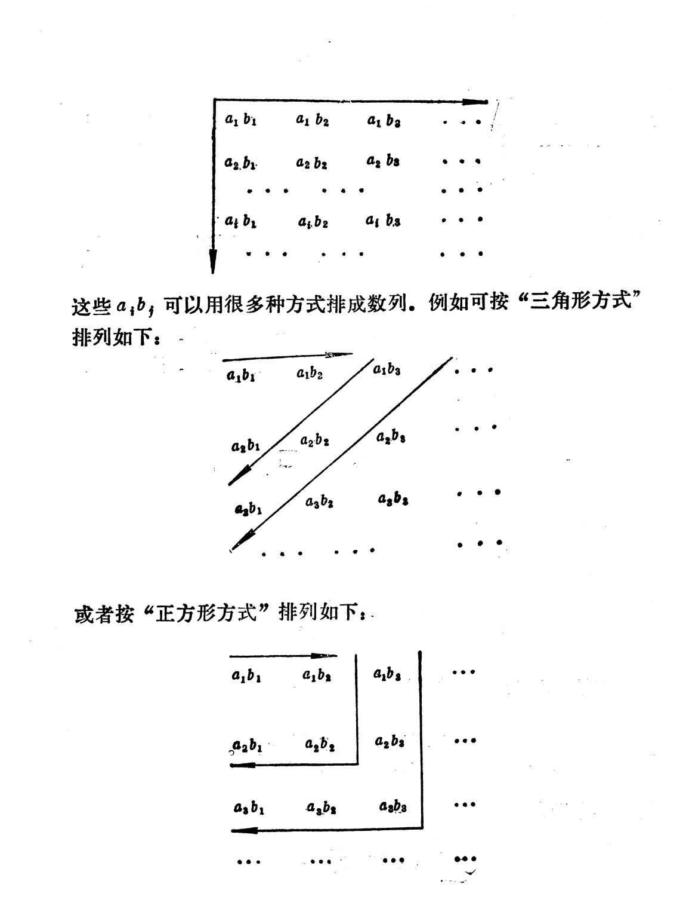

## **任意项级数**

级数$\sum a_n$,如果$a_n$可以正数，可以是负数，可以是0，则称这个级数为任意项级数。
$S_n=\sum_{k=1}^{n}a_k,n=1,2,...$
注意到$S_{n+p}-S_n=\sum_{k=n+1}^{n+p}a_k$

将序列的柯西收敛原理，平移到级数的，就有

【**级数的柯西收敛原理**】
级数$\sum a_n$收敛的充分必要条件是:对于$\varepsilon>0,\exists N,n > N,\forall p \in N_+$就有
$|\sum_{k=n+1}^{n+p}a_k|< \varepsilon$.

实际上就是$|S_{n+p}-S_n|< \varepsilon$,说明$\{S_n\}$是一个柯西列，$\{S_n\}$当然会收敛，对应级数也收敛.

[**定理1**]如果级数$\sum|a_n|$收敛，那么级数$\sum a_n$必然也收敛。

proof:  

级数$\sum|a_n|$收敛,如果$B_n=\sum_{k=1}^{n}|a_k|$,说明$\{B_n\}$是一个柯西列，利用级数收敛的柯西原理的必要性条件有$\epsilon >0 ,\exists N,n >N ,\forall p \in N_+,|a_{n+1}| + |a_{n+2} + ...+ |a_{n+p}| < \epsilon$.对于$\forall n,a_n \le |a_n|$
那么意味着$\epsilon >0, \exist N,n> N,\forall p \in N_+$有

$$|a_{n+1} + a_{n+2}+ ...+a_{n+p}| \le |a_{n+1}| + |a_{n+2}| + ...+ |a_{n+p}| < \epsilon$$

利用级数的柯西收敛原理，可知$\sum a_n$收敛。

实际上如果记$A_n=\sum_{k=1}^n a_k$,说明$\{A_n\}$是一个柯西列，当然是收敛的，从而对应的数项级数也是收敛的。

$\blacksquare$

【**例题**】
（1）$\sum_{k=1}^{\infty}(-1)^{k-1}\frac{1}{k}$  
(a)级数是否绝对收敛？
（b）级数本身是否收敛？

解：
(a) $a_k =(-1)^{k-1}\frac{1}{k}$那么$|a_k|=\frac{1}{k}$那么

$S_n = \sum_{k=1}^n = 1 + \frac{1}{2} + \frac{1}{3} + ...+ \frac{1}{n}> 
1 + 1/2 + (1/3 + 1/4) + (1/5 + 1/6 + 1/7+ 1/8) + ...$

当n充分大，取$n=2^{k}$,那么此时

$S_{2^k}=1 + 1/2 + (1/3+ 1/4) + (1/5+ 1/6+ 1/7 +1/8) + ...+ (1/(2^{k-1}+1) + 1/(2^{k-1}+2) + ...+ 1/(2^{k})) > 1 + 1/2 + 2/4 + 4/8 + ...+2^{k-1}/2^{k}=1 + k/2$

那么必然有$S_n$是发散的。

（b）
记$A_n=\sum_{k=1}^n a_k$那么

$|A_{n+p}-A_{n}|=|(-1)^{n}[\frac{1}{n+1}-\frac{1}{n+2} + \frac{1}{n+3}+...+(-1)^{p-1}\frac{1}{n+p}|=|\frac{1}{n+1}-\frac{1}{n+2} + \frac{1}{n+3}+...+(-1)^{p-1}\frac{1}{n+p}|$

分类讨论
$p=2k$为偶数.那么总共有偶数项
$$\frac{1}{n+1}-\frac{1}{n+2} + \frac{1}{n+3}+...+(-1)^{p-1}\frac{1}{n+p}=\\
(\frac{1}{n+1}-\frac{1}{n+2}) + (\frac{1}{n+3}-\frac{1}{n+4}) + ...+(\frac{1}{n+p-1}-\frac{1}{n+p})>0$$ 
必然是成立的
$$\frac{1}{n+1}-\frac{1}{n+2} + \frac{1}{n+3}+...+(-1)^{p-1}\frac{1}{n+p}=\\
\frac{1}{n+1}-[\frac{1}{n+2} - \frac{1}{n+3}+...-(-1)^{p-1}\frac{1}{n+p}]$$
那么又有
$[\frac{1}{n+2} - \frac{1}{n+3}+...-(-1)^{p-1}\frac{1}{n+p}] = (\frac{1}{n+2} - \frac{1}{n+3}) + (\frac{1}{n+4} - \frac{1}{n+5}) + ...+\frac{1}{n+p} >0$
可见必然有
$$\frac{1}{n+1}-\frac{1}{n+2} + \frac{1}{n+3}+...+(-1)^{p-1}\frac{1}{n+p}< \frac{1}{n+1}$$ 
如果$p=2k+1$那么总共有奇数项
$$\frac{1}{n+1}-\frac{1}{n+2} + \frac{1}{n+3}+...+(-1)^{p-1}\frac{1}{n+p}=\\
(\frac{1}{n+1}-\frac{1}{n+2}) + (\frac{1}{n+3}-\frac{1}{n+4}) + ...+(\frac{1}{n+p-2}-\frac{1}{n+p-1})+ \frac{1}{n+p}>0$$ 
又有
$$\frac{1}{n+1}-\frac{1}{n+2} + \frac{1}{n+3}+...+(-1)^{p-1}\frac{1}{n+p}=\\
\frac{1}{n+1}-[\frac{1}{n+2} - \frac{1}{n+3}+...+(-1)^{p-1}\frac{1}{n+p}]$$
此时$[\frac{1}{n+2} - \frac{1}{n+3}+...+(-1)^{p-1}\frac{1}{n+p}]$偶数项必然，其和大于0,故有$\frac{1}{n+1}-\frac{1}{n+2} + \frac{1}{n+3}+...+(-1)^{p-1}\frac{1}{n+p} < \frac{1}{n+1}$
也就是说
$$0 < \frac{1}{n+1}-\frac{1}{n+2} + \frac{1}{n+3}+...+(-1)^{p-1}\frac{1}{n+p} < \frac{1}{n+1},\forall n,p \in N_+$$
任意的$\epsilon >0$，只需要$\frac{1}{n+1} < \epsilon \Leftrightarrow n > max\{[1/\epsilon -1],1\}$便有
$|A_{n+p}-A_n| < \epsilon$,那么利用柯西收敛原理可知$\sum_{k=1}^{\infty}(-1)^{k-1}\frac{1}{k}$是收敛的。

[**定义**]  
（1）如果级数$\sum|a_n|$收敛，那么必然$\sum a_n$也是收敛的，称这种情况为级数$\sum a_n$绝对收敛。  
（2）如果级数$\sum |a_n|$发散，但是$\sum a_n$收敛，那么我们就说级数$\sum a_n$条件收敛。

### **绝对收敛判别**
对于任意项级数$\sum a_n$，只需要判断$\sum |a_n|$的收敛情况．为了判别绝对收敛性，可以利用正项级数收敛性的判别法。

### **条件收敛判别**
[**Abel引理-分部求和公式**]
设$\alpha_i,\beta_i \in R,i=1,2,...,n$则有
(1)$\sum_{i=1}^{n}\alpha_i \beta_i=\sum_{i=1}^{n-1}(\alpha_i-\alpha_{i+1})B_i + \alpha_nB_n$,$B_k=\sum_{i=1}^{k}\beta_i$
(2)如果$\alpha_1 \ge \alpha_2 \ge \alpha_3 \ge ...\ge \alpha_n$,或者反过来
($\alpha_1 \le \alpha_2 \le \alpha_3 \le ...\le \alpha_n$),并且$\forall k=1,2,...,n,|B_k| \le L$那么
$$|\sum_{i=1}^{n}\alpha_i \beta_i| \le L(|a_1| + 2|a_n|)$$

proof:
(1)
$B_k=\sum_{i=1}^{k}\beta_i$,那么$\beta_i = B_{i}-B_{i-1},B_0 = 0$

$$\sum_{i=1}^{n}\alpha_i \beta_i = \sum_{i=1}^{n}\alpha_i (B_{i}-B_{i-1})
= \sum_{i=1}^{n}\alpha_i B_{i}-  \sum_{i=1}^{n}\alpha_i B_{i-1} \\
=\sum_{i=1}^{n}\alpha_i B_{i} -   \sum_{i=1}^{n}\alpha_i B_{i-1} \\
=\sum_{i=1}^{n}\alpha_i B_{i} -   \sum_{i=1}^{n-1}\alpha_{i+1} B_{i} \\=\sum_{i=1}^{n-1}(\alpha_i -\alpha_{i+1}) B_{i} + \alpha_{n} B_{n}
$$

(2)
不妨先证明$a_i$递减，$a_{i} \ge a_{i+1}$
$|\sum_{i=1}^{n}\alpha_i \beta_i |=|\sum_{i=1}^{n-1}(\alpha_i -\alpha_{i+1}) B_{i} + \alpha_{n} B_{n}| \le \sum_{i=1}^{n-1} |(\alpha_i -\alpha_{i+1}) B_{i} | + |\alpha_{n} B_{n}| \le L (\sum_{i=1}^{n-1}|a_i -a_{i+1}|) + L|\alpha_{n}| = L(a_1 - a_n) + L|a_n| \le L(|a_1| +2|a_n|)$

$a_i$递增，$a_{i} \le a_{i+1}$
$|\sum_{i=1}^{n}\alpha_i \beta_i |=|\sum_{i=1}^{n-1}(\alpha_i -\alpha_{i+1}) B_{i} + \alpha_{n} B_{n}| \le \sum_{i=1}^{n-1} |(\alpha_i -\alpha_{i+1}) B_{i} | + |\alpha_{n} B_{n}| \le L (\sum_{i=1}^{n-1}|a_i -a_{i+1}|) + L|\alpha_{n}| = L(a_n - a_1) + L|a_n| \le L(|a_1| +2|a_n|)$

$L(a_n - a_1) + L|a_n| \le |L(a_n - a_1) + L|a_n|| \le L(|a_1| + 2|a_n|)$

综上可知，结论是成立的。

$\blacksquare$

【**定理2-狄利克雷判别法**】

考察级数$\sum a_n b_n$如果(1)序列$\{a_n\}$单调趋于0(2)序列$\{\sum_{k=1}^{n}b_k\}$有界
那么级数$\sum a_nb_n$收敛.

proof:

为了方便起见$\alpha_k = a_{n+k},\beta_k = b_{n+k},k=1,2,...,p$

那么$B_q=\sum_{k=1}^{q}\beta_k = \sum_{k=n+1}^{n+q}b_k, q=1,2,..,p$

题设序列$\{\sum_{k=1}^{n}b_k\}$有界，$\exist L > 0,|\sum_{k=1}^{n}b_k| \le L$.

显然$|B_q|= |\sum_{k=1}^{n+q}b_k - \sum_{k=1}^{n}b_k| \le |\sum_{k=1}^{n+q}b_k| + |\sum_{k=1}^{n}b_k| \le 2L$

$|\sum_{k=n+1}^{n+p}a_k b_k|=|\sum_{k=1}^{p}\alpha_k \beta_k| \le 2|L|(|a_{n+1}| + 2|a_{n+p}|)$

因为$a_n \to 0$,意味着$\forall \varepsilon >0,\exist N,n>N$有$|a_n| < \varepsilon$

可见当$n >N$时
$$|\sum_{k=n+1}^{n+p}a_k b_k| \le 2|L|(|a_{n+1}| + 2|a_{n+p}|) < 2L(3\varepsilon) $$

实际上简单调整上面的$\varepsilon'  = \frac{\varepsilon}{2L}$便可以证明级数 $\sum a_n b_n$是满足级数的柯西收敛准则的，故有其收敛。

$\blacksquare$

【**定理3-阿贝尔判别法**】
考察级数$\sum a_n b_n$如果(1)序列$\{a_n\}$单调且有界(2)级数$\sum_{k=1}^{\infty}b_k$收敛
那么级数$\sum a_nb_n$收敛.

proof:

序列$\{a_n\}$单调且有界,说明序列$\{a_n\}$ 收敛，那么必然有$\{a_n\}$有界，$\exist >0,\forall n,|a_n| \le M$.

序列$\{\sum_{k=1}^{n}b_k\}$收敛，利用级数收敛的柯西收敛原则必要性可知， $\forall \varepsilon >0,\exist N,n > N, \forall p \in N_+$满足
$$|\sum_{k=n+1}^{n+p}b_k|=|\sum_{k=1}^{n+p}b_k - \sum_{k=1}^{n}b_k| < \varepsilon $$

可以得知$|\sum_{k=n+1}^{n+p}b_k| < \varepsilon ,p=1,2,..,$
利用阿贝尔引理

$$|\sum_{k=n+1}^{n+p} a_k b_k| < \varepsilon (|a_{n+1}| + 2|a_{n+p}|) < 3M\varepsilon $$

只需要调整$\varepsilon'=\frac{\varepsilon}{3M},|\sum_{k=n+1}^{n+p}b_k| < \varepsilon' ,p=1,2,..,$便可知道，存在$N',n >N',\forall p \in N_+$此时
$$|\sum_{k=n+1}^{n+p} a_k b_k| \le \frac{\varepsilon}{3M} (|a_{n+1}| + 2|a_{n+p}|) < \varepsilon $$

利用级数的柯西收敛准则的充分性，可知级数$\sum a_i b_i$是收敛的。

$\blacksquare$

【**推论-莱布尼茨判别法**】

若交错级数$\sum_{n=1}^{\infty}(-1)^{n-1}a_n$满足

(1)$0 <a_{n+1} \le a_{n}$ (2)$\lim\limits_{n \to \infty} a_n = 0$

proof:

即$b_n=(-1)^{n-1}$,很显然$B_n=\sum_{k=1}^{n}b_n,|B_n| \le 1$而
$a_n$单调趋于0.利用狄利克雷判别法可知$\sum a_n b_n$是收敛的。

$\blacksquare$

考察交错级数的前ｎ项和$S_n=\sum_{k=1}^{n}(-1)^{k-1}a_{k}$
考察$\{S_n\}$的偶子列有
$$
S_2=a_1-a_2 \le a_1  \\
S_4=a_1-a_2 + a_3-a_4 =a_1-[(a_2 -a_3) + a_4] \le a_1\\
...\\
S_{2n}=a_1-a_2 + a_3-a_4 +...+a_{2n-1}-a_{2n} = \\
a_1-[(a_2 -a_3) + (a_4 -a_5) + ...+(a_{2n-2}-a_{2n-1}) + a_{2n}] \le a_1
$$

并且$S_{2n}=S_{2n-2} + (a_{2n-1} - a_{2n}) \ge S_{2n-2}$可见$\{S_{2n}\}$是一个单调递增上有界的子列，那么其必然收敛．记$\lim\limits_{n \to \infty}S_{2n}=S$
而$S_{2n+1}=S_{2n}+(-1)^{2n}a_{2n+1}＝S_{2n} + a_{2n+1}$
又因为$\lim\limits_{n \to \infty}a_{n} = 0$
故有$\lim\limits_{n \to \infty}S_{2n+1} = \lim\limits_{n \to \infty}(S_{2n} + a_{2n+1})= \lim\limits_{n \to \infty}S_{2n} +  \lim\limits_{n \to \infty}a_{2n+1}=S$

那么可见$\{S_n\}$的奇子列和偶子列都是收敛，有收敛极限的性质，可知，必然$\{S_n\}$是收敛的．

而其余项
$|\sum_{k=n+1}^{\infty}(-1)^{k-1}a_k|=|(-1)^{n}|*|\sum_{k=n+1}^{\infty}(-1)^{k-n-1}a_k| \le |a_{n+1}|$

> 注解

所以对于任意项级数，可以先将其视为正项级数做判断，即判断其是否绝对收敛，如果不是绝对收敛，在利用阿贝尔和狄利克雷的方法进行判断，当然讲的最多是实际上莱布尼茨的判别法，莱布尼茨方法实际上狄利克雷方法的特例．

[**例题**]

## 绝对收敛级数与条件收敛级数的性质
**结合律**
[**定理１**]
设收敛的级数$a_1 + a_2 + ...+a_n + ...$如果把这些级数的若干相继的项归并为一项，这样得到一个新的级数$(a_1 + ...+ a_{n_1}) + (a_{n_1 +1} + ...+ a_{n_2}) + ...+  (a_{n_k +1} + ...+ a_{n_{k+1}})+...$
那么这个级数任然收敛，并且与原级数有相等的和．
proof:
考虑原级数$\sum_{k=1}^{\infty}a_k$的前ｎ项和组成的序列$\{A_n\}$为
$A_1,A_2,...,A_n,...$
那么加括号后组成的新的级数的，前ｎ项和组成的序列$\{A_n'\}$，实际上正好是原级数前ｎ项和的子列$A_{n_1},A_{n_2},...,A_{n_k},...$
实际上就是$A_k'=A_{n_k}$
根据极限的收敛性质，后者必然是收敛的．
$\blacksquare$

值得注意的是，对于正项级数或者是负项级数，即不变号的级数而言，逆命题也是成立的，即加括号后收敛的级数，原级数也收敛．

但是对于变号级数，这个逆命题确实不成立的，举例来说$\sum_{n=1}^{\infty}(-1)^{n-1}$都知道原级数是不收敛的．但是
$(1-1) + (1-1) + (1-1) + ...$确实收敛的．

**交换律**

若函数$f(n)$是$N \to N$的一个双射（一一对应），则称$f(n)$是Ｎ的一个重排．

现设$\sum_{n=1}^{\infty}a_n$是一个数项级数，称$\sum_{n=1}^{\infty}a_n'$是它的一个重排，如果存在N的重排，使得$a_n'=a_{f(n)}$，所谓重排就是调整无穷个项的顺序。

[**引理**]
设正项级数$\sum a_n$收敛，那其重排后的级数$\sum a_n'$也收敛，并且
$\sum_{n=1}^{\infty}a_n' = \sum_{n=1}^{\infty}a_n$

proof:
(1)
如果$\sum a_n$是正项级数，考察正项级数$\sum a_n'$的敛散性，只需要考察其前ｎ项和，即$\sum_{k=1}^{n}a_k'$
因为$\sum a_n'$的前ｎ项和的每一项都来自于原级数，自然有
$\sum_{k=1}^{n}a_k' \le \sum_{k=1}^{\infty}a_k$
那么必然有级数$\sum_{n=1}^{\infty}a_n'$是收敛的，因为其前ｎ项和是有界的．
利用极限的保序性，当然有$\lim\limits_{n \to \infty}\sum_{k=1}^{n}a_k' \le \sum_{k=1}^{\infty}a_k$即$\sum_{k=1}^{\infty}a_k' \le \sum_{k=1}^{\infty}a_k$.

另一方面也可以把$\sum a_n$当做是$\sum a_n'$的重排级数，那么也就有
$\sum_{k=1}^{\infty}a_k \le \sum_{k=1}^{\infty}a_k'$.
从而有$\sum_{k=1}^{\infty}a_k' = \sum_{k=1}^{\infty}a_k$.

$\blacksquare$

[**定理**]
交换绝对收敛级数中的无穷多项（重排）的次序，所得的新级数仍然绝对收敛。

设级数$\sum a_n$绝对收敛，那重排后的级数$\sum a_n'$也绝对收敛，$\sum_{n=1}^{\infty}|a_n'| = \sum_{n=1}^{\infty}|a_n|$并且$\sum_{n=1}^{\infty}a_n' = \sum_{n=1}^{\infty}a_n$.

proof:
(1)

依题设可知，$\sum |a_n|$是收敛的，而$\sum |a_n|$是一个正项级数，　根据前面的引理可知，当然有$\sum |a_n'|$也是收敛的，并且$\sum |a_n| =\sum |a_n'|$.

(2)
如果$\sum a_n$是一个任意项级数，构造两个新序列
$$
p_n=\frac{|a_n| + a_n}{2},q_n=\frac{|a_n| - a_n}{2}
$$
实际上有$0 \le p_n \le |a_n|,0 \le q_n \le |a_n|$
并且有$|a_n|=p_n + q_n,a_n = p_n -q_n$.

有正项级数的比较判别法，可知$\sum p_n$和$\sum q_n$都是收敛的级数．根据前面的引理可知，正向级数的重排级数依然是收敛的,如果$\sum p_n'$和$\sum q_n'$代表重排以后的数列，$\sum p_n'$和$\sum q_n'$也都是收敛的，并且$\sum p_n =\sum p_n',\sum q_n= \sum q_n'$.

对于一般项级数，考察其重排级数依定义可知$\sum a_n'=\sum(p_n' - q_n')$因为$\sum p_n',  \sum q_n'$都是收敛级数，那么当然有$\sum(p_n' - q_n')$也收敛，并且等于$\sum(p_n' - q_n') = \sum(p_n') - \sum (q_n')$．

从而有
$$
\sum a_n'=\sum(p_n' - q_n')
=\sum(p_n') - \sum (q_n')
=\sum(p_n) - \sum (q_n)\\
=\sum(p_n - q_n)
=\sum a_n
$$
故原命题得证．

$\blacksquare$

实际上条件收敛的级数并不具备交换性．

### 级数的乘法
两个有限和$\sum_{n=１}^{N}a_n,\sum_{n=１}^{N}b_n$他们的一切可能的$a_ib_j$这样的和为：$\sum_{n=１}^{N}a_n \sum_{n=１}^{N}b_n = \sum_{i,j=１}^{n}a_ib_j$

那么如何计算$\sum_{n=１}^{\infty}a_n \sum_{n=１}^{\infty}b_n$
即两个无穷级数的乘积．

利用乘法的分配率给出相应的项$a_ib_j$

主要是正方形排列和对角线排列

做出两个级数所有可能的乘积$a_kb_j(k=1,2,...,j=1,2,...)$,将它们排成下面的无穷矩阵（称为两个级数的乘积矩阵）
任何将上面矩阵中的元素排成一个序列的方法都将得到$\sum a_n$和$\sum b_n$乘积的一个表示．

$
\left[
    \begin{matrix}
a_1b_1,a_1b_2,a_1b_3,...,a_1b_n,... \\
a_2b_1,a_2b_2,a_2b_3,...,a_2b_n,.... \\
...\\
a_nb_1,a_nb_2,a_nb_3,...,a_nb_n,....\\
....
    \end{matrix}
\right]
$
再用对角线排序时$(\sum a_n)(\sum b_n)=\sum c_n$.
那么通项$c_n$可以理解为
$c_{n}=\sum_{i+j=n+1}a_ib_j=(a_1b_{n} + a_2b_{n-1} + ...+a_{n}b_{1})=\sum_{k=1}^{n}(a_kb_{n+1-k})$
再用对角线方法得到的级数乘积$(\sum_{n=1}^{\infty} a_n)(\sum_{n=1}^{\infty} b_n)$称为其柯西乘积．
从上面的分析可知
$$
c_1=a_1b_1 \\
c_2=a_1b_2+a_2b_1 \\
c_3=a_1b_3+a_2b_2+ a_3b_1 \\
...\\
c_n=a_1b_{n} + a_2b_{n-1}+...+a_nb_1
$$
从而得到了级数$\sum_{n=1}^{\infty} c_n$

再用正方形排序时$(\sum a_n)(\sum b_n)=\sum d_n$.
$$
d_1 = a_1b_1,\\
d_2=a_1b_2 + a_2b_2 + a_2b_1,\\
... \\
d_n=a_1b_n + a_2b_n + ...+a_nb_n + a_nb_{n-1} + a_nb_{n-2} + ...+a_nb_{1}
$$

重要的是$\sum_{k=1}^{n}d_k =(\sum_{k=1}^{n}a_k)(\sum_{k=1}^{n}b_k)$

[**定理　柯西**]
如果级数$\sum a_n ,\sum b_n$都绝对收敛，且$\sum a_n=A,\sum b_n=B$,那么$a_ib_j(i,j=1,2,...)$按任意方式排列称的级数都是绝对收敛的，并且有
$(\sum a_n)(\sum b_n) =AB$

proof:

设$\sum_{n=1}^{\infty}a_{k_n}b_{j_n}$为$\sum_{n=1}^{\infty} a_n$与$\sum_{k=1}^{\infty}b_n$的乘积矩阵中所有元素的一个排列构成的级数，其前ｎ项部分为$S_n$.对$\forall n \in N_+,M_n = \max_{1 \le i \le n}\{k_i,j_i\}$
那么必然有$\sum_{i=1}^{n}|a_{k_i}b_{j_i}| \le \sum_{k=1}^{M_n}|a_k|\sum_{j=1}^{M_n}|b_j| \le \sum_{k=1}^{\infty}|a_k|\sum_{j=1}^{\infty}|b_j|$

由于$\sum a_n ,\sum b_n$都绝对收敛，$\sum_{k=1}^{\infty}|a_k|\sum_{j=1}^{\infty}|b_j|$是一个具体的界.

说明$\sum_{i=1}^{n}|a_{k_i}b_{j_i}|$有界，故其收敛．也就说
$\sum_{n=1}^{\infty}a_{k_n}b_{j_n}$是绝对收敛的．

对于绝对收敛而言，其任何重排也绝对收敛．

那么对于正方形排列而言
$\sum_{k=1}^{n}d_k =(\sum_{k=1}^{n}a_k)(\sum_{k=1}^{n}b_k)$
那么当然有
$\lim\limits_{n \to \infty}\sum_{k=1}^{n}d_k=\lim\limits_{n \to \infty}[(\sum_{k=1}^{n}a_k)(\sum_{k=1}^{n}b_k)]$

由于$\sum a_n ,\sum b_n$都绝对收敛，那么$\sum a_n ,\sum b_n$也都是收敛的，且$\lim\limits_{n \to \infty}\sum_{k=1}^{n}a_k$和$\lim\limits_{n \to \infty}\sum_{k=1}^{n}a_k$都是存在的，那么利用极限存在的性质可知
$\lim\limits_{n \to \infty}\sum_{k=1}^{n}d_k=\lim\limits_{n \to \infty}(\sum_{k=1}^{n}a_k)\lim\limits_{n \to \infty}(\sum_{k=1}^{n}b_k)$
$\blacksquare$

［**例题**］
1.级数$\sum_{k=0}^{\infty}\frac{x^n}{n!}$对任意的$x \in R$都是绝对收敛的．将两个级数$\sum_{m=0}^{\infty}\frac{x^m}{m!},\sum_{k=0}^{\infty}\frac{y^n}{n!}$相乘，并按三角形方式排列乘积各项的顺序．
三角形排列的通项$c_p=\sum_{k=0}^{p}\frac{x^k}{k!} \frac{y^{p-k}}{(p-k)!}=\sum_{k=0}^{p} \frac{C_{p}^{k} x^k y^{p-k}}{C_{p}^{k}k!(p-k)!}=\\
\sum_{k=0}^{p} \frac{C_{p}^{k} x^k y^{p-k}}{p!}=\frac{(x+y)^p}{p!}$

$\sum_{m=0}^{\infty}\frac{x^m}{m!}*\sum_{k=0}^{\infty}\frac{y^n}{n!}=\sum_{p=0}^{\infty}c_p=\sum_{p=0}^{\infty}\frac{(x+y)^p}{p!}$

### 进一步讨论级数乘法

如果按照柯西方式，考察级数的乘积。
对于级数$\sum_{n=1}^{\infty}$,$\sum_{n=1}^{\infty}$,那么其柯西乘积为$\sum_{n=1}^{\infty} c_n$,其中$c_n = \sum_{k=1}^{n}a_kb_{n+1-k}$

考察新级数的前N项和。可以发现如下结论。
如果记$A_n=\sum_{k=1}^{n}a_k,B_n=\sum_{k=1}^{n}b_k$
（1) $C_n=\sum_{k=1}^{n}c_k=a_1B_1+a_2B_{n-1} + ...+a_nB_1$
（2) $C_n=\sum_{k=1}^{n}c_k=A_1b_n+A_2b_{n-1} + ...+A_nb_1$
proof:

对于任意给定的元素$c_k=a_1b_k+a_2b_{k-1} + ...+a_{k-1}b_2+a_kb_1$
利用abel引理有$b_k=B_k-B_{k-1},b_{k-1}=B_{k-1}-B_{k-2},...,b_2 = B_2 -B_1,b_1=B_1$
从而有
$c_k=a_1(B_k-B_{k-1}) + a_2(B_{k-1}-B_{k-2}) + ...+a_kB_1=\\
a_1B_k + (a_2-a_1)B_{k-1} + (a_3-a_2)B_{k-2} + ...+(a_{k-1}-a_{k-2})B_2 + (a_k-a_{k-1})B_1$
那么
$$
c_1 = a_1B_1 \\
c_2 = a_1B_2 + (a_2-a_1)B_1 \\
c_3 = a_1B_3 + (a_2-a_1)B_2 + (a_3-a_2)B_1 \\
... \\
c_{n-1} = a_1B_{n-1}   + (a_2-a_1)B_{n-2} + (a_3-a_2)B_{n-3} + ...+ (a_{n-2} -a_{n-3})B_2 + (a_{n-1}-a_{n-2})B_1 \\
c_n = a_1B_n   + (a_2-a_1)B_{n-1} + (a_3-a_2)B_{n-2} + ...
+(a_{n-1} -a_{n-2})B_2 + (a_n-a_{n-1})B_1 
$$
$\sum_{k=1}^{n} c_k =c_1 + c_2 +...+ c_n$
合并同类项有
$\sum_{k=1}^{n} c_k=B_na_1 + a_2B_{n-1} + a_3B_{n-2} + ...+a_nB_1$

互换a_k,b_k的位置，同理可以证明后面的结论.
也就是说$C_n =\sum_{k=1}^{n} c_k=B_na_1 + a_2B_{n-1} + a_3B_{n-2} + ...+a_nB_1 $
(3)
$C_1=a_1B_1$
$C_2=a_1B_2 + a_2B_{1}$
$C_3= a_1B_3 + a_2B_2 + a_3B_1$
...
$C_{n-1}=a_1B_{n-1}+ a_2B_{n-2} +...+a_{n-1}B_1$

$C_{n}=a_1B_{n}+ a_2B_{n-1} +...+a_{n}B_1$

那么

$\sum_{k=1}^{n}C_k=C_1 +C_2 +...+C_n =\\
a_1B_{n} + (a_1 + a_2)B_{n-1} + ...+(a_1 + a_2+ ...+a_{n-1})B_2 + (a_1 + a_2 +...+a_n)B_1=\\
A_1B_n + A_2B_{n-1} +...+A_{n-1}B_2 + A_nB_1
$

$\blacksquare$

[**Mertens**]设级数$\sum a_n$绝对收敛，级数$\sum b_n$收敛，记$\sum_{n=1}^{\infty}a_n=A,\sum_{n=1}^{\infty}b_n=A,c_n = \sum_{k=1}^{n}a_kb_{n+1-k}$,则级数$\sum c_n$也收敛，并且有$\sum_{n=1}^{\infty}c_n= AB$

proof:
要证明命题，只需要证明$\lim\limits_{n \to \infty}\sum_{k=1}^{n}c_n = AB$

而通过前面的引理可以知道$C_n=\sum_{k=1}^{n}c_n =a_1B_n + a_2B_{n-1} + ...+a_{n-1}B_2 + a_nB_1$

命题可以等价于证明$\lim\limits_{n \to \infty}C_n=AB$

如果令$B_n = B-\beta_n$那么很显然$\beta_n  \to 0(n \to \infty)$
那么此时
$C_n =a_1B_n + a_2B_{n-1} + ...+a_{n-1}B_2 + a_nB_1=\\
a_1(B-\beta_n) + a_2(B-\beta_{n-1}) + ...+ a_n(B-\beta_{1})=\\
B(a_1 + a_2+ ...+ a_n)-(a_1\beta_n + a_2\beta_{n-1} + ...+ a_n\beta_1)\\
=BA_n -(a_1\beta_n + a_2\beta_{n-1} + ...+ a_n\beta_1)$

那么接下来的问题就可以归结为证明$\lim\limits_{n \to \infty}(a_1\beta_n + a_2\beta_{n-1} + ...+ a_n\beta_1) = 0$

因为$\lim\limits_{n \to \infty} \beta_n = 0 \Rightarrow \forall \varepsilon >0,\exists N,n > N,|\beta_n | < \varepsilon$
用 $N$ 将它们分开，当然也存在$L >0,|\beta_n| \le  L$
$$
|a_1\beta_n + a_2\beta_{n-1} + ...+ a_n\beta_1| \le \\
|a_1\beta_n + ...+a_{n-N}\beta_{N+1}|+ |a_{n+1-N}\beta_{N} + ...+ a_n\beta_1| \le \\
 \varepsilon(|a_1| + |a_2| +..+|a_{n-N}|) + |a_{n+1-N}\beta_{N} + ...+ a_n\beta_1|
$$

因为$\sum a_n$是绝对收敛的，那么$\sum_{n=1}^{\infty}|a_n| < +\infty$,不妨记$\lim\limits_{n \to \infty}\sum_{n=1}^{\infty}|a_n| = M$那么必然有$\sum_{k=1}^{n-N}|a_k| < M$
那么
$$
|a_1\beta_n + a_2\beta_{n-1} + ...+ a_n\beta_1| \le \\
|a_1\beta_n + ...+a_{n-N}\beta_{N+1}|+ |a_{n+1-N}\beta_{N} + ...+ a_n\beta_1| \le \\
 \varepsilon(|a_1| + |a_2| +..+|a_{n-N}|) + |a_{n+1-N}\beta_{N} + ...+ a_n\beta_1| < \\
 \varepsilon M + |a_{n+1-N}\beta_{N} + ...+ a_n\beta_1|
$$
记$\gamma_n= a_1\beta_n + a_2\beta_{n-1} + ...+ a_n\beta_1 $

那么$\limsup\limits_{n \to \infty}|\gamma_n| \le  \limsup\limits_{n \to \infty}(\varepsilon M + |a_{n+1-N}\beta_{N} + ...+ a_n\beta_1|)$

$(\varepsilon M + |a_{n+1-N}\beta_{N} + ...+ a_n\beta_1|) \le \varepsilon M + L(|a_{n+1-N}| + ...+ |a_n|)=\varepsilon M + L(S_n - S_{n+1-N})$
其中$S_n= |a_1| + |a_2| + ...+|a_n|$

所以上面的表达式可以进一步变形为
$\limsup\limits_{n \to \infty}|\gamma_n| \le  \limsup\limits_{n \to \infty}(\varepsilon M +  D(S_n - S_{n+1-N}))\le \varepsilon M$
$\{S_n\}$是收敛的,那么$\lim\limits_{n \to \infty}S_n-S_{n+1-N} = 0$．

这里有个疑问就是$a_n \to 0$，那$|a_{n+1-N}| + ...+ |a_n|$是不是无穷小量？　实际上并不一定，比如$a_n=\frac{1}{n}$.

**这里需要注意的是，极限只能保证，有限个无穷小量的和和有限个无穷小量的乘积任然是无穷小量**.

因为$\varepsilon$的任意性，可知$\limsup\limits_{n \to \infty}|\gamma_n|=0$,即$\lim\limits_{n \to \infty}\gamma_n = 0$.

故命题得证．

$\blacksquare$

另证:$\lim\limits_{n \to \infty}\gamma_n=\lim\limits_{n \to \infty}a_1\beta_n + a_2\beta_{n-1} + ...+ a_n\beta_1  =0$.

proof:
因为$\sum |a_n|$收敛，$S_n=\sum_{k=1}^{n}|a_k|$,那么序列$\{S_n\}$定然是收敛的．那么$\{S_n\}$是柯西列．$\forall \varepsilon ,\exists N_0,m,n > N_0,|S_m-S_n| < \varepsilon$.
不妨取$n=n,m=N_0 + 1$那么$\sum_{k=N_0 + 1}^{n}|a_k| < \varepsilon$.
因为$\lim\limits_{n \to \infty}\beta_n = 0 \Rightarrow |\beta_n| \le M$.
$$
|a_1\beta_n + a_2\beta_{n-1} + ...+ a_n\beta_1|\le \\
|a_1\beta_n + a_2\beta_{n-1} + ...+ a_{N_0}\beta_{n-N_0+1}| +\\ | a_{N_0 + 1}\beta_{n-N_0} +a_{N_0 + 2}\beta_{n-N_0-1}+ ...+ a_n\beta_1| \le \\
|a_1\beta_n + a_2\beta_{n-1} + ...+ a_{N_0}\beta_{n-N_0+1}| + M*\varepsilon
$$
因为$\lim\limits_{n \to \infty}\beta_n = 0 \Rightarrow \forall \varepsilon,\exists N_1,n > N_1,|\beta_n| < \epsilon$.
那么如果有$n-N_0 > N_1$就能有$|\beta_{n-N_0 +1}|< \varepsilon$

那么上面的式子进一步整理有
$$
|\gamma_n|=|a_1\beta_n + a_2\beta_{n-1} + ...+ a_n\beta_1|\le \\
|a_1\beta_n + a_2\beta_{n-1} + ...+ a_{N_0}\beta_{n-N_0+1}| + M*\varepsilon \le \\
(|a_1| + |a_2| + ...+ |a_{N_0}|)*\varepsilon  + M*\varepsilon
$$
由于$\varepsilon$的任意性，必然有$\lim\limits_{n \to \infty}\gamma_n=0$
最后讲一下，为什么需要$\sum |a_n|$是收敛的．
如果只有$\sum a_n$是收敛的,只能够得到，$\lim\limits_{n \to \infty}a_n=0$和$\exists N,m,n > N,|\sum_{k=m}^{n}a_k| < \varepsilon$
实际上不足以证明$\lim\limits_{n \to \infty}\gamma_n = 0$.

$\blacksquare$

[**引理**]
(1)已知$\lim\limits_{n \to \infty}x_n =a$,证明：$\lim\limits_{n \to \infty}\frac{x_1 + x_2 + ...x_n}{n}=a$

(2)$\lim\limits_{n \to \infty}x_n =a,\lim\limits_{n \to \infty}y_n=b$那么$\lim\limits_{n \to \infty}\frac{x_1y_n + x_2y_{n-1} + ...+ x_ny_1}{n}=ab$

[**定理－阿贝尔**]
考察收敛级数$\sum a_n,\sum b_n$记$\sum_{n=1}^{\infty}a_n=A,\sum_{n=1}^{\infty}b_n=A,c_n = \sum_{k=1}^{n}a_kb_{n+1-k}$,如果级数$\sum c_n$收敛，那么必然有$\sum_{n=1}^{\infty}c_n= AB$

proof:
题设说级数$\sum c_n$收敛，不妨记$\lim\limits_{n \to \infty}C_n = C$
那么根据引理可知的性质，可知$\lim\limits_{n \to \infty}\frac{C_1 + C_2 + ...+ C_n}{n} = C$
如果记$A_n=\sum_{k=1}^{n}a_k,B_n=\sum_{k=1}^{n}b_k$

而$\lim\limits_{n \to \infty}\frac{C_1 + C_2 + ...+ C_n}{n} = \lim\limits_{n \to \infty}\frac{A_1B_{n} + A_2B_{n-1} +...+A_{n-1}B_2 + A_nB_1}{n}$

如果$\lim\limits_{n \to \infty}A_n=A,\lim\limits_{n \to \infty}B_n = B$
那么
$\lim\limits_{n \to \infty}\frac{A_1B_{n} + A_2B_{n-1} +...+A_{n-1}B_2 + A_nB_1}{n}=AB$

也就是说此时必然有$C=AB$

$\blacksquare$

这里一定要记住的是，两个收敛级数的乘积，并不一定任然是收敛级数．
例如$a_n=(-1)^{n-1}\frac{1}{\sqrt{n}},b_n = (-1)^{n-1}\frac{1}{\sqrt{n}}$
考察其柯西乘积$c_n =\sum_{k=1}^{n}a_kb_{n+1-k}=\sum_{k=1}^{n}(-1)^{k-1}\frac{1}{\sqrt{k}} * (-1)^{n+1-k-1}\frac{1}{\sqrt{n+1-k}}=(-1)^{n-1}\sum_{k=1}^{n}\frac{1}{\sqrt{k(n+1-k)}}$

那么必然有$|c_n|=\sum_{k=1}^{n}\frac{1}{\sqrt{k(n+1-k)}} \ge \frac{2n}{n+1}$

$\sqrt{k(n+1-k)} \le \frac{n+1}{2} \Rightarrow \frac{1}{\sqrt{k(n+1-k)}} \ge \frac{2}{n+1}$

可见$|c_n| \ge \frac{2n}{n+1}$

当然有$\lim\limits_{n \to \infty}c_n \ne 0$
那么$\sum c_n$必然不收敛．

## 无穷乘积