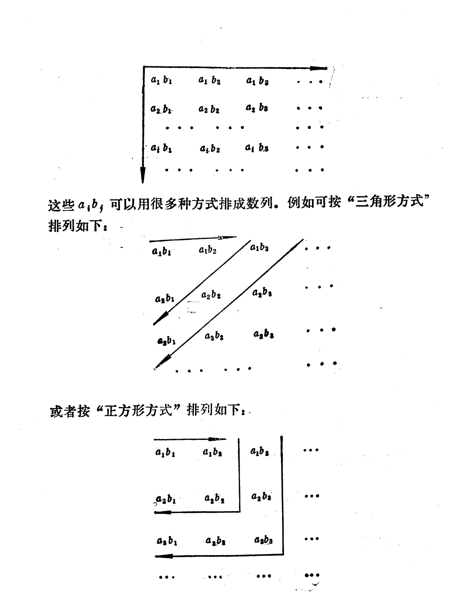

[toc]

[**引理**]
任意给定序列$\{a_n\}$,任意改变其有限项，构建新的序列$\{b_n\}$,那么如果$\{a_n\}$收敛则$\{b_n\}$收敛 ,反之，如果$\{b_n\}$收敛，则$\{a_n\}$也收敛。

proof:

任意给定序列$\{a_n\}$,任意改变其有限项，构建新的序列$\{b_n\}$,不妨设最后一项的下标是$N_0$，那么$n > N_0,a_n = b_n$.

如果$\lim\limits_{n \to \infty}a_n = A$,意味着$\forall \epsilon >0,\exist N,n>N,|a_n - A| < \epsilon$.又因为$n > N_0$有$a_n =b_n$那么不妨取$N_1 = max\{N,N_0\}$，如果$n >N_1$必然也有$|b_n -A| < \epsilon$.
可见有$\lim\limits_{n \to \infty}b_n = A$.

同理，如果$\lim\limits_{n \to \infty}b_n = B$,那么$\forall \epsilon >0,\exist N,n>N,|b_n - B| < \epsilon$.不妨取$N_1 = \max\{N,N_0\}$此时必然有$n > N_1$时，$|a_n - B | < \epsilon$,故有$\lim\limits_{n \to \infty}a_n= B$.

$\blacksquare$

## 级数问题的

记$a_n \in R,n=1,2,...$
$$
\sum_{n=1}^{\infty} a_n = a_1 + a_2 + ...+ a_n +... \tag{1}
$$
叫做以$a_1,a_2,...,a_n$为项的级数。

可以将级数看做序列$\{S_n\}$，那么必然有
$$
S_1 = a_1,\\
S_2 =a_1 + a_2,\\
S_3 = a_1 + a_2 + a_3,\\
....\\
S_n =a_1 + a_2 + ...+ a_n
$$

只用记$S_n$为级数的前$n$项和。并且讲序列$\{S_n\}$ 收敛，那么就说级数(1)收敛。如果序列$\{S_n\}$发散，就说级数(1)发散。

如果$\lim\limits_{n \to \infty}S_n=S$,就说$S$是级数(1)的和，并且约定$\sum_{n =1}^{\infty}a_n = S$.

也就是说通过部分和的序列定义级数的敛散性与级数的和。

实际上，涉及序列极限的任何问题，也都可以化成级数的相应问题来讨论。$\{b_n\}$的敛散性，等价于级数
$$b_1 + \sum_{n=1}^{\infty}(b_{n+1} - b_{n})$$
的敛散性，并且很显然$\lim\limits_{n \to \infty}b_n = b$等价于$b_1 + \sum_{n=1}^{\infty}(b_{n+1}-b_{n})=b$.

[**定理**]  
如果级数$\sum a_n$收敛，那么必然有$\lim\limits_{n \to \infty}a_n = 0$  
proof:

如果级数$\sum a_n$收敛 $\Rightarrow$ $\lim S_n=S$存在.  
而$a_n = S_{n} - S_{n-1}$

必然有$\lim a_n = \lim S_{n} - \lim S_{n-1}=0$

$\blacksquare$

[**例题**]

(1)几何级数的收敛性,$\sum_{n = 1}^{\infty}r^{n-1}$的敛散性
解:
$S_n =\sum_{k =1}^n r^{k-1}=\frac{1-r^n}{1-r}$
那么
$\lim\limits_{n \to \infty}S_n = \lim\limits_{n \to \infty}\frac{1-r^n}{1-r}$

当$r \ge 1$时$S_n$是发散的。

当$r < 1$的时候$S_n$是收敛的，并且$\lim\limits_{n \to \infty}S_n  = \frac{1}{1-r}$.

2.
考察级数$\sum_{n=1}^{\infty}\frac{1}{n(n+1)}$那么$S_n=\sum_{k=1}^{n}(\frac{1}{k} -\frac{1}{k+1})=\lim\limits_{n \to \infty}(1-\frac{1}{n+1})=1$可见其也是收敛的。

## 数项级数性质

## 正项级数

[定义] $a_n \ge 0$则称$\sum_{n =1}^{\infty}a_n$ 则称其为正项级数。

毫无疑问的是

$S_n=\sum_{k=1}^{n} a_k \le\sum_{k=1}^{n+1} a_k=S_{n+1}$

也就是正项级数的部分和序列是单调上升的。

如果一个级数的部分和序列是单调上升的，那么这个级数也就一定是正项级数。因此，正项级数的理论是单调数列极限理论的另一种陈述方式。

### 正项级数的收敛原理 

【**单调数列收敛原理**】单调上升数列收敛的充分必要条件是这个数列是有界的。

【**正项级数收敛原理**】换句话说，正项级数的充分必要条件的他的部分和序列有上界。

[**例题**]

（1）$\sum_{n=1}^{\infty}\frac{1}{n^2}$

$S_n =\sum_{k =1}^{n}\frac{1}{k^2} < 1+ \sum_{k = 2}^{n}(\frac{1}{k-1}-\frac{1}{k})=2-\frac{1}{n} < 2$
可见其前n项和是上有界的。故$\{S_n\}$收敛。

（2）$\sum_{n=1}^{\infty}\frac{1}{\sqrt{n}}$
$$S_n = \sum_{k=1}^{n}\frac{1}{\sqrt{k}} = 1 + \frac{1}{\sqrt{2}} + \frac{1}{\sqrt{3}} + \frac{1}{\sqrt{4}} + ...+ \frac{1}{\sqrt{n}} \ge n\frac{1}{\sqrt{n}}=\sqrt{n}$$
$\forall M > 0,S_n \ge \sqrt{n} > M$只需要$n > M^2$,取$N=M^2, n > N$必然有
$S_n > M$ 从而有$\lim\limits_{n \to \infty}S_n = +\infty$.

### **比较判别法**

为了考察一个正项级数是否收敛，常用另一个已知是收敛的或已知是发散的正项级数来与它作比较。

【**比较判别法定理**】 

设$\sum a_n ,\sum b_n$是正项级数，则  
(1)如果级数$\sum b_n$收敛，并且存在$c \ge 0,\exists N \in N_+$有
$$a_n \le cb_n,\forall n \ge N $$
那么级数$\sum a_n$也收敛。

proof:  
因为$\sum b_n$是收敛的,那么$B_{n}=\sum_{k=1}^n b_k$,有$\lim\limits_{n \to \infty} B_n$极限存在，利用极限存在的有界性质，$\exist M \ge 0,|B_n | \le M,n=1,2,...$

$$n > N,\sum_{k =1}^n a_n  = \sum_{k = 1}^{N-1} a_n + \sum_{k = N}^n a_n \le \sum_{k = 1}^{N-1}a_n + c\sum_{k = N}^n b_n  = \\
\sum_{k = 1}^{N-1}a_n + c\sum_{k = 1}^{N-1}b_n+ c\sum_{k = N}^n b_n -c\sum_{k = 1}^{N-1}b_n =\\
B_n + \sum_{k = 1}^{N-1}a_n - c\sum_{k = 1}^{N-1}b_n \le M + \sum_{k = 1}^{N-1}a_n $$

也就是说$\sum_{k =1}^{n}a_n$也是有界的。

那么利用正项级数的收敛原理，可知$\sum_{n =1}^{\infty} a_n$是收敛的。
$\blacksquare$

（2）如果级数$\sum b_n$发散，并且存在$c >0,N \in N_+$使得
$$a_n \ge c b_n ,\forall n \ge N$$
则$\sum a_n$发散.

proof:  

如果$\sum a_n$收敛，根据$\exists N ,c ,\forall n \ge N,b_n \le \frac{1}{c} a_n$
必然有$\sum b_n$收敛，这个就与条件矛盾。

利用定义证明

记$B_n =\sum_{k=1}^{n}b_k$,由$\sum b_n$发散可知，

$\lim\limits_{n \to \infty} B_n=+\infty$ $\Rightarrow$ $\forall M >0,\exists N_1,n> N_1,B_n > M$

$$A_n=\sum_{k=1}^{n}a_k = \sum_{k=1}^{N-1}a_k + \sum_{k=N}^{n}a_n \ge \\ 
\sum_{k=1}^{N-1}a_k + c\sum_{k=N}^{n}b_n = \sum_{k=1}^{N-1}a_k - c\sum_{k=1}^{N-1}b_k + c\sum_{k=1}^{n}b_n > \\
\sum_{k=1}^{N-1}a_k - c\sum_{k=1}^{N-1}b_k + c M $$

可见对于任意的$E > 0$,只需要

$\sum_{k=1}^{N-1}a_k - c\sum_{k=1}^{N-1}b_k + c M > E \Leftrightarrow M > (E-\sum_{k=1}^{N-1}a_k + c\sum_{k=1}^{N-1}b_k)/c$

取$M'= \max\{(E-\sum_{k=1}^{N-1}a_k + c\sum_{k=1}^{N-1}b_k)/c,0\}$对于$B_n$来说，必然存在$N', n > N'$使得$B_n > M'$,只要
$n > max\{N',N\}$则必然有$A_n > E$.有定义可知，$\{B_n\}$发散.

$\blacksquare$

[例题]
1.$x \in (0,\pi),\sum sin(\frac{x}{n^2})$是否收敛。
解：
$sin(\frac{x}{n^2}) \ge 0,sin(\frac{x}{n^2}) \le \frac{x}{n^2}$
因为$\sum\frac{1}{n^2}$收敛，故$\sum\frac{x}{n^2}$必然是收敛的。

2.$\sum \frac{1}{\sqrt{4n-3}}$
解：
$\frac{1}{\sqrt{4n-3}} \ge 0$,$\frac{1}{\sqrt{4n-3}} > \frac{1}{\sqrt{4n}}=\frac{1}{2\sqrt{n}}$
而$\frac{1}{\sqrt{n}}$发散，故$\sum \frac{1}{\sqrt{4n-3}}$也发散。

【**定理**】  
设$\sum a_n,\sum b_n$是正项级数，并设一下极限存在
$$\lim\limits_{n \to \infty}\frac{a_n}{b_n} = \gamma (0 \le \gamma \le +\infty)$$
(1)如果$\sum b_n$收敛，且$\gamma < \infty$,那么级数$\sum a_n$也收敛  
(2)如果$\sum b_n$发散，且$\gamma  > 0$,那么级数$\sum a_n$也发散

proof:  
（1）
$\lim\limits_{n \to \infty}\frac{a_n}{b_n} = \gamma \Leftrightarrow \forall \epsilon >0,\exists N ,n >N,|\frac{a_n}{b_n} - \gamma| < \epsilon$$ $\Rightarrow$ $0 \le \frac{a_n}{b_n} < \gamma + \epsilon$

不妨取$\epsilon =1$那么$\exists N,n > N,0 \le \frac{a_n}{b_n} < \gamma + 1$故有$a_n \le (\gamma +1)b_n, n > N$而$\sum b_n$是收敛的，故$\sum a_n$也收敛。

（2）

如果$\gamma > 0$
取$\epsilon =\frac{\gamma}{2} ,\exists N,n > N, \frac{\gamma}{2}<\frac{a_n}{b_n} < \frac{3\gamma}{2}$也就是$a_n > \frac{\gamma}{2}b_n ,n > N$
而$\sum b_n$发散，必然有$\sum a_n$ 发散。

当$\gamma =\infty \Leftrightarrow \forall M>0,\exists N,\frac{a_n}{b_n} > M \Rightarrow a_n > Mb_n ,n > N$也能推出$\sum a_n$ 发散。

$\blacksquare$

[例题]  
（1）设 $x \in (0,\pi)$,判断下列级数的敛散性
(a)$\sum(1-cos\frac{x}{n})$
(b)$\sum2^nsin\frac{x}{3^n}$
解:
(a)
$$1-cos(\frac{x}{n}) \ge 0$$
$$\lim\limits_{n \to \infty}\frac{1-cos\frac{x}{n}}{\frac{1}{n^2}} = \\
\lim\limits_{n \to \infty}\frac{2sin^2\frac{x}{2n}}{\frac{1}{n^2}} = \\
\lim\limits_{n \to \infty}\frac{2(\frac{x}{2n})^2}{\frac{1}{n^2}}=\frac{x^2}{2}$$

因为级数$\sum \frac{1}{n^2}$收敛,那么$\sum(1-cos\frac{x}{n})$也收敛.

(b)
$2^nsin\frac{x}{3^n} \ge 0$
$$\lim\limits_{n \to \infty}\frac{2^nsin\frac{x}{3^n}}{(\frac{2}{3})^n}=\lim\limits_{n \to \infty}\frac{2^n\frac{x}{3^n}}{(\frac{2}{3})^n} = x$$
因为级数$\sum(\frac{2}{3})^n$收敛，那么必然$\sum2^nsin\frac{x}{3^n}$收敛。

[**比较判别法引理**]　　
设$\{a_n\},\{b_n\}$是两个正数列，如果当$n \ge n_0$时，有不等式
$\frac{a_{n+1}}{a_n} \le \frac{b_{n+1}}{b_n}$,那么
(1)当$\sum b_n$收敛时,$\sum a_n$也收敛．
(2)当$\sum a_n$发散时，$\sum b_n$也发散．

proof:

$n \ge n_0$时，$\frac{a_{n+1}}{a_n} \le \frac{b_{n+1}}{b_n}$那么
$$
\frac{a_{n_0+1}}{a_{n_0}} \le \frac{b_{n_0+1}}{b_{n_0}} \\
\frac{a_{n_0+1}}{a_{n_0}} \le \frac{b_{n_0+1}}{b_{n_0}}\\
\frac{a_{n_0+1}}{a_{n_0}} \le \frac{b_{n_0+1}}{b_{n_0}} \\
...\\
\frac{a_{n}}{a_{n-1}} \le \frac{b_{n}}{b_{n-1}}
$$

这些式子相乘便有$a_n/a_{n_0} \le b_n/b_{n_0} \Leftrightarrow a_n \le \frac{a_{n_0}}{b_{n_0}}b_n$

（１）利用比较判别法可知当$\sum b_n$收敛时,$\sum a_n$也收敛．
（２）利用比较判别法当$\sum a_n$发散时，$\sum b_n$也发散．

$\blacksquare$

【p-级数的收敛性】
$\sum \frac{1}{n^p}$的敛散性

### p-判别法

用比较判别法来判别正项级数的敛散性，依赖于另一个已知敛散性的适当正项级数，但有时候，要选择一个这样的级数并不容易，而比值判别法和根值判别法，只依赖级数本身的结构。
一般来说，比值判别法叫做达朗贝尔判别法，根值判别法称为柯西判别法。

［**达朗贝尔判别法**］

设$a_n >0$(1)如果存在正数$a <1$,满足$n \ge n_0$有
$\frac{a_{n+1}}{a_n} \le q <1$
那么级数$\sum a_n$收敛．（２）如果当$n \ge n_0$时有$\frac{a_{n+1}}{a_{n}} \ge 1$那么级数$\sum a_n$发散．

proof:

(1)$\exists n_0 ,n \ge n_0,\frac{a_{n+1}}{a_{n}} \le q \Rightarrow a_n \le q^{n-n_0}a_{n_0}=q^n a_{n_0} q^{n_0}$
由比较判别法知道$\sum a_n$是收敛的．

（２）$\exists n_0 ,n \ge n_0,\frac{a_{n+1}}{a_{n}} \ge 1 \Rightarrow a_{n+1} \ge a_{n} \ge ...\ge a_{n_0} > 0$可知必然不可能有$a_n \to 0$从而有$\sum a_n$是发散的．

$\{a_n\}$不收敛不进行讨论，毫无疑问级数不收敛．

如果$\{a_n\}$收敛，那么必然有$\lim\limits_{n \to \infty}a_n =\sup_{n \ge n_0}\{a_n\} \ge a_{n_0} >0$

$\blacksquare$

### **达朗贝尔极限判别法**
设$\sum a_n$为正项级数，且$\lim\limits_{n \to \infty}\frac{a_{n+1}}{a_n}=l$

(a)当$0 \le l <1$，级数$\sum a_n$是收敛的。
（b)当$1 < l \le \infty$,级数$\sum a_n$是发散的。  

proof ：  

（a)
$\lim\limits_{n \to \infty}\frac{a_{n+1}}{a_n}=l$
如果$l <1$，那么取$\varepsilon=\frac{1-l}{2}>0,\exists N,n>N$有,
$0 \le \frac{a_{n+1}}{a_n} < l + \varepsilon =\frac{l+1}{2} <1$
为了简便起见，记$q=\frac{l+1}{2} < 1$那么有
$n>N,a_{n+1} < q a_n$.

取$N_1 =N+1$，那么$n > N_1$有
$a_{N_1 +1} < q a_{N_1},a_{N_1 +2} < q a_{N_1 +1},a_{N_1 +3} < q a_{N_1+2}...$
那么必然有$n > N_1,a_n < q^{n-N_1}a_{N_1}$.

因为等比级数$\sum_{n=N_1}^{\infty}q^{n-N_1}a_{N_1}$是收敛的，

根据比较判别法可知$\sum a_n$收敛。

(b)
当$\lim\limits_{n \to \infty}\frac{a_{n}}{a_n} =l > 1$,利用极限的保序性可知，$\exists N,n>N,\frac{a_{n+1}}{a_n} > 1$
取$N_1 = N +1$从而有

$a_{n+1} > a_n > ...> a_{N_1}$,只需要在$n >N_1$有一项$a_k \ne 0$,那么必然有
$\lim\limits_{n \to \infty}a_n \ne 0$那么此时级数$\sum a_n$是发散的。

$\blacksquare$

缺陷就是$l=1$会失效。

【**例题**】

（1）$\sum \frac{a^n}{n!},a >0$ (2)$\sum \frac{2^n+3}{3^n-2}$ 

(2)设$a >0$,讨论$\sum \frac{a^n n!}{n^n}$的敛散性.

### **根值判别法**
设$\sum a_n$为正项级数，且$\lim\limits_{n \to \infty}\sqrt[n]{a_n}=l$那么
(a)当$0 \le l <1$，级数$\sum a_n$是收敛的。
（b)当$1 < l \le \infty$,级数$\sum a_n$是发散的。  

proof:  
（a)
$\lim\limits_{n \to \infty}\sqrt[n]{a_n}=l<1$，$\varepsilon =\frac{1-l}{2},\exist N ,n > N,\sqrt[n]{a_n}< \frac{l+1}{2}<1$，记$q=\frac{l+1}{2}<1$那么也就是说
$n >N,a_n < q^n$,而级数$\sum q^n$是收敛的，由比较判别法可知$\sum a_n$也是收敛的
。

(b)
$\lim\limits_{n \to \infty}\sqrt[n]{a_n}=l>1,\varepsilon = \frac{l-1}{2},\exist N,n>N ,\sqrt[n]{a_n} >1 \Rightarrow a_n > 1$必然会有$\lim\limits_{n \to \infty}a_n \ne 0$,故级数$\sum a_n$必然是发散的。

$\blacksquare$

[**例题**]
（1）设常数$a>0$,试讨论级数$\sum_{n=1}^{\infty}\frac{n}{(a+\frac{1}{n})^n}$的敛散性。

【**引理**】
对于非负序列$\{a_n\}$满足$\lim\limits_{n \to \infty}\frac{a_{n+1}}{a_n}=l$,则有$\lim\limits_{n \to \infty}\sqrt[n]{a_n}=l$.

proof:

1.$l \ne 0$  

只需要证明$\varepsilon <l$的情况

$\lim\limits_{n \to \infty}\frac{a_{n+1}}{a_n}=l$ $\Leftrightarrow$ $\forall \varepsilon > 0,\exist N_1,n > N,l-\varepsilon<\frac{a_{n+1}}{a_{n}} < l+\varepsilon$

那么$a_n = \frac{a_n}{a_{n-1}}\frac{a_{n-1}}{a_{n-2}}...\frac{a_{N+2}}{a_{N+1}}a_{N+1}$

必然有

$a_{N+1}(l-\varepsilon)^{n-N-1} <a_n < a_{N+1}(l+\varepsilon)^{n-N-1}$

$\sqrt[n]{a_{N+1}}(l-\varepsilon)^{\frac{n-N-1}{n}} <\sqrt[n]{a_n} <\sqrt[n]{a_{N+1}}(l+\varepsilon)^{\frac{n-N-1}{n}}$

$$l-\varepsilon \le \liminf\limits_{n \to \infty}\sqrt[n]{a_n} \le \limsup\limits_{n \to \infty}\sqrt[n]{a_n} \le l+\varepsilon$$

取$\varepsilon_1 \ge  l$,那么必然也有
$$l-\varepsilon_1<l-\varepsilon \le \liminf\limits_{n \to \infty}\sqrt[n]{a_n} \le \limsup\limits_{n \to \infty}\sqrt[n]{a_n} \le l+\varepsilon < l+\varepsilon_1$$

由于$\epsilon$的任意性可知，$\lim\limits_{n \to \infty}\sqrt[n]{a_n} = l$

2.$l =+\infty$，这个证明是平凡的，略去不证.

$\blacksquare$

从这个引理可知，任意的比值判别法都可以推断出根值判别法。

同样的问题就是$l=1$会失效.

### **积分判别法**

## **利用上下极限判断正项级数的收敛性**

［**柯西判别法－上极限形式**］
对于正项级数$\sum a_n,a_n \ge 0$且$\limsup\limits_{n \to \infty}\sqrt[n]{a_n}=q$
那么(1)$q < 1$，级数$\sum a_n$收敛(２)$q > 1$，级数$\sum a_n$发散（３）$q=1$无法判断

proof:  

(1)
定义$\overline{a}_n = \sup_{k \ge n}\sqrt[k]{a_k}$

$\limsup\limits_{n \to \infty}\sqrt[n]{a_n}=q <1 
\Leftrightarrow \lim\limits_{n \to \infty}\overline{a}_n = q$

那么$\forall \epsilon >0,\exists N(\epsilon),n > N(\epsilon),\sup_{k \ge n}\{\sqrt[k]{a_k}\} < q + \epsilon$
可取$\epsilon = \frac{1-q}{2}$
那么必然有$\sup_{k \ge n}\{\sqrt[k]{a_k}\} < \frac{1+q}{2} <1$
那么当然有$n > N(\epsilon),\sqrt[n]{a_n}\ \le \sup_{k \ge n}\{\sqrt[k]{a_k}\} < \frac{1+q}{2} <1$ $\Rightarrow$ $a_n  < (\frac{1+q}{2})^n$
由比较判别法，知道$\sum a_n$是收敛的．

(2)

$\limsup\limits_{n \to \infty}\sqrt[n]{a_n}=q > 1 
\Leftrightarrow \lim\limits_{n \to \infty}\overline{a}_n = q$
意味着$\exists N,n > N$有$\overline{a}_n > 1$即$\sup_{k \ge n}\{\sqrt[k]{a_k}\} > 1$　实际上必然存在$k > n >N$有$\sqrt[k]{a_k} \ge 1$

利用上极限的定义，可知对于$\{a_n\}$必然存在一个子列$\{a_{k_n}\}$,使得$\lim\limits_{n \to \infty}\sqrt[k_n]{a_{k_n}} = q > 1$那么不可能有$a_n \to 0$

$\blacksquare$

［**达朗贝尔判别法－上下极限形式**］
设$a_n >0$(1)如果$\limsup\limits_{n \to \infty}\frac{a_{n+1}}{a_n}= q <1$那么级数$\sum a_n$收敛．(1)如果$\liminf\limits_{n \to \infty}\frac{a_{n+1}}{a_n}= q > 1$那么级数$\sum a_n$收敛．(3)$\limsup\limits_{n \to \infty}\frac{a_{n+1}}{a_n} = 1$或者$\liminf\limits_{n \to \infty}\frac{a_{n+1}}{a_n}= １$则无法判断级数的收敛性．

这个证明很简单，不与证明．

不管是达朗贝尔法还是柯西法，实际上能判别的面并不是很宽，他们只能够判别一些收敛得比几何级数还要块的级数．所谓$\sum a_n$比$\sum b_n$收敛得要快，指的是$\lim\limits_{n \to \infty}\frac{a_n}{b_n}=0$成立.

[**引理**]
如果级数$\sum a_n,a_n \ge 0$满足条件$\lim\limits_{n \to \infty}\frac{a_{n+1}}{a_n}=q <1$ 或者$\lim\limits_{n \to \infty}\sqrt[n]{a_n}=q < 1$
那么对于任意的$r (q <r < 1)$有
$\lim\limits_{n \to \infty}\frac{a_n}{r^n}=0$

这个就说明级数$\sum a_n$比几何级数$\sum r^n$收敛的要快．这个分析也意味着，如果某个级数比几何级数收敛的要慢，柯西和达朗贝尔的判别法都会失效．

前面分析知道$\sum \frac{1}{n^\alpha},\alpha > 1$级数是比几何级数收敛的要慢的级数,根据比较判别法引理，可以选取$b_n=\frac{1}{n^\alpha},\alpha >1$作为比较级数．

那么也就是正项级数如果有$\sum a_n$满足$\frac{a_{n+1}}{a_n} \le \frac{\frac{1}{(n+1)^\alpha}}{\frac{1}{n^\alpha}}=(\frac{n}{n+1})^\alpha$那么此时则有$\sum a_n$是收敛的．

$$
\frac{a_{n+1}}{a_n} \le \frac{\frac{1}{(n+1)^\alpha}}{\frac{1}{n^\alpha}}=(\frac{n}{n+1})^\alpha \Leftrightarrow \\
\frac{a_n}{a_{n+1}} - 1\ge (1+\frac{1}{n})^{\alpha}-1
\Leftrightarrow \\
n(\frac{a_n}{a_{n+1}} - 1) \ge \frac{(1+\frac{1}{n})^{\alpha}-1}{\frac{1}{n}}
$$

很显然
$
\limsup\limits_{n \to \infty} n(\frac{a_n}{a_{n+1}} - 1) \ge \limsup\limits_{n \to \infty}\frac{(1+\frac{1}{n})^{\alpha}-1}{\frac{1}{n}}=\alpha > 1
$
那必然存在$n_0,n > n_0,n(\frac{a_n}{a_{n+1}} -1) \ge \alpha >1$　
此时就能够断言$\sum a_n$收敛．

［**Raabe判别法**］　　

设$a_n >0$（１）如果存在$r >1$，使得当$\exists n_0,n \ge n_0$是有
$n(\frac{a_{n}}{a_{n+1}}-1) \ge r$那么级数$\sum a_n$是收敛的．
（２）存在$n_0$,使得当$n \ge n_0$是有
$n(\frac{a_{n}}{a_{n+1}}-1) \le 1$那么级数$\sum a_n$是发散的．

proof:

（１）
如果存在$r >1$，使得当$\exists n_0,n \ge n_0$是有
$n(\frac{a_{n}}{a_{n+1}}-1) \ge r$那么
$\limsup\limits_{n \to \infty}n(\frac{a_{n}}{a_{n+1}}-1) \ge r$
不妨取$r > \sigma > 1$有因为$\limsup\limits_{n \to \infty}\frac{(1+\frac{1}{n})^{\sigma}-1}{\frac{1}{n}}=\sigma$
可见有
　
$$\limsup\limits_{n \to \infty}n(\frac{a_{n}}{a_{n+1}}-1) \ge r > \sigma=\limsup\limits_{n \to \infty}\frac{(1+\frac{1}{n})^{\sigma}-1}{\frac{1}{n}} >1$$

这个意味着，必然存在$n_0,n > n_0$有$n(\frac{a_{n}}{a_{n+1}}-1) > \frac{(1+\frac{1}{n})^{\sigma}-1}{\frac{1}{n}}$根据前面的分析可知，此时$\frac{a_{n+1}}{a_{n}} \le \frac{\frac{1}{(n+1)^\sigma}}{\frac{1}{n^\sigma}}$
而已知有$\sum \frac{1}{n^\sigma}$是收敛，必然有$\sum a_n$也是收敛．

（２）
如果有$\exists n_0,n > n_0,n(\frac{a_n}{a_{n+1}}-1) \le 1$则有
$\frac{a_n}{a_{n+1}} \Leftrightarrow \frac{a_{n+1}}{a_n} \ge \frac{\frac{1}{n+1}}{\frac{1}{n}}$而级数$\sum \frac{1}{n}$是发散的，那么$\sum a_n$也是发散的．

$\blacksquare$

［**Raabe判别法极限形式**]  

设正数列$\{a_n\}$满足$\lim\limits_{n \to \infty}n(\frac{a_n}{a_{n+1}}-1)=l$那么当$l >1$是$\sum a_n$收敛；当$l <1$,级数$\sum a_n$是发散的．

根据极限的保号性和$Rabbe$判别原理很容易证明该结论．

判断正项级数的方法主要是两种思想，寻找一个已知收敛的级数$\sum b_n$，作为比较级数,通过分析$a_n ,b_n$的关系，来得到$\sum a_n$的收敛情况．
另外一种是不需要寻找比较级数，只利用自身的结构来分析级数是否收敛，主要有达朗贝尔，柯西，拉贝尔判别法，实际上后面讲的这些不需要通过比较法判断的方法，也是比较法的延拓．可以归结为使用几何级数和ｐ－级数作为比较级数．

### **达朗贝尔和柯西方法的关系**
$\sum a_n$是正项级数,则有
$$\liminf\limits\frac{a_{n+1}}{a_n} \le \liminf\limits\sqrt[n]{a_n} \le \limsup\limits \sqrt[n]{a_n} \le \limsup\limits\frac{a_{n+1}}{a_n}$$

proof:
(1)证明：$\limsup\limits \sqrt[n]{a_n} \le \limsup\limits\frac{a_{n+1}}{a_n}$.

不妨记$\limsup\limits_{n \to \infty}\frac{a_{n+1}}{a_n}=A$,记$\overline{a}_n = \sup_{k \ge n}\frac{a_{k+1}}{a_k}$,那么$\forall \epsilon >0,\exist N,n >N$有$A - \epsilon < \sup_{k \ge n}\frac{a_{k+1}}{a_k} < A + \epsilon$从上极限的定义可知知道$\frac{a_{n+1}}{a_n} \le \sup_{k \ge n}\frac{a_{k+1}}{a_k}$.

那么$n >N$时有
$$
\frac{a_{N+1}}{a_N} < A+\epsilon,\\
\frac{a_{N+2}}{a_{N+1}} < A+\epsilon,\\
...\\
\frac{a_{n}}{a_{n-1}} < A+\epsilon
$$
那么$a_n=\frac{a_n}{a_{n-1}}\frac{a_{n-1}}{a_{n-2}}*...*\frac{a_{N+1}}{a_{N}} a_N \le (A + \epsilon)^{n-N}a_N \le (A + \epsilon)^{n}a_N(A+\epsilon)^{-N}$ 

那么必然有$\sqrt[n]{a_n} \le (A+\epsilon)(a_N(A+\epsilon)^{-N})^{\frac{1}{n}} \Rightarrow \limsup\limits_{ n \to \infty}\sqrt[n]{a_n} \le A+\epsilon)(a_N(A+\epsilon)^{-N})^{\frac{1}{n}}=A+\epsilon \Rightarrow \limsup\limits_{ n \to \infty}\sqrt[n]{a_n} \le A$

$\blacksquare$

## **任意项级数**

级数$\sum a_n$,如果$a_n$可以正数，可以是负数，可以是0，则称这个级数为任意项级数。
$S_n=\sum_{k=1}^{n}a_k,n=1,2,...$
注意到$S_{n+p}-S_n=\sum_{k=n+1}^{n+p}a_k$

将序列的柯西收敛原理，平移到级数的，就有

【**级数的柯西收敛原理**】
级数$\sum a_n$收敛的充分必要条件是:对于$\epsilon>0,\exists N,n > N,\forall p \in N_+$就有
$|\sum_{k=n+1}^{n+p}a_k|< \epsilon$.

实际上就是$|S_{n+p}-S_n|< \epsilon$,说明$\{S_n\}$是一个柯西列，$\{S_n\}$当然会收敛，对应级数也收敛.

[**定理1**]如果级数$\sum|a_n|$收敛，那么级数$\sum a_n$必然也收敛。

proof:  

级数$\sum|a_n|$收敛,如果$B_n=\sum_{k=1}^{n}|a_k|$,说明$\{B_n\}$是一个柯西列，利用级数收敛的柯西原理的必要性条件有$\epsilon >0 ,\exists N,n >N ,\forall p \in N_+,|a_{n+1}| + |a_{n+2} + ...+ |a_{n+p}| < \epsilon$.对于$\forall n,a_n \le |a_n|$
那么意味着$\epsilon >0, \exist N,n> N,\forall p \in N_+$有

$$|a_{n+1} + a_{n+2}+ ...+a_{n+p}| \le |a_{n+1}| + |a_{n+2}| + ...+ |a_{n+p}| < \epsilon$$

利用级数的柯西收敛原理，可知$\sum a_n$收敛。

实际上如果记$A_n=\sum_{k=1}^n a_k$,说明$\{A_n\}$是一个柯西列，当然是收敛的，从而对应的数项级数也是收敛的。

$\blacksquare$

【**例题**】
（1）$\sum_{k=1}^{\infty}(-1)^{k-1}\frac{1}{k}$  
(a)级数是否绝对收敛？
（b）级数本身是否收敛？

解：
(a) $a_k =(-1)^{k-1}\frac{1}{k}$那么$|a_k|=\frac{1}{k}$那么

$S_n = \sum_{k=1}^n = 1 + \frac{1}{2} + \frac{1}{3} + ...+ \frac{1}{n}> 
1 + 1/2 + (1/3 + 1/4) + (1/5 + 1/6 + 1/7+ 1/8) + ...$

当n充分大，取$n=2^{k}$,那么此时

$S_{2^k}=1 + 1/2 + (1/3+ 1/4) + (1/5+ 1/6+ 1/7 +1/8) + ...+ (1/(2^{k-1}+1) + 1/(2^{k-1}+2) + ...+ 1/(2^{k})) > 1 + 1/2 + 2/4 + 4/8 + ...+2^{k-1}/2^{k}=1 + k/2$

那么必然有$S_n$是发散的。

（b）
记$A_n=\sum_{k=1}^n a_k$那么

$|A_{n+p}-A_{n}|=|(-1)^{n}[\frac{1}{n+1}-\frac{1}{n+2} + \frac{1}{n+3}+...+(-1)^{p-1}\frac{1}{n+p}|=|\frac{1}{n+1}-\frac{1}{n+2} + \frac{1}{n+3}+...+(-1)^{p-1}\frac{1}{n+p}|$

分类讨论
$p=2k$为偶数.那么总共有偶数项
$$\frac{1}{n+1}-\frac{1}{n+2} + \frac{1}{n+3}+...+(-1)^{p-1}\frac{1}{n+p}=\\
(\frac{1}{n+1}-\frac{1}{n+2}) + (\frac{1}{n+3}-\frac{1}{n+4}) + ...+(\frac{1}{n+p-1}-\frac{1}{n+p})>0$$ 
必然是成立的
$$\frac{1}{n+1}-\frac{1}{n+2} + \frac{1}{n+3}+...+(-1)^{p-1}\frac{1}{n+p}=\\
\frac{1}{n+1}-[\frac{1}{n+2} - \frac{1}{n+3}+...-(-1)^{p-1}\frac{1}{n+p}]$$
那么又有
$[\frac{1}{n+2} - \frac{1}{n+3}+...-(-1)^{p-1}\frac{1}{n+p}] = (\frac{1}{n+2} - \frac{1}{n+3}) + (\frac{1}{n+4} - \frac{1}{n+5}) + ...+\frac{1}{n+p} >0$
可见必然有
$$\frac{1}{n+1}-\frac{1}{n+2} + \frac{1}{n+3}+...+(-1)^{p-1}\frac{1}{n+p}< \frac{1}{n+1}$$ 
如果$p=2k+1$那么总共有奇数项
$$\frac{1}{n+1}-\frac{1}{n+2} + \frac{1}{n+3}+...+(-1)^{p-1}\frac{1}{n+p}=\\
(\frac{1}{n+1}-\frac{1}{n+2}) + (\frac{1}{n+3}-\frac{1}{n+4}) + ...+(\frac{1}{n+p-2}-\frac{1}{n+p-1})+ \frac{1}{n+p}>0$$ 
又有
$$\frac{1}{n+1}-\frac{1}{n+2} + \frac{1}{n+3}+...+(-1)^{p-1}\frac{1}{n+p}=\\
\frac{1}{n+1}-[\frac{1}{n+2} - \frac{1}{n+3}+...+(-1)^{p-1}\frac{1}{n+p}]$$
此时$[\frac{1}{n+2} - \frac{1}{n+3}+...+(-1)^{p-1}\frac{1}{n+p}]$偶数项必然，其和大于0,故有$\frac{1}{n+1}-\frac{1}{n+2} + \frac{1}{n+3}+...+(-1)^{p-1}\frac{1}{n+p} < \frac{1}{n+1}$
也就是说
$$0 < \frac{1}{n+1}-\frac{1}{n+2} + \frac{1}{n+3}+...+(-1)^{p-1}\frac{1}{n+p} < \frac{1}{n+1},\forall n,p \in N_+$$
任意的$\epsilon >0$，只需要$\frac{1}{n+1} < \epsilon \Leftrightarrow n > max\{[1/\epsilon -1],1\}$便有
$|A_{n+p}-A_n| < \epsilon$,那么利用柯西收敛原理可知$\sum_{k=1}^{\infty}(-1)^{k-1}\frac{1}{k}$是收敛的。

[**定义**]  
（1）如果级数$\sum|a_n|$收敛，那么必然$\sum a_n$也是收敛的，称这种情况为级数$\sum a_n$绝对收敛。  
（2）如果级数$\sum |a_n|$发散，但是$\sum a_n$收敛，那么我们就说级数$\sum a_n$条件收敛。

### **绝对收敛判别**
为了判别绝对收敛性，可以利用正项级数收敛性的判别法。

### **条件收敛判别**
[**Abel引理-分部求和公式**]
设$\alpha_i,\beta_i \in R,i=1,2,...,n$则有
(1)$\sum_{i=1}^{n}\alpha_i \beta_i=\sum_{i=1}^{n-1}(\alpha_i-\alpha_{i+1})B_i + \alpha_nB_n$,$B_k=\sum_{i=1}^{k}\beta_i$
(2)如果$\alpha_1 \ge \alpha_2 \ge \alpha_3 \ge ...\ge \alpha_n$,或者反过来
($\alpha_1 \le \alpha_2 \le \alpha_3 \le ...\le \alpha_n$),并且$\forall k=1,2,...,n,|B_k| \le L$那么
$$|\sum_{i=1}^{n}\alpha_i \beta_i| \le L(|a_1| + 2|a_n|)$$

proof:
(1)
$B_k=\sum_{i=1}^{k}\beta_i$,那么$\beta_i = B_{i}-B_{i-1},B_0 = 0$

$$\sum_{i=1}^{n}\alpha_i \beta_i = \sum_{i=1}^{n}\alpha_i (B_{i}-B_{i-1})
= \sum_{i=1}^{n}\alpha_i B_{i}-  \sum_{i=1}^{n}\alpha_i B_{i-1} \\
=\sum_{i=1}^{n}\alpha_i B_{i} -   \sum_{i=1}^{n}\alpha_i B_{i-1} \\
=\sum_{i=1}^{n}\alpha_i B_{i} -   \sum_{i=1}^{n-1}\alpha_{i+1} B_{i} \\=\sum_{i=1}^{n-1}(\alpha_i -\alpha_{i+1}) B_{i} + \alpha_{n} B_{n}
$$

(2)
不妨先证明$a_i$递减，$a_{i} \ge a_{i+1}$
$|\sum_{i=1}^{n}\alpha_i \beta_i |=|\sum_{i=1}^{n-1}(\alpha_i -\alpha_{i+1}) B_{i} + \alpha_{n} B_{n}| \le \sum_{i=1}^{n-1} |(\alpha_i -\alpha_{i+1}) B_{i} | + |\alpha_{n} B_{n}| \le L (\sum_{i=1}^{n-1}|a_i -a_{i+1}|) + L|\alpha_{n}| = L(a_1 - a_n) + L|a_n| \le L(|a_1| +2|a_n|)$

$a_i$递增，$a_{i} \le a_{i+1}$
$|\sum_{i=1}^{n}\alpha_i \beta_i |=|\sum_{i=1}^{n-1}(\alpha_i -\alpha_{i+1}) B_{i} + \alpha_{n} B_{n}| \le \sum_{i=1}^{n-1} |(\alpha_i -\alpha_{i+1}) B_{i} | + |\alpha_{n} B_{n}| \le L (\sum_{i=1}^{n-1}|a_i -a_{i+1}|) + L|\alpha_{n}| = L(a_n - a_1) + L|a_n| \le L(|a_1| +2|a_n|)$

$L(a_n - a_1) + L|a_n| \le |L(a_n - a_1) + L|a_n|| \le L(|a_1| + 2|a_n|)$

综上可知，结论是成立的。

$\blacksquare$

【**定理2-狄利克雷判别法**】

考察级数$\sum a_n b_n$如果(1)序列$\{a_n\}$单调趋于0(2)序列$\{\sum_{k=1}^{n}b_k\}$有界
那么级数$\sum a_nb_n$收敛.

proof:

为了方便起见$\alpha_k = a_{n+k},\beta_k = b_{n+k},k=1,2,...,p$

那么$B_q=\sum_{k=1}^{q}\beta_k = \sum_{k=n+1}^{n+q}b_k, q=1,2,..,p$

题设序列$\{\sum_{k=1}^{n}b_k\}$有界，$\exist L > 0,|\sum_{k=1}^{n}b_k| \le L$.

显然$|B_q|= |\sum_{k=1}^{n+q}b_k - \sum_{k=1}^{n}b_k| \le |\sum_{k=1}^{n+q}b_k| + |\sum_{k=1}^{n}b_k| \le 2L$

$|\sum_{k=n+1}^{n+p}a_k b_k|=|\sum_{k=1}^{p}\alpha_k \beta_k| \le 2|L|(|a_{n+1}| + 2|a_{n+p}|)$

因为$a_n \to 0$,意味着$\forall \varepsilon >0,\exist N,n>N$有
$|a_n| < \varepsilon$
可见当$n >N$时
$$|\sum_{k=n+1}^{n+p}a_k b_k| \le 2|L|(|a_{n+1}| + 2|a_{n+p}|) < 2L(3\varepsilon) $$

实际上简单调整上面的$\varepsilon'  = \frac{\varepsilon}{2L}$便可以证明级数 $\sum a_n b_n$是满足级数的柯西收敛准则的，故有其收敛。

$\blacksquare$

【**定理3-阿贝尔判别法**】
考察级数$\sum a_n b_n$如果(1)序列$\{a_n\}$单调且有界(2)级数$\sum_{k=1}^{\infty}b_k$收敛
那么级数$\sum a_nb_n$收敛.

proof:

序列$\{a_n\}$单调且有界,说明序列$\{a_n\}$ 收敛，那么必然有$\{a_n\}$有界，$\exist >0,\forall n,|a_n| \le M$.

序列$\{\sum_{k=1}^{\infty}b_k\}$收敛，利用级数收敛的柯西收敛原则必要性可知， $\forall \varepsilon >0,\exist N,n > N, \forall p \in N_+$满足
$$|\sum_{k=n+1}^{n+p}b_k|=|\sum_{k=1}^{n+p}b_k - \sum_{k=1}^{n}b_k| < \varepsilon $$

可以得知$|\sum_{k=n+1}^{n+p}b_k| < \varepsilon ,p=1,2,..,$
利用阿贝尔引理

$$|\sum_{k=n+1}^{n+p} a_k b_k| < \varepsilon (|a_{n+1}| + 2|a_{n+p}|) < 3M\varepsilon $$

只需要调整$\varepsilon'=\frac{\varepsilon}{3M},|\sum_{k=n+1}^{n+p}b_k| < \varepsilon' ,p=1,2,..,$便可知道，存在$N',n >N',\forall p \in N_+$此时
$$|\sum_{k=n+1}^{n+p} a_k b_k| \le \frac{\varepsilon}{3M} (|a_{n+1}| + 2|a_{n+p}|) < \varepsilon $$

利用级数的柯西收敛准则的充分性，可知级数$\sum a_i b_i$是收敛的。

$\blacksquare$

【**推论-莱布尼茨判别法**】

若交错级数$\sum_{n=1}^{\infty}(-1)^{n-1}a_n$满足

(1)$0 <a_{n+1} \le a_{n}$ (2)$\lim\limits_{n \to \infty} a_n = 0$

proof:

即$b_n=(-1)^{n-1}$,很显然$B_n=\sum_{k=1}^{n}b_n,|B_n| \le 1$而
$a_n$单调趋于0.利用狄利克雷判别法可知$\sum a_n b_n$是收敛的。

$\blacksquare$

考察交错级数的前ｎ项和$S_n=\sum_{k=1}^{n}(-1)^{k-1}a_{k}$
考察$\{S_n\}$的偶子列有
$$
S_2=a_1-a_2 \le a_1  \\
S_4=a_1-a_2 + a_3-a_4 =a_1-[(a_2 -a_3) + a_4] \le a_1\\
...\\
S_{2n}=a_1-a_2 + a_3-a_4 +...+a_{2n-1}-a_{2n} = \\
a_1-[(a_2 -a_3) + (a_4 -a_5) + ...+(a_{2n-2}-a_{2n-1}) + a_{2n}] \le a_1
$$

并且$S_{2n}=S_{2n-2} + (a_{2n-1} - a_{2n}) \ge S_{2n-2}$可见$\{S_{2n}\}$是一个单调递增上有界的子列，那么其必然收敛．记$\lim\limits_{n \to \infty}S_{2n}=S$
而$S_{2n+1}=S_{2n}+(-1)^{2n}a_{2n+1}＝S_{2n} + a_{2n+1}$
又因为$\lim\limits_{n \to \infty}a_{n} = 0$
故有$\lim\limits_{n \to \infty}S_{2n+1} = \lim\limits_{n \to \infty}(S_{2n} + a_{2n+1})= \lim\limits_{n \to \infty}S_{2n} +  \lim\limits_{n \to \infty}a_{2n+1}=S$

那么可见$\{S_n\}$的奇子列和偶子列都是收敛，有收敛极限的性质，可知，必然$\{S_n\}$是收敛的．

而其余项
$|\sum_{k=n+1}^{\infty}(-1)^{k-1}a_k|=|(-1)^{n}|*|\sum_{k=n+1}^{\infty}(-1)^{k-n-1}a_k| \le |a_{n+1}|$

所以对于任意项级数，可以先将其视为正项级数做判断，即判断其是否绝对收敛，如果不是绝对收敛，在利用阿贝尔和狄利克雷的方法进行判断，当然讲的最多是实际上莱布尼茨的判别法，莱布尼茨方法实际上狄利克雷方法的特例．

[**例题**]

## 绝对收敛级数与条件收敛级数的性质
**结合律**
[**定理１**]
设收敛的级数$a_1 + a_2 + ...+a_n + ...$如果把这些级数的若干相继的项归并为一项，这样得到一个新的级数$(a_1 + ...+ a_{n_1}) + (a_{n_1 +1} + ...+ a_{n_2}) + ...+  (a_{n_k +1} + ...+ a_{n_{k+1}})+...$
那么这个级数任然收敛，并且与原级数有相等的和．
proof:
考虑原级数$\sum_{k=1}^{\infty}a_k$的前ｎ项和组成的序列$\{A_n\}$为
$A_1,A_2,...,A_n,...$
那么加括号后组成的新的级数的，前ｎ项和组成的序列$\{A_n'\}$，实际上正好是原级数前ｎ项和的子列$A_{n_1},A_{n_2},...,A_{n_k},...$
实际上就是$A_k'=A_{n_k}$
根据极限的收敛性质，后者必然是收敛的．
$\blacksquare$

值得注意的是，对于正项级数或者是负项级数，即不变号的级数而言，逆命题也是成立的，即加括号后收敛的级数，原级数也收敛．

但是对于变号级数，这个逆命题确实不成立的，举例来说$\sum_{n=1}^{\infty}(-1)^{n-1}$都知道原级数是不收敛的．但是
$(1-1) + (1-1) + (1-1) + ...$确实收敛的．

**交换律**

若函数$f(n)$是$N \to N$的一个双射（一一对应），则称$f(n)$是Ｎ的一个重排．

现设$\sum_{n=1}^{\infty}a_n$是一个数项级数，称$\sum_{n=1}^{\infty}a_n'$是它的一个重排，如果存在N的重排，使得$a_n'=a_{f(n)}$，所谓重排就是调整无穷个项的顺序。

[**引理**]
设正项级数$\sum a_n$收敛，那其重排后的级数$\sum a_n'$也收敛，并且
$\sum_{n=1}^{\infty}a_n' = \sum_{n=1}^{\infty}a_n$

proof:
(1)
如果$\sum a_n$是正项级数，考察正项级数$\sum a_n'$的敛散性，只需要考察其前ｎ项和，即$\sum_{k=1}^{n}a_k'$
因为$\sum a_n'$的前ｎ项和的每一项都来自于原级数，自然有
$\sum_{k=1}^{n}a_k' \le \sum_{k=1}^{\infty}a_k$
那么必然有级数$\sum_{n=1}^{\infty}a_n'$是收敛的，因为其前ｎ项和是有界的．
利用极限的保序性，当然有$\lim\limits_{n \to \infty}\sum_{k=1}^{n}a_k' \le \sum_{k=1}^{\infty}a_k$即$\sum_{k=1}^{\infty}a_k' \le \sum_{k=1}^{\infty}a_k$.

另一方面也可以把$\sum a_n$当做是$\sum a_n'$的重排级数，那么也就有
$\sum_{k=1}^{\infty}a_k \le \sum_{k=1}^{\infty}a_k'$.
从而有$\sum_{k=1}^{\infty}a_k' = \sum_{k=1}^{\infty}a_k$.

$\blacksquare$

[**定理**]
交换绝对收敛级数中的无穷多项（重排）的次序，所得的新级数仍然绝对收敛。

设级数$\sum a_n$绝对收敛，那重排后的级数$\sum a_n'$也绝对收敛，$\sum_{n=1}^{\infty}|a_n'| = \sum_{n=1}^{\infty}|a_n|$并且$\sum_{n=1}^{\infty}a_n' = \sum_{n=1}^{\infty}a_n$.

proof:
(1)

依题设可知，$\sum |a_n|$是收敛的，而$\sum |a_n|$是一个正项级数，　根据前面的引理可知，当然有$\sum |a_n'|$也是收敛的，并且$\sum |a_n| =\sum |a_n'|$.

(2)
如果$\sum a_n$是一个任意项级数，构造两个新序列
$$
p_n=\frac{|a_n| + a_n}{2},q_n=\frac{|a_n| - a_n}{2}
$$
实际上有$0 \le p_n \le |a_n|,0 \le q_n \le |a_n|$
并且有$|a_n|=p_n + q_n,a_n = p_n -q_n$.

有正项级数的比较判别法，可知$\sum p_n$和$\sum q_n$都是收敛的级数．根据前面的引理可知，正向级数的重排级数依然是收敛的,如果$\sum p_n'$和$\sum q_n'$代表重排以后的数列，$\sum p_n'$和$\sum q_n'$也都是收敛的，并且$\sum p_n =\sum p_n',\sum q_n= \sum q_n'$.

对于一般项级数，考察其重排级数依定义可知$\sum a_n'=\sum(p_n' - q_n')$因为$\sum p_n',  \sum q_n'$都是收敛级数，那么当然有$\sum(p_n' - q_n')$也收敛，并且等于$\sum(p_n' - q_n') = \sum(p_n') - \sum (q_n')$．

从而有
$$
\sum a_n'=\sum(p_n' - q_n')
=\sum(p_n') - \sum (q_n')
=\sum(p_n) - \sum (q_n)\\
=\sum(p_n - q_n)
=\sum a_n
$$
故原命题得证．

$\blacksquare$

实际上条件收敛的级数并不具备交换性．

### 级数的乘法
两个有限和$\sum_{n=１}^{N}a_n,\sum_{n=１}^{N}b_n$
他们的一切可能的$a_ib_j$这样的和为：
$\sum_{n=１}^{N}a_n \sum_{n=１}^{N}b_n = \sum_{i,j=１}^{n}a_ib_j$

那么如何计算$\sum_{n=１}^{\infty}a_n \sum_{n=１}^{\infty}b_n$
即两个无穷级数的乘积．

利用乘法的分配率给出相应的项$a_ib_j$

主要是正方形排列和对角线排列

做出两个级数所有可能的乘积$a_kb_j(k=1,2,...,j=1,2,...)$,将它们排成下面的无穷矩阵（称为两个级数的乘积矩阵）
任何将上面矩阵中的元素排成一个序列的方法都将得到$\sum a_n$和$\sum b_n$乘积的一个表示．

$
\left[
    \begin{matrix}
a_1b_1,a_1b_2,a_1b_3,...,a_1b_n,... \\
a_2b_1,a_2b_2,a_2b_3,...,a_2b_n,.... \\
...\\
a_nb_1,a_nb_2,a_nb_3,...,a_nb_n,....\\
....
    \end{matrix}
\right]
$

再用对角线排序时$(\sum a_n)(\sum b_n)=\sum c_n$.

那么通项$c_n$可以理解为
$c_{n}=\sum_{i+j=n+1}a_ib_j=(a_1b_{n} + a_2b_{n-1} + ...+a_{n}b_{1})=\sum_{k=1}^{n}(a_kb_{n+1-k})$
再用对角线方法得到的级数乘积$(\sum_{n=1}^{\infty} a_n)(\sum_{n=1}^{\infty} b_n)$称为其柯西乘积．
从上面的分析可知
$$
c_1=a_1b_1 \\
c_2=a_1b_2+a_2b_1 \\
c_3=a_1b_3+a_2b_2+ a_3b_1 \\
...\\
c_n=a_1b_{n} + a_2b_{n-1}+...+a_nb_1
$$
从而得到了级数$\sum_{n=1}^{\infty} c_n$

再用正方形排序时$(\sum a_n)(\sum b_n)=\sum d_n$.
$$
d_1 = a_1b_1,\\
d_2=a_1b_2 + a_2b_2 + a_2b_1,\\
... \\
d_n=a_1b_n + a_2b_n + ...+a_nb_n + a_nb_{n-1} + a_nb_{n-2} + ...+a_nb_{1}
$$

重要的是$\sum_{k=1}^{n}d_k =(\sum_{k=1}^{n}a_k)(\sum_{k=1}^{n}b_k)$

[**定理　柯西**]
如果级数$\sum a_n ,\sum b_n$都绝对收敛，且$\sum a_n=A,\sum b_n=B$,那么$a_ib_j(i,j=1,2,...)$按任意方式排列称的级数都是绝对收敛的，并且有
$(\sum a_n)(\sum b_n) =AB$

proof:

设$\sum_{n=1}^{\infty}a_{k_n}b_{j_n}$为$\sum_{n=1}^{\infty} a_n$与$\sum_{k=1}^{\infty}b_n$的乘积矩阵中所有元素的一个排列构成的级数，其前ｎ项部分为$S_n$.对$\forall n \in N_+,M_n = \max_{1 \le i \le n}\{k_i,j_i\}$
那么必然有$\sum_{i=1}^{n}|a_{k_i}b_{j_i}| \le \sum_{k=1}^{M_n}|a_k|\sum_{j=1}^{M_n}|b_j| \le \sum_{k=1}^{\infty}|a_k|\sum_{j=1}^{\infty}|b_j|$

由于$\sum a_n ,\sum b_n$都绝对收敛，$\sum_{k=1}^{\infty}|a_k|\sum_{j=1}^{\infty}|b_j|$是一个具体的界.

说明$\sum_{i=1}^{n}|a_{k_i}b_{j_i}|$有界，故其收敛．也就说
$\sum_{n=1}^{\infty}a_{k_n}b_{j_n}$是绝对收敛的．

对于绝对收敛而言，其任何重排也绝对收敛．

那么对于正方形排列而言
$\sum_{k=1}^{n}d_k =(\sum_{k=1}^{n}a_k)(\sum_{k=1}^{n}b_k)$
那么当然有
$\lim\limits_{n \to \infty}\sum_{k=1}^{n}d_k=\lim\limits_{n \to \infty}[(\sum_{k=1}^{n}a_k)(\sum_{k=1}^{n}b_k)]$

由于$\sum a_n ,\sum b_n$都绝对收敛，那么$\sum a_n ,\sum b_n$也都是收敛的，且$\lim\limits_{n \to \infty}\sum_{k=1}^{n}a_k$和$\lim\limits_{n \to \infty}\sum_{k=1}^{n}a_k$都是存在的，那么利用极限存在的性质可知
$\lim\limits_{n \to \infty}\sum_{k=1}^{n}d_k=\lim\limits_{n \to \infty}(\sum_{k=1}^{n}a_k)\lim\limits_{n \to \infty}(\sum_{k=1}^{n}b_k)$
$\blacksquare$

［**例题**］
1.级数$\sum_{k=0}^{\infty}\frac{x^n}{n!}$对任意的$x \in R$都是绝对收敛的．将两个级数$\sum_{m=0}^{\infty}\frac{x^m}{m!},\sum_{k=0}^{\infty}\frac{y^n}{n!}$相乘，并按三角形方式排列乘积各项的顺序．
三角形排列的通项$c_p=\sum_{k=0}^{p}\frac{x^k}{k!} \frac{y^{p-k}}{(p-k)!}=\sum_{k=0}^{p} \frac{C_{p}^{k} x^k y^{p-k}}{C_{p}^{k}k!(p-k)!}=\\
\sum_{k=0}^{p} \frac{C_{p}^{k} x^k y^{p-k}}{p!}=\frac{(x+y)^p}{p!}$

$\sum_{m=0}^{\infty}\frac{x^m}{m!}*\sum_{k=0}^{\infty}\frac{y^n}{n!}=\sum_{p=0}^{\infty}c_p=\sum_{p=0}^{\infty}\frac{(x+y)^p}{p!}$

### 进一步讨论级数乘法

如果按照柯西方式，考察级数的乘积。
对于级数$\sum_{n=1}^{\infty}$,$\sum_{n=1}^{\infty}$,那么其柯西乘积为$\sum_{n=1}^{\infty} c_n$,其中$c_n = \sum_{k=1}^{n}a_kb_{n+1-k}$

考察新级数的前N项和。可以发现如下结论。
如果记$A_n=\sum_{k=1}^{n}a_k,B_n=\sum_{k=1}^{n}b_k$
（1) $C_n=\sum_{k=1}^{n}c_k=a_1B_1+a_2B_{n-1} + ...+a_nB_1$
（2) $C_n=\sum_{k=1}^{n}c_k=A_1b_n+A_2b_{n-1} + ...+A_nb_1$
proof:

对于任意给定的元素$c_k=a_1b_k+a_2b_{k-1} + ...+a_{k-1}b_2+a_kb_1$
利用abel引理有$b_k=B_k-B_{k-1},b_{k-1}=B_{k-1}-B_{k-2},...,b_2 = B_2 -B_1,b_1=B_1$
从而有
$c_k=a_1(B_k-B_{k-1}) + a_2(B_{k-1}-B_{k-2}) + ...+a_kB_1=\\
a_1B_k + (a_2-a_1)B_{k-1} + (a_3-a_2)B_{k-2} + ...+(a_{k-1}-a_{k-2})B_2 + (a_k-a_{k-1})B_1$
那么

$$
c_1 = a_1B_1 \\
c_2 = a_1B_2 + (a_2-a_1)B_1 \\
c_3 = a_1B_3 + (a_2-a_1)B_2 + (a_3-a_2)B_1 \\
... \\
c_{n-1} = a_1B_{n-1}   + (a_2-a_1)B_{n-2} + (a_3-a_2)B_{n-3} + ...+ (a_{n-2} -a_{n-3})B_2 + (a_{n-1}-a_{n-2})B_1 \\
c_n = a_1B_n   + (a_2-a_1)B_{n-1} + (a_3-a_2)B_{n-2} + ...
+(a_{n-1} -a_{n-2})B_2 + (a_n-a_{n-1})B_1 
$$

$\sum_{k=1}^{n} c_k =c_1 + c_2 +...+ c_n$
合并同类项有
$\sum_{k=1}^{n} c_k=B_na_1 + a_2B_{n-1} + a_3B_{n-2} + ...+a_nB_1$

互换a_k,b_k的位置，同理可以证明后面的结论.

<!-- （３）$\sum$ -->
$\blacksquare$

[**Mertens**]设级数$\sum a_n$绝对收敛，级数$\sum b_n$收敛，记$\sum_{n=1}^{\infty}a_n=A,\sum_{n=1}^{\infty}b_n=A,c_n = \sum_{k=1}^{n}a_kb_{n+1-k}$,则级数$\sum c_n$也收敛，并且有$\sum_{n=1}^{\infty}c_n= AB$

proof:

要证明命题，只需要证明$\lim\limits_{n \to \infty}\sum_{k=1}^{n}c_n = AB$
而通过前面的引理可以知道$C_n=\sum_{k=1}^{n}c_n =a_1B_n + a_2B_{n-1} + ...+a_{n-1}B_2 + a_nB_1$

命题可以等价于证明$\lim\limits_{n \to \infty}C_n=AB$

如果令$B_n = B-\beta_n$那么很显然$\beta_n  \to 0(n \to \infty)$
那么此时
$C_n =a_1B_n + a_2B_{n-1} + ...+a_{n-1}B_2 + a_nB_1=\\
a_1(B-\beta_n) + a_2(B-\beta_{n-1}) + ...+ a_n(B-\beta_{1})=\\
B(a_1 + a_2+ ...+ a_n)-(a_1\beta_n + a_2\beta_{n-1} + ...+ a_n\beta_1)\\
=BA_n -(a_1\beta_n + a_2\beta_{n-1} + ...+ a_n\beta_1)$

那么接下来的问题就可以归结为证明$\lim\limits_{n \to \infty}(a_1\beta_n + a_2\beta_{n-1} + ...+ a_n\beta_1) = 0$

因为$\lim\limits_{n \to \infty} \beta_n = 0 \Rightarrow \forall \epsilon >0,\exists N,n > N,|\beta_n | < \epsilon$
用N将它们分开．
$$
|a_1\beta_n + a_2\beta_{n-1} + ...+ a_n\beta_1| \le \\
|a_1\beta_n + ...+a_{n-N}\beta_{N+1}|+ |a_{n+1-N}\beta_{N} + ...+ a_n\beta_1| \le \\
 \epsilon(|a_1| + |a_2| +..+|a_{n-N}|) + |a_{n+1-N}\beta_{N} + ...+ a_n\beta_1|
$$

因为$\sum a_n$是绝对收敛的，那么$\sum_{n=1}^{\infty}|a_n| < +\infty$,不妨记$\lim\limits_{n \to \infty}\sum_{n=1}^{\infty}|a_n| = M$那么必然有$\sum_{k=1}^{n-N}|a_k| < M$

那么
$$
|a_1\beta_n + a_2\beta_{n-1} + ...+ a_n\beta_1| \le \\
|a_1\beta_n + ...+a_{n-N}\beta_{N+1}|+ |a_{n+1-N}\beta_{N} + ...+ a_n\beta_1| \le \\
 \epsilon(|a_1| + |a_2| +..+|a_{n-N}|) + |a_{n+1-N}\beta_{N} + ...+ a_n\beta_1| < \\
 \epsilon M + |a_{n+1-N}\beta_{N} + ...+ a_n\beta_1|
$$
记$\gamma_n= a_1\beta_n + a_2\beta_{n-1} + ...+ a_n\beta_1 $
那么$\limsup\limits_{n \to \infty}|\gamma_n| \le  \limsup\limits_{n \to \infty}(\epsilon M + |a_{n+1-N}\beta_{N} + ...+ a_n\beta_1|)$

因为$\lim\limits_{n \to \infty}a_n = 0$

所以上面的表达式可以进一步变形为
$\limsup\limits_{n \to \infty}|\gamma_n| \le  \limsup\limits_{n \to \infty}(\epsilon M + |a_{n+1-N}\beta_{N} + ...+ a_n\beta_1|)\le \epsilon M$

因为$\epsilon$的任意性，可知$\limsup\limits_{n \to \infty}|\gamma_n|=0$,即$\lim\limits_{n \to \infty}\gamma_n = 0$.

故命题得证．

$\blacksquare$

[**定理－阿贝尔**]
考察收敛级数$\sum a_n,\sum b_n$记$\sum_{n=1}^{\infty}a_n=A,\sum_{n=1}^{\infty}b_n=A,c_n = \sum_{k=1}^{n}a_kb_{n+1-k}$,如果级数$\sum c_n$收敛，那么必然有$\sum_{n=1}^{\infty}c_n= AB$

proof:

$\blacksquare$

## 无穷乘积

